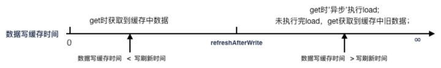
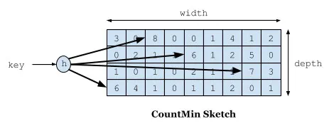
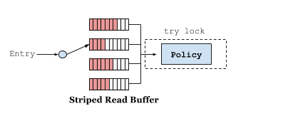
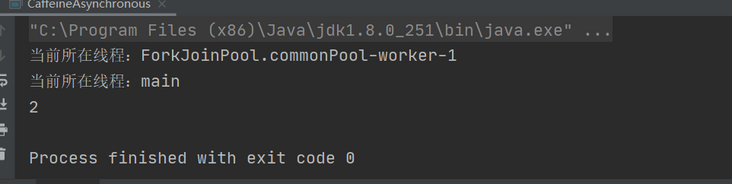

# [缓存之王Caffeine Cache，性能比Guava更强 - 知乎](https://zhuanlan.zhihu.com/p/345175951)

## 一、前言

在项目开发中，为提升系统性能，减少 IO 开销，本地缓存是必不可少的。最常见的本地缓存是 Guava 和 Caffeine，本篇文章将为大家介绍 Caffeine。

Caffeine 是基于 Google Guava Cache 设计经验改进的结果，相较于 Guava 在性能和命中率上更具有效率，你可以认为其是 Guava Plus。

毋庸置疑的，你应该尽快将你的本地缓存从 Guava 迁移至 Caffeine，本文将重点和 Guava 对比二者性能占据，给出本地缓存的最佳实践，以及迁移策略。

## 二、PK Guava

## 2.1

从功能上看，Guava 已经比较完善了，满足了绝大部分本地缓存的需求。Caffine 除了提供 Guava 已有的功能外，同时还加入了一些扩展功能。

## 2.2 性能

Guava 中其读写操作夹杂着过期时间的处理，也就是你在一次 put 操作中有可能会做淘汰操作，所以其读写性能会受到一定影响。

Caffeine 在读写操作方面完爆 Guava，主要是因为 Caffeine 对这些事件的操作是异步的，将事件提交至队列（使用 Disruptor RingBuffer），然后会通过默认的 ForkJoinPool.commonPool()，或自己配置的线程池，进行取队列操作，然后再进行后续的淘汰、过期操作。

以下性能对比来自 Caffeine 官方提供数据：

（1）在此基准测试中，从配置了最大大小的缓存中，8 个线程并发读：


（2）在此基准测试中，从配置了最大大小的缓存中，6个线程并发读、2个线程并发写：


（3）在此基准测试中，从配置了最大大小的缓存中，8 个线程并发写：


## 2.3 命中率

缓存的淘汰策略是为了预测哪些数据在短期内最可能被再次用到,从而提升缓存的命中率。Guava 使用 S-LRU 分段的最近最少未使用算法，Caffeine 采用了一种结合 LRU、LFU 优点的算法：W-TinyLFU，其特点是：高命中率、低内存占用。

## 2.3.1 LRU

Least Recently Used：如果数据最近被访问过，将来被访问的概率也更高。每次访问就把这个元素放到队列的头部，队列满了就淘汰队列尾部的数据，即淘汰最长时间没有被访问的。

需要维护每个数据项的访问频率信息，每次访问都需要更新，这个开销是非常大的。

其缺点是，如果某一时刻大量数据到来，很容易将热点数据挤出缓存，留下来的很可能是只访问一次，今后不会再访问的或频率极低的数据。比如外卖中午时候访问量突增、微博爆出某明星糗事就是一个突发性热点事件。当事件结束后，可能没有啥访问量了，但是由于其极高的访问频率，导致其在未来很长一段时间内都不会被淘汰掉。

## 2.3.2 LFU

Least Frequently Used：如果数据最近被访问过，那么将来被访问的概率也更高。也就是淘汰一定时间内被访问次数最少的数据（时间局部性原理）。

需要用 Queue 来保存访问记录，可以用 LinkedHashMap 来简单实现一个基于 LRU 算法的缓存。

其优点是，避免了 LRU 的缺点，因为根据频率淘汰，不会出现大量进来的挤压掉 老的，如果在数据的访问的模式不随时间变化时候，LFU 能够提供绝佳的命中率。

其缺点是，偶发性的、周期性的批量操作会导致LRU命中率急剧下降，缓存污染情况比较严重。

## 2.3.3 TinyLFU

TinyLFU 顾名思义，轻量级LFU，相比于 LFU 算法用更小的内存空间来记录访问频率。

TinyLFU 维护了近期访问记录的频率信息，不同于传统的 LFU 维护整个生命周期的访问记录，所以他可以很好地应对突发性的热点事件（超过一定时间，这些记录不再被维护）。这些访问记录会作为一个过滤器，当新加入的记录（New Item）访问频率高于将被淘汰的缓存记录（Cache Victim）时才会被替换。流程如下：


tiny-lfu-arch

尽管维护的是近期的访问记录，但仍然是非常昂贵的，TinyLFU 通过 Count-Min Sketch 算法来记录频率信息，它占用空间小且误报率低，关于 Count-Min Sketch 算法可以参考论文：pproximating Data with the Count-Min Data Structure

## 2.3.4 W-TinyLFU

W-TinyLFU 是 Caffeine 提出的一种全新算法，它可以解决频率统计不准确以及访问频率衰减的问题。这个方法让我们从空间、效率、以及适配举证的长宽引起的哈希碰撞的错误率上做均衡。

下图是一个运行了 ERP 应用的数据库服务中各种算法的命中率，实验数据来源于 ARC 算法作者，更多场景的性能测试参见官网：


database

W-TinyLFU 算法是对 TinyLFU算法的优化，能够很好地解决一些稀疏的突发访问元素。在一些数目很少但突发访问量很大的场景下，TinyLFU将无法保存这类元素，因为它们无法在短时间内积累到足够高的频率，从而被过滤器过滤掉。W-TinyLFU 将新记录暂时放入 Window Cache 里面，只有通过 TinLFU 考察才能进入 Main Cache。大致流程如下图：


W-TinyLFU

## 三、最佳实践

## 3.1 实践1

**配置方式**：设置 maxSize、refreshAfterWrite，不设置 expireAfterWrite

**存在问题**：get 缓存间隔超过 refreshAfterWrite 后，触发缓存异步刷新，此时会获取缓存中的旧值

**适用场景**：

- 缓存数据量大，限制缓存占用的内存容量* 缓存值会变，需要刷新缓存* 可以接受任何时间缓存中存在旧数据




设置 maxSize、refreshAfterWrite，不设置 expireAfterWrite

## 3.2 实践2

**配置方式**：设置 maxSize、expireAfterWrite，不设置 refreshAfterWrite

**存在问题**：get 缓存间隔超过 expireAfterWrite 后，针对该 key，获取到锁的线程会同步执行 load，其他未获得锁的线程会阻塞等待，获取锁线程执行延时过长会导致其他线程阻塞时间过长

**适用场景**：

- 缓存数据量大，限制缓存占用的内存容量* 缓存值会变，需要刷新缓存* 不可以接受缓存中存在旧数据* 同步加载数据延迟小（使用 redis 等）


设置 maxSize、expireAfterWrite，不设置refreshAfterWrite

## 3.3 实践3

**配置方式**：设置 maxSize，不设置 refreshAfterWrite、expireAfterWrite，定时任务异步刷新数据

**存在问题**：需要手动定时任务异步刷新缓存

**适用场景**：

- 缓存数据量大，限制缓存占用的内存容量* 缓存值会变，需要刷新缓存* 不可以接受缓存中存在旧数据* 同步加载数据延迟可能会很大


g

设置 maxSize，不设置 refreshAfterWrite、expireAfterWrite，定时任务异步刷新数据

## 3.4 实践4

**配置方式**：设置 maxSize、refreshAfterWrite、expireAfterWrite，refreshAfterWrite < expireAfterWrite

**存在问题**：

- get 缓存间隔在 refreshAfterWrite 和 expireAfterWrite 之间，触发缓存异步刷新，此时会获取缓存中的旧值* get 缓存间隔大于 expireAfterWrite，针对该 key，获取到锁的线程会同步执行 load，其他未获得锁的线程会阻塞等待，获取锁线程执行延时过长会导致其他线程阻塞时间过长

**适用场景**：

- 缓存数据量大，限制缓存占用的内存容量* 缓存值会变，需要刷新缓存* 可以接受有限时间缓存中存在旧数据* 同步加载数据延迟小（使用 redis 等）


设置 maxSize、refreshAfterWrite、expireAfterWrite

## 四、迁移指南

**4.1 切换至 Caffeine**

在 pom 文件中引入 Caffeine 依赖：

```text
<dependency>
    <groupId>com.github.ben-manes.caffeine</groupId>
    <artifactId>caffeine</artifactId>
</dependency>
```

Caffeine 兼容 Guava API，从 Guava 切换到 Caffeine，仅需要把 CacheBuilder.newBuilder()改成 Caffeine.newBuilder() 即可。

**4.2 Get Exception**

需要注意的是，在使用 Guava 的 get()方法时，当缓存的 load()方法返回 null 时，会抛出 ExecutionException。切换到 Caffeine 后，get()方法不会抛出异常，但允许返回为 null。

Guava 还提供了一个getUnchecked()方法，它不需要我们显示的去捕捉异常，但是一旦 load()方法返回 null时，就会抛出 UncheckedExecutionException。切换到 Caffeine 后，不再提供 getUnchecked()方法，因此需要做好判空处


# [高性能缓存 Caffeine 原理及实战 - SegmentFault 思否](https://segmentfault.com/a/1190000039149070)

# 一、简介

Caffeine 是基于Java 8 开发的、提供了近乎最佳命中率的高性能本地缓存组件，Spring5 开始不再支持 Guava Cache，改为使用 Caffeine。

下面是 [Caffeine 官方测试报告](https://link.segmentfault.com/?enc=ODgp0M1Qy2OGJrf3wqG4yg%3D%3D.iXNbYqPvsXZTZ8fmQBQ76nu08csrXyCAZHk65faeVvWRxv44UML5pc%2Byyv7OntiIlXyENv553mpQRZuX9u%2F7%2Bg%3D%3D)。


由上面三幅图可见：不管在并发读、并发写还是并发读写的场景下，Caffeine 的性能都大幅领先于其他本地开源缓存组件。

本文先介绍 Caffeine 实现原理，再讲解如何在项目中使用 Caffeine 。

#  二、Caffeine 原理

## 2.1 淘汰算法

### 2.1.1 常见算法

对于 Java 进程内缓存我们可以通过 HashMap 来实现。不过，Java 进程内存是有限的，不可能无限地往里面放缓存对象。这就需要有合适的算法辅助我们淘汰掉使用价值相对不高的对象，为新进的对象留有空间。常见的缓存淘汰算法有 FIFO、LRU、LFU。

**FIFO(First In First Out)：先进先出。**

它是优先淘汰掉最先缓存的数据、是最简单的淘汰算法。缺点是如果先缓存的数据使用频率比较高的话，那么该数据就不停地进进出出，因此它的缓存命中率比较低。

**LRU(Least Recently Used)：最近最久未使用。**

它是优先淘汰掉最久未访问到的数据。缺点是不能很好地应对偶然的突发流量。比如一个数据在一分钟内的前59秒访问很多次，而在最后1秒没有访问，但是有一批冷门数据在最后一秒进入缓存，那么热点数据就会被冲刷掉。

**LFU(Least Frequently Used)：**

最近最少频率使用。它是优先淘汰掉最不经常使用的数据，需要维护一个表示使用频率的字段。

主要有两个缺点：

一、如果访问频率比较高的话，频率字段会占据一定的空间；

二、无法合理更新新上的热点数据，比如某个歌手的老歌播放历史较多，新出的歌如果和老歌一起排序的话，就永无出头之日。

**2.1.2 W-TinyLFU 算法**

Caffeine 使用了 W-TinyLFU 算法，解决了 LRU 和LFU上述的缺点。W-TinyLFU 算法由论文《TinyLFU: A Highly Efficient Cache Admission Policy》提出。

它主要干了两件事：

一、采用 Count–Min Sketch 算法降低频率信息带来的内存消耗；

二、维护一个PK机制保障新上的热点数据能够缓存。

如下图所示，Count–Min Sketch 算法类似布隆过滤器 (Bloom filter)思想，对于频率统计我们其实不需要一个精确值。存储数据时，对key进行多次 hash 函数运算后，二维数组不同位置存储频率（Caffeine 实际实现的时候是用一维 long 型数组，每个 long 型数字切分成16份，每份4bit，默认15次为最高访问频率，每个key实际 hash 了四次，落在不同 long 型数字的16份中某个位置）。读取某个key的访问次数时，会比较所有位置上的频率值，取最小值返回。对于所有key的访问频率之和有个最大值，当达到最大值时，会进行reset即对各个缓存key的频率除以2。



如下图缓存访问频率存储主要分为两大部分，即 LRU 和 Segmented LRU 。新访问的数据会进入第一个 LRU，在 Caffeine 里叫 WindowDeque。当 WindowDeque 满时，会进入 Segmented LRU 中的 ProbationDeque，在后续被访问到时，它会被提升到 ProtectedDeque。当 ProtectedDeque 满时，会有数据降级到 ProbationDeque 。数据需要淘汰的时候，对 ProbationDeque 中的数据进行淘汰。具体淘汰机制：取ProbationDeque 中的队首和队尾进行 PK，队首数据是最先进入队列的，称为受害者，队尾的数据称为攻击者，比较两者 频率大小，大胜小汰。


总的来说，通过 reset 衰减，避免历史热点数据由于频率值比较高一直淘汰不掉，并且通过对访问队列分成三段，这样避免了新加入的热点数据早早地被淘汰掉。

## 2.2 高性能读写

Caffeine 认为读操作是频繁的，写操作是偶尔的，读写都是异步线程更新频率信息。

### 2.2.1 读缓冲

传统的缓存实现将会为每个操作加锁，以便能够安全的对每个访问队列的元素进行排序。一种优化方案是将每个操作按序加入到缓冲区中进行批处理操作。读完把数据放到环形队列 RingBuffer 中，为了减少读并发，采用多个 RingBuffer，每个线程都有对应的 RingBuffer。环形队列是一个定长数组，提供高性能的能力并最大程度上减少了 GC所带来的性能开销。数据丢到队列之后就返回读取结果，类似于数据库的WAL机制，和ConcurrentHashMap 读取数据相比，仅仅多了把数据放到队列这一步。异步线程并发读取 RingBuffer 数组，更新访问信息，这边的线程池使用的是下文实战小节讲的 Caffeine 配置参数中的 executor。



### 2.2.2 写缓冲

与读缓冲类似，写缓冲是为了储存写事件。读缓冲中的事件主要是为了优化驱逐策略的命中率，因此读缓冲中的事件完整程度允许一定程度的有损。但是写缓冲并不允许数据的丢失，因此其必须实现为一个安全的队列。Caffeine 写是把数据放入MpscGrowableArrayQueue 阻塞队列中，它参考了JCTools里的MpscGrowableArrayQueue ，是针对 MPSC- 多生产者单消费者（Multi-Producer & Single-Consumer）场景的高性能实现。多个生产者同时并发地写入队列是线程安全的，但是同一时刻只允许一个消费者消费队列。

#  三、Caffeine 实战

## 3.1 配置参数

Caffeine 借鉴了Guava Cache 的设计思想，如果之前使用过 Guava Cache，那么Caffeine 很容易上手，只需要改变相应的类名就行。构造一个缓存 Cache 示例代码如下：

```java
Cache cache = Caffeine.newBuilder().maximumSize(1000).expireAfterWrite(6, TimeUnit.MINUTES).softValues().build();
```

Caffeine 类相当于建造者模式的 Builder 类，通过 Caffeine 类配置 Cache，配置一个Cache 有如下参数：

- expireAfterWrite：写入间隔多久淘汰；
- expireAfterAccess：最后访问后间隔多久淘汰；
- refreshAfterWrite：写入后间隔多久刷新，该刷新是基于访问被动触发的，支持异步刷新和同步刷新，如果和 expireAfterWrite 组合使用，能够保证即使该缓存访问不到、也能在固定时间间隔后被淘汰，否则如果单独使用容易造成OOM；
- expireAfter：自定义淘汰策略，该策略下 Caffeine 通过时间轮算法来实现不同key 的不同过期时间；
- maximumSize：缓存 key 的最大个数；
- weakKeys：key设置为弱引用，在 GC 时可以直接淘汰；
- weakValues：value设置为弱引用，在 GC 时可以直接淘汰；
- softValues：value设置为软引用，在内存溢出前可以直接淘汰；
- executor：选择自定义的线程池，默认的线程池实现是 ForkJoinPool.commonPool()；
- maximumWeight：设置缓存最大权重；
- weigher：设置具体key权重；
- recordStats：缓存的统计数据，比如命中率等；
- removalListener：缓存淘汰监听器；
- writer：缓存写入、更新、淘汰的监听器。

## 3.2 项目实战

Caffeine 支持解析字符串参数，参照 Ehcache 的思想，可以把所有缓存项参数信息放入配置文件里面，比如有一个 caffeine.properties 配置文件，里面配置参数如下：

```java
users=maximumSize=10000,expireAfterWrite=180s,softValues
goods=maximumSize=10000,expireAfterWrite=180s,softValues
```

针对不同的缓存，解析配置文件，并加入 Cache 容器里面，代码如下：

```java
@Component
@Slf4j
public class CaffeineManager {
    private final ConcurrentMap<String, Cache> cacheMap = new ConcurrentHashMap<>(16);
 
    @PostConstruct
    public void afterPropertiesSet() {
        String filePath = CaffeineManager.class.getClassLoader().getResource("").getPath() + File.separator + "config"
            + File.separator + "caffeine.properties";
        Resource resource = new FileSystemResource(filePath);
        if (!resource.exists()) {
            return;
        }
        Properties props = new Properties();
        try (InputStream in = resource.getInputStream()) {
            props.load(in);
            Enumeration propNames = props.propertyNames();
            while (propNames.hasMoreElements()) {
                String caffeineKey = (String) propNames.nextElement();
                String caffeineSpec = props.getProperty(caffeineKey);
                CaffeineSpec spec = CaffeineSpec.parse(caffeineSpec);
                Caffeine caffeine = Caffeine.from(spec);
                Cache manualCache = caffeine.build();
                cacheMap.put(caffeineKey, manualCache);
            }
        }
        catch (IOException e) {
            log.error("Initialize Caffeine failed.", e);
        }
    }
}
```

当然也可以把 caffeine.properties 里面的配置项放入配置中心，如果需要动态生效，可以通过如下方式：

至于是否利用 Spring 的 EL 表达式通过注解的方式使用，仁者见仁智者见智，笔者主要考虑三点：

一、EL 表达式上手需要学习成本；

二、引入注解需要注意动态代理失效场景；

获取缓存时通过如下方式：

```java
caffeineManager.getCache(cacheName).get(redisKey, value -> getTFromRedis(redisKey, targetClass, supplier));
```

Caffeine 这种带有回源函数的 get 方法最终都是调用 ConcurrentHashMap 的 compute 方法，它能确保高并发场景下，如果对一个热点 key 进行回源时，单个进程内只有一个线程回源，其他都在阻塞。业务需要确保回源的方法耗时比较短，防止线程阻塞时间比较久，系统可用性下降。

笔者实际开发中用了 Caffeine 和 Redis 两级缓存。Caffeine 的 cache 缓存 key 和 Redis 里面一致，都是命名为 redisKey。targetClass 是返回对象类型，从 Redis 中获取字符串反序列化成实际对象时使用。supplier 是函数式接口，是缓存回源到数据库的业务逻辑。

getTFromRedis 方法实现如下：

```java
private <T> T getTFromRedis(String redisKey, Class targetClass, Supplier supplier) {
    String data;
    T value;
    String redisValue = UUID.randomUUID().toString();
    if (tryGetDistributedLockWithRetry(redisKey + RedisKey.DISTRIBUTED_SUFFIX, redisValue, 30)) {
        try {
            data = getFromRedis(redisKey);
            if (StringUtils.isEmpty(data)) {
                value = (T) supplier.get();
                setToRedis(redisKey, JackSonParser.bean2Json(value));
            }
            else {
                value = json2Bean(targetClass, data);
            }
        }
        finally {
            releaseDistributedLock(redisKey + RedisKey.DISTRIBUTED_SUFFIX, redisValue);
        }
    }
    else {
        value = json2Bean(targetClass, getFromRedis(redisKey));
    }
    return value;
}
```

由于回源都是从 MySQL 查询，虽然 Caffeine 本身解决了进程内同一个 key 只有一个线程回源，需要注意多个业务节点的分布式情况下，如果 Redis 没有缓存值，并发回源时会穿透到 MySQL ，所以回源时加了分布式锁，保证只有一个节点回源。

注意一点：从本地缓存获取对象时，如果业务要对缓存对象做更新，需要深拷贝一份对象，不然并发场景下多个线程取值会相互影响。

笔者项目之前都是使用 Ehcache 作为本地缓存，切换成 Caffeine 后，涉及本地缓存的接口，同样 TPS 值时，CPU 使用率能降低 10% 左右，接口性能都有一定程度提升，最多的提升了 25%。上线后观察调用链，平均响应时间降低24%左右。

#  四、总结

Caffeine 是目前比较优秀的本地缓存解决方案，通过使用 W-TinyLFU 算法，实现了缓存高命中率、内存低消耗。如果之前使用过 Guava Cache，看下接口名基本就能上手。如果之前使用的是 Ehcache，笔者分享的使用方式可以作为参考。

# 五、参考文献

1. [TinyLFU: A Highly Efficient Cache Admission Policy](https://link.segmentfault.com/?enc=r7z1OGHvTewYY64AcgQAdg%3D%3D.AotUQQyJoaVfsvECxp0EOpmFyQSfAToquFLk1yz2zFU%2B2pxSemVfVeLtI%2BLM0b8s)
2. [Design Of A Modern Cache](https://link.segmentfault.com/?enc=Xy0len4O%2B1mKwZXDbKNfQA%3D%3D.9D01tl3se3gvfKUOHDucvxjtnyTi58wNoXDD2KlOXYiBOgHGrOvfMMJnlMuDA7eAZngOyYfhdLEsUgLu72Tl42ulBxcb6B6iwWS1qzN4kAY%3D)
3. [Caffeine Github](https://link.segmentfault.com/?enc=47zCXfA3ms7Py2EuNAXz3g%3D%3D.nFQYVLuasWgsoPjHOda377KTpvoVr%2BAykFNc4IPuLbZMNo7EENXzh8NerkEsQ3Cj)

> 作者：Zhang Zhenglin


Caffeine 允许您通过对键或值使用弱引用以及对值使用软引用来设置缓存以允许条目的垃圾收集。请注意，AsyncCache不支持弱值和软值引用。

Caffeine.weakKeys()使用弱引用存储键。如果没有其他对键的强引用，这允许条目被垃圾收集。由于垃圾收集仅取决于身份相等性，这会导致整个缓存使用身份 (==) 相等性来比较键，而不是equals()。

Caffeine.weakValues()使用弱引用存储值。如果没有其他对值的强引用，这允许对条目进行垃圾收集。由于垃圾收集仅取决于身份相等性，这会导致整个缓存使用身份 (==) 相等性来比较值，而不是equals()。

Caffeine.softValues()使用软引用存储值。软引用的对象以全局最近最少使用的方式进行垃圾收集，以响应内存需求。由于使用软引用的性能影响，我们通常建议使用更可预测的最大缓存大小。使用 ofsoftValues()将导致使用标识 (==) 相等而不是equals().


# [Caffeine缓存 - 简书](https://www.jianshu.com/p/9a80c662dac4)

# 简介

在本文中，我们来看看 [Caffeine](https://github.com/ben-manes/caffeine) — 一个高性能的 Java 缓存库。

缓存和 Map 之间的一个根本区别在于缓存可以回收存储的 item。

回收策略为在指定时间删除哪些对象。此策略直接影响缓存的命中率 — 缓存库的一个重要特征。

Caffeine 因使用 Window TinyLfu 回收策略，提供了一个近乎最佳的命中率。

# 填充策略（Population）

Caffeine 为我们提供了三种填充策略：手动、同步和异步

## 手动加载（Manual）


```java
Cache<String, Object> manualCache = Caffeine.newBuilder()
        .expireAfterWrite(10, TimeUnit.MINUTES)
        .maximumSize(10_000)
        .build();

String key = "name1";
// 根据key查询一个缓存，如果没有返回NULL
graph = manualCache.getIfPresent(key);
// 根据Key查询一个缓存，如果没有调用createExpensiveGraph方法，并将返回值保存到缓存。
// 如果该方法返回Null则manualCache.get返回null，如果该方法抛出异常则manualCache.get抛出异常
graph = manualCache.get(key, k -> createExpensiveGraph(k));
// 将一个值放入缓存，如果以前有值就覆盖以前的值
manualCache.put(key, graph);
// 删除一个缓存
manualCache.invalidate(key);

ConcurrentMap<String, Object> map = manualCache.asMap();
cache.invalidate(key);
```

Cache接口允许显式的去控制缓存的检索，更新和删除。

我们可以通过cache.getIfPresent(key) 方法来获取一个key的值，通过cache.put(key, value)方法显示的将数控放入缓存，但是这样子会覆盖缓原来key的数据。更加建议使用cache.get(key，k - > value) 的方式，get 方法将一个参数为 key 的 Function (createExpensiveGraph) 作为参数传入。如果缓存中不存在该键，则调用这个 Function 函数，并将返回值作为该缓存的值插入缓存中。get 方法是以阻塞方式执行调用，即使多个线程同时请求该值也只会调用一次Function方法。这样可以避免与其他线程的写入竞争，这也是为什么使用 get 优于 getIfPresent 的原因。

**注意**：如果调用该方法返回NULL（如上面的 createExpensiveGraph 方法），则cache.get返回null，如果调用该方法抛出异常，则get方法也会抛出异常。

可以使用Cache.asMap() 方法获取ConcurrentMap进而对缓存进行一些更改。

## 同步加载（Loading）


```java
LoadingCache<String, Object> loadingCache = Caffeine.newBuilder()
        .maximumSize(10_000)
        .expireAfterWrite(10, TimeUnit.MINUTES)
        .build(key -> createExpensiveGraph(key));
    
String key = "name1";
// 采用同步方式去获取一个缓存和上面的手动方式是一个原理。在build Cache的时候会提供一个createExpensiveGraph函数。
// 查询并在缺失的情况下使用同步的方式来构建一个缓存
Object graph = loadingCache.get(key);

// 获取组key的值返回一个Map
List<String> keys = new ArrayList<>();
keys.add(key);
Map<String, Object> graphs = loadingCache.getAll(keys);
```

LoadingCache是使用CacheLoader来构建的缓存的值。

批量查找可以使用getAll方法。默认情况下，getAll将会对缓存中没有值的key分别调用CacheLoader.load方法来构建缓存的值。我们可以重写CacheLoader.loadAll方法来提高getAll的效率。

**注意**：您可以编写一个CacheLoader.loadAll来实现为特别请求的key加载值。例如，如果计算某个组中的任何键的值将为该组中的所有键提供值，则loadAll可能会同时加载该组的其余部分。

## 异步加载（Asynchronously Loading）


```java
AsyncLoadingCache<String, Object> asyncLoadingCache = Caffeine.newBuilder()
            .maximumSize(10_000)
            .expireAfterWrite(10, TimeUnit.MINUTES)
            // Either: Build with a synchronous computation that is wrapped as asynchronous
            .buildAsync(key -> createExpensiveGraph(key));
            // Or: Build with a asynchronous computation that returns a future
            // .buildAsync((key, executor) -> createExpensiveGraphAsync(key, executor));

 String key = "name1";

// 查询并在缺失的情况下使用异步的方式来构建缓存
CompletableFuture<Object> graph = asyncLoadingCache.get(key);
// 查询一组缓存并在缺失的情况下使用异步的方式来构建缓存
List<String> keys = new ArrayList<>();
keys.add(key);
CompletableFuture<Map<String, Object>> graphs = asyncLoadingCache.getAll(keys);
// 异步转同步
loadingCache = asyncLoadingCache.synchronous();
```

AsyncLoadingCache是继承自LoadingCache类的，异步加载使用Executor去调用方法并返回一个CompletableFuture。异步加载缓存使用了响应式编程模型。

如果要以同步方式调用时，应提供CacheLoader。要以异步表示时，应该提供一个AsyncCacheLoader，并返回一个CompletableFuture。

synchronous()这个方法返回了一个LoadingCacheView视图，LoadingCacheView也继承自LoadingCache。调用该方法后就相当于你将一个异步加载的缓存AsyncLoadingCache转换成了一个同步加载的缓存LoadingCache。

默认使用ForkJoinPool.commonPool()来执行异步线程，但是我们可以通过Caffeine.executor(Executor) 方法来替换线程池。

# 驱逐策略（eviction）

Caffeine提供三类驱逐策略：基于大小（size-based），基于时间（time-based）和基于引用（reference-based）。

## 基于大小（size-based）

基于大小驱逐，有两种方式：一种是基于缓存大小，一种是基于权重。


```rust
// Evict based on the number of entries in the cache
// 根据缓存的计数进行驱逐
LoadingCache<Key, Graph> graphs = Caffeine.newBuilder()
    .maximumSize(10_000)
    .build(key -> createExpensiveGraph(key));

// Evict based on the number of vertices in the cache
// 根据缓存的权重来进行驱逐（权重只是用于确定缓存大小，不会用于决定该缓存是否被驱逐）
LoadingCache<Key, Graph> graphs = Caffeine.newBuilder()
    .maximumWeight(10_000)
    .weigher((Key key, Graph graph) -> graph.vertices().size())
    .build(key -> createExpensiveGraph(key));
```

我们可以使用Caffeine.maximumSize(long)方法来指定缓存的最大容量。当缓存超出这个容量的时候，会使用[Window TinyLfu策略](https://github.com/ben-manes/caffeine/wiki/Efficiency)来删除缓存。

我们也可以使用权重的策略来进行驱逐，可以使用Caffeine.weigher(Weigher) 函数来指定权重，使用Caffeine.maximumWeight(long) 函数来指定缓存最大权重值。

maximumWeight与maximumSize不可以同时使用。

## 基于时间（Time-based）


```java
// Evict based on a fixed expiration policy
// 基于固定的到期策略进行退出
LoadingCache<Key, Graph> graphs = Caffeine.newBuilder()
    .expireAfterAccess(5, TimeUnit.MINUTES)
    .build(key -> createExpensiveGraph(key));
LoadingCache<Key, Graph> graphs = Caffeine.newBuilder()
    .expireAfterWrite(10, TimeUnit.MINUTES)
    .build(key -> createExpensiveGraph(key));

// Evict based on a varying expiration policy
// 基于不同的到期策略进行退出
LoadingCache<Key, Graph> graphs = Caffeine.newBuilder()
    .expireAfter(new Expiry<Key, Graph>() {
      @Override
      public long expireAfterCreate(Key key, Graph graph, long currentTime) {
        // Use wall clock time, rather than nanotime, if from an external resource
        long seconds = graph.creationDate().plusHours(5)
            .minus(System.currentTimeMillis(), MILLIS)
            .toEpochSecond();
        return TimeUnit.SECONDS.toNanos(seconds);
      }
      
      @Override
      public long expireAfterUpdate(Key key, Graph graph, 
          long currentTime, long currentDuration) {
        return currentDuration;
      }
      
      @Override
      public long expireAfterRead(Key key, Graph graph,
          long currentTime, long currentDuration) {
        return currentDuration;
      }
    })
    .build(key -> createExpensiveGraph(key));
```

Caffeine提供了三种定时驱逐策略：

- expireAfterAccess(long, TimeUnit):在最后一次访问或者写入后开始计时，在指定的时间后过期。假如一直有请求访问该key，那么这个缓存将一直不会过期。
- expireAfterWrite(long, TimeUnit): 在最后一次写入缓存后开始计时，在指定的时间后过期。
- expireAfter(Expiry): 自定义策略，过期时间由Expiry实现独自计算。

**缓存的删除策略使用的是惰性删除和定时删除**。这两个删除策略的时间复杂度都是O(1)。

测试定时驱逐不需要等到时间结束。我们可以使用Ticker接口和Caffeine.ticker(Ticker)方法在缓存生成器中指定时间源，而不必等待系统时钟。如：


```java
FakeTicker ticker = new FakeTicker(); // Guava's testlib
Cache<Key, Graph> cache = Caffeine.newBuilder()
    .expireAfterWrite(10, TimeUnit.MINUTES)
    .executor(Runnable::run)
    .ticker(ticker::read)
    .maximumSize(10)
    .build();

cache.put(key, graph);
ticker.advance(30, TimeUnit.MINUTES)
assertThat(cache.getIfPresent(key), is(nullValue());
```

## 基于引用（reference-based）

[强引用，软引用，弱引用概念说明](http://blog.csdn.net/xiaolyuh123/article/details/78779234)请点击连接，这里说一下各各引用的区别：

Java4种引用的级别由高到低依次为：强引用 > 软引用 > 弱引用 > 虚引用

| 引用类型 | 被垃圾回收时间 | 用途           | 生存时间          |
| -------- | -------------- | -------------- | ----------------- |
| 强引用   | 从来不会       | 对象的一般状态 | JVM停止运行时终止 |
| 软引用   | 在内存不足时   | 对象缓存       | 内存不足时终止    |
| 弱引用   | 在垃圾回收时   | 对象缓存       | gc运行后终止      |
| 虚引用   | Unknown        | Unknown        | Unknown           |


```java
// Evict when neither the key nor value are strongly reachable
// 当key和value都没有引用时驱逐缓存
LoadingCache<Key, Graph> graphs = Caffeine.newBuilder()
    .weakKeys()
    .weakValues()
    .build(key -> createExpensiveGraph(key));

// Evict when the garbage collector needs to free memory
// 当垃圾收集器需要释放内存时驱逐
LoadingCache<Key, Graph> graphs = Caffeine.newBuilder()
    .softValues()
    .build(key -> createExpensiveGraph(key));
```

我们可以将缓存的驱逐配置成基于垃圾回收器。为此，我们可以将key 和 value 配置为弱引用或只将值配置成软引用。

**注意**：AsyncLoadingCache不支持弱引用和软引用。

Caffeine.weakKeys() 使用弱引用存储key。如果没有其他地方对该key有强引用，那么该缓存就会被垃圾回收器回收。由于垃圾回收器只依赖于身份(identity)相等，因此这会导致整个缓存使用身份 (==) 相等来比较 key，而不是使用 equals()。

Caffeine.weakValues() 使用弱引用存储value。如果没有其他地方对该value有强引用，那么该缓存就会被垃圾回收器回收。由于垃圾回收器只依赖于身份(identity)相等，因此这会导致整个缓存使用身份 (==) 相等来比较 key，而不是使用 equals()。

Caffeine.softValues() 使用软引用存储value。当内存满了过后，软引用的对象以将使用最近最少使用(least-recently-used ) 的方式进行垃圾回收。由于使用软引用是需要等到内存满了才进行回收，所以我们通常建议给缓存配置一个使用内存的最大值。 softValues() 将使用身份相等(identity) (==) 而不是equals() 来比较值。

**注意**：Caffeine.weakValues()和Caffeine.softValues()不可以一起使用。

# 移除监听器（Removal）

概念：

- 驱逐（eviction）：由于满足了某种驱逐策略，后台自动进行的删除操作
- 无效（invalidation）：表示由调用方手动删除缓存
- 移除（removal）：监听驱逐或无效操作的监听器

## 手动删除缓存：

在任何时候，您都可能明确地使缓存无效，而不用等待缓存被驱逐。


```java
// individual key
cache.invalidate(key)
// bulk keys
cache.invalidateAll(keys)
// all keys
cache.invalidateAll()
```

## Removal 监听器：


```java
Cache<Key, Graph> graphs = Caffeine.newBuilder()
    .removalListener((Key key, Graph graph, RemovalCause cause) ->
        System.out.printf("Key %s was removed (%s)%n", key, cause))
    .build();
```

您可以通过Caffeine.removalListener(RemovalListener) 为缓存指定一个删除侦听器，以便在删除数据时执行某些操作。 RemovalListener可以获取到key、value和RemovalCause（删除的原因）。

删除侦听器的里面的操作是使用Executor来异步执行的。默认执行程序是ForkJoinPool.commonPool()，可以通过Caffeine.executor(Executor)覆盖。当操作必须与删除同步执行时，请改为使用CacheWrite，CacheWrite将在下面说明。

**注意**：由RemovalListener抛出的任何异常都会被记录（使用Logger）并不会抛出。

# 刷新（Refresh）


```java
LoadingCache<Key, Graph> graphs = Caffeine.newBuilder()
    .maximumSize(10_000)
    // 指定在创建缓存或者最近一次更新缓存后经过固定的时间间隔，刷新缓存
    .refreshAfterWrite(1, TimeUnit.MINUTES)
    .build(key -> createExpensiveGraph(key));
```

刷新和驱逐是不一样的。刷新的是通过LoadingCache.refresh(key)方法来指定，并通过调用CacheLoader.reload方法来执行，刷新key会异步地为这个key加载新的value，并返回旧的值（如果有的话）。驱逐会阻塞查询操作直到驱逐作完成才会进行其他操作。

与expireAfterWrite不同的是，refreshAfterWrite将在查询数据的时候判断该数据是不是符合查询条件，如果符合条件该缓存就会去执行刷新操作。例如，您可以在同一个缓存中同时指定refreshAfterWrite和expireAfterWrite，只有当数据具备刷新条件的时候才会去刷新数据，不会盲目去执行刷新操作。如果数据在刷新后就一直没有被再次查询，那么该数据也会过期。

刷新操作是使用Executor异步执行的。默认执行程序是ForkJoinPool.commonPool()，可以通过Caffeine.executor(Executor)覆盖。

如果刷新时引发异常，则使用log记录日志，并不会抛出。

# Writer


```java
LoadingCache<Key, Graph> graphs = Caffeine.newBuilder()
  .writer(new CacheWriter<Key, Graph>() {
    @Override public void write(Key key, Graph graph) {
      // write to storage or secondary cache
    }
    @Override public void delete(Key key, Graph graph, RemovalCause cause) {
      // delete from storage or secondary cache
    }
  })
  .build(key -> createExpensiveGraph(key));
```

CacheWriter允许缓存充当一个底层资源的代理，当与CacheLoader结合使用时，所有对缓存的读写操作都可以通过Writer进行传递。Writer可以把操作缓存和操作外部资源扩展成一个同步的原子性操作。并且在缓存写入完成之前，它将会阻塞后续的更新缓存操作，但是读取（get）将直接返回原有的值。如果写入程序失败，那么原有的key和value的映射将保持不变，如果出现异常将直接抛给调用者。

CacheWriter可以同步的监听到缓存的创建、变更和删除操作。加载（例如，LoadingCache.get）、重新加载（例如，LoadingCache.refresh）和计算（例如Map.computeIfPresent）的操作不被CacheWriter监听到。

**注意**：CacheWriter不能与weakKeys或AsyncLoadingCache结合使用。

## 可能的用例（Possible Use-Cases）

CacheWriter是复杂工作流的扩展点，需要外部资源来观察给定Key的变化顺序。这些用法Caffeine是支持的，但不是本地内置。

### 写模式（Write Modes）

CacheWriter可以用来实现一个直接写（write-through ）或回写（write-back ）缓存的操作。

write-through式缓存中，写操作是一个同步的过程，只有写成功了才会去更新缓存。这避免了同时去更新资源和缓存的条件竞争。

write-back式缓存中，对外部资源的操作是在缓存更新后异步执行的。这样可以提高写入的吞吐量，避免数据不一致的风险，比如如果写入失败，则在缓存中保留无效的状态。这种方法可能有助于延迟写操作，直到指定的时间，限制写速率或批写操作。

通过对write-back进行扩展，我们可以实现以下特性：

- 批处理和合并操作
- 延迟操作并到一个特定的时间执行
- 如果超过阈值大小，则在定期刷新之前执行批处理
- 如果操作尚未刷新，则从写入后缓冲器（write-behind）加载
- 根据外部资源的特点，处理重审，速率限制和并发

可以参考一个简单的[例子](https://github.com/ben-manes/caffeine/tree/master/examples/write-behind-rxjava)，使用RxJava实现。

### 分层（Layering）

CacheWriter可能用来集成多个缓存进而实现多级缓存。

多级缓存的加载和写入可以使用系统外部高速缓存。这允许缓存使用一个小并且快速的缓存去调用一个大的并且速度相对慢一点的缓存。典型的off-heap、file-based和remote 缓存。

受害者缓存（Victim Cache）是一个多级缓存的变体，其中被删除的数据被写入二级缓存。这个delete(K, V, RemovalCause) 方法允许检查为什么该数据被删除，并作出相应的操作。

### 同步监听器（Synchronous Listeners）

同步监听器会接收一个key在缓存中的进行了那些操作的通知。监听器可以阻止缓存操作，也可以将事件排队以异步的方式执行。这种类型的监听器最常用于复制或构建分布式缓存。

# 统计（Statistics）


```java
Cache<Key, Graph> graphs = Caffeine.newBuilder()
    .maximumSize(10_000)
    .recordStats()
    .build();
```

使用Caffeine.recordStats()，您可以打开统计信息收集。Cache.stats() 方法返回提供统计信息的CacheStats，如：

- hitRate()：返回命中与请求的比率
- hitCount(): 返回命中缓存的总数
- evictionCount()：缓存逐出的数量
- averageLoadPenalty()：加载新值所花费的平均时间

# Cleanup

缓存的删除策略使用的是惰性删除和定时删除，但是我也可以自己调用cache.cleanUp()方法手动触发一次回收操作。cache.cleanUp()是一个同步方法。

# 策略（Policy）

在创建缓存的时候，缓存的策略就指定好了。但是我们可以在运行时可以获得和修改该策略。这些策略可以通过一些选项来获得，以此来确定缓存是否支持该功能。

## Size-based


```java
cache.policy().eviction().ifPresent(eviction -> {
  eviction.setMaximum(2 * eviction.getMaximum());
});
```

如果缓存配置的时基于权重来驱逐，那么我们可以使用weightedSize() 来获取当前权重。这与获取缓存中的记录数的Cache.estimatedSize() 方法有所不同。

缓存的最大值(maximum)或最大权重(weight)可以通过getMaximum()方法来读取，并使用setMaximum(long)进行调整。当缓存量达到新的阀值的时候缓存才会去驱逐缓存。

如果有需用我们可以通过hottest(int) 和 coldest(int)方法来获取最有可能命中的数据和最有可能驱逐的数据快照。

## Time-based


```java
cache.policy().expireAfterAccess().ifPresent(expiration -> ...);
cache.policy().expireAfterWrite().ifPresent(expiration -> ...);
cache.policy().expireVariably().ifPresent(expiration -> ...);
cache.policy().refreshAfterWrite().ifPresent(expiration -> ...);
```

ageOf(key，TimeUnit) 提供了从expireAfterAccess，expireAfterWrite或refreshAfterWrite策略的角度来看条目已经空闲的时间。最大持续时间可以从getExpiresAfter(TimeUnit)读取，并使用setExpiresAfter(long，TimeUnit)进行调整。

如果有需用我们可以通过hottest(int) 和 coldest(int)方法来获取最有可能命中的数据和最有可能驱逐的数据快照。

# 测试（Testing）


```java
FakeTicker ticker = new FakeTicker(); // Guava's testlib
Cache<Key, Graph> cache = Caffeine.newBuilder()
    .expireAfterWrite(10, TimeUnit.MINUTES)
    .executor(Runnable::run)
    .ticker(ticker::read)
    .maximumSize(10)
    .build();

cache.put(key, graph);
ticker.advance(30, TimeUnit.MINUTES)
assertThat(cache.getIfPresent(key), is(nullValue());
```

测试的时候我们可以使用Caffeine..ticker(ticker)来指定一个时间源，并不需要等到key过期。

FakeTicker这个是guawa test包里面的Ticker，主要用于测试。依赖：


```xml
<dependency>
    <groupId>com.google.guava</groupId>
    <artifactId>guava-testlib</artifactId>
    <version>23.5-jre</version>
</dependency>
```

# 常见问题（Faq）

## 固定数据（Pinning Entries）

固定数据是不能通过驱逐策略去将数据删除的。当数据是一个有状态的资源时（如锁），那么这条数据是非常有用的，你有在客端使用完这个条数据的时候才能删除该数据。在这种情况下如果驱逐策略将这个条数据删掉的话，将导致资源泄露。

通过使用权重将该数据的权重设置成0，并且这个条数据不计入maximum size里面。 当缓存达到maximum size 了以后，驱逐策略也会跳过该条数据，不会进行删除操作。我们还必须自定义一个标准来判断这个数据是否属于固定数据。

通过使用Long.MAX_VALUE（大约300年）的值作为key的有效时间，这样可以将一条数据从过期中排除。自定义到期必须定义，这可以评估条目是否固定。

将数据写入缓存时我们要指定该数据的权重和到期时间。这可以通过使用cache.asMap()获取缓存列表后，再来实现引脚和解除绑定。

## 递归调用（Recursive Computations）

在原子操作内执行的加载，计算或回调可能不会写入缓存。 ConcurrentHashMap不允许这些递归写操作，因为这将有可能导致活锁（Java 8）或IllegalStateException（Java 9）。

解决方法是异步执行这些操作，例如使用AsyncLoadingCache。在异步这种情况下映射已经建立，value是一个CompletableFuture，并且这些操作是在缓存的原子范围之外执行的。但是，如果发生无序的依赖链，这也有可能导致死锁。

# 示例代码：


```java
package com.xiaolyuh.controller;

import com.alibaba.fastjson.JSON;
import com.github.benmanes.caffeine.cache.*;
import com.google.common.testing.FakeTicker;
import com.xiaolyuh.entity.Person;
import com.xiaolyuh.service.PersonService;
import org.springframework.beans.factory.annotation.Autowired;
import org.springframework.web.bind.annotation.RequestMapping;
import org.springframework.web.bind.annotation.RestController;

import java.util.ArrayList;
import java.util.List;
import java.util.Map;
import java.util.OptionalLong;
import java.util.concurrent.CompletableFuture;
import java.util.concurrent.ConcurrentMap;
import java.util.concurrent.Executor;
import java.util.concurrent.TimeUnit;

@RestController
public class CaffeineCacheController {

    @Autowired
    PersonService personService;

    Cache<String, Object> manualCache = Caffeine.newBuilder()
            .expireAfterWrite(10, TimeUnit.MINUTES)
            .maximumSize(10_000)
            .build();

    LoadingCache<String, Object> loadingCache = Caffeine.newBuilder()
            .maximumSize(10_000)
            .expireAfterWrite(10, TimeUnit.MINUTES)
            .build(key -> createExpensiveGraph(key));

    AsyncLoadingCache<String, Object> asyncLoadingCache = Caffeine.newBuilder()
            .maximumSize(10_000)
            .expireAfterWrite(10, TimeUnit.MINUTES)
            // Either: Build with a synchronous computation that is wrapped as asynchronous
            .buildAsync(key -> createExpensiveGraph(key));
    // Or: Build with a asynchronous computation that returns a future
    // .buildAsync((key, executor) -> createExpensiveGraphAsync(key, executor));

    private CompletableFuture<Object> createExpensiveGraphAsync(String key, Executor executor) {
        CompletableFuture<Object> objectCompletableFuture = new CompletableFuture<>();
        return objectCompletableFuture;
    }

    private Object createExpensiveGraph(String key) {
        System.out.println("缓存不存在或过期，调用了createExpensiveGraph方法获取缓存key的值");
        if (key.equals("name")) {
            throw new RuntimeException("调用了该方法获取缓存key的值的时候出现异常");
        }
        return personService.findOne1();
    }

    @RequestMapping("/testManual")
    public Object testManual(Person person) {
        String key = "name1";
        Object graph = null;

        // 根据key查询一个缓存，如果没有返回NULL
        graph = manualCache.getIfPresent(key);
        // 根据Key查询一个缓存，如果没有调用createExpensiveGraph方法，并将返回值保存到缓存。
        // 如果该方法返回Null则manualCache.get返回null，如果该方法抛出异常则manualCache.get抛出异常
        graph = manualCache.get(key, k -> createExpensiveGraph(k));
        // 将一个值放入缓存，如果以前有值就覆盖以前的值
        manualCache.put(key, graph);
        // 删除一个缓存
        manualCache.invalidate(key);

        ConcurrentMap<String, Object> map = manualCache.asMap();
        System.out.println(map.toString());
        return graph;
    }

    @RequestMapping("/testLoading")
    public Object testLoading(Person person) {
        String key = "name1";

        // 采用同步方式去获取一个缓存和上面的手动方式是一个原理。在build Cache的时候会提供一个createExpensiveGraph函数。
        // 查询并在缺失的情况下使用同步的方式来构建一个缓存
        Object graph = loadingCache.get(key);

        // 获取组key的值返回一个Map
        List<String> keys = new ArrayList<>();
        keys.add(key);
        Map<String, Object> graphs = loadingCache.getAll(keys);
        return graph;
    }

    @RequestMapping("/testAsyncLoading")
    public Object testAsyncLoading(Person person) {
        String key = "name1";

        // 查询并在缺失的情况下使用异步的方式来构建缓存
        CompletableFuture<Object> graph = asyncLoadingCache.get(key);
        // 查询一组缓存并在缺失的情况下使用异步的方式来构建缓存
        List<String> keys = new ArrayList<>();
        keys.add(key);
        CompletableFuture<Map<String, Object>> graphs = asyncLoadingCache.getAll(keys);

        // 异步转同步
        loadingCache = asyncLoadingCache.synchronous();
        return graph;
    }

    @RequestMapping("/testSizeBased")
    public Object testSizeBased(Person person) {
        LoadingCache<String, Object> cache = Caffeine.newBuilder()
                .maximumSize(1)
                .build(k -> createExpensiveGraph(k));

        cache.get("A");
        System.out.println(cache.estimatedSize());
        cache.get("B");
        // 因为执行回收的方法是异步的，所以需要调用该方法，手动触发一次回收操作。
        cache.cleanUp();
        System.out.println(cache.estimatedSize());

        return "";
    }

    @RequestMapping("/testTimeBased")
    public Object testTimeBased(Person person) {
        String key = "name1";
        // 用户测试，一个时间源，返回一个时间值，表示从某个固定但任意时间点开始经过的纳秒数。
        FakeTicker ticker = new FakeTicker();

        // 基于固定的到期策略进行退出
        // expireAfterAccess
        LoadingCache<String, Object> cache1 = Caffeine.newBuilder()
                .ticker(ticker::read)
                .expireAfterAccess(5, TimeUnit.SECONDS)
                .build(k -> createExpensiveGraph(k));

        System.out.println("expireAfterAccess：第一次获取缓存");
        cache1.get(key);

        System.out.println("expireAfterAccess：等待4.9S后，第二次次获取缓存");
        // 直接指定时钟
        ticker.advance(4900, TimeUnit.MILLISECONDS);
        cache1.get(key);

        System.out.println("expireAfterAccess：等待0.101S后，第三次次获取缓存");
        ticker.advance(101, TimeUnit.MILLISECONDS);
        cache1.get(key);

        // expireAfterWrite
        LoadingCache<String, Object> cache2 = Caffeine.newBuilder()
                .ticker(ticker::read)
                .expireAfterWrite(5, TimeUnit.SECONDS)
                .build(k -> createExpensiveGraph(k));

        System.out.println("expireAfterWrite：第一次获取缓存");
        cache2.get(key);

        System.out.println("expireAfterWrite：等待4.9S后，第二次次获取缓存");
        ticker.advance(4900, TimeUnit.MILLISECONDS);
        cache2.get(key);

        System.out.println("expireAfterWrite：等待0.101S后，第三次次获取缓存");
        ticker.advance(101, TimeUnit.MILLISECONDS);
        cache2.get(key);

        // Evict based on a varying expiration policy
        // 基于不同的到期策略进行退出
        LoadingCache<String, Object> cache3 = Caffeine.newBuilder()
                .ticker(ticker::read)
                .expireAfter(new Expiry<String, Object>() {

                    @Override
                    public long expireAfterCreate(String key, Object value, long currentTime) {
                        // Use wall clock time, rather than nanotime, if from an external resource
                        return TimeUnit.SECONDS.toNanos(5);
                    }

                    @Override
                    public long expireAfterUpdate(String key, Object graph,
                                                  long currentTime, long currentDuration) {

                        System.out.println("调用了 expireAfterUpdate：" + TimeUnit.NANOSECONDS.toMillis(currentDuration));
                        return currentDuration;
                    }

                    @Override
                    public long expireAfterRead(String key, Object graph,
                                                long currentTime, long currentDuration) {

                        System.out.println("调用了 expireAfterRead：" + TimeUnit.NANOSECONDS.toMillis(currentDuration));
                        return currentDuration;
                    }
                })
                .build(k -> createExpensiveGraph(k));

        System.out.println("expireAfter：第一次获取缓存");
        cache3.get(key);

        System.out.println("expireAfter：等待4.9S后，第二次次获取缓存");
        ticker.advance(4900, TimeUnit.MILLISECONDS);
        cache3.get(key);

        System.out.println("expireAfter：等待0.101S后，第三次次获取缓存");
        ticker.advance(101, TimeUnit.MILLISECONDS);
        Object object = cache3.get(key);

        return object;
    }

    @RequestMapping("/testRemoval")
    public Object testRemoval(Person person) {
        String key = "name1";
        // 用户测试，一个时间源，返回一个时间值，表示从某个固定但任意时间点开始经过的纳秒数。
        FakeTicker ticker = new FakeTicker();

        // 基于固定的到期策略进行退出
        // expireAfterAccess
        LoadingCache<String, Object> cache = Caffeine.newBuilder()
                .removalListener((String k, Object graph, RemovalCause cause) ->
                        System.out.printf("Key %s was removed (%s)%n", k, cause))
                .ticker(ticker::read)
                .expireAfterAccess(5, TimeUnit.SECONDS)
                .build(k -> createExpensiveGraph(k));

        System.out.println("第一次获取缓存");
        Object object = cache.get(key);

        System.out.println("等待6S后，第二次次获取缓存");
        // 直接指定时钟
        ticker.advance(6000, TimeUnit.MILLISECONDS);
        cache.get(key);

        System.out.println("手动删除缓存");
        cache.invalidate(key);

        return object;
    }

    @RequestMapping("/testRefresh")
    public Object testRefresh(Person person) {
        String key = "name1";
        // 用户测试，一个时间源，返回一个时间值，表示从某个固定但任意时间点开始经过的纳秒数。
        FakeTicker ticker = new FakeTicker();

        // 基于固定的到期策略进行退出
        // expireAfterAccess
        LoadingCache<String, Object> cache = Caffeine.newBuilder()
                .removalListener((String k, Object graph, RemovalCause cause) ->
                        System.out.printf("执行移除监听器- Key %s was removed (%s)%n", k, cause))
                .ticker(ticker::read)
                .expireAfterWrite(5, TimeUnit.SECONDS)
                // 指定在创建缓存或者最近一次更新缓存后经过固定的时间间隔，刷新缓存
                .refreshAfterWrite(4, TimeUnit.SECONDS)
                .build(k -> createExpensiveGraph(k));

        System.out.println("第一次获取缓存");
        Object object = cache.get(key);

        System.out.println("等待4.1S后，第二次次获取缓存");
        // 直接指定时钟
        ticker.advance(4100, TimeUnit.MILLISECONDS);
        cache.get(key);

        System.out.println("等待5.1S后，第三次次获取缓存");
        // 直接指定时钟
        ticker.advance(5100, TimeUnit.MILLISECONDS);
        cache.get(key);

        return object;
    }

    @RequestMapping("/testWriter")
    public Object testWriter(Person person) {
        String key = "name1";
        // 用户测试，一个时间源，返回一个时间值，表示从某个固定但任意时间点开始经过的纳秒数。
        FakeTicker ticker = new FakeTicker();

        // 基于固定的到期策略进行退出
        // expireAfterAccess
        LoadingCache<String, Object> cache = Caffeine.newBuilder()
                .removalListener((String k, Object graph, RemovalCause cause) ->
                        System.out.printf("执行移除监听器- Key %s was removed (%s)%n", k, cause))
                .ticker(ticker::read)
                .expireAfterWrite(5, TimeUnit.SECONDS)
                .writer(new CacheWriter<String, Object>() {
                    @Override
                    public void write(String key, Object graph) {
                        // write to storage or secondary cache
                        // 写入存储或者二级缓存
                        System.out.printf("testWriter:write - Key %s was write (%s)%n", key, graph);
                        createExpensiveGraph(key);
                    }

                    @Override
                    public void delete(String key, Object graph, RemovalCause cause) {
                        // delete from storage or secondary cache
                        // 删除存储或者二级缓存
                        System.out.printf("testWriter:delete - Key %s was delete (%s)%n", key, graph);
                    }
                })
                // 指定在创建缓存或者最近一次更新缓存后经过固定的时间间隔，刷新缓存
                .refreshAfterWrite(4, TimeUnit.SECONDS)
                .build(k -> createExpensiveGraph(k));

        cache.put(key, personService.findOne1());
        cache.invalidate(key);

        System.out.println("第一次获取缓存");
        Object object = cache.get(key);

        System.out.println("等待4.1S后，第二次次获取缓存");
        // 直接指定时钟
        ticker.advance(4100, TimeUnit.MILLISECONDS);
        cache.get(key);

        System.out.println("等待5.1S后，第三次次获取缓存");
        // 直接指定时钟
        ticker.advance(5100, TimeUnit.MILLISECONDS);
        cache.get(key);

        return object;
    }

    @RequestMapping("/testStatistics")
    public Object testStatistics(Person person) {
        String key = "name1";
        // 用户测试，一个时间源，返回一个时间值，表示从某个固定但任意时间点开始经过的纳秒数。
        FakeTicker ticker = new FakeTicker();

        // 基于固定的到期策略进行退出
        // expireAfterAccess
        LoadingCache<String, Object> cache = Caffeine.newBuilder()
                .removalListener((String k, Object graph, RemovalCause cause) ->
                        System.out.printf("执行移除监听器- Key %s was removed (%s)%n", k, cause))
                .ticker(ticker::read)
                .expireAfterWrite(5, TimeUnit.SECONDS)
                // 开启统计
                .recordStats()
                // 指定在创建缓存或者最近一次更新缓存后经过固定的时间间隔，刷新缓存
                .refreshAfterWrite(4, TimeUnit.SECONDS)
                .build(k -> createExpensiveGraph(k));

        for (int i = 0; i < 10; i++) {
            cache.get(key);
            cache.get(key + i);
        }
        // 驱逐是异步操作，所以这里要手动触发一次回收操作
        ticker.advance(5100, TimeUnit.MILLISECONDS);
        // 手动触发一次回收操作
        cache.cleanUp();

        System.out.println("缓存命数量：" + cache.stats().hitCount());
        System.out.println("缓存命中率：" + cache.stats().hitRate());
        System.out.println("缓存逐出的数量：" + cache.stats().evictionCount());
        System.out.println("加载新值所花费的平均时间：" + cache.stats().averageLoadPenalty());

        return cache.get(key);
    }

    @RequestMapping("/testPolicy")
    public Object testPolicy(Person person) {
        FakeTicker ticker = new FakeTicker();

        LoadingCache<String, Object> cache = Caffeine.newBuilder()
                .ticker(ticker::read)
                .expireAfterAccess(5, TimeUnit.SECONDS)
                .maximumSize(1)
                .build(k -> createExpensiveGraph(k));

        // 在代码里面动态的指定最大Size
        cache.policy().eviction().ifPresent(eviction -> {
            eviction.setMaximum(4 * eviction.getMaximum());
        });

        cache.get("E");
        cache.get("B");
        cache.get("C");
        cache.cleanUp();
        System.out.println(cache.estimatedSize() + ":" + JSON.toJSON(cache.asMap()).toString());

        cache.get("A");
        ticker.advance(100, TimeUnit.MILLISECONDS);
        cache.get("D");
        ticker.advance(100, TimeUnit.MILLISECONDS);
        cache.get("A");
        ticker.advance(100, TimeUnit.MILLISECONDS);
        cache.get("B");
        ticker.advance(100, TimeUnit.MILLISECONDS);
        cache.policy().eviction().ifPresent(eviction -> {
            // 获取热点数据Map
            Map<String, Object> hottestMap = eviction.hottest(10);
            // 获取冷数据Map
            Map<String, Object> coldestMap = eviction.coldest(10);

            System.out.println("热点数据:" + JSON.toJSON(hottestMap).toString());
            System.out.println("冷数据:" + JSON.toJSON(coldestMap).toString());
        });

        ticker.advance(3000, TimeUnit.MILLISECONDS);
        // ageOf通过这个方法来查看key的空闲时间
        cache.policy().expireAfterAccess().ifPresent(expiration -> {

            System.out.println(JSON.toJSON(expiration.ageOf("A", TimeUnit.MILLISECONDS)));
        });
        return cache.get("name1");
    }
}
```

英文不好，有些翻译的不准确的请不吝赐教。。。

参考：

- https://github.com/ben-manes/caffeine/blob/master/README.md
- http://oopsguy.com/2017/10/25/java-caching-caffeine/
- http://blog.csdn.net/mazhimazh/article/details/19752475

源码：
https://github.com/wyh-spring-ecosystem-student/spring-boot-student/tree/releases

spring-boot-student-cache-caffeine 工程

[为监控而生的多级缓存框架 layering-cache](https://github.com/xiaolyuh/layering-cache)这是我开源的一个多级缓存框架的实现，如果有兴趣可以看一下


# [Caffeine本地缓存实战 - SegmentFault 思否](https://segmentfault.com/a/1190000040449571)

### 什么是本地缓存

本地缓存是指将客户机本地的物理内存划分出一部分空间用来缓冲客户机回写到服务器的数据,因其在回写上的突出贡献，因此本地缓存一般称为本地回写。本地缓存概念首次出现是在无盘领域，作为PXD无盘的一项核心技术被广泛应用。
作用：该技术将客户机回写的数据不再先写入服务器硬盘，而是将回写数据先写入本地回写缓存，当缓存空间达到一定的阈值时，再将数据回写到服务器。有了本地回写缓存功能之后，可大大降低服务器读写压力和网络负载。

### Caffeine 简介

Caffeine 是一个高性能Java 缓存库，提供近乎最佳的命中率。
A Cache 类似于ConcurrentMap，但不完全相同。最根本的区别是ConcurrentMap保留所有添加到它的元素，直到它们被显式删除。Cache另一方面，A通常配置为自动驱逐条目，以限制其内存占用。在某些情况下， a LoadingCacheorAsyncLoadingCache可能很有用，即使它不驱逐条目，由于其自​​动缓存加载

### Caffeine 功能

Caffeine 提供灵活的构造来创建具有以下功能组合的缓存：

自动将条目加载到缓存中，可选异步
当超过基于频率和新近度的最大值时基于大小的驱逐
基于时间的条目过期，自上次访问或上次写入以来测量
当条目的第一个陈旧请求发生时异步刷新
键自动包装在弱引用中
值自动包装在弱引用或软引用中
驱逐（或以其他方式删除）条目的通知
写入传播到外部资源
缓存访问统计的累积

### Caffeine 使用

#### 1.pom.xml依赖

```xml
            <!--caffeine 本地缓存-->
            <dependency>
                <groupId>com.github.ben-manes.caffeine</groupId>
                <artifactId>caffeine</artifactId>
                <version>2.9.1</version>
            </dependency>
```

#### 2.初始化缓存

你也可以基于以下，做升级，比如做异步操作...

```livescript
/**
 * @description Caffeine本地缓存
 * @author: yx-0173
 * @date: 2021-07-15 10:23
 **/
@Configuration
@Slf4j
public class CacheConfig {

    @Bean
    public Cache<String, Object> cache() {
        return Caffeine.newBuilder()
                // 设置最后一次写入或访问后经过固定时间过期
                .expireAfterWrite(60, TimeUnit.SECONDS)
                // 监听器
                .removalListener((String key, Object graph, RemovalCause cause) ->
                        log.info("移除缓存中key为：{},value为：{}的缓存记录", key, graph))
                // 初始的缓存空间大小
                .initialCapacity(100)
                // 缓存的最大条数
                .maximumSize(1000)
                .build();
    }
   
   // api测试，以下代码不要写道这个配置类，可自行整理
   
   // 查找条目，如果未找到，则为null
   cache.getIfPresent(key);
   // 从缓存中查询，如果查询不到则将对应的值放入缓存，如果不可计算，则为null
   cache.get(key, k - > createExpensiveGraph(key));
   // 插入或修改缓存
   cache.put(key, graph);
   // 根据key删除一个缓存
   cache.invalidate(key);
   // 批量获取
   cache.getAll(keys);
   。。。还有很多，可自行官网，页尾附上官网地址
}
```

#### 3.工具类贡献给大家

```typescript
**
 * @description 本地缓存工具类
 * @author: yx-0173
 * @date: 2021-07-15 12:51
 **/
@Component
public class CacheUtil<K, V> {

    @Resource
    private Cache<K, V> cache;

    /**
     * 根据key获取value
     *
     * @return Object
     */
    public V get(K key) {
        return cache.asMap().get(key);
    }

    /**
     * 根据key获取value
     *
     * @return Object
     */
    public Map<? extends K, ? extends V> getBatch(List<String> key) {
        return cache.getAllPresent(key);
    }

    /**
     * 将一个map插入
     */
    public void putBatch(Map<? extends K, ? extends V> map) {
        cache.asMap().putAll(map);
    }


    public ConcurrentMap<K, V> get() {
        return cache.asMap();
    }

    /**
     * 插入缓存
     *
     * @param key   key
     * @param value value
     */
    public void put(K key, V value) {
        cache.put(key, value);
    }

    /**
     * 插入缓存,如果不存在，则将value放入缓存
     *
     * @param key   key
     * @param value value
     */
    public V getIfNotExist(K key, V value) {
        return cache.get(key, k -> value);
    }

    /**
     * 是否含有
     *
     * @param key key
     */
    public boolean contains(K key) {
        return cache.asMap().containsKey(key);
    }

    /**
     * 清除
     */
    public void deleteAll() {
        cache.invalidateAll();
    }

    /**
     * 批量删除
     *
     * @param key key
     */
    public void delete(List<String> key) {
        cache.invalidateAll(key);
    }

    /**
     * 删除
     *
     * @param key key
     */
    public void delete(K key) {
        cache.asMap().remove(key);
    }

    /**
     * 更新
     *
     * @param key   key
     * @param value value
     */
    public void update(K key, V value) {
        cache.put(key, value);
    }
}
```

### Caffeine驱逐策略

#### 1.基于大小

Size-based

```reasonml
// 根据缓存中的条目数驱逐
LoadingCache<Key, Graph> graphs = Caffeine.newBuilder()
    .maximumSize(10_000)
    .build(key -> createExpensiveGraph(key));

// 根据缓存中的顶点数驱逐
LoadingCache<Key, Graph> graphs = Caffeine.newBuilder()
    .maximumWeight(10_000)
    .weigher((Key key, Graph graph) -> graph.vertices().size())
    .build(key -> createExpensiveGraph(key));
```

#### 2.基于时间

```processing
// 基于固定的过期策略进行
驱逐 LoadingCache< Key , Graph > graphs =  Caffeine . newBuilder()
    .expireAfterAccess( 5 , TimeUnit . MINUTES )
    .build(key - > createExpensiveGraph(key));
LoadingCache< Key , Graph > graphs =  Caffeine 。newBuilder()
    .expireAfterWrite( 10 , TimeUnit . MINUTES )
    .build(key - > createExpensiveGraph(key));

// 根据不同的过期策略进行
驱逐 LoadingCache< Key , Graph > graphs =  Caffeine . newBuilder()
    .expireAfter( new  Expiry< Key , Graph > () {
       public  long  expireAfterCreate ( Key  key , Graph  graph , long  currentTime ) {
         // 如果来自外部资源，则使用挂钟时间而不是纳米时间
        long seconds = graph . creationDate( ) . plusHours( 5 )
            .minus（系统。的currentTimeMillis（），MILLIS）
            .toEpochSecond();
        返回 TIMEUNIT 。秒。toNanos（秒）；
      }
      public  long  expireAfterUpdate ( Key  key , Graph  graph , 
           long  currentTime , long  currentDuration ) {
         return currentDuration;
      }
      public  long  expireAfterRead ( Key  key , Graph  graph ,
           long  currentTime , long  currentDuration ) {
         return currentDuration;
      }
    })
    .build(key - > createExpensiveGraph(key));
```

expireAfterAccess(long, TimeUnit):自上次通过读取或写入访问条目后经过指定的持续时间后使条目过期。如果缓存数据绑定到会话并由于不活动而过期，这可能是可取的。
expireAfterWrite(long, TimeUnit):自创建条目或最近的值替换后指定的持续时间过后，使条目过期。如果缓存数据在一段时间后变得陈旧，这可能是可取的。
expireAfter(Expiry):在可变持续时间过后使条目过期。如果条目的过期时间由外部资源确定，这可能是可取的。
在写入期间和偶尔在读取期间通过定期维护执行到期。到期事件的调度和触发是在 O(1) 的分摊时间内执行的。

为了提示过期，而不是依赖其他缓存活动来触发日常维护，使用Scheduler接口和Caffeine.scheduler(Scheduler)方法在你的缓存构建器中指定一个调度线程。Java 9+ 用户可能更喜欢使用Scheduler.systemScheduler()专用的、系统范围的调度线程。

测试定时驱逐不需要测试等到挂钟时间过去。使用Ticker接口和Caffeine.ticker(Ticker)方法在缓存构建器中指定时间源，而不必等待系统时钟。Guava 的 testlibFakeTicker为这个目的提供了便利。

#### 3.基于参考

```reasonml
//当键和值都不是强可达时
驱逐 LoadingCache< Key , Graph > graphs =  Caffeine . newBuilder() .weakKeys()
    .weakValues()
    .build(
    key - > createExpensiveGraph(key)); //当垃圾收集器需要释放内存时驱逐 LoadingCache< Key , Graph > graphs = Caffeine . newBuilder() .softValues()
    .build(
    key - > createExpensiveGraph(key));
```

Caffeine 允许您通过对键或值使用弱引用以及对值使用软引用来设置缓存以允许条目的垃圾收集。请注意，不支持弱值和软值引用AsyncCache。

Caffeine.weakKeys()使用弱引用存储键。如果没有其他对键的强引用，这允许条目被垃圾收集。由于垃圾收集仅取决于身份相等性，这会导致整个缓存使用身份 (==) 相等性来比较键，而不是equals()。

Caffeine.weakValues()使用弱引用存储值。如果没有其他对值的强引用，这允许对条目进行垃圾收集。由于垃圾收集仅取决于身份相等性，这会导致整个缓存使用身份 (==) 相等性来比较值，而不是equals()。

Caffeine.softValues()使用软引用存储值。软引用的对象以全局最近最少使用的方式进行垃圾收集，以响应内存需求。由于使用软引用的性能影响，我们通常建议使用更可预测的最大缓存大小。使用 ofsoftValues()将导致使用标识 (==) 相等而不是equals().

学习之道，永无止境，要学习如何以渔，不要学如何以鱼。
Caffeine官网：[https://github.com/ben-manes/...](https://link.segmentfault.com/?enc=yNY%2FfWojgeWhLUhmT4fvTA%3D%3D.HevpdYJCYfZXG0pkOWcB2mf6tg6m5YO4EOEpf6K233tksxqx9xz3oTSF9kFJ27zj)


# [全网最权威的Caffeine教程 - SegmentFault 思否](https://segmentfault.com/a/1190000038665523)

如果是想直接看官网教程的请移步：[https://github.com/ben-manes/...](https://link.segmentfault.com/?enc=NUtBt03h7kdptfzF%2BS0F9g%3D%3D.cjsOTyxfS5fPg56pX4KFjsmJSkWw5D3hm5scM9A6tjzHmk1a1h%2FqJY%2Fun8jdtt5g)

**而如果还想结合实际应用场景，以及各种坑的，请看本文。**

最近来了一个实习生小张，看了我在公司项目中使用的缓存框架Caffeine，三天两头跑来找我取经，说是要把Caffeine吃透，为此无奈的也只能一个个细心解答了。

后来这件事情被总监直到了，说是后面还有新人，让我将相关问题和细节汇总成一份教程，权当共享好了，该份教程也算是全网第一份，结合了目前我司游戏中业务场景的应用和思考，以及踩过的坑。

> 实习生小张：稀饭稀饭，以前我们游戏中应用的缓存其实是谷歌提供的ConcurrentLinkedHashMap，为什么后面你强烈要求换成用Caffeine呢？

关于上面的问题，具体有以下几个原因：

- 使用谷歌提供的ConcurrentLinkedHashMap有个漏洞，那就是缓存的过期只会发生在缓存达到上限的情况，否则便只会一直放在缓存中。咋一看，这个机制没问题，是没问题，可是却不合理，举个例子，有玩家上线后加载了一堆的数据放在缓存中，之后便不再上线了，那么这份缓存便会一直存在，知道缓存达到上限。
- ConcurrentLinkedHashMap没有提供基于时间淘汰时间的机制，而Caffeine有，并且有多种淘汰机制，并且支持淘汰通知。
- 目前Spring也在推荐使用，Caffeine 因使用 Window TinyLfu 回收策略，提供了一个近乎最佳的命中率。

> 实习生小张：哦哦哦，我了解了，是否可以跟我介绍下Caffeine呢？

可以的，Caffeine是基于Java8的高性能缓存库，可提供接近最佳的命中率。Caffeine的底层使用了ConcurrentHashMap，支持按照一定的规则或者自定义的规则使缓存的数据过期，然后销毁。

再说一个劲爆的消息，很多人都听说过Google的GuavaCache，而没有听说过Caffeine，其实和Caffeine相比，GuavaCache简直就是个弟中弟，这不SpringFramework5.0（SpringBoot2.0）已经放弃了Google的GuavaCache，转而选择了Caffeine。


为什么敢这么夸Caffeine呢？我们可以用官方给出的数据说话。


Caffeine提供了多种灵活的构造方法，从而可以创建多种特性的本地缓存。

1. 自动把数据加载到本地缓存中，并且可以配置异步；
2. 基于数量剔除策略；
3. 基于失效时间剔除策略，这个时间是从最后一次操作算起【访问或者写入】；
4. 异步刷新；
5. Key会被包装成Weak引用；
6. Value会被包装成Weak或者Soft引用，从而能被GC掉，而不至于内存泄漏；
7. 数据剔除提醒；
8. 写入广播机制；
9. 缓存访问可以统计；

> 实习生小张：我擦，这么强大，为什么可以这么强大呢，稀饭你不是自称最熟悉Caffeine的人吗？能否给我大概所说内部结构呢？

我日，我没有，我只是说在我们项目组我最熟悉，别污蔑我

那接下来我大概介绍下Caffeine的内部结构


- Cache的内部包含着一个ConcurrentHashMap，这也是存放我们所有缓存数据的地方，众所周知，ConcurrentHashMap是一个并发安全的容器，这点很重要，可以说Caffeine其实就是一个被强化过的ConcurrentHashMap。
- Scheduler，定期清空数据的一个机制，可以不设置，如果不设置则不会主动的清空过期数据。
- Executor，指定运行异步任务时要使用的线程池。可以不设置，如果不设置则会使用默认的线程池，也就是ForkJoinPool.commonPool()

> 实习生小张：听起来就是一个强化版的ConcurrentHashMap，那么需要导入什么包吗？

Caffeine的依赖，其实还是很简单的，直接引入maven依赖即可。

```java
<dependency>
    <groupId>com.github.ben-manes.caffeine</groupId>
    <artifactId>caffeine</artifactId>
</dependency>
```

> 实习生小张：可以，导入成功了，你一直和我说Caffeine的数据填充机制设计的很优美，不就是put数据吗？有什么优美的？说说看吗？

是put数据，只是针对put数据，Caffeine提供了三种机制，分别是

- 手动加载
- 同步加载
- 异步加载

我分别举个例子，比如手动加载

```java
/**
 * @author xifanxiaxue
 * @date 2020/11/17 0:16
 * @desc 手动填充数据
 */
public class CaffeineManualTest {

    @Test
    public void test() {
        // 初始化缓存，设置了1分钟的写过期，100的缓存最大个数
        Cache<Integer, Integer> cache = Caffeine.newBuilder()
                .expireAfterWrite(1, TimeUnit.MINUTES)
                .maximumSize(100)
                .build();
        int key1 = 1;
        // 使用getIfPresent方法从缓存中获取值。如果缓存中不存指定的值，则方法将返回 null：
        System.out.println(cache.getIfPresent(key1));

        // 也可以使用 get 方法获取值，该方法将一个参数为 key 的 Function 作为参数传入。如果缓存中不存在该 key
        // 则该函数将用于提供默认值，该值在计算后插入缓存中：
        System.out.println(cache.get(key1, new Function<Integer, Integer>() {
            @Override
            public Integer apply(Integer integer) {
                return 2;
            }
        }));

        // 校验key1对应的value是否插入缓存中
        System.out.println(cache.getIfPresent(key1));

        // 手动put数据填充缓存中
        int value1 = 2;
        cache.put(key1, value1);

        // 使用getIfPresent方法从缓存中获取值。如果缓存中不存指定的值，则方法将返回 null：
        System.out.println(cache.getIfPresent(1));

        // 移除数据，让数据失效
        cache.invalidate(1);
        System.out.println(cache.getIfPresent(1));
    }
}
```

上面提到了两个get数据的方式，一个是getIfPercent，没数据会返回Null，而get数据的话则需要提供一个Function对象，当缓存中不存在查询的key则将该函数用于提供默认值，并且会插入缓存中。

> 实习生小张：如果同时有多个线程进行get，那么这个Function对象是否会被执行多次呢？

实际上不会的，可以从结构图看出，Caffeine内部最主要的数据结构就是一个ConcurrentHashMap，而get的过程最终执行的便是ConcurrentHashMap.compute，这里仅会被执行一次。

接下来说说同步加载数据

```java
/**
 * @author xifanxiaxue
 * @date 2020/11/19 9:47
 * @desc 同步加载数据
 */
public class CaffeineLoadingTest {

    /**
     * 模拟从数据库中读取key
     *
     * @param key
     * @return
     */
    private int getInDB(int key) {
        return key + 1;
    }

    @Test
    public void test() {
        // 初始化缓存，设置了1分钟的写过期，100的缓存最大个数
        LoadingCache<Integer, Integer> cache = Caffeine.newBuilder()
                .expireAfterWrite(1, TimeUnit.MINUTES)
                .maximumSize(100)
                .build(new CacheLoader<Integer, Integer>() {
                    @Nullable
                    @Override
                    public Integer load(@NonNull Integer key) {
                        return getInDB(key);
                    }
                });

        int key1 = 1;
        // get数据，取不到则从数据库中读取相关数据，该值也会插入缓存中：
        Integer value1 = cache.get(key1);
        System.out.println(value1);

        // 支持直接get一组值，支持批量查找
        Map<Integer, Integer> dataMap
                = cache.getAll(Arrays.asList(1, 2, 3));
        System.out.println(dataMap);
    }
}
```

所谓的同步加载数据指的是，在get不到数据时最终会调用build构造时提供的CacheLoader对象中的load函数，如果返回值则将其插入缓存中，并且返回，这是一种同步的操作，也支持批量查找。

**实际应用：在我司项目中，会利用这个同步机制，也就是在CacheLoader对象中的load函数中，当从Caffeine缓存中取不到数据的时候则从数据库中读取数据，通过这个机制和数据库结合使用**

最后一种便是异步加载

```java
/**
 * @author xifanxiaxue
 * @date 2020/11/19 22:34
 * @desc 异步加载
 */
public class CaffeineAsynchronousTest {

    /**
     * 模拟从数据库中读取key
     *
     * @param key
     * @return
     */
    private int getInDB(int key) {
        return key + 1;
    }

    @Test
    public void test() throws ExecutionException, InterruptedException {
        // 使用executor设置线程池
        AsyncCache<Integer, Integer> asyncCache = Caffeine.newBuilder()
                .expireAfterWrite(1, TimeUnit.MINUTES)
                .maximumSize(100).executor(Executors.newSingleThreadExecutor()).buildAsync();
        Integer key = 1;
        // get返回的是CompletableFuture
        CompletableFuture<Integer> future = asyncCache.get(key, new Function<Integer, Integer>() {
            @Override
            public Integer apply(Integer key) {
                // 执行所在的线程不在是main，而是ForkJoinPool线程池提供的线程
                System.out.println("当前所在线程：" + Thread.currentThread().getName());
                int value = getInDB(key);
                return value;
            }
        });

        int value = future.get();
        System.out.println("当前所在线程：" + Thread.currentThread().getName());
        System.out.println(value);
    }
}
```

执行结果如下



可以看到getInDB是在线程池ForkJoinPool提供的线程中执行的，而且asyncCache.get()返回的是一个CompletableFuture，熟悉流式编程的人对这个会比较熟悉，可以用CompletableFuture来实现异步串行的实现。

> 实习生小张：我看到默认是线程池ForkJoinPool提供的线程，实际上不大可能用默认的，所以我们可以自己指定吗？

答案是可以的，实例如下

```java
// 使用executor设置线程池
AsyncCache<Integer, Integer> asyncCache = Caffeine.newBuilder()
        .expireAfterWrite(1, TimeUnit.MINUTES)
        .maximumSize(100).executor(Executors.newSingleThreadExecutor()).buildAsync();
```

> 实习生小张：听说Caffeien最屌的地方就是它那健全的淘汰机制，可以说说看吗？

可以的，实际上Caffeine比ConcurrentHashMap和相比，最明显的一点便是提供了一套完整的淘汰机制。

基于基本需求，Caffeine提供了三种淘汰机制：

- 基于大小
- 基于权重
- 基于时间
- 基于引用

基本上这三个对于我们来说已经是够用了，接下来我针对这几个都给出相关的例子。

首先是基于大小淘汰，设置方式：maximumSize(个数)，这意味着当缓存大小超过配置的大小限制时会发生回收。

```java
/**
 * @author xifanxiaxue
 * @date 2020/11/19 22:34
 * @desc 基于大小淘汰
 */
public class CaffeineSizeEvictionTest {

    @Test
    public  void test() throws InterruptedException {
        // 初始化缓存，缓存最大个数为1
        Cache<Integer, Integer> cache = Caffeine.newBuilder()
                .maximumSize(1)
                .build();

        cache.put(1, 1);
        // 打印缓存个数，结果为1
        System.out.println(cache.estimatedSize());

        cache.put(2, 2);
        // 稍微休眠一秒
        Thread.sleep(1000);
        // 打印缓存个数，结果为1
        System.out.println(cache.estimatedSize());
    }
}
```

我这边设置了最大缓存个数为1，当put进二个数据时则第一个就被淘汰了，此时缓存内个数只剩1个。

之所以在demo中需要休眠一秒，是因为淘汰数据是一个异步的过程，休眠一秒等异步的回收结束。

接下来说说基于权重淘汰的方式，设置方式：maximumWeight(个数)，意味着当缓存大小超过配置的权重限制时会发生回收。

```java
/**
 * @author xifanxiaxue
 * @date 2020/11/21 15:26
 * @desc 基于缓存权重
 */
public class CaffeineWeightEvictionTest {

    @Test
    public void test() throws InterruptedException {
        // 初始化缓存，设置最大权重为2
        Cache<Integer, Integer> cache = Caffeine.newBuilder()
                .maximumWeight(2)
                .weigher(new Weigher<Integer, Integer>() {
                    @Override
                    public @NonNegative int weigh(@NonNull Integer key, @NonNull Integer value) {
                        return key;
                    }
                })
                .build();

        cache.put(1, 1);
        // 打印缓存个数，结果为1
        System.out.println(cache.estimatedSize());

        cache.put(2, 2);
        // 稍微休眠一秒
        Thread.sleep(1000);
        // 打印缓存个数，结果为1
        System.out.println(cache.estimatedSize());
    }
}
```

我这边设置了最大权重为2，权重的计算方式是直接用key，当put 1 进来时总权重为1，当put 2 进缓存是总权重为3，超过最大权重2，因此会触发淘汰机制，回收后个数只为1。

然后是基于时间的方式，基于时间的回收机制，Caffeine有提供了三种类型，可以分为：

- 访问后到期，时间节点从最近一次读或者写，也就是get或者put开始算起。
- 写入后到期，时间节点从写开始算起，也就是put。
- 自定义策略，自定义具体到期时间。

这三个我举个例子，看好相关的区别了哈。

```java
/**
 * @author xifanxiaxue
 * @date 2020/11/24 23:41
 * @desc 基于时间淘汰
 */
public class CaffeineTimeEvictionTest {

    /**
     * 访问后到期
     *
     * @throws InterruptedException
     */
    @Test
    public void testEvictionAfterProcess() throws InterruptedException {
        // 设置访问5秒后数据到期
        Cache<Integer, Integer> cache = Caffeine.newBuilder()
                .expireAfterAccess(5, TimeUnit.SECONDS).scheduler(Scheduler.systemScheduler())
                .build();
        cache.put(1, 2);
        System.out.println(cache.getIfPresent(1));

        Thread.sleep(6000);

        System.out.println(cache.getIfPresent(1));
    }

    /**
     * 写入后到期
     *
     * @throws InterruptedException
     */
    @Test
    public void testEvictionAfterWrite() throws InterruptedException {
        // 设置写入5秒后数据到期
        Cache<Integer, Integer> cache = Caffeine.newBuilder()
                .expireAfterWrite(5, TimeUnit.SECONDS).scheduler(Scheduler.systemScheduler())
                .build();
        cache.put(1, 2);
        System.out.println(cache.getIfPresent(1));

        Thread.sleep(6000);

        System.out.println(cache.getIfPresent(1));
    }

    /**
     * 自定义过期时间
     *
     * @throws InterruptedException
     */
    @Test
    public void testEvictionAfter() throws InterruptedException {
        Cache<Integer, Integer> cache = Caffeine.newBuilder()
                .expireAfter(new Expiry<Integer, Integer>() {
                    // 创建1秒后过期，可以看到这里必须要用纳秒
                    @Override
                    public long expireAfterCreate(@NonNull Integer key, @NonNull Integer value, long currentTime) {
                        return TimeUnit.SECONDS.toNanos(1);
                    }

                    // 更新2秒后过期，可以看到这里必须要用纳秒
                    @Override
                    public long expireAfterUpdate(@NonNull Integer key, @NonNull Integer value, long currentTime, @NonNegative long currentDuration) {
                        return TimeUnit.SECONDS.toNanos(2);
                    }

                    // 读3秒后过期，可以看到这里必须要用纳秒
                    @Override
                    public long expireAfterRead(@NonNull Integer key, @NonNull Integer value, long currentTime, @NonNegative long currentDuration) {
                        return TimeUnit.SECONDS.toNanos(3);
                    }
                }).scheduler(Scheduler.systemScheduler())
                .build();

        cache.put(1, 2);

        System.out.println(cache.getIfPresent(1));

        Thread.sleep(6000);

        System.out.println(cache.getIfPresent(1));
    }
}
```

上面举了三个demo，已经是很详细了，这里需要额外提的一点是，我构建Cache对象的时候都会调用scheduler(Scheduler.systemScheduler())，Scheduler在上文描述Caffeine结构的时候有提到，Scheduler就是定期清空数据的一个机制，可以不设置，如果不设置则不会主动的清空过期数据。

> 实习生小张：diao大的稀饭，问题来了，如果不设置的时候数据过期了是什么时候清空的呢？

为了找出这个问题的答案，我特地通读了Caffeine的源码，终于找到答案，那就是在我们操作数据的时候会进行异步清空过期数据，也就是put或者get的时候，关于源码部分，等后面讲解完具体用法了我再特地讲讲。

> 实习生小张：还有一个问题，为什么我在我的工程中用了scheduler(Scheduler.systemScheduler())没生效呢？

这确实是一个很好的问题，如果没有像我这么仔细去看文档和跑demo的话根本不知道怎么解答这个问题，实际上是jdk版本的限制，只有java9以上才会生效。

**实际应用：目前在我司项目中，利用了基于缓存大小和访问后到期两种淘汰，目前从线上表现来说，效果是极其明显的，不过要注意一个点，那就是需要入库的缓存记得保存，否则容易产生数据丢失**。

最后一种淘汰机制是基于引用，很多人可能对引用没什么概念，在这里放过如意门：[https://mp.weixin.qq.com/s/-N...](https://link.segmentfault.com/?enc=c0olnWn1HsG7EgsVZtjexA%3D%3D.5%2FBlGRHEldTCm9gzOj7FA8vOqscwGnkqoQ8Zymv8qG3JBglnoY2H5fuVfj9r29VBqq61z1A9kcDxGY5P%2F7VB2Q%3D%3D) ，不懂的先学学，再来看这个Caffeine吧。

```java
/**
 * @author xifanxiaxue
 * @date 2020/11/25 0:43
 * @desc 基于引用淘汰
 */
public class CaffeineReferenceEvictionTest {

    @Test
    public void testWeak() {
        Cache<Integer, Integer> cache = Caffeine.newBuilder()
                // 设置Key为弱引用，生命周期是下次gc的时候
                .weakKeys()
                // 设置value为弱引用，生命周期是下次gc的时候
                .weakValues()
                .build();
        cache.put(1, 2);
        System.out.println(cache.getIfPresent(1));

        // 强行调用一次GC
        System.gc();

        System.out.println(cache.getIfPresent(1));
    }

    @Test
    public void testSoft() {
        Cache<Integer, Integer> cache = Caffeine.newBuilder()
                // 设置value为软引用，生命周期是GC时并且堆内存不够时触发清除
                .softValues()
                .build();
        cache.put(1, 2);
        System.out.println(cache.getIfPresent(1));

        // 强行调用一次GC
        System.gc();

        System.out.println(cache.getIfPresent(1));
    }
}
```

这里要注意的地方有三个

- System.gc() 不一定会真的触发GC，只是一种通知机制，但是并非一定会发生GC，垃圾收集器进不进行GC是不确定的，所以有概率看到设置weakKeys了却在调用System.gc() 的时候却没有丢失缓存数据的情况。
- 使用异步加载的方式不允许使用引用淘汰机制，启动程序的时候会报错：java.lang.IllegalStateException: Weak or soft values can not be combined with AsyncCache，猜测原因是异步加载数据的生命周期和引用淘汰机制的生命周期冲突导致的，因而Caffeine不支持。
- 使用引用淘汰机制的时候，判断两个key或者两个value是否相同，用的是 ==，而非是equals()，也就是说需要两个key指向同一个对象才能被认为是一致的，这样极可能导致缓存命中出现预料之外的问题。

因而，总结下来就是慎用基于引用的淘汰机制，其实其他的淘汰机制完全够用了。

> 实习生小张：我这边接到了一个需求，需要用到写后一段时间定时过期，可是如果在一定时间内，数据有访问则重新计时，应该怎么做呢？

关于这种需求，其实并不常见，合理来说使用读写后过期真的够用，但是不排除有上面这种特别的情况。

因而这就要说到Caffeine提供的刷新机制了，使用很简单，用接口refreshAfterWrite 即可，可以说refreshAfterWrite其实就是和expireAfterWrite配套使用的，只不过使用refreshAfterWrite需要注意几个坑点，具体我举例说。

```java
/**
 * @author xifanxiaxue
 * @date 2020/12/1 23:12
 * @desc
 */
public class CaffeineRefreshTest {

    private int index = 1;

    /**
     * 模拟从数据库中读取数据
     *
     * @return
     */
    private int getInDB() {
        // 这里为了体现数据重新被get，因而用了index++
        index++;
        return index;
    }

    @Test
    public void test() throws InterruptedException {
        // 设置写入后3秒后数据过期，2秒后如果有数据访问则刷新数据
        LoadingCache<Integer, Integer> cache = Caffeine.newBuilder()
                .refreshAfterWrite(2, TimeUnit.SECONDS)
                .expireAfterWrite(3, TimeUnit.SECONDS)
                .build(new CacheLoader<Integer, Integer>() {
                    @Nullable
                    @Override
                    public Integer load(@NonNull Integer key) {
                        return getInDB();
                    }
                });
        cache.put(1, getInDB());

        // 休眠2.5秒，后取值
        Thread.sleep(2500);
        System.out.println(cache.getIfPresent(1));

        // 休眠1.5秒，后取值
        Thread.sleep(1500);
        System.out.println(cache.getIfPresent(1));
    }
}
```

可以看到我设置写入后3秒后数据过期，2秒后如果有数据访问则刷新数据，而在put数据后，我先是休眠了2.5秒，再打印取值，再休眠了1.5秒，再打印取值。

> 稀饭：小张，你猜猜看，最终打印是啥？
>
> 实习生小张：应该是 3 4，因为设置的写后刷新时间是2秒，而第一次休眠已经过了2.5秒了，应该已经主动打印了。
>
> 稀饭：其实不是，最终打印的结果是：2 3

**坑点：**我研究过源码，写后刷新其实并不是方法名描述的那样在一定时间后自动刷新，而是在一定时间后进行了访问，再访问后才自动刷新。也就是在第一次*cache.get(1)*的时候其实取到的依旧是旧值，在*doAfterRead*里边做了自动刷新的操作，这样在第二次*cache.get(1)*取到的才是刷洗后的值。

> 稀饭：那小张，你说说看，第一次休眠已经过了2.5秒，第二次休眠过了1.5秒，总共时长是4秒，而写后过期时间其实才设置了3秒，为什么第二次取值依旧取得到没有过期呢？
>
> 实习生小张：应该是这样的，在写后刷新后重新将值填充到了缓存中，因而触发了写后过期时间机制的重新计算，所以虽然看起来在第二次get数据的时候已经过了4秒，其实对于写后过期机制来说，其实才过了1.5秒。
>
> 稀饭：正解。

**坑点：**在写后刷新被触发后，会重新填充数据，因而会触发写后过期时间机制的重新计算。

> 实习生小张：主管说直接给Caffeine设置了最大缓存个数，会存在一个隐患，那便是当同时在线的玩家数超过最大缓存个数的情况下，会导致缓存被清，之后导致频繁读取数据库加载数据，让我在Caffeine的基础上，结合二级缓存解决这个问题。

可以的，目前来说Caffeine提供了整套机制，可以方便我们和二级缓存进行结合。

在具体给出例子前，要先引出一个CacheWriter的概念，我们可以把它当做一个回调对象，在往Caffeine的缓存put数据或者remove数据的时候回调用。

```java
/**
 * @author xifanxiaxue
 * @date 2020/12/5 10:18
 * @desc
 */
public class CaffeineWriterTest {

    /**
     * 充当二级缓存用，生命周期仅活到下个gc
     */
    private Map<Integer, WeakReference<Integer>> secondCacheMap =
            new ConcurrentHashMap<>();

    @Test
    public void test() throws InterruptedException {
        // 设置最大缓存个数为1
        LoadingCache<Integer, Integer> cache = Caffeine.newBuilder()
                .maximumSize(1)
                // 设置put和remove的回调
                .writer(new CacheWriter<Integer, Integer>() {
                    @Override
                    public void write(@NonNull Integer key, @NonNull Integer value) {
                        secondCacheMap.put(key, new WeakReference<>(value));
                        System.out.println("触发CacheWriter.write，将key = " + key + "放入二级缓存中");
                    }

                    @Override
                    public void delete(@NonNull Integer key, @Nullable Integer value, @NonNull RemovalCause cause) {
                        switch (cause) {
                            case EXPLICIT:
                                secondCacheMap.remove(key);
                                System.out.println("触发CacheWriter" +
                                        ".delete，清除原因：主动清除，将key = " + key +
                                        "从二级缓存清除");
                                break;
                            case SIZE:
                                System.out.println("触发CacheWriter" +
                                        ".delete，清除原因：缓存个数超过上限，key = " + key);
                                break;
                            default:
                                break;
                        }
                    }
                })
                .build(new CacheLoader<Integer, Integer>() {
                    @Nullable
                    @Override
                    public Integer load(@NonNull Integer key) {
                        WeakReference<Integer> value = secondCacheMap.get(key);
                        if (value == null) {
                            return null;
                        }

                        System.out.println("触发CacheLoader.load，从二级缓存读取key = " + key);
                        return value.get();
                    }
                });

        cache.put(1, 1);
        cache.put(2, 2);
        // 由于清除缓存是异步的，因而睡眠1秒等待清除完成
        Thread.sleep(1000);
        
        // 缓存超上限触发清除后
        System.out.println("从Caffeine中get数据，key为1，value为"+cache.get(1));
    }
}
```

举的这个例子稍显复杂，毕竟是要和二级缓存结合使用，不复杂点就没办法显示Caffeine的妙，先看下secondCacheMap对象，这是我用来充当二级缓存用的，由于value值我设置成为WeakReference弱引用，因而生命周期仅活到下个gc。

> 稀饭：小张，这个例子就可以解决你的二级缓存如何结合的问题，你给我说说看最终打印结果值是null还是非null？
>
> 小张：肯定是null 啊，因为key为1的缓存因为缓存个数超过上限被清除了呀。

对Caffeine的运行机制不够熟悉的人很容易犯了小张这样的错误，产生了对结果的误判。

为了理清楚程序运行的逻辑，我将程序运行结果打印了出来

> 触发CacheWriter.write，将key = 1放入二级缓存中
> 触发CacheWriter.write，将key = 2放入二级缓存中
> 触发CacheWriter.delete，清除原因：缓存个数超过上限，key = 1
> 触发CacheLoader.load，从二级缓存读取key = 1
> 从Caffeine中get数据，key为1，value为1
> 触发CacheWriter.delete，清除原因：缓存个数超过上限，key = 2

结合代码，我们可以看到CacheWriter.delete中，我判断了RemovalCause，也就是清除缓存理由的意思，如果是缓存超上限，那么并不清除二级缓存的数据，而CacheLoader.load会从二级缓存中读取数据，所以在最终从Caffeine中加载key为1的数据的时候并不为null，而是从二级缓存拿到了数据。

> 实习生小张：那最后的打印 ” 触发CacheWriter.delete，清除原因：缓存个数超过上限，key = 2 “ 又是什么情况呢？

那是因为Caffeine在调用*CacheLoader.load*拿到非null的数据后会重新放入缓存中，这样便导致缓存个数又超过了最大的上限了，所以清除了key为2的缓存。

> 实习生小张：稀饭稀饭，我这边想具体看到缓存命中率如何，有没有什么方法呢？

有的有的，看源码的话就可以看到，Caffeine内部有挺多打点记录的，不过需要我们在构建缓存的时候开启记录。

```java
/**
 * @author xifanxiaxue
 * @date 2020/12/1 23:12
 * @desc
 */
public class CaffeineRecordTest {

    /**
     * 模拟从数据库中读取数据
     *
     * @param key
     * @return
     */
    private int getInDB(int key) {
        return key;
    }

    @Test
    public void test() {
        LoadingCache<Integer, Integer> cache = Caffeine.newBuilder()
                // 开启记录
                .recordStats()
                .build(new CacheLoader<Integer, Integer>() {
                    @Override
                    public @Nullable Integer load(@NonNull Integer key) {
                        return getInDB(key);
                    }
                });
        cache.get(1);

        // 命中率
        System.out.println(cache.stats().hitRate());
        // 被剔除的数量
        System.out.println(cache.stats().evictionCount());
        // 加载新值所花费的平均时间[纳秒]
        System.out.println(cache.stats().averageLoadPenalty() );
    }
}
```

**实际应用：**上次在游戏中引入Caffeine的时候便用来*record*的机制，只不过是在测试的时候用，一般不建议生产环境用这个。具体用法我是开了条线程定时的打印命中率、被剔除的数量以及加载新值所花费的平均时间，进而判断引入Caffeine是否具备一定的价值。

> 实习生小张：Caffeine我已经用上了，可是会有个问题，如果数据忘记保存入库，然后被淘汰掉了，玩家数据就丢失了，Caffeine有没有提供什么方法可以在淘汰的事情让开发者做点什么？
>
> 稀饭：还真的有，Caffeine对外提供了淘汰监听，我们只需要在监听器内进行保存就可以了。

```java
/**
 * @author xifanxiaxue
 * @date 2020/11/19 22:34
 * @desc 淘汰通知
 */
public class CaffeineRemovalListenerTest {

    @Test
    public void test() throws InterruptedException {
        LoadingCache<Integer, Integer> cache = Caffeine.newBuilder()
                .expireAfterAccess(1, TimeUnit.SECONDS)
                .scheduler(Scheduler.systemScheduler())
                // 增加了淘汰监听
                .removalListener(((key, value, cause) -> {
                    System.out.println("淘汰通知，key：" + key + "，原因：" + cause);
                }))
                .build(new CacheLoader<Integer, Integer>() {
                    @Override
                    public @Nullable Integer load(@NonNull Integer key) throws Exception {
                        return key;
                    }
                });

        cache.put(1, 2);

        Thread.currentThread().sleep(2000);
    }
```

可以看到我这边使用removalListener提供了淘汰监听，因此可以看到以下的打印结果：

> 淘汰通知，key：1，原因：EXPIRED

> 实习生小张：我看到数据淘汰的时候是有提供了几个cause的，也就是原因，分别对应着什么呢？

目前数据被淘汰的原因不外有以下几个：

- EXPLICIT：如果原因是这个，那么意味着数据被我们手动的remove掉了。
- REPLACED：就是替换了，也就是put数据的时候旧的数据被覆盖导致的移除。
- COLLECTED：这个有歧义点，其实就是收集，也就是垃圾回收导致的，一般是用弱引用或者软引用会导致这个情况。
- EXPIRED：数据过期，无需解释的原因。
- SIZE：个数超过限制导致的移除。

以上这几个就是数据淘汰时会携带的原因了，如果有需要，我们可以根据不同的原因处理不同的业务。

**实际应用：** 目前我们项目中就有在数据被淘汰的时候做了缓存入库的处理，毕竟确实有开发人员忘记在逻辑处理完后手动save入库了，所以只能做个兜底机制，避免数据丢失。