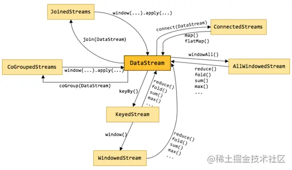

**参考资料:** 

- [Flink介绍](https://juejin.cn/post/7003585014340255774)

- [Flink知识点总结 - 掘金](https://juejin.cn/post/6989050844654075918)

# 1.技术调研

## 1.1. Flink概述

### 1.1.1. Apache Flink诞生

Flink诞生于一个大数据研究项目StratoSphere。早期，Flink是做Batch计算的，但在2014年，StratoSphere里面的核心成员孵化出Flink，同年Flink捐赠Apache，后成为Apache的顶级项目。Flink计算的主流方向在此时被定位为Streaming，即用流计算来做所有的大数据计算。

### 1.1.2.与其他流计算引擎的区别

它不仅是一个高吞吐，低延迟的计算引擎，同事还提供很多高级功能。比如它提供了有状态的计算，支持状态管理，支持强一致性的数据语义以及支持基于Event Time（事件时间）的WaterMark对延迟或乱序的数据进行处理等。

### 1.1.3. Flink概述

Flink官网地址：[flink.apache.org/](https://link.juejin.cn?target=https%3A%2F%2Fflink.apache.org%2F)


### 1.1.4. Flink组件栈

Flink分层的组件栈如下图所示：每一层所包含的组件都是提供了特定的抽象，用来服务于上层组件。


- 物理部署层：Flink支持本地运行，在单机运行的时候用多线程模拟并行计算。Flink也能在独立集群或者被YARN管理的集群上运行，同时他也支持部署在云上，这一层主要涉及的就是Flink的部署模式。目前Flink支持多种部署模式：本地，集群（Standalone，YARN），云（GCE/EC2），Kubenetes。Flink通过物理部署层支持不同平台的部署。
- Runtime核心层：Runtime层提供了支持FLink计算的全部核心实现，为上层API层提供基础服务，该层主要负责对上层不同接口提供基础服务，也是Flink分布式计算框架的核心实现层，支持分布式Stream作业的执行，JobGraph到ExecutionGraph的映射转换，任务调度等。讲DataSteam和DataSet转成统一的可执行的Task Operator，达到在流式引擎下同事处理批量计算和流式计算的目的。
- API&Libraries层：Flink首先支持了Scala和Java的API，Python也在测试中。DataStream，DataSet，Table，SQL API，作为分布式数据处理框架，Flink同时提供了支撑流计算和批计算的接口，两者都提供给用户丰富的数据处理高级API，例如Map，FlatMap操作等，也提供比较低级的Process Function API，用户可以直接操作状态和时间等底层数据。
- 扩展库：Flink还包括用于复杂事件处理的CEP，机器学习库FlinkML，图处理库Gelly等。Table是一种接口化的SQL支持，也就是API支持（DSL），而不是文本化的SQL解析和执行。

### 1.1.5. Flink基石

Flink的流行离不开四个最重要的基石：Checkpoint，State，Time，Window。

- Checkpoint：
  - 这是Flink最重要的一个特性。
  - Flink基于Chandy-Lamport算法实现了一个分布式的一致性的快照，从而提供了一致性的语义。
- State
  - Flink提供一致性的语义之后，Flink为了更轻松，更容易的管理状态，提供了一套简单的State API，包括ValueStae，ListState，MapState，BroadcastState，使用State API能够自动享受到这种一致性语义。
- Time
  - Flink还实现了Watermark机制，能够支持基于事件的事件处理，能够容忍迟到/乱序的数据。
- Window
  - 另外流计算中一般在对流数据进行操作之前都会先进行开窗，即基于一个什么样的窗口上做这个计算。Flink提供了开箱即用的各种窗口，比如滑动窗口，滚动窗口，回话窗口以及非常灵活的自定义窗口。

### 1.1.6. Flink应用场景


#### 1.1.6.1. Event-driven Application【事件驱动】

**什么是事件驱动型应用？**

事件驱动型应用是一类具有状态的应用，它从一个或多个事件流提取数据，并根据到来的事件触发计算，状态更新或其他外部动作。

事件驱动型应用是在计算存储分离的传统应用基础上进化而来。在传统架构中，应用需要读写远程事务型数据库。

相反，事件驱动型应用是基于状态化流处理来完成。在该设计中，数据和计算不会分离，应用只需要访问本地（内存或磁盘）即可获取数据。系统容错性的实现依赖于定期向远程持久化存储写入Checkpoint。下图描述了传统应用和事件驱动型应用架构的区别。

 **事件驱动型应用的优势？**

事件驱动型应用无须查询远程数据库，本地数据访问使得它具有更高的吞吐和更低的延迟。而由于定义向远程持久化存储的Checkpoint工作可以异步，增量式完成，因此对于正常事件处理的影响很小。事件驱动型应用的优势不仅限于本地数据访问。传统分层架构下，通常多个应用会共享同一个数据库，因而任何对数据库自身的更改都需要谨慎协调。反观事件驱动型应用，由于只需要自身数据，因此在更改数据表示或服务扩容时所协调工作将大大减少。

**Flink如何支持事件驱动型应用？**

事件驱动型应用会受制于底层流处理系统对事件和状态的把控能力，Flink诸多优秀特质都是围绕这些方面来设计的。它提供了一系列丰富的状态操作原语，允许以精确一次的一致性语义合并海量规模（TB级别）的状态数据。此外，Flink还支持事件时间和自由度极高的定制化窗口逻辑，而且它内置的ProcessFunction支持细粒度时间控制，方便实现一些高级业务逻辑。同时，Flink还拥有一个复杂数据处理（CEP）类库，可以用来检测数据流中的模式。

Flink中针对事件驱动型应用的明星特质当属savepoint。Savepoint是一个一致性的状态映像，它可以用来初始化任意状态兼容的应用。在完成一次savepoint后，即可放心对应用升级或扩容，还可以启动多个版本的应用来完成A/B测试。

**典型的事件驱动型应用实例**

- 反欺诈
- 异常检测
- 基于规则的报警
- 业务流程监控
- （社交网络）Web应用


#### 1.1.6.2. Data Analytics Application 【数据分析】

**什么是数据分析应用？**

数据分析任务需要从原始数据中提取有价值的信息和指标。传统的分析方式通常是利用批查询，或将事件记录下来并基于此有限数据集构建应用来完成。为了得到最新的分析结果，必须先将他们加入分析数据集并重新执行查询或运行应用，随后将结果写入存储系统或生成报告。

借助一些先进的流处理引擎，还可以实时地进行数据分析。和传统模式下读取有限数据集不同，流式查询或应用会接入实时事件流，并随着事件消费持续产生和更新结果。这些结果数据可能会写入外部数据库系统或内部状态的形式维护。仪表展示应用可以相应地从外部数据库读取或直接查询应用的内部状态。

如下图所示，Apache Flink 同时支持流式及批量分析应用。

 **流式分析应用的优势？**

和批量分析相比，由于流式分析省掉了周期性的数据导入和查询过程，因此从事件中获取指标的延迟更低。不仅如此，批量查询必须处理那些由定期导入和输入有界性导致的人工数据边界，而流式查询则无须考虑该问题。

另一方面，流式分析会简化应用抽象。批量查询的流水线通常由多个独立组件组成，需要周期性的调度提取数据和执行查询。如此复杂的流水线操作起来并不容易，一旦某个组件出错将会影响流水线的后续步骤。而流式分析应用整体运行在Flink之类的高端流处理系统之上，涵盖了从数据接入到连续结果计算的所有步骤，因此可以依赖底层引擎提供的故障恢复机制。

**Flink如何支持数据分析类应用？**

Flink为支持流式分析和批量分析都提供了良好的支持。具体而言，它内置了一个符合ANSI标准的SQL接口，将批，流查询的语义统一起来。无论是在记录事件的静态数据集上还是实时事件流上，相同SQL查询都会得到一致的结果。同时Flink还支持丰富的用户自定义函数，允许在SQL中执行定制化代码。如果还需要进一步定制逻辑，可以利用Flink DataStream API和DataSet API进行更低层次的控制。

**典型的数据分析应用实例**

- 电信网络质量监控
- 移动应用中的产品更新及实验评估分析
- 消费者技术中实时数据即席分析
- 大规模图分析

#### 1.1.6.3. Data Pipeline Applications 【数据管道】

**什么是数据管道？**

提取-转换-加载（ETL）是一种在存储系统之间进行数据转换和迁移的常用方法。ETL作业通常会周期性的触发，将数据从事务型数据库拷贝到分析型数据库或数据仓库。

数据管道和ETL作业的用途相似，都可以转换，丰富数据，并将其从某个存储系统移动到另一个。但数据管道是以持续流模式运行，而非周期性触发。因此它支持从一个不断生成数据的源头读取记录，并将他们以低延迟移动到终点。例如：数据管道可以用来监控文件系统目录中新文件，并将其数据写入事件日志；另一个应用可能会将事件流物化到数据库或增量构建和优化查询索引。

下图描述了周期性ETL和持续数据管道的差异。

 **数据管道的优势？**

和周期性ETL作业相比，持续数据管道可以明显降低数据移动到目的端的延迟。此外，由于他能够持续消费和发送数据，因此用途更广，支持用例更多。

**Flink如何支持数据管道应用？**

很多常见的数据转换和增强操作可以利用Flink的SQL接口（或Table API）及用户自定义函数解决。如果数据管道有更高级的需求，可以选择更通用的DataStream API来实现。Flink为多种数据存储系统（如：Kafka，Kinesis，ElasticSearch，JDBC数据库系统等）内置了连接器。同时它还提供了文件系统的连续型数据源及数据汇，可用来监控目录变化和以时间分区的方式写入文件。

**典型的数据管道应用实例**

- 电子商务中实时查询索引构建

  搜索引擎这块以淘宝为例，当卖家上线新商品时，后台会实时产生消息流，该消息流经过Flink 系统时会进行数据的处理、扩展。然后将处理及扩展后的数据生成实时索引，写入到搜索引擎中。这样当淘宝卖家上线新商品时，能在秒级或者分钟级实现搜索引擎的搜索。

- 电子商务中的持续ETL

  当下游要构建实时数仓时，上游则可能需要实时的Stream ETL。这个过程会进行实时清洗或扩展数据，清洗完成后写入到下游的实时数仓的整个链路中，可保证数据查询的时效性，形成实时数据采集、实时数据处理以及下游的实时Query。

## 1.2.Flink优势


### 1.2.1.主要优势

1. Flink具备统一的框架用以处理有界和无界两种数据流的能力。
2. 部署灵活，Flink底层支持多种资源调度器，包括YARN，Kubernetes等。
3. 极高的可伸缩性，可伸缩性对于分布式系统十分重要。
4. 极致的流处理性能。Flink相对于Storm最大的特点是讲状态语义完全抽象到框架中，支持本地状态读取，避免大量网络IO，可以极大的提升状态读取性能。

### 1.2.2.其他优势

1. 同时支持高吞吐，低延迟，高性能

   Flink是目前开源社区中唯一一套高吞吐，低延迟，高性能三者基于一身的分布式流式数据处理框架。

   Spark只能兼顾高吞吐和高性能的特性，无法做到低延迟保障，因为Spark是用批处理来做流处理的。

   Storm只能支持低延迟和高性能特性，无法满足高吞吐的要求。

2. 支持事件时间（Event Time）概念

   在流式计算领域中，窗口计算的地位举足轻重，但目前大多数框架窗口计算采用的都是系统时间（Process Time），也就是时间传输到计算框架处理时，系统主机当前时间。

   Flink能支持基于事件时间（Event Time）语义进行窗口计算。

   这种基于事件驱动的机制使得事件即使乱序到达甚至延迟到达，流系统也能够计算出精确地结果，保持了事件原本产生时的时序性，尽可能避免网络传输或硬件系统的影响。

3. 支持有状态计算

   所谓状态就是在流式计算过程中讲算子的中间结果保存在内存或者文件系统中，等下一个事件进入算子后可以从之前的状态中获取中间结果，计算当前结果，从而无需每次都基于全部的原始数据来统计结果，极大的提升了系统性能，状态话意味着可以维护随着事件推移已经产生的数据聚合。

4. 支持高度灵活的窗口（Window）操作

   Flink讲窗口划分为基于Time，Count，Session，以及Data-Driven等类型的窗口操作，窗口可以用灵活的触发条件定制化来达到对复杂的流传输模式的支持，用户可以定义不同的窗口。

5. 基于轻量级分布式快照（Snapshot/Checkpoints）的容错机制

   Flink能够分布式运行在上千个节点上，通过基于分布式快照技术的Checkpoints，将执行过程中的状态信息进行持久化存储，一旦任务出现异常停止，Flink能够从Checkpoints中进行任务的自动恢复，以确保数据处理过程中的一致性。

   Flink的容错能力是轻量级的，允许系统保持高并发，同时在相同事件内提供强一致性保证。

6. 基于JVM实现的独立的内存管理

   Flink 实现了自身管理内存的机制，通过使用散列，索引，缓存和排序有效地进行内存管理，通过序列化/反序列化机制将所有的数据对象转换成二进制在内存中存储，降低数据存储大小的同时，更加有效的利用空间。使其独立于 Java 的默认垃圾收集器，尽可能减少 JVM GC 对系统的影响。

7. SavePoint保存点

   对于 7 * 24 小时运行的流式应用，数据源源不断的流入，在一段时间内应用的终止有可能导致数据的丢失或者计算结果的不准确。比如集群版本的升级，停机运维操作等。

   Flink 通过SavePoints 技术将任务执行的快照保存在存储介质上，当任务重启的时候，可以从事先保存的 SavePoints 恢复原有的计算状态，使得任务继续按照停机之前的状态运行。

   Flink 保存点提供了一个状态化的版本机制，使得能以无丢失状态和最短停机时间的方式更新应用或者回退历史数据。

8. 灵活的部署方式，支持大规模集群

   Flink 被设计成能用上千个点在大规模集群上运行，除了支持独立集群部署外，Flink 还支持 YARN 和Mesos 方式部署。

9. Flink的程序内在是并行和分布式的

   数据流可以被分区成 stream partitions，operators 被划分为operator subtasks; 这些 subtasks 在不同的机器或容器中分不同的线程独立运行；

   operator subtasks 的数量就是operator的并行计算数，不同的 operator 阶段可能有不同的并行数；

10. 丰富的库

    Flink 拥有丰富的库来进行机器学习，图形处理，关系数据处理等。

## 1.3.入门demo

```java
package com.lhw.flink.demo1_wordcount;

import org.apache.flink.api.common.RuntimeExecutionMode;
import org.apache.flink.api.common.functions.FlatMapFunction;
import org.apache.flink.api.common.functions.MapFunction;
import org.apache.flink.api.java.tuple.Tuple2;
import org.apache.flink.streaming.api.datastream.DataStream;
import org.apache.flink.streaming.api.datastream.KeyedStream;
import org.apache.flink.streaming.api.environment.StreamExecutionEnvironment;
import org.apache.flink.util.Collector;

/**
 * 需求：使用Flink完成WordCount-DataStream
 * 编码步骤：
 * 1：准备环境-env
 * 2：准备数据-source
 * 3：处理数据-transformation
 * 4：输出结果-sink
 * 5：触发执行-execute
 */
public class DataStreamWordCount2 {
    public static void main(String[] args) throws Exception {
        //新版本的流批一体API，即支持流处理也支持批处理
        //1：准备环境-env
        StreamExecutionEnvironment env = StreamExecutionEnvironment.getExecutionEnvironment();
        env.setRuntimeMode(RuntimeExecutionMode.AUTOMATIC);//自动判断
        //env.setRuntimeMode(RuntimeExecutionMode.STREAMING);//流
        //env.setRuntimeMode(RuntimeExecutionMode.BATCH);//批
        //2：准备数据-source
        DataStream<String> linesDS = env.fromElements("flink hadoop spark", "flink hadoop spark", "flink hadoop", "flink");
        //3：处理数据-transformation
        //3.1：每一行数据按照空格切分成一个个的单词组成一个集合
        DataStream<String> wordsDS = linesDS.flatMap(new FlatMapFunction<String, String>() {
            @Override
            public void flatMap(String s, Collector<String> collector) throws Exception {
                String[] arr = s.split(" ");
                for (String s1 : arr) {
                    collector.collect(s1);
                }
            }
        });
        //3.2：将集合中的每一个单词记为1
        DataStream<Tuple2<String, Integer>> wordAndOnesDS = wordsDS.map(new MapFunction<String, Tuple2<String, Integer>>() {
            @Override
            public Tuple2<String, Integer> map(String s) throws Exception {
                return Tuple2.of(s, 1);
            }
        });
        //3.3：对数据按照单词（key）进行分组
        //0表示按照tuple中索引为0的字段，也就是key进行分组
//        KeyedStream<Tuple2<String, Integer>, Tuple> groupedDS = wordAndOnesDS.keyBy(0);
        KeyedStream<Tuple2<String, Integer>, String> groupedDS = wordAndOnesDS.keyBy(t -> t.f0);
        //3.4：对各个组内的数据按照数量（value）进行聚合就是求sum
        //1表示tuple中索引为1的字段
        DataStream<Tuple2<String, Integer>> result = groupedDS.sum(1);
        //4：输出结果-sink
        result.print();
        //5：触发执行-execute
        env.execute();//DataStream需要调用execute
    }
}
```

## 1.4.Flink原理

### 1.4.1.Flink角色

在实际生产中，Flink都是以集群在运行，在运行的过程中包含了两类进程。

- JobManager

  它扮演的是集群管理者的角色，负责协调任务，协调checkpoints，协调故障恢复，收集Job的状态信息，并管理Flink集群中的从节点TaskManager。

- TaskManager

  实际负责执行计算的Worker，在其上执行Flink Job的一组Task；TaskManager还是所在节点的管理员，它负责把该节点上的服务器信息，比如内存，磁盘，任务运行情况等向JobManager汇报。

- Client

  用在提交编写好的Flink工程时，会先创建一个客户端再进行提交，这个客户端就是Client。


### 1.4.2.Flink执行流程

#### 1.4.2.1.Standalone版


#### 1.4.2.2.On Yarn版


1. Client向HDFS上传Flink的Jar包和配置
2. Client向Yarn ResourceManager提交任务并申请资源
3. ResourceManager分配Container资源并启动ApplicationMaster，然后ApplicationMaster加载Flink的Jar包和配置构建环境，启动JobManager。
4. ApplicationMaster向ResourceManager申请工作资源，NodeManager加载Flink的Jar包和配置文件构建环境并启动TaskManager
5. TaskManager启动后向JobManager发送心跳包，并等待JobManager向其分配任务

### 1.4.3.Flink运行时组件

Flink运行时架构主要包括四个不同的组件，他们会在运行流处理应用程序时协同工作。

- 作业管理器（JobManager）：分配任务，调度Checkpoint做快照。
- 任务管理器（TaskManager）：主要任务执行者
- 资源管理器（ResourceManager）：管理分配资源
- 分发器（Dispatcher）：方便递交任务的接口，WebUI

因为Flink是用Java和Scala实现的，所以所有组件都会运行在Java虚拟机上。每个组件职责如下：

1. 作业管理器（JobManager）
   1. 控制一个应用程序执行的主进程，也就是说，每个应用程序都会被一个不同的JobManger所控制执行。
   2. JobManager会先接收到要执行的应用程序，这个应用程序会包括：作业图（JobGraph），逻辑数据流图（logical dataflow graph）和打包了所有的类，库和其他资源的Jar包。
   3. JobManager会把JobGraph转换成一个物理层面的数据流图，这个图被叫做“执行图”（ExecutionGraph），包含了所有可以并发执行的任务。
   4. JobManager会向资源管理器（ResourceManager）请求执行必要的资源，也就是任务管理器（TaskManager）上的插槽（slots）。一旦它获取到足够的资源，就会执行图分发到真正运行他们的TaskManager上。而在运行过程中，JobManager会负责所有需要中央协调的操作，比如说检查点（checkpoint）的协调。
2. 任务管理器（TaskManager）
   1. Flink中的工作进程。通常在Flink中会有多个TaskManager运行，每一个TaskManager都包含了一定数量的插槽（slots）。插槽的数量限制了TaskManager能够执行的任务数量。
   2. 启动之后，TaskManager会向资源管理器注册它的插槽；收到资源管理器的指令之后，TaskManager就会将一个或者多个插槽提供给JobManager调用。JobManager就可以向插槽分配任务（tasks）来执行了。
   3. 在执行过程中，一个TaskManager可以跟其他运行同一应用的TaskManager交换数据。
3. 资源管理器（ResourceManager）
   1. 主要负责任务管理器（TaskManager）的插槽（slot），TaskManager插槽是Flink中定义的处理资源单元。
   2. Flink为不同的环境和资源管理工具提供了不同资源管理器，比如YARN，Mesos，K8s，以及Standalone部署
   3. 当JobManager申请插槽资源时。ResourceManager会将有空闲插槽的TaskManager分配给JobManager。如果ResourceManager没有足够的插槽来满足JobManager的请求，他还可以向资源提供平台发起会话，以提供启动TaskManager进程的容器。
4. 分发器（Dispatcher）
   1. 可以跨作业运行，它为应用提交提供了REST接口。
   2. 当一个应用被提交执行时，分发器就会启动并将应用移交给一个JobManager。
   3. Dispatcher也会启动一个Web UI，用来方便的展示和监控作业执行的信息。
   4. Dispatcher在架构中可能不是必须的，这取决于应用提交运行的方式。

## 1.5.Flink API


### 1.5.1.Source

#### 1.5.1.1.预定义Source

**基于集合的Source：**

```
// * 1.env.fromElements(可变参数);
DataStream<String> ds1 = env.fromElements("hadoop", "spark", "flink");
// * 2.env.fromColletion(各种集合);
DataStream<String> ds2 = env.fromCollection(Arrays.asList("hadoop", "spark", "flink"));
// * 3.env.generateSequence(开始,结束);
DataStream<Long> ds3 = env.generateSequence(1, 10);
//* 4.env.fromSequence(开始,结束);
DataStream<Long> ds4 = env.fromSequence(1, 10);
```

**基于文件的Source：**

```
// * 1.env.readTextFile(本地文件/HDFS文件);//压缩文件也可以
DataStream<String> ds1 = env.readTextFile("data/input/words.txt");
DataStream<String> ds2 = env.readTextFile("data/input/dir");
DataStream<String> ds3 = env.readTextFile("hdfs://node1:8020//wordcount/input/words.txt");
DataStream<String> ds4 = env.readTextFile("data/input/wordcount.txt.gz");
```

**基于Socket的Source：**

```
DataStream<String> linesDS = env.socketTextStream("node1", 9999);
```

#### 1.5.1.2.自定义Source

```java
package com.lhw.flink.demo2_source;

import lombok.AllArgsConstructor;
import lombok.Data;
import lombok.NoArgsConstructor;
import org.apache.flink.api.common.RuntimeExecutionMode;
import org.apache.flink.configuration.Configuration;
import org.apache.flink.streaming.api.datastream.DataStreamSource;
import org.apache.flink.streaming.api.environment.StreamExecutionEnvironment;
import org.apache.flink.streaming.api.functions.source.RichParallelSourceFunction;

import java.sql.Connection;
import java.sql.DriverManager;
import java.sql.PreparedStatement;
import java.sql.ResultSet;

/**
 * 演示Flink-DataStream-API-自定义Source-MySQL
 * SourceFunction：非并行数据源（并行度只能=1）
 * RichSourceFunction：多功能非并行数据源（并行度只能=1）
 * ParallelSourceFunction：并行数据源（并行度能够>1）
 * RichParallelSourceFunction：多功能并行数据源（并行度能够>=1）
 */
public class SourceDemo5 {
    public static void main(String[] args) throws Exception {
        //1：env
        StreamExecutionEnvironment env = StreamExecutionEnvironment.getExecutionEnvironment();
        env.setRuntimeMode(RuntimeExecutionMode.AUTOMATIC);
        //2：Source
        DataStreamSource<Student> ds = env.addSource(new MySQLSource()).setParallelism(1);
        //3:transformation
        //4:sink
        ds.print();
        //5:executor
        env.execute();
    }
    /**
     * 使用自定义数据源加载MySQL中的最新数据，每隔两秒加载一次
     * SourceFunction:非并行数据源(并行度只能=1)
     * RichSourceFunction:多功能非并行数据源(并行度只能=1)
     * ParallelSourceFunction:并行数据源(并行度能够>=1)
     * RichParallelSourceFunction:多功能并行数据源(并行度能够>=1)
     */
    public static class MySQLSource extends RichParallelSourceFunction<Student>{

        private Boolean flag = true;
        private Connection conn;
        private PreparedStatement ps;
        @Override
        public void open(Configuration parameters) throws Exception {
            conn= DriverManager.getConnection("jdbc:mysql://localhost:3306/bigdata", "root", "root");
            ps = conn.prepareStatement("select id,name,age from t_student");
        }

        //查询数据要一直执行，每隔2s查询一次最新数据
        @Override
        public void run(SourceContext<Student> sourceContext) throws Exception {
            while (flag){
                ResultSet resultSet = ps.executeQuery();
                while (resultSet.next()){
                    int id = resultSet.getInt("id");
                    String name = resultSet.getString("name");
                    int age = resultSet.getInt("age");
                    sourceContext.collect(new Student(id,name,age));
                }
                Thread.sleep(2000);
            }
        }
        //执行cancel命令时执行
        @Override
        public void cancel() {
            flag=false;
        }

        //关闭连接的时候执行一次
        @Override
        public void close() throws Exception {
            super.close();
        }
    }

    @Data
    @NoArgsConstructor
    @AllArgsConstructor
    public static class Student {
        private Integer id;
        private String name;
        private Integer age;
    }
}
```

### 1.5.2.Transformation




整体来说，流式数据上的操作可以分为4类。

第一类是对于单条记录的操作，比如筛除不符合要求的记录（Filter操作），或者将每条记录都做一个转换（Map操作）

第二类是对多条记录的操作，比如统计一个小时内订单总成交量，就需要将一个小时内的所有订单记录的成交量加到一起。为了支持这种类型的操作，就得通过Window将需要的记录关联到一起进行处理。

第三类是对多个流进行操作转换为单流。例如，多个流可以通过Union，Join或Connect等操作合到一起。这些操作合并逻辑不同，但是它们最终都会产生一个新的统一的流，从而可以进行一些跨流的操作。

### 1.5.3.Sink

#### 1.5.3.1.预定义Sink

**基于控制台和文件的Sink：**

1.ds.print 直接输出到控制台

2.ds.printToErr() 直接输出到控制台,用红色

3.ds.writeAsText("本地/HDFS的path",WriteMode.OVERWRITE).setParallelism(1)

在输出到path的时候,可以在前面设置并行度,如果并行度>1,则path为目录，并行度=1,则path为文件名

```java
package com.lhw.flink.demo4_sink;

import org.apache.flink.api.common.RuntimeExecutionMode;
import org.apache.flink.streaming.api.datastream.DataStreamSource;
import org.apache.flink.streaming.api.environment.StreamExecutionEnvironment;

/**
 * 演示FlinkDemo1
 */
public class SinkDemo1 {
    public static void main(String[] args) throws Exception {
        //1:env
        StreamExecutionEnvironment env = StreamExecutionEnvironment.getExecutionEnvironment();
        env.setRuntimeMode(RuntimeExecutionMode.AUTOMATIC);
        //2:source
        DataStreamSource<String> ds = env.readTextFile("data/input/words.txt");
        //3:transformation
        //4:sink
        //4.1:ds.print 直接输出到控制台
        ds.print();
        ds.print("提示符");
        //4.2:ds.printToErr() 直接输出到到控制台，用红色
        ds.printToErr();
        //4.3:ds.writeAsText("本地/HDFS的path",WriteMode.OVERWRITE).setParallelism(1);
        ds.writeAsText("data/output/result1").setParallelism(1);//以一个并行度写，生成一个文件
        ds.writeAsText("data/output/result2").setParallelism(2);//以多个并行度写，生成多个文件
        //在输出到path的时候，可以在前面设置并行度，如果
        //并行度>1，则path为目录
        //并行度=1，则path为文件名
        //5：execution
        env.execute();
    }
}
```

#### 1.5.3.2.自定义Sink

**MySQL**

```java
package com.lhw.flink.demo4_sink;

import lombok.AllArgsConstructor;
import lombok.Data;
import lombok.NoArgsConstructor;
import org.apache.flink.api.common.RuntimeExecutionMode;
import org.apache.flink.configuration.Configuration;
import org.apache.flink.streaming.api.datastream.DataStreamSource;
import org.apache.flink.streaming.api.environment.StreamExecutionEnvironment;
import org.apache.flink.streaming.api.functions.sink.RichSinkFunction;

import java.sql.Connection;
import java.sql.DriverManager;
import java.sql.PreparedStatement;

/**
 * 演示Flink-DataStream-API-Sink
 */
public class SinkDemo2 {
    public static void main(String[] args) throws Exception {
        //1:env
        StreamExecutionEnvironment env = StreamExecutionEnvironment.getExecutionEnvironment();
        env.setRuntimeMode(RuntimeExecutionMode.AUTOMATIC);
        //2:source
        DataStreamSource<Student> studentDS = env.fromElements(new Student(null, "tony", 18));
        //3:transformation
        //4:sink
        studentDS.addSink(new RichSinkFunction<Student>() {
            private Connection conn;
            private PreparedStatement ps;
            @Override
            public void open(Configuration parameters) throws Exception {
                conn = DriverManager.getConnection("jdbc:mysql://localhost:3306/bigdata","root","root");
                ps = conn.prepareStatement("insert into t_student (id,name,age) values (null,?,?)");
            }

            //执行插入操作
            @Override
            public void invoke(Student value, Context context) throws Exception {
                //设置？占位符
                ps.setString(1,value.getName());
                ps.setInt(2,value.getAge());
                //执行
                ps.executeUpdate();
            }
            //关闭连接
            @Override
            public void close() throws Exception {
                if (conn!=null) conn.close();
                if (ps!=null) ps.close();
            }
        });
        //5：execution
        env.execute();
    }

    @Data
    @NoArgsConstructor
    @AllArgsConstructor
    public static class Student {
        private Integer id;
        private String name;
        private Integer age;
    }
}
```

# 1.Flink知识点总结

## 1.1.Flink组件栈

Apache Flink-数据流上的有状态计算。


组件栈


各层详细介绍：

- 物理部署层：Flink 支持本地运行、能在独立集群或者在被 YARN 管理的集群上运行， 也能部署在云上，该层主要涉及Flink的部署模式，目前Flink支持多种部署模式：本地、集群(Standalone、YARN)、云(GCE/EC2)、Kubenetes。Flink能够通过该层能够支持不同平台的部署，用户可以根据需要选择使用对应的部署模式。
- Runtime核心层：Runtime层提供了支持Flink计算的全部核心实现，为上层API层提供基础服务，该层主要负责对上层不同接口提供基础服务，也是Flink分布式计算框架的核心实现层，支持分布式Stream作业的执行、JobGraph到ExecutionGraph的映射转换、任务调度等。将DataSteam和DataSet转成统一的可执行的Task Operator，达到在流式引擎下同时处理批量计算和流式计算的目的。
- API&Libraries层：Flink 首先支持了 Scala 和 Java 的 API，Python 也正在测试中。DataStream、DataSet、Table、SQL API，作为分布式数据处理框架，Flink同时提供了支撑计算和批计算的接口，两者都提供给用户丰富的数据处理高级API，例如Map、FlatMap操作等，也提供比较低级的Process Function API，用户可以直接操作状态和时间等底层数据。
- 扩展库：Flink 还包括用于复杂事件处理的CEP，机器学习库FlinkML，图处理库Gelly等。Table 是一种接口化的 SQL 支持，也就是 API 支持(DSL)，而不是文本化的SQL 解析和执行。

## 1.2.Flink基石

Flink之所以能这么流行，离不开它最重要的四个基石：Checkpoint、State、Time、Window。


- Checkpoint

  这是Flink最重要的一个特性。

  Flink基于Chandy-Lamport算法实现了一个分布式的一致性的快照，从而提供了一致性的语义。

  Chandy-Lamport算法实际上在1985年的时候已经被提出来，但并没有被很广泛的应用，而Flink则把这个算法发扬光大了。

  Spark最近在实现Continue streaming，Continue streaming的目的是为了降低处理的延时，其也需要提供这种一致性的语义，最终也采用了Chandy-Lamport这个算法，说明Chandy-Lamport算法在业界得到了一定的肯定。

- State

  提供了一致性的语义之后，Flink为了让用户在编程时能够更轻松、更容易地去管理状态，还提供了一套非常简单明了的State API，包括里面的有ValueState、ListState、MapState，近期添加了BroadcastState，使用State API能够自动享受到这种一致性的语义。

- Time

  除此之外，Flink还实现了Watermark的机制，能够支持基于事件的时间的处理，能够容忍迟到/乱序的数据。

- Window

  另外流计算中一般在对流数据进行操作之前都会先进行开窗，即基于一个什么样的窗口上做这个计算。Flink提供了开箱即用的各种窗口，比如滑动窗口、滚动窗口、会话窗口以及非常灵活的自定义的窗口。

## 1.3.Flink安装部署

Flink支持多种安装模式

\- Local—本地单机模式，学习测试时使用

\- Standalone—独立集群模式，Flink自带集群，开发测试环境使用

\- StandaloneHA—独立集群高可用模式，Flink自带集群，开发测试环境使用

\- On Yarn—计算资源统一由Hadoop YARN管理，生产环境使用

### 1.3.1.Local本地模式

### **原理**


1. Flink程序由JobClient进行提交
2. JobClient将作业提交给JobManager
3. JobManager负责协调资源分配和作业执行。资源分配完成后，任务将提交给相应的TaskManager
4. TaskManager启动一个线程以开始执行。TaskManager会向JobManager报告状态更改,如开始执行，正在进行或已完成。
5. 作业执行完成后，结果将发送回客户端(JobClient)

### 1.3.2.Standalone独立集群模式

**原理**


1. client客户端提交任务给JobManager
2. JobManager负责申请任务运行所需要的资源并管理任务和资源
3. JobManager分发任务给TaskManager执行
4. TaskManager定期向JobManager汇报状态

### 1.3.3.Standalone-HA高可用集群模式


从之前的架构中我们可以很明显的发现 JobManager 有明显的单点问题(SPOF，single point of failure)。JobManager 肩负着任务调度以及资源分配，一旦 JobManager 出现意外，其后果可想而知。

在 Zookeeper 的帮助下，一个 Standalone的Flink集群会同时有多个活着的 JobManager，其中只有一个处于工作状态，其他处于 Standby 状态。当工作中的 JobManager 失去连接后(如宕机或 Crash)，Zookeeper 会从 Standby 中选一个新的 JobManager 来接管 Flink 集群。

### 1.3.1.Flink On Yarn模式

**原理**

为什么使用Flink On Yarn？

1. Yarn的资源可以按需使用，提高集群的资源利用率
2. Yarn的任务有优先级，根据优先级运行作业
3. 基于Yarn调度系统，能够自动化地处理各个角色的 Failover(容错)
   1. JobManager 进程和 TaskManager 进程都由 Yarn NodeManager 监控
   2. 如果 JobManager 进程异常退出，则 Yarn ResourceManager 会重新调度 JobManager 到其他机器
   3. 如果 TaskManager 进程异常退出，JobManager 会收到消息并重新向 Yarn ResourceManager 申请资源，重新启动 TaskManager

**Flink如何和YARN进行交互？**


1. Client上传jar包和配置文件到HDFS集群上

2. Client向Yarn ResourceManager提交任务并申请资源

3. .ResourceManager分配Container资源并启动ApplicationMaster,然后AppMaster加载Flink的Jar包和配置构建环境,启动JobManager

   1. JobManager和ApplicationMaster运行在同一个container上。

   2. 一旦他们被成功启动，AppMaster就知道JobManager的地址(AM它自己所在的机器)。

   3. 它就会为TaskManager生成一个新的Flink配置文件(他们就可以连接到JobManager)。这个配置文件也被上传到HDFS上。

   4. 此外，AppMaster容器也提供了Flink的web服务接口。

      YARN所分配的所有端口都是临时端口，这允许用户并行执行多个Flink

4. ApplicationMaster向ResourceManager申请工作资源,NodeManager加载Flink的Jar包和配置构建环境并启动TaskManager

5. TaskManager启动后向JobManager发送心跳包，并等待JobManager向其分配任务

## 1.4.Flink入门案例


### 1.4.1.编程模型

Flink 应用程序结构主要包含三部分,Source/Transformation/Sink,如下图所示：


### 1.4.2.入门案例

pom文件

```xml
<?xml version="1.0" encoding="UTF-8"?>
<project xmlns="http://maven.apache.org/POM/4.0.0"
         xmlns:xsi="http://www.w3.org/2001/XMLSchema-instance"
         xsi:schemaLocation="http://maven.apache.org/POM/4.0.0 http://maven.apache.org/xsd/maven-4.0.0.xsd">
    <modelVersion>4.0.0</modelVersion>

    <groupId>com.lhw</groupId>
    <artifactId>flink_demo</artifactId>
    <version>1.0-SNAPSHOT</version>


    <repositories>
        <repository>
            <id>aliyun</id>
            <url>http://maven.aliyun.com/nexus/content/groups/public/</url>
        </repository>
        <repository>
            <id>apache</id>
            <url>https://repository.apache.org/content/repositories/snapshots/</url>
        </repository>
        <repository>
            <id>cloudera</id>
            <url>https://repository.cloudera.com/artifactory/cloudera-repos/</url>
        </repository>
    </repositories>

    <properties>
        <encoding>UTF-8</encoding>
        <project.build.sourceEncoding>UTF-8</project.build.sourceEncoding>
        <maven.compiler.source>1.8</maven.compiler.source>
        <maven.compiler.target>1.8</maven.compiler.target>
        <java.version>1.8</java.version>
        <scala.version>2.12</scala.version>
        <flink.version>1.12.0</flink.version>
    </properties>
    <dependencies>
        <!--依赖Scala语言-->
        <dependency>
            <groupId>org.scala-lang</groupId>
            <artifactId>scala-library</artifactId>
            <version>2.12.11</version>
        </dependency>

        <dependency>
            <groupId>org.apache.flink</groupId>
            <artifactId>flink-clients_2.12</artifactId>
            <version>${flink.version}</version>
        </dependency>
        <dependency>
            <groupId>org.apache.flink</groupId>
            <artifactId>flink-scala_2.12</artifactId>
            <version>${flink.version}</version>
        </dependency>
        <dependency>
            <groupId>org.apache.flink</groupId>
            <artifactId>flink-java</artifactId>
            <version>${flink.version}</version>
        </dependency>
        <dependency>
            <groupId>org.apache.flink</groupId>
            <artifactId>flink-streaming-scala_2.12</artifactId>
            <version>${flink.version}</version>
        </dependency>
        <dependency>
            <groupId>org.apache.flink</groupId>
            <artifactId>flink-streaming-java_2.12</artifactId>
            <version>${flink.version}</version>
        </dependency>
        <dependency>
            <groupId>org.apache.flink</groupId>
            <artifactId>flink-table-api-scala-bridge_2.12</artifactId>
            <version>${flink.version}</version>
        </dependency>
        <dependency>
            <groupId>org.apache.flink</groupId>
            <artifactId>flink-table-api-java-bridge_2.12</artifactId>
            <version>${flink.version}</version>
        </dependency>

        <!-- blink执行计划,1.11+默认的-->
        <dependency>
            <groupId>org.apache.flink</groupId>
            <artifactId>flink-table-planner-blink_2.12</artifactId>
            <version>${flink.version}</version>
        </dependency>
        <dependency>
            <groupId>org.apache.flink</groupId>
            <artifactId>flink-table-common</artifactId>
            <version>${flink.version}</version>
        </dependency>

        <!--<dependency>
            <groupId>org.apache.flink</groupId>
            <artifactId>flink-cep_2.12</artifactId>
            <version>${flink.version}</version>
        </dependency>-->

        <!-- flink连接器-->
        <dependency>
            <groupId>org.apache.flink</groupId>
            <artifactId>flink-connector-kafka_2.12</artifactId>
            <version>${flink.version}</version>
        </dependency>
        <dependency>
            <groupId>org.apache.flink</groupId>
            <artifactId>flink-sql-connector-kafka_2.12</artifactId>
            <version>${flink.version}</version>
        </dependency>
        <dependency>
            <groupId>org.apache.flink</groupId>
            <artifactId>flink-connector-jdbc_2.12</artifactId>
            <version>${flink.version}</version>
        </dependency>
        <dependency>
            <groupId>org.apache.flink</groupId>
            <artifactId>flink-csv</artifactId>
            <version>${flink.version}</version>
        </dependency>
        <dependency>
            <groupId>org.apache.flink</groupId>
            <artifactId>flink-json</artifactId>
            <version>${flink.version}</version>
        </dependency>

        <!--<dependency>
              <groupId>org.apache.flink</groupId>
              <artifactId>flink-parquet_2.12</artifactId>
              <version>${flink.version}</version>
         </dependency>-->
        <!--<dependency>
            <groupId>org.apache.avro</groupId>
            <artifactId>avro</artifactId>
            <version>1.9.2</version>
        </dependency>
        <dependency>
            <groupId>org.apache.parquet</groupId>
            <artifactId>parquet-avro</artifactId>
            <version>1.10.0</version>
        </dependency>-->


        <dependency>
            <groupId>org.apache.bahir</groupId>
            <artifactId>flink-connector-redis_2.11</artifactId>
            <version>1.0</version>
            <exclusions>
                <exclusion>
                    <artifactId>flink-streaming-java_2.11</artifactId>
                    <groupId>org.apache.flink</groupId>
                </exclusion>
                <exclusion>
                    <artifactId>flink-runtime_2.11</artifactId>
                    <groupId>org.apache.flink</groupId>
                </exclusion>
                <exclusion>
                    <artifactId>flink-core</artifactId>
                    <groupId>org.apache.flink</groupId>
                </exclusion>
                <exclusion>
                    <artifactId>flink-java</artifactId>
                    <groupId>org.apache.flink</groupId>
                </exclusion>
            </exclusions>
        </dependency>

        <dependency>
            <groupId>org.apache.flink</groupId>
            <artifactId>flink-connector-hive_2.12</artifactId>
            <version>${flink.version}</version>
        </dependency>
        <dependency>
            <groupId>org.apache.hive</groupId>
            <artifactId>hive-metastore</artifactId>
            <version>2.1.0</version>
            <exclusions>
                <exclusion>
                    <artifactId>hadoop-hdfs</artifactId>
                    <groupId>org.apache.hadoop</groupId>
                </exclusion>
            </exclusions>
        </dependency>
        <dependency>
            <groupId>org.apache.hive</groupId>
            <artifactId>hive-exec</artifactId>
            <version>2.1.0</version>
        </dependency>

        <dependency>
            <groupId>org.apache.flink</groupId>
            <artifactId>flink-shaded-hadoop-2-uber</artifactId>
            <version>2.7.5-10.0</version>
        </dependency>

        <dependency>
            <groupId>org.apache.hbase</groupId>
            <artifactId>hbase-client</artifactId>
            <version>2.1.0</version>
        </dependency>
        <dependency>
            <groupId>mysql</groupId>
            <artifactId>mysql-connector-java</artifactId>
            <version>5.1.38</version>
            <!--<version>8.0.20</version>-->
        </dependency>

        <!-- 高性能异步组件：Vertx-->
        <dependency>
            <groupId>io.vertx</groupId>
            <artifactId>vertx-core</artifactId>
            <version>3.9.0</version>
        </dependency>
        <dependency>
            <groupId>io.vertx</groupId>
            <artifactId>vertx-jdbc-client</artifactId>
            <version>3.9.0</version>
        </dependency>
        <dependency>
            <groupId>io.vertx</groupId>
            <artifactId>vertx-redis-client</artifactId>
            <version>3.9.0</version>
        </dependency>

        <!-- 日志 -->
        <dependency>
            <groupId>org.slf4j</groupId>
            <artifactId>slf4j-log4j12</artifactId>
            <version>1.7.7</version>
            <scope>runtime</scope>
        </dependency>
        <dependency>
            <groupId>log4j</groupId>
            <artifactId>log4j</artifactId>
            <version>1.2.17</version>
            <scope>runtime</scope>
        </dependency>

        <dependency>
            <groupId>com.alibaba</groupId>
            <artifactId>fastjson</artifactId>
            <version>1.2.44</version>
        </dependency>

        <dependency>
            <groupId>org.projectlombok</groupId>
            <artifactId>lombok</artifactId>
            <version>1.18.2</version>
            <scope>provided</scope>
        </dependency>

        <!-- 参考：https://blog.csdn.net/f641385712/article/details/84109098-->
        <!--<dependency>
            <groupId>org.apache.commons</groupId>
            <artifactId>commons-collections4</artifactId>
            <version>4.4</version>
        </dependency>-->
        <!--<dependency>
            <groupId>org.apache.thrift</groupId>
            <artifactId>libfb303</artifactId>
            <version>0.9.3</version>
            <type>pom</type>
            <scope>provided</scope>
         </dependency>-->
        <!--<dependency>
           <groupId>com.google.guava</groupId>
           <artifactId>guava</artifactId>
           <version>28.2-jre</version>
       </dependency>-->

    </dependencies>

    <build>
        <sourceDirectory>src/main/java</sourceDirectory>
        <plugins>
            <!-- 编译插件 -->
            <plugin>
                <groupId>org.apache.maven.plugins</groupId>
                <artifactId>maven-compiler-plugin</artifactId>
                <version>3.5.1</version>
                <configuration>
                    <source>1.8</source>
                    <target>1.8</target>
                    <!--<encoding>${project.build.sourceEncoding}</encoding>-->
                </configuration>
            </plugin>
            <!-- 指定编译scala的插件 -->
            <plugin>
                <groupId>net.alchim31.maven</groupId>
                <artifactId>scala-maven-plugin</artifactId>
                <version>3.2.2</version>
                <executions>
                    <execution>
                        <goals>
                            <goal>compile</goal>
                            <goal>testCompile</goal>
                        </goals>
                        <configuration>
                            <args>
                                <arg>-dependencyfile</arg>
                                <arg>${project.build.directory}/.scala_dependencies</arg>
                            </args>
                        </configuration>
                    </execution>
                </executions>
            </plugin>
            <plugin>
                <groupId>org.apache.maven.plugins</groupId>
                <artifactId>maven-surefire-plugin</artifactId>
                <version>2.18.1</version>
                <configuration>
                    <useFile>false</useFile>
                    <disableXmlReport>true</disableXmlReport>
                    <includes>
                        <include>**/*Test.*</include>
                        <include>**/*Suite.*</include>
                    </includes>
                </configuration>
            </plugin>
            <!-- 打包插件(会包含所有依赖) -->
            <plugin>
                <groupId>org.apache.maven.plugins</groupId>
                <artifactId>maven-shade-plugin</artifactId>
                <version>2.3</version>
                <executions>
                    <execution>
                        <phase>package</phase>
                        <goals>
                            <goal>shade</goal>
                        </goals>
                        <configuration>
                            <filters>
                                <filter>
                                    <artifact>*:*</artifact>
                                    <excludes>
                                        <!--
                                        zip -d learn_spark.jar META-INF/*.RSA META-INF/*.DSA META-INF/*.SF -->
                                        <exclude>META-INF/*.SF</exclude>
                                        <exclude>META-INF/*.DSA</exclude>
                                        <exclude>META-INF/*.RSA</exclude>
                                    </excludes>
                                </filter>
                            </filters>
                            <transformers>
                                <transformer implementation="org.apache.maven.plugins.shade.resource.ManifestResourceTransformer">
                                    <!-- 设置jar包的入口类(可选) -->
                                    <mainClass></mainClass>
                                </transformer>
                            </transformers>
                        </configuration>
                    </execution>
                </executions>
            </plugin>
        </plugins>
    </build>
</project>

复制代码
package com.lhw.flink.demo1_wordcount;

import org.apache.flink.api.common.RuntimeExecutionMode;
import org.apache.flink.api.common.functions.FlatMapFunction;
import org.apache.flink.api.common.functions.MapFunction;
import org.apache.flink.api.java.tuple.Tuple2;
import org.apache.flink.streaming.api.datastream.DataStream;
import org.apache.flink.streaming.api.datastream.KeyedStream;
import org.apache.flink.streaming.api.environment.StreamExecutionEnvironment;
import org.apache.flink.util.Collector;

/**
 * 需求：使用Flink完成WordCount-DataStream
 * 编码步骤：
 * 1：准备环境-env
 * 2：准备数据-source
 * 3：处理数据-transformation
 * 4：输出结果-sink
 * 5：触发执行-execute
 */
public class DataStreamWordCount2 {
    public static void main(String[] args) throws Exception {
        //新版本的流批一体API，即支持流处理也支持批处理
        //1：准备环境-env
        StreamExecutionEnvironment env = StreamExecutionEnvironment.getExecutionEnvironment();
        env.setRuntimeMode(RuntimeExecutionMode.AUTOMATIC);//自动判断
        //env.setRuntimeMode(RuntimeExecutionMode.STREAMING);//流
        //env.setRuntimeMode(RuntimeExecutionMode.BATCH);//批
        //2：准备数据-source
        DataStream<String> linesDS = env.fromElements("itcast hadoop spark", "itcast hadoop spark", "itcast hadoop", "itcast");
        //3：处理数据-transformation
        //3.1：每一行数据按照空格切分成一个个的单词组成一个集合
        DataStream<String> wordsDS = linesDS.flatMap(new FlatMapFunction<String, String>() {
            @Override
            public void flatMap(String s, Collector<String> collector) throws Exception {
                String[] arr = s.split(" ");
                for (String s1 : arr) {
                    collector.collect(s1);
                }
            }
        });
        //3.2：将集合中的每一个单词记为1
        DataStream<Tuple2<String, Integer>> wordAndOnesDS = wordsDS.map(new MapFunction<String, Tuple2<String, Integer>>() {
            @Override
            public Tuple2<String, Integer> map(String s) throws Exception {
                return Tuple2.of(s, 1);
            }
        });
        //3.3：对数据按照单词（key）进行分组
        //0表示按照tuple中索引为0的字段，也就是key进行分组
//        KeyedStream<Tuple2<String, Integer>, Tuple> groupedDS = wordAndOnesDS.keyBy(0);
        KeyedStream<Tuple2<String, Integer>, String> groupedDS = wordAndOnesDS.keyBy(t -> t.f0);
        //3.4：对各个组内的数据按照数量（value）进行聚合就是求sum
        //1表示tuple中索引为1的字段
        DataStream<Tuple2<String, Integer>> result = groupedDS.sum(1);
        //4：输出结果-sink
        result.print();
        //5：触发执行-execute
        env.execute();//DataStream需要调用execute
    }
}
复制代码
```

## 1.5.Flink原理

### 1.5.1.Flink角色分工

在实际生产中，Flink 都是以集群在运行，在运行的过程中包含了两类进程。

- JobManager：

  它扮演的是集群管理者的角色，负责调度任务、协调 checkpoints、协调故障恢复、收集 Job 的状态信息，并管理 Flink 集群中的从节点 TaskManager。

- TaskManager：

  实际负责执行计算的 Worker，在其上执行 Flink Job 的一组 Task；TaskManager 还是所在节点的管理员，它负责把该节点上的服务器信息比如内存、磁盘、任务运行情况等向 JobManager 汇报。

- Client：

  用户在提交编写好的 Flink 工程时，会先创建一个客户端再进行提交，这个客户端就是 Client


### 1.5.2.Flink执行流程

**Standalone**


**On Yarn**


1. Client向HDFS上传Flink的Jar包和配置
2. Client向Yarn ResourceManager提交任务并申请资源
3. ResourceManager分配Container资源并启动ApplicationMaster,然后AppMaster加载Flink的Jar包和配置构建环境,启动JobManager
4. ApplicationMaster向ResourceManager申请工作资源,NodeManager加载Flink的Jar包和配置构建环境并启动TaskManager
5. TaskManager启动后向JobManager发送心跳包，并等待JobManager向其分配任务

### 1.5.3.Flink Streaming Dataflow

**Dataflow、Operator、Partition、SubTask、Parallelism**

1. Dataflow:Flink程序在执行的时候会被映射成一个数据流模型
2. Operator:数据流模型中的每一个操作被称作Operator,Operator分为:Source/Transform/Sink
3. Partition:数据流模型是分布式的和并行的,执行中会形成1~n个分区
4. Subtask:多个分区任务可以并行,每一个都是独立运行在一个线程中的,也就是一个Subtask子任务
5. Parallelism:并行度,就是可以同时真正执行的子任务数/分区数


### 1.5.4.Operator传递模式

数据在两个operator(算子)之间传递的时候有两种模式：

1. One to One模式

   两个operator用此模式传递的时候，会保持数据的分区数和数据的排序；如上图中的Source1到Map1，它就保留的Source的分区特性，以及分区元素处理的有序性。--类似于Spark中的窄依赖

2. Redistributing 模式

   这种模式会改变数据的分区数；每个一个operator subtask会根据选择transformation把数据发送到不同的目标subtasks,比如keyBy()会通过hashcode重新分区,broadcast()和rebalance()方法会随机重新分区。--类似于Spark中的宽依赖

### 1.5.5.Operator Chain


客户端在提交任务的时候会对Operator进行优化操作，能进行合并的Operator会被合并为一个Operator，合并后的Operator称为Operator chain，实际上就是一个执行链，每个执行链会在TaskManager上一个独立的线程中执行--就是SubTask。

### 1.5.6.TaskSlot And Slot Sharing

- 任务槽


每个TaskManager是一个JVM的进程, 为了控制一个TaskManager(worker)能接收多少个task，Flink通过Task Slot来进行控制。TaskSlot数量是用来限制一个TaskManager工作进程中可以同时运行多少个工作线程，TaskSlot 是一个 TaskManager 中的最小资源分配单位，一个 TaskManager 中有多少个 TaskSlot 就意味着能支持多少并发的Task处理。

Flink将进程的内存进行了划分到多个slot中，内存被划分到不同的slot之后可以获得如下好处:

\- TaskManager最多能同时并发执行的子任务数是可以通过TaskSolt数量来控制的

\- TaskSolt有独占的内存空间，这样在一个TaskManager中可以运行多个不同的作业，作业之间不受影响。

- 槽共享(Slot Sharing)

 

Flink允许子任务共享插槽，即使它们是不同任务(阶段)的子任务(subTask)，只要它们来自同一个作业。

比如图左下角中的map和keyBy和sink 在一个 TaskSlot 里执行以达到资源共享的目的。

允许插槽共享有两个主要好处：

\- 资源分配更加公平，如果有比较空闲的slot可以将更多的任务分配给它。

\- 有了任务槽共享，可以提高资源的利用率。

注意:

slot是静态的概念，是指taskmanager具有的并发执行能力

parallelism是动态的概念，是指程序运行时实际使用的并发能力

## 1.6.Flink运行时组件


Flink运行时架构主要包括四个不同的组件，它们会在运行流处理应用程序时协同工作：

- 作业管理器（JobManager）：分配任务、调度checkpoint做快照
- 任务管理器（TaskManager）：主要干活的
- 资源管理器（ResourceManager）：管理分配资源
- 分发器（Dispatcher）：方便递交任务的接口，WebUI

因为Flink是用Java和Scala实现的，所以所有组件都会运行在Java虚拟机上。每个组件的职责如下

1. 作业管理器（JobManager）
   - 控制一个应用程序执行的主进程，也就是说，每个应用程序都会被一个不同的JobManager 所控制执行。
   - JobManager 会先接收到要执行的应用程序，这个应用程序会包括：作业图（JobGraph）、逻辑数据流图（logical dataflow graph）和打包了所有的类、库和其它资源的JAR包。
   - JobManager 会把JobGraph转换成一个物理层面的数据流图，这个图被叫做“执行图”（ExecutionGraph），包含了所有可以并发执行的任务。
   - JobManager 会向资源管理器（ResourceManager）请求执行任务必要的资源，也就是任务管理器（TaskManager）上的插槽（slot）。一旦它获取到了足够的资源，就会将执行图分发到真正运行它们的TaskManager上。而在运行过程中，JobManager会负责所有需要中央协调的操作，比如说检查点（checkpoints）的协调。
2. 任务管理器（TaskManager）
   - Flink中的工作进程。通常在Flink中会有多个TaskManager运行，每一个TaskManager都包含了一定数量的插槽（slots）。插槽的数量限制了TaskManager能够执行的任务数量。
   - 启动之后，TaskManager会向资源管理器注册它的插槽；收到资源管理器的指令后，TaskManager就会将一个或者多个插槽提供给JobManager调用。JobManager就可以向插槽分配任务（tasks）来执行了。
   - 在执行过程中，一个TaskManager可以跟其它运行同一应用程序的TaskManager交换数据。
3. 资源管理器（ResourceManager）
   - 主要负责管理任务管理器（TaskManager）的插槽（slot），TaskManger 插槽是Flink中定义的处理资源单元。
   - Flink为不同的环境和资源管理工具提供了不同资源管理器，比如YARN、Mesos、K8s，以及standalone部署。
   - 当JobManager申请插槽资源时，ResourceManager会将有空闲插槽的TaskManager分配给JobManager。如果ResourceManager没有足够的插槽来满足JobManager的请求，它还可以向资源提供平台发起会话，以提供启动TaskManager进程的容器。
4. 分发器（Dispatcher）
   - 可以跨作业运行，它为应用提交提供了REST接口。
   - 当一个应用被提交执行时，分发器就会启动并将应用移交给一个JobManager。
   - Dispatcher也会启动一个Web UI，用来方便地展示和监控作业执行的信息。
   - Dispatcher在架构中可能并不是必需的，这取决于应用提交运行的方式。

## 1.7.Flink执行图（ExecutionGraph）

由Flink程序直接映射成的数据流图是****StreamGraph****，也被称为逻辑流图，因为它们表示的是计算逻辑的高级视图。为了执行一个流处理程序，Flink需要将逻辑流图转换为物理数据流图（也叫执行图），详细说明程序的执行方式。

Flink 中的执行图可以分成四层：**StreamGraph -> JobGraph -> ExecutionGraph -> 物理执行图** 。


**原理介绍**

- Flink执行executor会自动根据程序代码生成DAG数据流图
- Flink 中的执行图可以分成四层：StreamGraph -> JobGraph -> ExecutionGraph -> 物理执行图。
- **StreamGraph**：是根据用户通过 Stream API 编写的代码生成的最初的图。表示程序的拓扑结构。
- **JobGraph**：StreamGraph经过优化后生成了 JobGraph，提交给 JobManager 的数据结构。主要的优化为，将多个符合条件的节点 chain 在一起作为一个节点，这样可以减少数据在节点之间流动所需要的序列化/反序列化/传输消耗。
- **ExecutionGraph**：JobManager 根据 JobGraph 生成ExecutionGraph。ExecutionGraph是JobGraph的并行化版本，是调度层最核心的数据结构。
- **物理执行图**：JobManager 根据 ExecutionGraph 对 Job 进行调度后，在各个TaskManager 上部署 Task 后形成的“图”，并不是一个具体的数据结构。

**简单理解：**

StreamGraph：最初的程序执行逻辑流程，也就是算子之间的前后顺序--在Client上生成

JobGraph：将OneToOne的Operator合并为OperatorChain--在Client上生成

ExecutionGraph：将JobGraph根据代码中设置的并行度和请求的资源进行并行化规划!--在JobManager上生成

物理执行图：将ExecutionGraph的并行计划,落实到具体的TaskManager上，将具体的SubTask落实到具体的TaskSlot内进行运行。