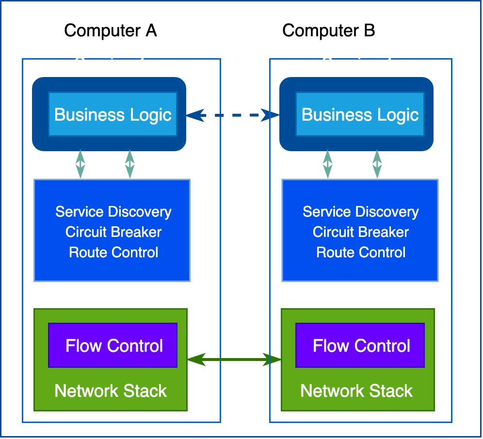
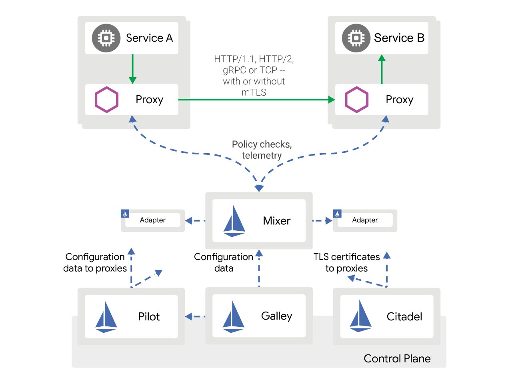

# 参考

- [一份好吃的 Istio 入门餐](https://morven.life/posts/getting_started_istio/)
- [Istio 的前世今生](https://morven.life/posts/the_history_of_istio/)


# Istio 的前世今生

其实要彻底了解 Istio 以及服务网格出现的背景，就得从计算机发展的早期说起。


下面这张图展示的的通信模型变种其实从计算机刚出现不久的上世纪50年代开始就得到广泛应用，那个时候，计算机很稀有，也很昂贵，人们手动管理计算机之间的连接，图中绿色的网络栈底层只负责传输电子信号和字节码：


------

随着计算机变得越来越普及，计算机的价格也没那么贵了，计算机之间的连接数量和相互之间通信的数据量出现了疯狂式的增长，人们越来越依赖网络系统，工程师们必须确保他们开发的服务能够满足用户的要求。于是，如何提升系统质量成为人们关注的焦点。计算机需要知道如何找到其他节点，处理同一个通道上的并发连接，与非直接连接的计算机发生通信，通过网络路由数据包、加密流量等等，除此之外，还需要流量控制机制，流量控制可以防止下游服务器给上游服务器发送过多的数据包。

于是，在一段时期内，开发人员需要在自己的代码里处理上述问题。在下面这张图的示例中，为了确保下游服务器不给其他上游服务造成过载，应用程序需要自己处理流量控制逻辑，于是网络中的流量控制逻辑和业务逻辑就混杂在一起：


幸运的是，到了上世纪60年代末，TCP/IP 协议栈的横空出世解决了可靠传输和流量控制等问题，此后尽管网络逻辑代码依然存在，但已经从应用程序里抽离出来，成为操作系统网络栈的一部分，工程师只需要按照操作系统的调用接口进行编程就可以解决基础的网络传输问题：


进入21世纪，计算机越来越普及、也越来越便宜，相互连接的计算机节点越来越多，业界出现了各种网络系统，如分布式代理和面向服务架构：


分布式为我们带来了更高层次的能力和好处，但却也带来了新的挑战。这时候工程师的重心开始转移到应用程序的网络功能上面，这时候的服务之间的对话以“消息”为传输单元，当工程师们通过网络进行调用服务时，必须能为应用程序消息执行超时、重试、确认等操作。

于是，有工程师是开始尝试使用消息主干网（messaging backbone）集中式地来提供控制应用程序网络功能的模块，如服务发现、负载均衡、重试等等，甚至可以完成诸如协议调解、消息转换、消息路由、编排等功能，因为他们觉得如果可以将这些看似同一层面的内容加入到基础设施中，应用程序或许会更轻量、更精简、更敏捷。这些需求绝对是真实的，[ESB(Enterprise Service Bus)](https://en.wikipedia.org/wiki/Enterprise_service_bus) 演变并满足了这些需要。ESB 在是2005年被提出的，它的概念特别类似于计算机硬件概念里的 USB, USB 作为电脑中的标准扩展接口，可以连接各种外部设备；而 ESB 则就把路由管理、协议转换、策略控制等通用应用程序网络功能加到现有的集中式消息总线里。


这看似行得通！

可是，在实施 SOA 架构的时候，工程师们发现这种架构有点儿用力过度、矫枉过正了。集中式的消息总线往往会成为架构的瓶颈，用它来进行流量控制、路由、策略执行等并不像我们想象那么容易，加上组织结构过于复杂，强制使用专有的格式，需要业务逻辑实现路由转换和编排等功能，各个服务之间耦合度很高，在敏捷运动的时代背景下，ESB 架构已经无法跟上时代的节奏了。

------

在接下来的几年内，REST 革命和 API 优先的思潮孕育了微服务架构，而以 docker 为代表的容器技术和以 k8s 为代表的容器编排技术的出现促进了微服务架构的落地。事实上，微服务时代可以以 k8s 的出现节点划分为“前微服务时代”和“后微服务时代”：


“前微服务时代”基本上是微服务作为用例推动容器技术的发展，而到“后微服务时代”，特别是成为标准的 k8s 其实在驱动和重新定义微服务的最佳实践，容器和 k8s 为微服务架构的落地提供了绝佳的客观条件。

微服务架构有很多好处，比如：

- 快速分配计算资源
- 快速部署升级迭代
- 易于分配的存储
- 易于访问的边界等等

但是作为较复杂的分布式系统，微服务架构给运维带来了新的挑战。当工程师开始接尝试微服务架构，必须考虑如何进行微服务治理。狭义的“微服务治理”，关注的是微服务组件之间的连接与通讯，例如服务注册发现、东西向路由流控、负载均衡、熔断降级、遥测追踪等。

历史总是惊人的相似，面对类似的问题，第一批采用微服务架构的企业遵循着与第一代网络计算机系统类似的策略，也就是说，解决网络通信问题的任务又落在了业务工程师的肩上。


这个时候出现了看到诸如 Netflix [OSS 堆栈](https://netflix.github.io/)、Twitter [Finagle](https://github.com/twitter/finagle) 以及赫赫有名的 [Spring Cloud](https://spring.io/projects/spring-cloud) 这样的框架和类库帮助业务工程师快速开发应用程序级别的网络功能，只需要写少量代码，就可以把服务发现、负载均衡、路由管理、遥测收集、监控告警等这些功能实现：


但是如果仔细想一下的话，就会发现这样编写微服务程序的问题也很明显。

这些类库或者框架是特定语言编写的，并且混合在业务逻辑中（或在整个基础设施上层分散的业务逻辑中）。姑且不说类库和框架的学习成本和门槛，我们知道微服务架构问世的一个承诺就是不同的微服务可以采用不同的编程语言来编写，可是当你开始编写代码的时候会发现有些语言还没有提供对应的类库。这是一个尴尬的局面！这个问题非常尖锐，为了解决这个问题，大公司通常选择就是统一编程语言来编写微服务代码。另外的问题是，怎么去做框架升级？框架不可能一开始就完美无缺，所有功能都齐备，没有任何 BUG。升级一般都是逐个版本递进升级，一旦出现客户端和服务器端版本不一致，就要小心维护兼容性。实际上，每做出一次变更都需要进行深度的集成和测试，还要重新部署所有的服务，尽管服务本身并没有发生变化。

------


与网络协议栈一样，工程师们急切地希望能够将分布式服务所需要的一些特性放到底层的平台中。这就像工程师基于 HTTP 协议开发非常复杂的应用，无需关心底层 TCP 如何传输控制数据包。在开发微服务时也是类似的，业务工程师们聚焦在业务逻辑上，不需要浪费时间去编写服务基础设施代码或管理系统用到的软件库和框架。把这种想法囊括到之前架构中，就是下边这幅图所描述的样子：



不过，在网络协议栈中加入这样的一个层是不实际的，貌似可以尝试一下代理的方案！事实上，确实有一些先驱者曾经尝试过使用代理的方案，例如 nginx/haproxy/proxygen 等代理。也就是说，一个服务不会直接与上游服务发生连接，所有的网络流量都会流经代理，代理会拦截服务之间的请求并转发到上游服务。可是，那时候代理的功能非常简陋，很多工程师尝试之后觉得没有办法实现服务的客户端所有需求。

在这样的诉求下，第一代的 sidecar 出现了，sidecar 扮演的角色和代理很像，但是功能就齐全很多，基本上原来微服务框架在客户端实现的功能都会有对应的功能实现：


但是第一代 sidecar 有一个重要的限制，它们是专门为特定基础设施组件而设计的，因此无法通用，例如，Airbnb 的 Nerve 和 Synapse，它们工作的基础是服务一定是注册到 ZooKeeper 上的，而 Netflix 的 Prana 要求使用 Netflix 自己的 Eureka 注册服务。

随着微服务架构日渐流行，新一代的 sidecar 也很快出现了，它可以用在不同基础设施组件上，我们把他们叫做通用型 sidecar。其中 [Linkerd](https://linkerd.io/) 是业界第一个通用型 sidecar，它是基于 Twitter 微服务平台而开发，实际上也正是它创造了 Service Mesh 即服务网格的概念。2016年1月15日，Linkerd-0.0.7发布，随后加入 CNCF，1.0版本于2017年4月份发布；随后出现的通用型 sidecar 就是大名鼎鼎来自于 Lyft 的 [envoy](https://www.envoyproxy.io/) ，Lyft 在2016年9月发布了 envoy 的1.0版本，2017年9月 envoy 加入 CNCF；最后一个比较新的通用型 sidecar 来自于我们熟悉的 nginx，叫做 【NGINX Mesh](https://www.nginx.com/products/nginx-service-mesh/)，2017年9月发布了第一个版本。

------

有了通用型 sidecar，每个微服务都会有一个 sidecar 代理与之配对，服务间通信都是通过 sidecar 代理进行的。正如我们在下这幅图上看到的那样，sidecar 代理之间的连接形成了一种网格网络：


这就是服务网格概念的来源，下面是服务网格概念的官方定义，它不再把 sidecar 代理看成单独的组件，并强调了这些 sidecar 代理所形成的网络的重要性：

> A service mesh is a dedicated infrastructure layer for making service-to-service communication safe, fast, and reliable.

实际上，就像 TCP/IP 网络栈为我们抽象了网络传输的细节一样，有了服务网格，我们不需要再担心微服务之间通信的各种网络诉求，如服务发现和负载均衡、流量管理、策略执行、监控告警等。

------

服务网格的概念出现之后，有部分工程师们开始将微服务部署到更为复杂的基础平台（如 K8s、Mesos）上，并开始使用这些基础平台提供的网络工具来管理整个服务网格里的所有 sidecar，也就是从一系列独立运行的 sidecar 代理转向使用集中式的控制面板来管理所有的 sidecar 代理。

在 Google 内部，很早通过一个分布式平台对微服务进行管理，通过代理处理内部与外部的协议，这些代理的背后是一个控制面板，它在开发者与运维人员之间提供了一层额外的抽象，在这层抽象之上对跨语言与系统平台的服务进行管理。经过实战的检验，这套架构已经证明它能够确保高伸缩、低延迟等特性，并为 Google 内部的各项服务提供了丰富的特性。

在2016年，Google 决定开发一个对微服务进行管理的开源项目，它与 Google 内部使用的平台有很大的相似性，该项目被命名为“Istio”, Istio 在希腊语中的意思是“启航”。就在 Google 启动 Istio 项目的几乎同一时间，IBM 也发布了一个名为 [Amalgam8](https://github.com/amalgam8) 的开源项目，这是一个基于 Nginx 代理技术，为微服务提供基于内容路由方案的项目。随后，Google 和 IBM 意识到这两个项目在使用场景与产品愿景上存在很大一部分交集，于是答应成为合作伙伴，IBM 放弃 Amalgam8 的开发，与 Google 共同基于 Lyft 公司开源的 envoy 项目打造 [Istio](https://istio.io/) 这款产品。

Istio 的出现将服务网格的概念彻底发扬光大，它创新性地将服务网格从逻辑上划分为“数据面板”和“控制面板”：

1. 随着分布式应用一起部署的 sidecar 成为数据平面，它能够拦截网络请求并控制服务之间的通信；
2. 而集中式的管理模块成为控制平面，它提供服务发现、流量管理、遥测数据收集以及证书轮换等功能；

在整个网络里面，所有的流量都在 sidecar 代理的控制当中，所有的 sidecar 代理都在控制面板控制当中，因此，可以通过控制面板控制整个服务网格，这是 Istio 带来的最大革新。


就如我们在上面这幅图中看到的那样，Istio 默认使用 envoy 作为 sidecar 代理，事实上，Istio 大量利用了 envoy 内建特性，例如服务发现与负载均衡、流量拆分、故障注入、熔断器以及金丝雀发布等，而在控制平面 Istio 也分为四个主要模块：

1. **Pilot** 为 sidecar 代理提供服务发现和配置下发功能；它将控制流量的高级路由规则转换为特定于 envoy 的配置，并在运行时将它们传播到 envoy；
2. **Mixer** 负责在服务网格上执行访问控制和策略检查，并从 envoy 代理收集遥测数据，提取请求级属性并发送到 Mixer 进行评估；
3. **Citadel** 证书分发和管理中心；通过内置身份和凭证管理，用于升级服务网格中未加密的流量，并为运维人员提供基于服务标识的访问策略；
4. **Galley** 统一的配置消化、验证和分发中心；未来的版本中 Galley 将承担更多的责任，从而将其他 Istio 组件与从底层平台的耦合中彻底释放出来；

2018年7月31日，Istio-1.0正式发布，距离最初的0.1版本发布以来已经过了一年多时间。从0.1发布开始，Istio 就在蓬勃壮大的社区、贡献者和用户的帮助下迅速发展。现在已经有许多公司已经或者开始尝试将 Istio 应用于生产环境中，并通过 Istio 提供的洞察力和控制力获得了真正的价值。Istio 帮助大型企业和快速发展的创业公司，如 eBay、Auto Trader UK、Descartes Labs、HP FitStation、Namely、PubNub 和 Trulia 使用 Istio 从头开始连接、管理和保护他们的微服务。

同时，整个 Istio 生态系统也不断的扩张，envoy 增加了许多对生产级别的服务网格至关重要的功能，包括与许多可观察性工具的集成，像 Datadog、SolarWinds、Sysdig、Google Stackdriver 和 Amazon CloudWatch 这样的可观察性提供商也编写了插件来将 Istio 与他们的产品集成在一起；Red Hat 构建的 [Kiali](https://www.kiali.io/) 为网格管理和可观察性提供了良好的用户体验；[Knative](https://github.com/knative) 无服务化项目也正基于 Istio 开发下一代下一代流量路由堆栈；[Apigee](https://cloud.google.com/apigee/) 也宣布计划在他们的 API 管理解决方案中使用 Istio。


# 一份好吃的 Istio 入门餐

前两天 Istio 正式发布 1.2 版本，至此，Istio 社区再次回归每3个月一个大版本加每月一个小版本更新的传统。从 Istio 1.0发布以来，社区在对改进 Istio 一些非功能性的需求（例如性能与扩展性）方面的努力是大家有目共睹的。我觉得是时候写一篇通俗易懂的 Istio 入门文章，让更多的人去体验一下 Istio 在云原生时代所带来的各种益处。

## 为什么需要 Istio

说到 Istio，就不得不提到另外一个名词：Service Mesh，中文名为“服务网格”。

相信很多人对于传统的单体应用以及它所面临的问题很熟悉，一种显而易见的方案是将其分解为多个微服务。这确实能简化微服务的开发，但是不得不说，也带来非常多的挑战，比如对于成百上千的微服务的通信、监控以及安全性的管理并不是一件简单的事。目前为止，针对这些问题确实有一些解决方案（比如 [Spring Cloud](https://spring.io/projects/spring-cloud)），但基本都是通过类似于类库或者定制化脚本的方式将为服务串联在一起，附带很高的维护升级成本。


Service Mesh 的出现正是为了解决这一问题。它是位于底层网络与上层服务之间的一层基础设施，提供了一种透明的、与编程语言无关的方式，使网络配置、安全配置以及遥测等操作能够灵活而简便地实现自动化。从本质上说，它解耦了服务的开发与运维工作。如果你是一名开发者，那么部署升级服务的时候不需要担心这些操作会对整个分布式系统带来哪些运维层面的影响；与之对应，如果你是运维人员，那么也可以放心大胆地进行服务之间的运维结构进行变更，而不需要修改服务的源代码。

而 Istio 真正地将 Service Mesh 的概念发扬光大。它创新性地将控制平面（Control Plane）与数据平面（Data Plane）解耦，通过独立的控制平面可以对 Mesh 获得全局性的可观测性（Observability）和可控制性（Controllability），从而让 Service Mesh 有机会上升到平台的高度，这对于对于希望提供面向微服务架构基础设施的厂商，或是企业内部需要赋能业务团队的平台部门都具有相当大的吸引力。

为什么会需要这样的设计呢？

我们先来看一个单独的一个微服务，正常情况下不管单个微服务部署在一个物理机上，亦或一个容器里，甚至一个 k8s 的 pod 里面，它的基本数据流向不外乎所有的 Inbound 流量作为实际业务逻辑的输入，经过微服务处理的输出作为 Outbound 流量：


随着应用的衍进与扩展，微服务的数量快速增长，整个分布式系统变得“失控”，没有一种通用可行的方案来监控、跟踪这些独立、自治、松耦合的微服务组件之间的通信；对于服务的发现和负载均衡，虽说像 k8s 这样的平台通过提供 apiserver 与 kube-proxy 下发 iptables 规则来实现了基本的部署、升级和有限的运行流量管理能力，但是本质上 k8s 提供的滚动升级都是依赖于 replicas 实例数的伸缩来调整，没办法实现按照版本的灰度发布或者金丝雀发布，不能满足高并发应用下高级的服务应用层特性；至于更加复杂的熔断、限流、降级等需求。

看起来不通过应用侵入式编程几乎不可能实现。


但是，真的是这样吗？我们来换一个思路，想象一下，如果我们在部署微服务的同时部署一个 sidecar，这个 sidecar 充当代理的功能，它会拦截所有流向微服务业务逻辑的流量，做一些预处理（解包然后抽取、添加或者修改特定字段再封包）之后在将流量转发给微服务，微服务处理的输出也要经过 sidecar 拦截做一些后处理（解包然后抽取、删除或者修改特定字段再封包），最后将流量分发给外部：


随着微服务数量的增长，整个分布式应用看起来类似于这样，可以看到所有的 sidecar 接管了微服务之间的通信流量：


这样的架构也有问题，数量少的情况下，sidecar 的配置简单，我们可以简单应对，但是 sidecar 的数量会随着微服务的数量不断增长，sidecar 需要又一个能集中管理的控制模块根据整个分布式系统的架构变动动态下发 sidecar 配置，这里我们把随着分布式应用一起部署的 sidecar 成为数据平面（Data Plane），而集中是的管理模块成为控制平面（Control Plane）。现在整个架构看起来会像是这样：


## Istio 架构设计

让我们再次简化一下上面的架构设计，这次我们将关注点放在数据平面里两个部署 sidecar 的微服务中，它们之间通信的所有流量都要被 sidecar 拦截，经过预处理之后转发给对应的应用逻辑：


这基本就是 Istio 的设计原型，只不过 Isti o默认使用 [Envoy](https://www.envoyproxy.io/) 作为 sidecar 代理（Istio 利用了 Envoy 内建的大量特性，例如服务发现与负载均衡、流量拆分、故障注入、熔断器以及分阶段发布等功能），而在控制层面 Istio 也分为四个主要模块：

1. Pilot 为 sidecar 提供服务发现功能，为智能路由（例如A/B测试、金丝雀部署等）和弹性（超时、重试、熔断器等）提供流量管理功能；它将控制流量行为的高级路由规则转换为特定于 Envoy 的配置，并在运行时将它们传播到 sidecar；
2. Mixer 负责在服务网格上执行访问控制和使用策略，并从 Envoy 代理和其他服务收集遥测数据；代理提取请求级属性，发送到Mixer进行评估；
3. Citadel 通过内置身份和凭证管理赋能强大的服务间和最终用户身份验证；可用于升级服务网格中未加密的流量，并为运维人员提供基于服务标识而不是网络控制的强制执行策略的能力；
4. Galley 用来验证用户编写的 Istio API 配置；未来的版本中 Galley 将接管获取配置、处理和分配组件的顶级责任，从而将其他的 Istio 组件与从底层平台（例如 k8s）获取用户配置的细节中隔离开来；

最终，Istio 的架构设计如下图所示：



## Istio 快速上手

### 部署 Istio 控制平面

> Note: Istio 可以用来运行在多种不同的环境里面，包括 k8s、Docker、Consul 甚至 BareMental（物理机上），文本以 k8s 环境为例来演示 Istio 的多种特性。

在部署使用 Istio 之前，我们需要准备一个 k8s 的环境，如果只是试用 Istio 的话，推荐试用 [Minikube](https://github.com/kubernetes/minikube) 或者 [Kind](https://github.com/kubernetes-sigs/kind) 来快速搭建 k8s 环境。

有了 k8s 环境并且配置好 kubectl 之后，我们就可以正式开始了。

1. 下载并解压最新的 Istio 发布版本（截至发布本文时的最新 Istio 版为为1.2.0）

```bash
$ curl -L https://git.io/getLatestIstio | ISTIO_VERSION=1.2.0 sh -
  % Total    % Received % Xferd  Average Speed   Time    Time     Time  Current
                                 Dload  Upload   Total   Spent    Left  Speed
  0     0    0     0    0     0      0      0 --:--:-- --:--:-- --:--:--     0
100  2140  100  2140    0     0   1787      0  0:00:01  0:00:01 --:--:--  1787
Downloading istio-1.2.0 from https://github.com/istio/istio/releases/download/1.2.0/istio-1.2.0-linux.tar.gz ...  % Total    % Received % Xferd  Average Speed   Time    Time     Time  Current
                                 Dload  Upload   Total   Spent    Left  Speed
100   614    0   614    0     0   1130      0 --:--:-- --:--:-- --:--:--  1132
100 20.2M  100 20.2M    0     0  3766k      0  0:00:05  0:00:05 --:--:-- 4632k
Istio 1.2.0 Download Complete!

Istio has been successfully downloaded into the istio-1.2.0 folder on your system.

Next Steps:
See https://istio.io/docs/setup/kubernetes/install/ to add Istio to your Kubernetes cluster.

To configure the istioctl client tool for your workstation,
add the /root/istio-1.2.0/bin directory to your environment path variable with:
	 export PATH="$PATH:/root/istio-1.2.0/bin"

Begin the Istio pre-installation verification check by running:
	 istioctl verify-install

Need more information? Visit https://istio.io/docs/setup/kubernetes/install/
```

1. 将 `istioctl` 命令行工具加入 `PATH` 环境变量，并且验证 k8s 集群环境满足 Istio 部署条件：

```bash
$ export PATH="$PATH:/root/istio-1.2.0/bin"
$ istioctl verify-install

Checking the cluster to make sure it is ready for Istio installation...

Kubernetes-api
-----------------------
Can initialize the Kubernetes client.
Can query the Kubernetes API Server.

Kubernetes-version
-----------------------
Istio is compatible with Kubernetes: v1.14.1.


Istio-existence
-----------------------
Istio will be installed in the istio-system namespace.

Kubernetes-setup
-----------------------
Can create necessary Kubernetes configurations: Namespace,ClusterRole,ClusterRoleBinding,CustomResourceDefinition,Role,ServiceAccount,Service,Deployments,ConfigMap.

SideCar-Injector
-----------------------
This Kubernetes cluster supports automatic sidecar injection. To enable automatic sidecar injection see https://istio.io/docs/setup/kubernetes/additional-setup/sidecar-injection/#deploying-an-app

-----------------------
Install Pre-Check passed! The cluster is ready for Istio installation.
```

1. 安装部署 Istio 控制平面：

> Note: 本文为了演示，使用最基本的 Istio 安装配置；如果需要定制 Istio 的安装配置或者在生产环境中使用 Istio，请使用 [helm](https://github.com/helm/helm) 来定制化安装配置，详情请移步：https://istio.io/docs/setup/kubernetes/install/helm/

```bash
$ kubectl apply -f istio-1.2.0/install/kubernetes/istio-demo.yaml
```

1. 验证 Istio 控制平面安装成功：

> Note: 本文使用的最基本的 Istio 安装配置除了会部署 Istio 控制层面的核心组件 Pilot、Mixer、Citadel 和 Galley 之外，还会部署 sidecar-injector（用于给应用自动注入 sidecar）、ingressgateway、egressgateway 以及一些 addons，如 Prometheus、Kiali、Jaeger 等。

```bash
$ kubectl -n istio-system get pod
NAME                                      READY   STATUS      RESTARTS   AGE
grafana-6fb9f8c5c7-bg8jd                  1/1     Running     0          8m2s
istio-citadel-7695fc84d9-jhr6s            1/1     Running     0          8m2s
istio-cleanup-secrets-1.2.0-cbjjs         0/1     Completed   0          8m3s
istio-egressgateway-687f8559cb-tn24g      1/1     Running     0          8m2s
istio-galley-75466f5dc7-ms8mm             1/1     Running     0          8m2s
istio-grafana-post-install-1.2.0-jls4k    0/1     Completed   0          8m3s
istio-ingressgateway-5d8d989c76-trpkn     1/1     Running     0          8m2s
istio-pilot-5465879d79-swpz2              2/2     Running     0          8m2s
istio-policy-6448f68f75-9b5lk             2/2     Running     5          8m2s
istio-security-post-install-1.2.0-xtxjv   0/1     Completed   0          8m3s
istio-sidecar-injector-6f4c67c6cd-fgj6c   1/1     Running     0          8m1s
istio-telemetry-56b9b87478-sbk5p          2/2     Running     6          8m2s
istio-tracing-5d8f57c8ff-nx72r            1/1     Running     0          8m1s
kiali-7d749f9dcb-wlmrt                    1/1     Running     0          8m2s
prometheus-776fdf7479-g2dgg               1/1     Running     0          8m2s
```

### 部署 Istio 数据平面

前面提到过 Istio 数据平面其实就是由一些与微服务一起部署的 sidecar 组成，因此，在这里我们以 Istio 官方提供的样例程序 [bookinfo](https://istio.io/docs/examples/bookinfo/) 为例来介绍 Istio 数据平面的部署。

bookinfo 样例程序模仿在线书店的一个分类，显示一本书的信息，页面上会显示一本书的描述，书籍的细节（ISBN、页数等），以及关于这本书的一些评论。它由四个单独的微服务构成，可谓“麻雀虽小，五脏俱全”，bookinfo 例子用来演示多种 Istio 特性。

- productpage 微服务会调用 details 和 reviews 两个微服务，用来生成页面
- details 微服务包含了书籍的信息
- reviews 微服务包含了书籍相关的评论。它还会调用 ratings 微服务
- ratings 微服务中包含了由书籍评价组成的评级信息

其中 reviews 微服务有3个版本：

- v1 版本不会调用 ratings 服务；
- v2 版本会调用 ratings 服务，并使用1到5个黑色星形图标来显示评分信息；
- v3 版本会调用 ratings 服务，并使用1到5个红色星形图标来显示评分信息；

下图展示了这个应用的端到端架构：


可以看到 bookinfo 是一个异构应用，几个微服务是由不同的语言编写的，而且这些服务对 Istio 并无依赖。

要使用 Istio 管理 bookinfo，无需对应用做出任何改变，只需要把 sidecar 注入到每个微服务之中。最终部署结构如下图所示：


1. 在 k8s 环境里，有两种方式注入 sidecar：手动注入和自动注入

- 手动注入使用 istio 命令行工具 `istioctl`：

```bash
$ kubectl apply -f <(istioctl kube-inject -f istio-1.2.0/samples/bookinfo/platform/kube/bookinfo.yaml)
```

- 自动注入依赖于 `istio-sidecar-injector`（使用 [MutatingWebhook 准入控制器](https://kubernetes.io/docs/reference/access-authn-authz/extensible-admission-controllers/#what-are-admission-webhooks)来实现），需要部署应用前给对应的 namespace 打上 label(`istio-injection=enabled`)：

```bash
$ kubectl label ns default istio-injection=enabled
$ kubectl apply -f istio-1.2.0/samples/bookinfo/platform/kube/bookinfo.yaml
```

1. 确认 bookinfo 所有的服务和 pod 都已经正确定义和启动并且 sidecar 也被注入：

```bash
$ kubectl get svc
NAME          TYPE        CLUSTER-IP      EXTERNAL-IP   PORT(S)    AGE
details       ClusterIP   10.108.10.87    <none>        9080/TCP   2m42s
kubernetes    ClusterIP   10.96.0.1       <none>        443/TCP    51m
productpage   ClusterIP   10.103.98.1     <none>        9080/TCP   2m42s
ratings       ClusterIP   10.104.90.24    <none>        9080/TCP   2m42s
reviews       ClusterIP   10.100.151.78   <none>        9080/TCP   2m42s
$ kubectl get pod
NAME                              READY   STATUS    RESTARTS   AGE
details-v1-5544dc4896-swbgq       2/2     Running   0          2m44s
productpage-v1-7868c48878-l9zpd   2/2     Running   0          2m45s
ratings-v1-858fb7569b-f2hqh       2/2     Running   0          2m45s
reviews-v1-796d4c54d7-8r8b4       2/2     Running   0          2m45s
reviews-v2-5d5d57db85-46bmc       2/2     Running   0          2m45s
reviews-v3-77c6b4bdff-h4tgq       2/2     Running   0          2m45s
$ kubectl get pod -o jsonpath="{.items[*].spec.containers[*].name}"
details istio-proxy productpage istio-proxy ratings istio-proxy reviews istio-proxy reviews istio-proxy reviews istio-proxy
```

1. 既然 bookinfo 应用已经启动并在运行中，我们需要使应用程序可以从外部访问（例如使用浏览器）；这时候需要部署一个 [Istio Gateway](https://istio.io/docs/reference/config/networking/v1alpha3/gateway/) 来充当外部网关来作为访问应用的流量入口：

```fallback
$ kubectl create -f istio-1.2.0/samples/bookinfo/networking/bookinfo-gateway.yaml
gateway.networking.istio.io/bookinfo-gateway created
virtualservice.networking.istio.io/bookinfo created
```

1. 确认网关的地址以及路径来访问 bookinfo 应用：

> Note: 如果 Istio 部署在使用 Kind 创建的 k8s 集群中，需要 kubectl 做端口转发；这里我们使用`任意一个 Node 的 IP 地址` + `ingressgateway 的 NodePort` 来访问 bookinfo 应用。

```bash
$ export INGRESS_HOST=<node_ip>
$ export INGRESS_PORT=$(kubectl -n istio-system get service istio-ingressgateway -o jsonpath='{.spec.ports[?(@.name=="http2")].nodePort}')
$ export GATEWAY_URL=$INGRESS_HOST:$INGRESS_PORT
$ curl -s http://${GATEWAY_URL}/productpage | grep -o "<title>.*</title>"
<title>Simple Bookstore App</title>
```

> Note: 这时候也可以在浏览器中访问 `http://${GATEWAY_URL}/productpage`，如果一切正常，多次刷新浏览器页面，我们会发现 review 部分会随机的出现无星、黑星和红星，这是因为我们目前没有创建任何流量规则，所以使用默认的随机(round robin)模式在不同的 reviews 版本之间切换。

1. 创建默认的 destination rules；在使用流量规则控制访问的 review 版本之前，我们需要创建一系列的 destination rules 用来定义每个版本对应的 subset：

```bash
$ kubectl apply -f istio-1.2.0/samples/bookinfo/networking/destination-rule-all.yaml
destinationrule.networking.istio.io/productpage created
destinationrule.networking.istio.io/reviews created
destinationrule.networking.istio.io/ratings created
destinationrule.networking.istio.io/details created
```

1. 现在我们开始创建第一条流量规则-让所有访问 reviews 服务的流量只访问 v1 版本（无星）：

```bash
$ grep -B 3 -A 1 reviews istio-1.2.0/samples/bookinfo/networking/virtual-service-all-v1.yaml
apiVersion: networking.istio.io/v1alpha3
kind: VirtualService
metadata:
  name: reviews
spec:
  hosts:
  - reviews
  http:
  - route:
    - destination:
        host: reviews
        subset: v1
$ kubectl apply -f istio-1.2.0/samples/bookinfo/networking/virtual-service-all-v1.yaml
virtualservice.networking.istio.io/productpage created
virtualservice.networking.istio.io/reviews created
virtualservice.networking.istio.io/ratings created
virtualservice.networking.istio.io/details created
```

> Note: 上面创建的这条流量规则的意思是我们让所有对 review 服务的访问都指向 v1 版本，这时候在浏览器中访问 `http://${GATEWAY_URL}/productpage`，如果一切正常，多次刷新浏览器页面，我们会发现 review 部分总是出现无星版本，这说明我们的流量规则生效了。

1. 接下来，我们来创建一条流量规则来实现 review 微服务的金丝雀发布：

```bash
$ cat istio-1.2.0/samples/bookinfo/networking/virtual-service-reviews-80-20.yaml
apiVersion: networking.istio.io/v1alpha3
kind: VirtualService
metadata:
  name: reviews
spec:
  hosts:
    - reviews
  http:
  - route:
    - destination:
        host: reviews
        subset: v1
      weight: 80
    - destination:
        host: reviews
        subset: v2
      weight: 20
$ kubectl apply -f istio-1.2.0/samples/bookinfo/networking/virtual-service-reviews-80-20.yaml
virtualservice.networking.istio.io/reviews configured
```

> Note: 上面创建的这条流量规则的意思是我们让所有对 review 服务的访问流量中80%指向 v1，20%指向 v2，这时候在浏览器中访问 `http://${GATEWAY_URL}/productpage`，如果一切正常，多次刷新浏览器页面，我们会发现页面中 review 部分大约有20%的几率会看到页面中出带黑星的评价内容，刷新次数越多，结果越准确。

> Note: Istio 官方文档包括更复杂的例子来说名 Istio 的各种功能，如果想进一步了解，请移步：https://istio.io/docs/tasks/traffic-management/

1. 使用 Jaeger 来对 bookinfo 应用做分布式跟踪：

```bash
$ kubectl -n istio-system port-forward $(kubectl -n istio-system get pod -l app=jaeger -o jsonpath='{.items[0].metadata.name}') 15032:16686 &
```

> Note: 为了演示方便，我们这里使用 kubectl 命令行工具对 jaeger 做端口转发，这样就可以通过 `http://localhost:15032` 来访问 jaeger 的 UI 界面。

> Note: Istio 默认使用样本跟踪率为1%，为了确保 jaeger 收集到分布式跟踪的数据，请使用一下脚本实现多次访问 bookinfo 应用：

```bash
$ for i in `seq 1 100`; do curl -s -o /dev/null http://$GATEWAY_URL/productpage; done
```

> 然后在 jaeger 仪表盘的左边区域的服务列表里面选择 `productpage.default`，然后点击 `Find Traces`，一切正常的话，jaeger 的 UI 会显示最新的20条分布式跟踪的记录数据。


> 随机选择一条分布式跟踪的记录打开，我们会发现每一条 jaeger 的分布式跟踪链（称为一个 trace）是有多个不同的单独请求（称为一个 span）组成的树状结构；同时我们也可以打开每个单独的请求来查看请求的状态以及其他的元数据。


1. 使用 Grafana 来可视化指标度量：

```bash
$ kubectl -n istio-system port-forward $(kubectl -n istio-system get pod -l app=grafana -o jsonpath='{.items[0].metadata.name}') 3000:3000 &
```

> Note: 为了演示方便，这里使用 kubectl 命令行工具对 Grafana 做端口转发，这样就可以通过 `http://localhost:3000/dashboard/db/istio-mesh-dashboard` 访问 Grafana 的 UI 来查看网格的全局视图以及网格中的服务和工作负载。


> 除了查看网格的全局视图以及网格中的服务和工作负载外，Grafana 还可以查看 Istio 控制层面主要组件的运行状况。

1. 使用 Kiali 来做网格整体可视化：

```bash
$ kubectl -n istio-system port-forward $(kubectl -n istio-system get pod -l app=kiali -o jsonpath='{.items[0].metadata.name}') 20001:20001 &
```

> Note: 为了演示方便，我们这里使用 kubectl 命令行工具对 Kiali 做端口转发，现在我们可以通过 `http://localhost:2001/kiali/` 访问 Kiali 的 UI，默认用户名和密码都是 `admin`。

> 登录 Kiali 的 UI 之后会显示 Overview 页面，这里可以浏览整个服务网格的概况：


> 要查看指定 bookinfo 的整体服务图，可以点击 `default` 命名空间卡片，会显示类似于下面的页面，甚至可以动态显示流量走向：


## 总结

至此，我们这篇文章中介绍了 Istio 设计的初衷以及整体架构，也在一个 k8s 环境中部署了 Istio 的控制层面，并以一个简单明了的样例程序 bookinfo 展示了 Istio 数据平面的组成以及创建简单的流量规则来实现控制访问的微服务版本，最后，还展示了使用 Istio 的一些 addon 来做微服务的分布式调用链跟踪和可视化整个服务网格的整体状况。这篇文章只是帮助我们快速上手 Istio，关于 Istio 各方面的细节，后续文章我们一一解读。