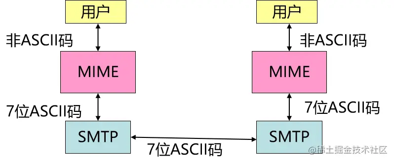
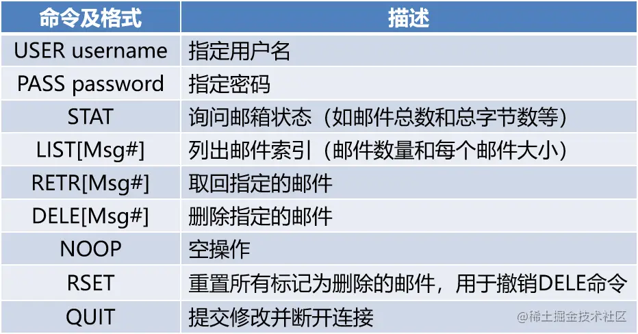

# 参考

- [邮件传输的过程都看不懂。那我走？？？ - 掘金](https://juejin.cn/post/6997692754453069838)
- [详解电子邮件的POP3协议及最小化实现_chuifuhuo6864的博客-CSDN博客](https://blog.csdn.net/chuifuhuo6864/article/details/100877765)


# 邮件传输的过程

给学习网络的新手一个我自己总结的建议： 我觉得学网络先要先把最基础最常用的协议的原理搞的明明白白，然后再学习难的协议或者是拓展的协议就好理解容易上手了。

## 邮件的传输流程

先将邮箱[xxx.@qq.com](https://link.juejin.cn/?target=mailto%3Axxx.%40qq.com)用DNS解析成IP地址然后在一步步的传输。 　 　通常，一封电子邮件的发送需要经过用户代理、客户端邮件服务器和服务端邮件服务器等三个程序的参与，并使用邮件传输协议（SMTP,POP3或IMAP）来发送和获取邮件。 　 

## Ｗebmail

电子邮件从 A 发送到客户服务器是使用 HTTP 协议。两个邮件服务器之间的传送使用 SMTP。邮件从服务端邮件服务器传送到 B 是使用 HTTP 协议。


## 使用邮件客户端收发邮件

　　电子邮件从 A 发送到客户服务器是使用 SMTP 协议。两个邮件服务器之间的传送使用 SMTP。B从服务端邮件服务器获取邮件使用POP3或IMAP协议。常见的邮件客户端有Foxmail,Outlook Express等.

 

用QQ邮箱给网易邮箱发邮件的传输过程

 

## 邮件服务器各组件关系图

- MUA(Mail User Agent):用户代理，提供邮件编辑，查看功能；
- MTA(Mail Transfer Agent): 邮件传输代理，负责传送和接收邮件；
- MDA(Mail Dilivery Agent): 邮件投递代理，负责将MTA接收到的邮件传递到用户邮箱或转递其他MTA，兼具有过滤功能。


## SMTP简单邮件传输协议

- SMTP 使用客户/服务器方式，负责发送邮件的 SMTP 进程是 SMTP 客户，而负责接收邮件的 SMTP进程是 SMTP 服务器，当两个进程建立了TCP连接后，电子邮件就能通过该标准准确无误地传输；
- SMTP协议是基于文本的协议，通过SMTP发送的电子邮件都是普通文本格式的，不支持声音、图像等非文本信息，但可以通过MIME标准将此类信息进行编码后再通过SMTP传输；
- SMTP 规定了 14 条命令和 21 种应答信息。每条命令用 4 个字母组成，而每一种应答信息一般只有一行信息，由一个 3 位数字的代码开始;

## SMTP命令

命令由客户端发送请求给服务端 

## SMTP应答码

每一条SMTP命令都会返回一条SMTP响应，由服务端返回给客户端 

## SMTP传输流程图


1. 客户端主动连接到服务器的25端口，建立TCP连接。服务器会发送一个应答码为220的问候报文，表示已经准备就绪。
2. 客户端向服务器发送HELO命令以标识发送方身份，若服务器接受请求，则返回一个代码为250的应答，表示可以开始报文传输。
3. 客户端发送MAIL命令以标识邮件发送方身份，通过FROM参数指定发送方的邮件地址。若服务器准备接收，则返回250的OK应答。
4. 客户端发送RCPT命令标识邮件的接收方，通过TO参数指定接收方的电子邮件地址，若有多个接收人，可发送多个RCPT命令。如果服务器能够识别接收人，则会返回代码为250的OK应答，否则返回代码为550的失败应答。
5. 客户端与服务器之间的协商结束，客户端发送DATA命令指示将要发送邮件数据，服务器端返回应答码为354的响应进行确认，表示可以开始邮件输入。
6. 客户端将邮件内容按行发送，邮件的末尾由客户端指定，是只有一个小数点(邮件数据结束指示器)的一行，服务器检测到邮件数据结束指示器后，返回代码为250的OK应答。
7. 客户端发送QUIT命令终止连接。

> 注: 由于SMTP不需要身份验证，人们连接到邮件服务器就能随便给一个知道的邮箱地址发送邮件，造成垃圾邮件泛滥。后来就有了ESMTP (Extended SMTP)。他和 SMTP 服务的区别仅仅是，使用 ESMTP 发信时，需要经过身份验证才能发送邮件。即在HELO命令后多加一条auth login登陆命令，登陆成功后才能使用后续的发送邮件命令。

## 电子邮件的信息格式

每一封电子邮件的结构格式为：

- 报文头(Header)
- 分隔邮件头与邮件体的空行
- 报文体(Body)

报文头是一些控制信息，它是由一系列的头字段组成，每个头字段的结构格式是： 字段名(field-name)：字段体(field-body) 包括收方和发方的地址，发送时间等，常用的头字段有：

- Date域：记录邮件发送日期（本地主机的日期和时间）；
- Subject域：邮件主题；
- From域：发信人邮件地址；
- To域：收信人邮件地址；

…… 报文体是用户邮件内容，由用户自由撰写。但SMTP只支持传输7位ASCII码的英文字符，有很大局限性，后来邮件系统就扩展了MIME。

## MIME

MIME扩展了基本的面向文本的Internet邮件系统，在不改动现有邮件协议的情况下，实现了用标准的文本格式邮件传输非文本（二进制）数据的功能。MIME的原理是将二进制数据转化为文本格式，然后再进行传输。 MIME扩包括三部分内容：新增了5个首部字段名，这些字段提供了邮件的主题信息；新增了许多邮件内容，对多媒体的表示方法进行标准化；定义了编码方法，可对任何内容进行准换。

邮件报文示例


## POP3协议

　　POP是一种邮件接收协议，其作用是：当用户计算机与支持POP协议的电子邮件服务器连接时，把存储在该服务器的电子邮箱中的邮件准确无误地下载到用户的计算机中。POP3属于离线式协议，即不能对邮件进行在线操作，必须下载到本地才能进行处理。POP协议已发展到第三版，称作POP3。 　　 POP3与SMTP一样都是请求响应协议，命令与响应也都是用NVT ASCII格式的文本表示。POP3响应由一个状态码和其后的附加信息组成，只有两种状态码：“+OK”（正确）和“-ERR”（失败）。


## POP3命令



## POP3连接


- 当客户端连接到服务器的110端口，并建立起TCP连接后，即进入身份验证状态，需要使用USER和PASS命令将用户名和密码提供给服务器。
- 通过身份验证之后，即转入事务处理状态，这时客户端可以发送POP3命令进行相应操作，服务器会接收命令并做出响应。
- 操作完成之后，客户端发出QUIT命令，则进入更新状态，服务器确认用户的操作，更新邮件存储区，同时关闭客户端与服务器之间的连接。

## POP3客户和服务器会话例

```handlebars
S：<在TCP端口110等待连接> 
C：<打开TCP连接>  - telnet <服务器域名> 110
S：+OK  oar pop3 server ready 
C：USER  your_userid 
S：+OK  your_userid is welcome here 
C：PASS  your_password 
S：+OK your_userid’s  maildrop has 2 messages   (320 octets) 
S：. 
C：STAT  
S：+OK  <邮件数量> <总大小>
C：RETR  2 
S：+OK  200 octets 
S：报文2的内容 
S：. 
C：DELE  2 
S：+OK  message 2 deleted 
…………
```


# SMTP身份认证 (SMTP AUTH)

SMTP身份认证是一种保证SMTP服务器安全的方法，它要求希望通过SMTP服务器转 发 邮件（即邮件最终发送给另一个SMTP服务器）的用户在发送消息之前必须先向James表明自己的身份。 这样垃圾邮件发送者就不能用你的SMTP服务器发送未经授权的邮件了，然而仍然可以让没有固定IP地址的用户 发送他们的消息。

允许垃圾邮件发送者发送未经授权的email的邮件服务器被称为**开放中继**，所以SMTP AUTH是一种确保你的 邮件服务器不是开放中继的机制。

现在James仅支持简单的用户名/密码认证。
将James配置为需要身份认证的SMTP服务器
将James配置为需要身份认证的SMTP服务器需要几个步骤，调整config.xml文件的几个地方。下面是具体方法：

1. 如上所述，SMTP AUTH首先要求James能够区分要发送到本地的邮件和要发送到远程的邮件。James通过将邮件发往的域与配置文件中 的<servernames>元素来进行判断。任何本地域应该显式的放在<servername>元素列表中。
2. James 初始配置就使它不是垃圾邮件发送者的开放中继。它通过使用RemoteAddrNotInNetwork mailet 来限制可以接受邮件的发送者的IP地址。要让用户能从任意的客户端发送邮件必须先解除这个限制。解除的办法是 将包含"RemoteAddrNotInNetwork"类属性的mailet标签注释掉或删掉。 可以在spoolmanager配置块的根处理器配置中找到这个标签。
3. 将smtpserver配置块中的authRequired元素设为"true"。
4. 如果你希望确保通过认证的用户仅能用自己的账号发送邮件，应该将smtpserver配置块中的verifyIdentity 元素设为 "true"。
5. 重启James，使你所做的配置生效。

验证你的配置
最终你需要验证你的配置是正确的。这一步很重要，不应该忽略。
确保你没有不经意的将你的服务器配置为开放中继。通过用ORDB.org提供的 服务很容易完成这个验证。 ORDB.org将检查你的邮件服务器，如果它是一个开放中继，ORDB.org会通知你。
确保你没有将服务器配置为开放中继极其重要。除了垃圾邮件发送者的使用所造成的消耗外，SMTP服务器会例行公事 的拒绝来自开放中继的服务器连接，这会严重影响你的邮件服务器发送邮件的能力。
在你的服务器上证实用户能够登录服务器并发送邮件当然也是必要的。这可以用任何标准的邮件客户端 完成（比如Outlook、Eudora、 Evolution）。


# 详解电子邮件的POP3协议及最小化实现

**1.   什么是POP3**

POP3的英文全称Post OfficeProtocol [Version](https://so.csdn.net/so/search?q=Version&spm=1001.2101.3001.7020) 3，POP3协议本质上是一种消息传递协议

主要用来在支持POP3客户端和POP3邮件服务器端通信，基于TCP协议之上的应用层协议

POP3协议主要用来读取邮件服务器上的电子邮件。发送邮件时候支持的协议为SMTP.

此外还有一种同时支持收发邮件协议IMAP.


直白的说，当你的邮件客户端检查你是否有新邮件以及读新邮件是，很可能协议为POP3

当你写完一封Email,发送给指定收件人时候，很可能是通过SMTP协议,当然还可以是IMAP。

| 协议           | 支持发送邮件 | 支持接受邮件 |
| -------------- | ------------ | ------------ |
| **POP3**       | No           | Yes          |
| **SMTP/ESMTP** | Yes          | No           |
| **IMAP**       | Yes          | Yes          |

 

**2.   基本操作**

服务器端启动POP3服务在端口110, Google Mail是SSL加密的，在端口995。当客户端连

接成功之后，服务器端首先会发送一条问候信息(Greet).然后服务器端与客户端开始会话操作

知道客户端断开连接或者退出会话。

基本的会话类型分为两个阶段 – 第一阶段为授权状态；第二个阶段为传输状态

 

**授权状态（AUTHORIZATION State）**支持三个命令为【USER, PASS, QUIT】：

\-     **USER** <name> -  <name>参数是必须的，指要求的UserID,通常为Email帐号

\-     **PASS** <password><password>参数是必须的,指要求的Email帐号密码

\-     **QUIT** 不需要任何参数，表示退出，结束与POP3服务器的会话

 

**传输状态（TRANSACTION State）**支持命令为【STAT, LIST, RETR, DELE, 

NOOP,LAST, RSET】

\-     **STAT** 不需要任何参数，列出当前邮箱中所有的邮件总数及大小

\-     **LIST** [message id] 参数可选，列出当前邮箱每封邮件及其大小

\-     **RETR** <Message id> 参数是必须的，读出指定message id的邮件内容

\-     **DELE** <Message id> 参数是必须的，删除指定message id 的邮件

\-     **NOOP** 不需要任何参数，POP3服务器只是发一条问候消息作为响应

\-     **LAST** 不需要任何参数，返回Client最后访问过的消息ID,如何没有任何email被客户端

读过，返回最大的Message Id 1， 如何邮箱里面没有任何email，返回 0

\-     **RSET** 不需要任何参数, 任何被标记为删除的邮件将被恢复

 

最后，当QUIT命令发布以后客户端退出，服务器端则进入更新状态（UPDATE State）。

**一个是Google MailPOP3 会话的例子如下：**

 

**3.   一个最小化命令集的Java实现**


```java
package com.gloomyfish.sslsocket.study;
 
import java.io.BufferedReader;
import java.io.DataOutputStream;
import java.io.IOException;
import java.io.InputStreamReader;
 
import javax.net.ssl.SSLSocket;
import javax.net.ssl.SSLSocketFactory;
 
public class POP3Client {
	private static DataOutputStream writer;
	public static void main(String[] args) throws Exception
	{
		int delay = 6000;// give enough delay to get response message from POP server
		SSLSocket sock = (SSLSocket)((SSLSocketFactory)SSLSocketFactory.getDefault()).createSocket("pop.gmail.com", 995);
		final BufferedReader br = new BufferedReader(new InputStreamReader(sock.getInputStream()));
		(new Thread(new Runnable()
		{
			public void run()
			{
				try
				{
					String line;
					while((line = br.readLine()) != null)
						System.out.println(" S: "+line);
				}
				catch (IOException e)
				{
					e.printStackTrace();
				}
			}
		})).start();
		writer = new DataOutputStream(sock.getOutputStream());
		
		// start to AUTHORIZATION State
		send("USER YOUREMAILID\r\n");
		Thread.sleep(delay);
		send("PASS YOURPASSWORD\r\n");
		Thread.sleep(delay);
		// end AUTHORIZATION State
		
		// start <<The TRANSACTION State>>
		send("STAT\r\n"); // check new arrived mail
		Thread.sleep(delay);
		
		// List Mail
		send("LIST 1\r\n"); // check new arrived mail
		Thread.sleep(delay);
		
		// Fetch the message here [RETR <SP> msg CRLF]
		send("RETR 1\r\n"); // check new arrived mail
		Thread.sleep(delay);
		
		// DELET
		send("DELE 1\r\n"); // check new arrived mail
		Thread.sleep(delay);
		
		// UNMARKER THE DELETED EMAIL
		send("RSET\r\n"); // check new arrived mail
		Thread.sleep(delay);
		// end The TRANSACTION State
		
		// issue the [quit] command from client.
		send("QUIT\r\n");
		Thread.sleep(delay);
	}
	
	private static void send(String s) throws Exception
	{
		writer.writeBytes(s);
		System.out.println(" C: "+s);
	}
 
}
```