# [Redis](https://wylong.top/redis/)

## 参考

- Redis 官网：https://redis.io/
- Redis 在线测试：http://try.redis.io/
- Redis 命令参考：http://doc.redisfans.com/
- [Redis分布式锁 （图解-秒懂-史上最全） - 疯狂创客圈 - 博客园](https://www.cnblogs.com/crazymakercircle/p/14731826.html)

## 什么是 Redis

`Redis` 是一个开源(BSD许可)的, 是一个高性能的 key-value 数据库.

内存中的数据结构存储系统, 它可以用作数据库, 缓存和消息中间件. 它支持多 种类型的数据结构, 如 字符串(strings), 散列(hashes),  列表(lists),  集合(sets),  有序集合(sorted sets)等.

`Redis` 与其他 `key-value` 缓存产品有以下三个特点: 

- Redis支持数据的持久化, 可以将内存中的数据保存在磁盘中, 重启的时候可以再次加载进行使用.
- Redis不仅仅支持简单的key-value类型的数据, 同时还提供list, set, zset, hash等数据结构的存储.
- Redis支持数据的备份, 即master-slave模式的数据备份.

## Windows安装 sentinel

```shell
# config
port 26379
daemonize yes
sentinel myid 91802ce2f29692bcc17f63a65a5b8bc29fb1c00e
sentinel deny-scripts-reconfig yes
sentinel monitor mymaster 127.0.0.1 6379 1
sentinel down-after-milliseconds mymaster 15000
sentinel failover-timeout mymaster 80000
# bind 172.26.5.247
# Generated by CONFIG REWRITE
dir "E:\\opt\\Redis"
sentinel auth-pass mymaster admin
sentinel config-epoch mymaster 0
sentinel leader-epoch mymaster 203
sentinel current-epoch 203
protected-mode no

# register windows service
redis-server --service-install --service-name Redis-Sentinel sentinel.conf --sentinel
```


## Redis与其他key-value存储有什么不同(优点)？

- Redis有着更为复杂的数据结构并且提供对他们的原子性操作，这是一个不同于其他数据库的进化路径。Redis的数据类型都是基于基本数据结构的同时对程序员透明，无需进行额外的抽象。
- Redis运行在内存中但是可以持久化到磁盘，所以在对不同数据集进行高速读写时需要权衡内存，因为数据量不能大于硬件内存。在内存数据库方面的另一个优点是，相比在磁盘上相同的复杂的数据结构，在内存中操作起来非常简单，这样Redis可以做很多内部复杂性很强的事情。同时，在磁盘格式方面他们是紧凑的以追加的方式产生的，因为他们并不需要进行随机访问。

## Redis和memcached和mysql之间的区别


## redis作为数据库和作为缓存的选择，线上怎么优雅的使用redis

**简介：redis作为数据库和作为内存缓存的两种使用方法**

- redis作为数据库的使用有什么优缺点
  - 优点
    - 没有Scheme约束，数据结构的变更相对容易，一开始确定数据类型， 抗压能力强，性能极高，10万/qps
  - 缺点
    - 没有索引，没有外键，缺少int/date等基本数据类型，多条件查询需要通过集合内联(sinter,zinterstore) 和连接间接实现开发效率低，可维护性不佳
- redis作为缓存的使用，搭配数据库使用的两种方案
  - jedis整合使用方案 set key,value ["11","22"] 第一层在缓存进行查询，如果得到数据则直接返回， 第二层在数据库进行查询，并且刷新缓存，方便下次查询 ["33,"44"]
  - 作为mybatis/hibernate二级缓存使用方案，一级缓存：sqlSession，进程缓存，单次链接有效

## Redis消息订阅发布

**简介：redis消息订阅发布讲解，基础使用**

- 作用：发布订阅类似于信息管道，用来进行系统之间消息解耦，类似于mq，rabbitmq、rocketmq、kafka、activemq主要有消息发布者和消息订阅者。比如运用于：订单支付成功，会员系统加积分、钱包进行扣钱操作、发货系统（下发商品）

- PUBLISH 将信息message发送到指定的频道channel。返回收到消息的客户端数量
- SUBSCRIBE 订阅给指定频道的信息
- UNSUBSCRIBE 取消订阅指定的频道，如果不指定，则取消订阅所有的频道。
- redis的消息订阅发布和mq对比？

  答：redis发布订阅功能比较薄弱但比较轻量级

   mq消息持久化，数据可靠性比较差

   无后台功能（mq通常都有个后台管理平台）

   可msgId、msgKey进行查询消息

## 数据类型

### String字符串(key-value)数据类型

String是最常用的一种数据类型，普通的key/value存储都可以归为此类。

常用命令：

- set/get
  - 设置key对应的值为String类型的value
  - 获取key对应的值
- mget
  - 批量获取多个key的值，如果可以不存在则返回nil
- incr && incrby
  - incr对key对应的值进行加加操作，并返回新的值;incrby加指定值
- setnx
  - 设置key对应的值为String类型的value，如果key已经存在则返回0
- setex
  - 设置key对应的值为String类型的value，并设定有效期
- 其他命令
  - getrange 获取key对应value的子字符串
  - mset 批量设置多个key的值，如果成功表示所有值都被设置，否则返回0表示没有任何值被设置
  - msetnx，同mset，不存在就设置，不会覆盖已有的key
  - getset 设置key的值，并返回key旧的值
  - append：给指定key的value追加字符串，并返回新字符串的长度

> 备注：redis String命令的使用实战，记住1、3、5、6这几个重要命令


------

### Hash类型讲解

Redis hash 是一个 string 类型的 field（字段） 和 value（值） 的映射表，hash 特别适合用于存储对象。

Redis 中每个 hash 可以存储 232 - 1 键值对（40多亿）。

常用命令：

- Hash是一个String类型的field和value之间的映射表
- redis的Hash数据类型的key（hash表名称）对应的value实际的内部存储结构为一个HashMap
- Hash特别适合存储对象
- 相对于把一个对象的每个属性存储为String类型，将整个对象存储在Hash类型中会占用更少内存。
- 所存储的成员较少时数据存储为zipmap，当成员数量增大时会自动转成真正的HashMap,此时encoding为ht。
- 运用场景： 如用一个对象来存储用户信息，商品信息，订单信息等等。

- Hash命令讲解
  - hset——设置key对应的HashMap中的field的value
  - hget——获取key对应的HashMap中的field的value
  - hgetall——获取key对应的HashMap中的所有field的value
  - hlen--返回key对应的HashMap中的field的数量

------

### List列表类型讲解

Redis列表是简单的字符串列表，按照插入顺序排序。你可以添加一个元素到列表的头部（左边）或者尾部（右边）

一个列表最多可以包含 232 - 1 个元素 (4294967295, 每个列表超过40亿个元素)。

常用命令：

- lpush——在key对应的list的头部添加一个元素
- lrange——获取key对应的list的指定下标范围的元素，-1表示获取所有元素
- lpop——从key对应的list的尾部删除一个元素，并返回该元素
- rpush——在key对应的list的尾部添加一个元素
- rpop——从key对应的list的尾部删除一个元素，并返回该元素

------

### Set类型讲解

Redis 的 Set 是 String 类型的无序集合。集合成员是唯一的，这就意味着集合中不能出现重复的数据。

Redis 中集合是通过哈希表实现的，所以添加，删除，查找的复杂度都是 O(1)。

集合中最大的成员数为 232 - 1 (4294967295, 每个集合可存储40多亿个成员)。

常用命令：

- sadd——在key对应的set中添加一个元素
- smembers——获取key对应的set的所有元素
- spop——随机返回并删除key对应的set中的一个元素
- suion——求给定key对应的set并集
- sinter——求给定key对应的set交集

------

### SortSet类型讲解

Redis 有序集合和集合一样也是 string 类型元素的集合,且不允许重复的成员。

不同的是每个元素都会关联一个 double 类型的分数。redis 正是通过分数来为集合中的成员进行从小到大的排序。

有序集合的成员是唯一的,但分数(score)却可以重复。

集合是通过哈希表实现的，所以添加，删除，查找的复杂度都是 O(1)。 集合中最大的成员数为 2^32 - 1 (4294967295, 每个集合可存储40多亿个成员)。

set的基础增加顺序score，再根据score进行排序 实战：通过sortset实现排行榜

- zadd ——在key对应的zset中添加一个元素
- zrange——获取key对应的zset中指定范围的元素，-1表示获取所有元素
- zrem——删除key对应的zset中的一个元素
- zrangebyscore——返回有序集key中，指定分数范围的元素列表,排行榜中运用
- zrank——返回key对应的zset中指定member的排名。其中member按score值递增(从小到大）； 排名以0为底，也就是说，score值最小的成员排名为0,排行榜中运用

**set和sortset对比**

- set是通过hashmap存储，key对应set的元素，value是空对象
- sortset是怎么存储并实现排序的呢，hashmap存储，还加了一层跳跃表 跳跃表：相当于双向链表，在其基础上添加前往比当前元素大的跳转链接

##  传统关系型数据库事务与Redis事务

### 一、 深入浅出剖析传统关系型数据库事务

**简介：通过类比法进行学习可以增强知识掌握程度，讲解事务概要和事务隔离级别**

- 一个数据库事务通常包含了一个序列的对数据库的读/写操作。它的存在包含有以下两个目的：
  - 为数据库操作序列提供了一个从失败中恢复到正常状态的方法，同时提供了数据库即使在异常状态下仍能保持一致性的方法。
  - 当多个应用程序在并发访问数据库时，可以在这些应用程序之间提供一个隔离方法，以防止彼此的操作互相干扰。

- 事务的ACID四大特性
  - 原子性（Atomicity）：事务作为一个整体被执行，包含在其中的对数据库的操作要么全部被执行，要么都不执行
  - 一致性（Consistency）：事务应确保数据库的状态从一个一致状态转变为另一个一致状态。一致状态的含义是数据库中的数据应满足完整性约束
  - 隔离性（Isolation）：多个事务并发执行时，一个事务的执行不应影响其他事务的执行
  - 持久性（Durability）：已被提交的事务对数据库的修改应该永久保存在数据库中

- 事务隔离机制
  - 语法：set global transaction isolation level read uncommitted;
  - 种类：read uncommitted、read committed、repeatable read、serializable

### 二、浅谈mysql事务隔离机制和MVCC

- redis事务隔离机制可重复读讲解（repeatable read）
- InnoDB MVCC多版本并发控制功能讲解
  - 在每一行数据中额外保存两个隐藏的列：当前行创建时的版本号和删除时的版本号（可能为空，其实还有一列称为回滚指针，用于事务回滚，不在本文范畴）。这里的版本号并不是实际的时间值，而是系统版本号。每开始新的事务，系统版本号都会自动递增。事务开始时刻的系统版本号会作为事务的版本号， 用来和查询每行记录的版本号进行比较
- 图解InnoDB MVCC的组成和原理

### 三、redis事务机制

**简介：讲解redis事务基本命令，分析redis事务的基本原理**

- MULTI 与 EXEC命令
  - 以 MULTI 开始一个事务，然后将多个命令入队到事务中， 最后由 EXEC 命令触发事务， 一并执行事务中的所有命令
- DISCARD命令
  - DISCARD 命令用于取消一个事务， 它清空客户端的整个事务队列， 然后将客户端从事务状态调整回非事务状态， 最后返回字符串 OK 给客户端， 说明事务已被取消
- WATCH命令
  - WATCH 命令用于在事务开始之前监视任意数量的键： 当调用 EXEC 命令执行事务时， 如果任意一个被监视的键已经被其他客户端修改了， 那么整个事务不再执行， 直接返回失败。

###  四、redis事务与传统关系型事务的比较

**简介：讲解redis事务ACID**

- 原子性（Atomicity）
  - 单个 Redis 命令的执行是原子性的，但 Redis 没有在事务上增加任何维持原子性的机制，所以 Redis 事务的执行并不是原子性的。如果一个事务队列中的所有命令都被成功地执行，那么称这个事务执行成功
- 一致性（Consistency）
  - 入队错误
    - 在命令入队的过程中，如果客户端向服务器发送了错误的命令，比如命令的参数数量不对，等等， 那么服务器将向客户端返回一个出错信息， 并且将客户端的事务状态设为 REDIS_DIRTY_EXEC 。
  - 执行错误
    - 如果命令在事务执行的过程中发生错误，比如说，对一个不同类型的 key 执行了错误的操作， 那么 Redis 只会将错误包含在事务的结果中， 这不会引起事务中断或整个失败，不会影响已执行事务命令的结果，也不会影响后面要执行的事务命令， 所以它对事务的一致性也没有影响

- 隔离性（Isolation）
  - WATCH 命令用于在事务开始之前监视任意数量的键： 当调用 EXEC 命令执行事务时， 如果任意一个被监视的键已经被其他客户端修改了， 那么整个事务不再执行， 直接返回失败
- 持久性（Durability）
  - 因为事务不过是用队列包裹起了一组 Redis 命令，并没有提供任何额外的持久性功能，所以事务的持久性由 Redis 所使用的持久化模式决定

##  redis实现分布式集群环境session共享

- cookie与session

  - Cookie是什么？ Cookie 是一小段文本信息，伴随着用户请求和页面在 Web 服务器和浏览器之间传递。Cookie 包含每次用户访问站点时

    Web 应用程序都可以读取的信息，我们可以看到在服务器写的cookie，会通过响应头Set-Cookie的方式写入到浏览器

  - HTTP协议是无状态的，并非TCP一样进行三次握手，对于一个浏览器发出的多次请求，WEB服务器无法区分是不是来源于同一个浏览器。所以服务器为了区分这个过程会通过一个 sessionid来区分请求，而这个sessionid是怎么发送给服务端的呢。cookie相对用户是不可见的，用来保存这个sessionid是最好不过了

- redis实现分布式集群配置过程
  - org.springframework.session spring-session-data-redis
  - @EnableRedisHttpSession 开启redis session缓存
  - maxInactiveIntervalInSeconds指定缓存的时间 spring:session:sessions:expires:+‘sessionId’的过期时间
- 验证过程
  - 打开隐身模式清空cookie来验证缓存的时间

> 分布式系统，现在主流采用token的方式作为身份验证，JWT的方案目前比较流行

## 分布式锁

### Redis分布式锁的使用场景

分布式锁是BATJ最常见的Redis面试题，对分布式锁的掌握，多场景下不同版本分布锁的掌握显得尤为关键

- 分布式锁是什么

  - 分布式锁是控制分布式系统或不同系统之间共同访问共享资源的一种锁实现
  - 如果不同的系统或同一个系统的不同主机之间共享了某个资源时，往往通过互斥来防止彼此干扰。

- 分布锁设计目的

  可以保证在分布式部署的应用集群中，同一个方法在同一操作只能被一台机器上的一个线程执行。

- 设计要求

  - 这把锁要是一把可重入锁（避免死锁）
  - 这把锁有高可用的获取锁和释放锁功能
  - 这把锁获取锁和释放锁的性能要好…

- 分布锁实现方案分析

  - 获取锁的时候，使用 setnx(SETNX key val:当且仅当 key 不存在时，set 一个 key 为 val 的字符串，返回 1;
  - 若 key 存在，则什么都不做，返回 【0】加锁，锁的 value 值为当前占有锁服务器内网IP编号拼接任务标识
  - 在释放锁的时候进行判断。并使用 expire 命令为锁添 加一个超时时间，超过该时间则自动释放锁。
  - 返回1则成功获取锁。还设置一个获取的超时时间， 若超过这个时间则放弃获取锁。setex（key,value,expire）过期以秒为单位
  - 释放锁的时候，判断是不是该锁（即Value为当前服务器内网IP编号拼接任务标识），若是该锁，则执行 delete 进行锁释放

**保证setnx和setex两个操作的原子性** - 必须都成功才可以。

- 采用Lua脚本
- Redis从2.6之后支持setnx、setex连用

### Lua脚本实现Redis分布式锁

- Lua简介
  - 从 Redis 2.6.0 版本开始，通过内置的 Lua 解释器，可以使用 EVAL 命令对 Lua 脚本进行求值。
  - Redis 使用单个 Lua 解释器去运行所有脚本，并且， Redis 也保证脚本会以原子性(atomic)的方式执行：当某个脚本正在运行的时候，不会有其他脚本或 Redis 命令被执行。这和使用 MULTI / EXEC 包围的事务很类似。在其他别的客户端看来，脚本的效果(effect)要么是不可见的(not visible)，要么就是已完成的(already completed)。
- Lua脚本配置流程
  - 1、在resource目录下面新增一个后缀名为.lua结尾的文件
  - 2、编写lua脚本
  - 3、传入lua脚本的key和arg
  - 4、调用redisTemplate.execute方法执行脚本
- Lua脚本结合RedisTempalte示例

lua脚本

```lua
local lockKey = KEYS[1]
local lockValue = KEYS[2]

-- setnx info
local result_1 = redis.call('SETNX', lockKey, lockValue)
if result_1 == true
then
local result_2= redis.call('SETEX', lockKey,3600, lockValue)
return result_1
else
return result_1
end
```

java代码

```java
    public void lockJob() {
        String lock = LOCK_PREFIX + "LockNxExJob";
        boolean luaRet = false;
        try {
            luaRet = luaExpress(lock,getHostIp());//getHostIp-获取本机内网IP地址
            //获取锁失败
            if (!luaRet) {
                String value = (String) redisService.genValue(lock);
                return;
            } else {
                //获取锁成功
                Thread.sleep(5000);
            }
        } catch (Exception e) {
            logger.error("lock error", e);
        } finally {
            if (luaRet) {
                // 不能直接释放锁，会有如下问题
                redisService.remove(lock);
                // 释放锁的时候，有可能因为持锁之后方法执行时间大于锁的有效期
                // 此时有可能已经被另外一个线程持有锁，所以不能直接删除,否则A解锁了B持有的锁
                // 解决办法：
                // 解锁只能解自己的锁(根据锁的key和value综合判断解锁)
                // 先根据key获得value，判断value是否是自己的锁，再做删除
            }
        }
    }


    /**
     * 获取lua结果
     * @param key
     * @param value
     * @return
     */
    public Boolean luaExpress(String key,String value) {
        lockScript = new DefaultRedisScript<Boolean>();
        lockScript.setScriptSource(
                new ResourceScriptSource(new ClassPathResource("add.lua")));
        lockScript.setResultType(Boolean.class);
        // 封装参数
        List<Object> keyList = new ArrayList<Object>();
        keyList.add(key);
        keyList.add(value);
        Boolean result = (Boolean) redisTemplate.execute(lockScript, keyList);
        return result;
    }
```

### RedisConnection实现分布式锁

**采用redisTemplate操作redisConnection 实现setnx和setex两个命令连用**

- redisTemplate本身有没通过valueOperation实现分布式锁
  - 问题探索： Spring Data Redis提供了与Java客户端包的集成服务，比如Jedis, JRedis等 通过getNativeConnection的方式可以解决问题吗？
- Spring Data Redis提供了与Java客户端包的集成服务，比如Jedis, JRedis等

代码示例：

```java
    /**
     * 获得锁 setnx、setex连用
     * @param key
     * @param expire
     * @return
     */
    public boolean setLock(String key, long expire) {
        try {
            Boolean result = redisTemplate.execute(new RedisCallback<Boolean>() {
                @Override
                public Boolean doInRedis(RedisConnection connection) throws DataAccessException {
                    return connection.set(key.getBytes(), getHostIp().getBytes(), Expiration.seconds(expire) ,RedisStringCommands.SetOption.ifAbsent());
                }
            });
            return result;
        } catch (Exception e) {
            logger.error("set redis occured an exception", e);
        }
        return false;
    }
```

------

### **实战操作采用lua脚本做高可用分布式锁的优化**

**简介：高可用分布式锁的优化点分析**

- 解锁的流程分析

  当某个锁需要持有的时间小于锁超时时间时会出现两个进程同时执行任务的情况， 这时候如果进程没限制只有占有这把锁的人才能解锁的原则就会出现， A解了B的锁。

- 采用lua脚本做解锁流程优化讲解

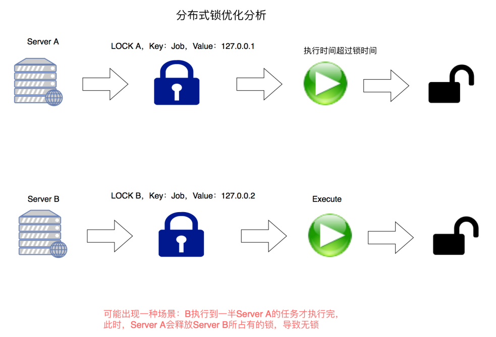

lua脚本释放锁示例：

lua脚步也可以直接定义在java代码中使用

```java
    public static final String UNLOCK_LUA;

    static {
        StringBuilder sb = new StringBuilder();
        sb.append("local lockKey = KEYS[1] ");
        sb.append("local lockValue = KEYS[2] ");
        sb.append("local result_1 = redis.call('get', lockKey) ");
        sb.append("if result_1 == lockValue ");
        sb.append("then ");
        sb.append("local result_2= redis.call('del', lockKey) ");
        sb.append("return result_2 ");
        sb.append("else ");
        sb.append("return false ");
        sb.append("end ");
        UNLOCK_LUA = sb.toString();
    }

    /**
     * 使用Lua脚本释放锁
     * @param key
     * @param value
     * @return
     */
    private boolean releaseLock(String key, String value) {
        // 封装参数
        List<Object> keyList = new ArrayList<Object>();
        keyList.add(key);
        keyList.add(value);

        lockScript = new DefaultRedisScript<Boolean>();
        lockScript.setScriptText(UNLOCK_LUA);
        lockScript.setResultType(Boolean.class);

        Boolean result = (Boolean) redisTemplate.execute(lockScript, keyList);
        return result;
    }

    /**
    * 获得锁-改造部分为finally中的释放方法
    */
    public void lockJob() {
        String lock = LOCK_PREFIX + "LockNxExJob";
        boolean luaRet = false;
        try {
            luaRet = luaExpress(lock,getHostIp());//getHostIp-获取本机内网IP地址
            //获取锁失败
            if (!luaRet) {
                String value = (String) redisService.genValue(lock);
                return;
            } else {
                //获取锁成功
                Thread.sleep(5000);
            }
        } catch (Exception e) {
            logger.error("lock error", e);
        } finally {
            if (luaRet) {
                // 不能直接释放锁，会有如下问题
                // 释放锁的时候，有可能因为持锁之后方法执行时间大于锁的有效期
                // 此时有可能已经被另外一个线程持有锁，所以不能直接删除,否则A解锁了B持有的锁
                // 解决办法：
                // 解锁只能解自己的锁(根据锁的key和value综合判断解锁)
                // 先根据key获得value，判断value是否是自己的锁，再做删除
                // redisService.remove(lock);
                releaseLock(lock,getHostIp());
            }
        }
    }
```

- 遗留问题
  - 锁的过期时间，如何实现锁的自动续期 或者 避免业务执行时间过长，锁过期了？
    - 原生方式的话，一般把锁的过期时间设置的久一点：比如10分钟时间

------

### redis分布式锁最佳实现 redisson

**redis**官⽅推荐**-**分布式锁最佳实践 redisson

------

### Redis布式锁总结

- 问题1： 1、什么是分布式锁？

  - 首先，为了确保分布式锁可用，我们至少要确保锁的实现同时满足以下三个条件：
    - 互斥性。在任意时刻，只有一个客户端能持有锁。
    - 不会发生死锁。即使有一个客户端在持有锁的期间崩溃而没有主动解锁，也能保证后续其他客户端能加锁。
    - 解铃还须系铃人。加锁和解锁必须是同一个客户端，客户端自己不能把别人加的锁给解了

- - 从 Redis 2.6.0 版本开始，通过内置的 Lua 解释器，可以使用 EVAL 命令对 Lua 脚本进行求值。
  - Redis 使用单个 Lua 解释器去运行所有脚本，并且， Redis 也保证脚本会以原子性(atomic)的方式执行：当某个脚本正在运行的时候，不会有其他脚本或 Redis 命令被执行。这和使用 MULTI / EXEC 包围的事务很类似。在其他别的客户端看来，脚本的效果(effect)要么是不可见的(not visible)，要么就是已完成的(already completed)。

- 问题2：怎么实现分布式锁

  - 实现分布式锁的方案大概有两种
    - 采用lua脚本操作分布式锁
    - 采用setnx、setex命令连用的方式实现分布式锁

- 问题3：

  - 解锁需要注意什么

    **解铃还须系铃人**。加锁和解锁必须是同一个客户端，客户端自己不能把别人加的锁给解了


# [聊聊分布式锁——Redis和Redisson的方式-51CTO.COM](https://www.51cto.com/article/682636.html)

### 一、什么是分布式锁

- 分布式~~锁，要这么念，首先得是『分布式』，然后才是『锁』

分布式：这里的分布式指的是分布式系统，涉及到好多技术和理论，包括CAP 理论、分布式存储、分布式事务、分布式锁...

分布式系统是由一组通过网络进行通信、为了完成共同的任务而协调工作的计算机节点组成的系统。

分布式系统的出现是为了用廉价的、普通的机器完成单个计算机无法完成的计算、存储任务。其目的是利用更多的机器，处理更多的数据。

- 锁：对对，就是你想的那个，Javer 学的第一个锁应该就是 synchronized

Java 初级面试问题，来拼写下 赛克瑞纳挨日的

从锁的使用场景有来看下边这 3 种锁：

线程锁：synchronized 是用在方法或代码块中的，我们把它叫『线程锁』，线程锁的实现其实是靠线程之间共享内存实现的，说白了就是内存中的一个整型数，有空闲、上锁这类状态，比如 synchronized 是在对象头中的 Mark Word 有个锁状态标志，Lock 的实现类大部分都有个叫 volatile int state 的共享变量来做状态标志。

进程锁：为了控制同一操作系统中多个进程访问某个共享资源，因为进程具有独立性，各个进程无法访问其他进程的资源，因此无法通过 synchronized 等线程锁实现进程锁。比如说，我们的同一个 linux 服务器，部署了好几个 Java 项目，有可能同时访问或操作服务器上的相同数据，这就需要进程锁，一般可以用『文件锁』来达到进程互斥。

分布式锁：随着用户越来越多，我们上了好多服务器，原本有个定时给客户发邮件的任务，如果不加以控制的话，到点后每台机器跑一次任务，客户就会收到 N 条邮件，这就需要通过分布式锁来互斥了。

书面解释：分布式锁是控制分布式系统或不同系统之间共同访问共享资源的一种锁实现，如果不同的系统或同一个系统的不同主机之间共享了某个资源时，往往需要互斥来防止彼此干扰来保证一致性。

知道了什么是分布式锁，接下来就到了技术选型环节

### 二、分布式锁要怎么搞

要实现一个分布式锁，我们一般选择集群机器都可以操作的外部系统，然后各个机器都去这个外部系统申请锁。

这个外部系统一般需要满足如下要求才能胜任：

1. 互斥：在任意时刻，只能有一个客户端能持有锁。
2. 防止死锁：即使有一个客户端在持有锁的期间崩溃而没有主动解锁，也能保证后续其他客户端能加锁。所以锁一般要有一个过期时间。
3. 独占性：解铃还须系铃人，加锁和解锁必须是同一个客户端，一把锁只能有一把钥匙，客户端自己的锁不能被别人给解开，当然也不能去开别人的锁。
4. 容错：外部系统不能太“脆弱”，要保证外部系统的正常运行，客户端才可以加锁和解锁。

我觉得可以这么类比：

好多商贩要租用某个仓库，同一时刻，只能给一个商贩租用，且只能有一把钥匙，还得有固定的“租期”，到期后要回收的，当然最重要的是仓库门不能坏了，要不锁都锁不住。这不就是分布式锁吗?

感慨自己真是个爱技术爱生活的程序猿~~

其实锁，本质上就是用来进行防重操作的(数据一致性)，像查询这种幂等操作，就不需要费这劲

直接上结论：

分布式锁一般有三种实现方式：1. 数据库乐观锁;2. 基于 Redis 的分布式锁;3. 基于 ZooKeeper 的分布式锁。

但为了追求更好的性能，我们通常会选择使用 Redis 或 Zookeeper 来做。

想必也有喜欢问为什么的同学，那数据库客观锁怎么就性能不好了?

使用数据库乐观锁，包括主键防重，版本号控制。但是这两种方法各有利弊。

使用主键冲突的策略进行防重，在并发量非常高的情况下对数据库性能会有影响，尤其是应用数据表和主键冲突表在一个库的时候，表现更加明显。还有就是在 MySQL 数据库中采用主键冲突防重，在大并发情况下有可能会造成锁表现象，比较好的办法是在程序中生产主键进行防重。

使用版本号策略

这个策略源于 MySQL 的 MVCC 机制，使用这个策略其实本身没有什么问题，唯一的问题就是对数据表侵入较大，我们要为每个表设计一个版本号字段，然后写一条判断 SQL 每次进行判断。

第三趴，编码

### 三、基于 Redis 的分布式锁

其实 Redis 官网已经给出了实现：https://redis.io/topics/distlock，说各种书籍和博客用了各种手段去用 Redis 实现分布式锁，建议用 Redlock 实现，这样更规范、更安全。我们循序渐进来看

我们默认指定大家用的是 Redis 2.6.12 及更高的版本，就不再去讲 setnx、expire 这种了，直接 set 命令加锁


```shell
set key value[expiration EX seconds|PX milliseconds] [NX|XX] 
```

eg:


```shell
SET resource_name my_random_value NX PX 30000 
```

SET 命令的行为可以通过一系列参数来修改

- EX second ：设置键的过期时间为 second 秒。SET key value EX second 效果等同于 SETEX key second value 。
- PX millisecond ：设置键的过期时间为 millisecond 毫秒。SET key value PX millisecond 效果等同于 PSETEX key millisecond value 。
- NX ：只在键不存在时，才对键进行设置操作。SET key value NX 效果等同于 SETNX key value 。
- XX ：只在键已经存在时，才对键进行设置操作。

这条指令的意思：当 key——resource_name 不存在时创建这样的key，设值为 my_random_value，并设置过期时间 30000 毫秒。

别看这干了两件事，因为 Redis 是单线程的，这一条指令不会被打断，所以是原子性的操作。

Redis 实现分布式锁的主要步骤：

1. 指定一个 key 作为锁标记，存入 Redis 中，指定一个 唯一的标识 作为 value。
2. 当 key 不存在时才能设置值，确保同一时间只有一个客户端进程获得锁，满足 互斥性 特性。
3. 设置一个过期时间，防止因系统异常导致没能删除这个 key，满足 防死锁 特性。
4. 当处理完业务之后需要清除这个 key 来释放锁，清除 key 时需要校验 value 值，需要满足 解铃还须系铃人 。

设置一个随机值的意思是在解锁时候判断 key 的值和我们存储的随机数是不是一样，一样的话，才是自己的锁，直接 del 解锁就行。

当然这个两个操作要保证原子性，所以 Redis 给出了一段 lua 脚本(Redis 服务器会单线程原子性执行 lua 脚本，保证 lua 脚本在处理的过程中不会被任意其它请求打断。)：


```lua
if redis.call("get",KEYS[1]) == ARGV[1] then 
    return redis.call("del",KEYS[1]) 
else 
    return 0 
end 
```

### 问题：

我们先抛出两个问题思考：

获取锁时，过期时间要设置多少合适呢?

预估一个合适的时间，其实没那么容易，比如操作资源的时间最慢可能要 10 s，而我们只设置了 5 s 就过期，那就存在锁提前过期的风险。这个问题先记下，我们先看下 Javaer 要怎么在代码中用 Redis 锁。

容错性如何保证呢?

Redis 挂了怎么办，你可能会说上主从、上集群，但也会出现这样的极端情况，当我们上锁后，主节点就挂了，这个时候还没来的急同步到从节点，主从切换后锁还是丢了

带着这两个问题，我们接着看

### Redisson 实现代码

redisson 是 Redis 官方的分布式锁组件。GitHub 地址：https://github.com/redisson/redisson

Redisson 是一个在 Redis 的基础上实现的 Java 驻内存数据网格(In-Memory Data Grid)。它不仅提供了一系列的分布式的 Java 常用对象，还实现了可重入锁(Reentrant Lock)、公平锁(Fair Lock、联锁(MultiLock)、 红锁(RedLock)、 读写锁(ReadWriteLock)等，还提供了许多分布式服务。Redisson 提供了使用 Redis 的最简单和最便捷的方法。Redisson 的宗旨是促进使用者对 Redis 的关注分离(Separation of Concern)，从而让使用者能够将精力更集中地放在处理业务逻辑上。

redisson 现在已经很强大了，github 的 wiki 也很详细，分布式锁的介绍直接戳 Distributed locks and synchronizers

Redisson 支持单点模式、主从模式、哨兵模式、集群模式，只是配置的不同，我们以单点模式来看下怎么使用，代码很简单，都已经为我们封装好了，直接拿来用就好，详细的demo，我放在了 github: starfish-learn-redisson 上，这里就不一步步来了


```java
RLock lock = redisson.getLock("myLock"); 
```

RLock 提供了各种锁方法，我们来解读下这个接口方法，

注：代码为 3.16.2 版本，可以看到继承自 JDK 的 Lock 接口，和 Reddsion 的异步锁接口 RLockAsync(这个我们先不研究)

**RLock**

[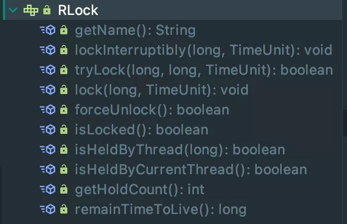](https://s3.51cto.com/oss/202109/17/e58b4d4e86d5bc9b2e93a9a747f45690.jpg)


```java
public interface RLock extends Lock, RLockAsync { 
 
    /** 
     * 获取锁的名字 
     */ 
    String getName(); 
     
    /** 
     * 这个叫终端锁操作，表示该锁可以被中断 假如A和B同时调这个方法，A获取锁，B为获取锁，那么B线程可以通过 
     * Thread.currentThread().interrupt(); 方法真正中断该线程 
     */ 
    void lockInterruptibly(long leaseTime, TimeUnit unit) throws InterruptedException; 
 
    /** 
     * 这个应该是最常用的，尝试获取锁 
     * waitTimeout 尝试获取锁的最大等待时间，超过这个值，则认为获取锁失败 
     * leaseTime   锁的持有时间,超过这个时间锁会自动失效（值应设置为大于业务处理的时间，确保在锁有效期内业务能处理完） 
     */ 
    boolean tryLock(long waitTime, long leaseTime, TimeUnit unit) throws InterruptedException; 
 
    /** 
     * 锁的有效期设置为 leaseTime，过期后自动失效 
     * 如果 leaseTime 设置为 -1, 表示不主动过期 
     */ 
    void lock(long leaseTime, TimeUnit unit); 
 
    /** 
     * Unlocks the lock independently of its state 
     */ 
    boolean forceUnlock(); 
 
    /** 
     * 检查是否被另一个线程锁住 
     */ 
    boolean isLocked(); 
 
    /** 
     * 检查当前线线程是否持有该锁 
     */ 
    boolean isHeldByCurrentThread(); 
   
     /** 
     *  这个就明了了，检查指定线程是否持有锁 
     */ 
    boolean isHeldByThread(long threadId); 
 
    /** 
     * 返回当前线程持有锁的次数 
     */ 
    int getHoldCount(); 
 
    /** 
     * 返回锁的剩余时间 
     * @return time in milliseconds 
     *          -2 if the lock does not exist. 
     *          -1 if the lock exists but has no associated expire. 
     */ 
    long remainTimeToLive(); 
     
} 
```

**Demo**

就是这么简单，Redisson 已经做好了封装，使用起来 so easy，如果使用主从、哨兵、集群这种也只是配置不同。

**原理**

看源码小 tips，最好是 fork 到自己的仓库，然后拉到本地，边看边注释，然后提交到自己的仓库，也方便之后再看，不想这么麻烦的，也可以直接看我的 Jstarfish/redisson

先看下 RLock 的类关系

[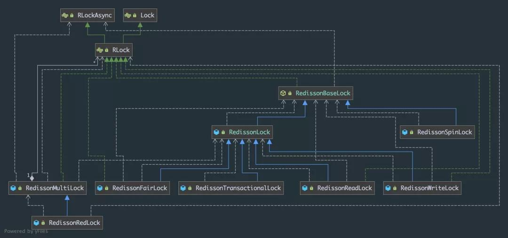](https://s2.51cto.com/oss/202109/17/1d833877375c841c46fc006776cd276f.jpg)

跟着源码，可以发现 RedissonLock 是 RLock 的直接实现，也是我们加锁、解锁操作的核心类

**加锁**

主要的加锁方法就下边这两个，区别也很简单，一个有等待时间，一个没有，所以我们挑个复杂的看(源码包含了另一个的绝大部分)


```java
boolean tryLock(long waitTime, long leaseTime, TimeUnit unit) throws InterruptedException; 
void lock(long leaseTime, TimeUnit unit); 
```

**RedissonLock.tryLock**


```java
@Override 
public boolean tryLock(long waitTime, long leaseTime, TimeUnit unit) throws InterruptedException { 
    // 获取等锁的最长时间 
    long time = unit.toMillis(waitTime); 
    long current = System.currentTimeMillis(); 
    //取得当前线程id（判断是否可重入锁的关键） 
    long threadId = Thread.currentThread().getId(); 
    // 【核心点1】尝试获取锁，若返回值为null，则表示已获取到锁，返回的ttl就是key的剩余存活时间 
    Long ttl = tryAcquire(waitTime, leaseTime, unit, threadId); 
    if (ttl == null) { 
        return true; 
    } 
    // 还可以容忍的等待时长 = 获取锁能容忍的最大等待时长 - 执行完上述操作流程的时间 
    time -= System.currentTimeMillis() - current; 
    if (time <= 0) { 
        //等不到了，直接返回失败 
        acquireFailed(waitTime, unit, threadId); 
        return false; 
    } 
 
    current = System.currentTimeMillis(); 
    /** 
     * 【核心点2】 
     * 订阅解锁消息 redisson_lock__channel:{$KEY}，并通过await方法阻塞等待锁释放，解决了无效的锁申请浪费资源的问题： 
     * 基于信息量，当锁被其它资源占用时，当前线程通过 Redis 的 channel 订阅锁的释放事件，一旦锁释放会发消息通知待等待的线程进行竞争 
     * 当 this.await返回false，说明等待时间已经超出获取锁最大等待时间，取消订阅并返回获取锁失败 
     * 当 this.await返回true，进入循环尝试获取锁 
     */ 
    RFuture<RedissonLockEntry> subscribeFuture = subscribe(threadId); 
    //await 方法内部是用CountDownLatch来实现阻塞，获取subscribe异步执行的结果（应用了Netty 的 Future） 
    if (!subscribeFuture.await(time, TimeUnit.MILLISECONDS)) { 
        if (!subscribeFuture.cancel(false)) { 
            subscribeFuture.onComplete((res, e) -> { 
                if (e == null) { 
                    unsubscribe(subscribeFuture, threadId); 
                } 
            }); 
        } 
        acquireFailed(waitTime, unit, threadId); 
        return false; 
    } 
 
    // ttl 不为空，表示已经有这样的key了，只能阻塞等待 
    try { 
        time -= System.currentTimeMillis() - current; 
        if (time <= 0) { 
            acquireFailed(waitTime, unit, threadId); 
            return false; 
        } 
 
        // 来个死循环，继续尝试着获取锁 
        while (true) { 
            long currentTime = System.currentTimeMillis(); 
            ttl = tryAcquire(waitTime, leaseTime, unit, threadId); 
            if (ttl == null) { 
                return true; 
            } 
 
            time -= System.currentTimeMillis() - currentTime; 
            if (time <= 0) { 
                acquireFailed(waitTime, unit, threadId); 
                return false; 
            } 
 
            currentTime = System.currentTimeMillis(); 
 
           /** 
            * 【核心点3】根据锁TTL，调整阻塞等待时长； 
            * 1、latch其实是个信号量Semaphore，调用其tryAcquire方法会让当前线程阻塞一段时间，避免在while循环中频繁请求获锁； 
            *  当其他线程释放了占用的锁，会广播解锁消息，监听器接收解锁消息，并释放信号量，最终会唤醒阻塞在这里的线程 
            * 2、该Semaphore的release方法，会在订阅解锁消息的监听器消息处理方法org.redisson.pubsub.LockPubSub#onMessage调用； 
            */ 
            //调用信号量的方法来阻塞线程，时长为锁等待时间和租期时间中较小的那个 
            if (ttl >= 0 && ttl < time) { 
                subscribeFuture.getNow().getLatch().tryAcquire(ttl, TimeUnit.MILLISECONDS); 
            } else { 
                subscribeFuture.getNow().getLatch().tryAcquire(time, TimeUnit.MILLISECONDS); 
            } 
 
            time -= System.currentTimeMillis() - currentTime; 
            if (time <= 0) { 
                acquireFailed(waitTime, unit, threadId); 
                return false; 
            } 
        } 
    } finally { 
        // 获取到锁或者抛出中断异常，退订redisson_lock__channel:{$KEY}，不再关注解锁事件 
        unsubscribe(subscribeFuture, threadId); 
    } 
} 
```

接着看注释中提到的 3 个核心点

**核心点1-尝试加锁：RedissonLock.tryAcquireAsync**


```java
private <T> RFuture<Long> tryAcquireAsync(long waitTime, long leaseTime, TimeUnit unit, long threadId) { 
    RFuture<Long> ttlRemainingFuture; 
    // leaseTime != -1 说明没过期 
    if (leaseTime != -1) { 
        // 实质是异步执行加锁Lua脚本 
        ttlRemainingFuture = tryLockInnerAsync(waitTime, leaseTime, unit, threadId, RedisCommands.EVAL_LONG); 
    } else { 
        // 否则，已经过期了,传参变为新的时间（续期后） 
        ttlRemainingFuture = tryLockInnerAsync(waitTime, internalLockLeaseTime, 
                TimeUnit.MILLISECONDS, threadId, RedisCommands.EVAL_LONG); 
    } 
    ttlRemainingFuture.onComplete((ttlRemaining, e) -> { 
        if (e != null) { 
            return; 
        } 
 
        // lock acquired 
        if (ttlRemaining == null) { 
            if (leaseTime != -1) { 
                internalLockLeaseTime = unit.toMillis(leaseTime); 
            } else { 
                // 续期 
                scheduleExpirationRenewal(threadId); 
            } 
        } 
    }); 
    return ttlRemainingFuture; 
} 
```

**异步执行加锁 Lua 脚本：RedissonLock.tryLockInnerAsync**


```java
<T> RFuture<T> tryLockInnerAsync(long waitTime, long leaseTime, TimeUnit unit, long threadId, RedisStrictCommand<T> command) { 
    return evalWriteAsync(getRawName(), LongCodec.INSTANCE, command, 
            // 1.如果缓存中的key不存在，则执行 hincrby 命令(hincrby key UUID+threadId 1), 设值重入次数1 
            // 然后通过 pexpire 命令设置锁的过期时间(即锁的租约时间) 
            // 返回空值 nil ，表示获取锁成功 
            "if (redis.call('exists', KEYS[1]) == 0) then " + 
                    "redis.call('hincrby', KEYS[1], ARGV[2], 1); " + 
                    "redis.call('pexpire', KEYS[1], ARGV[1]); " + 
                    "return nil; " + 
                    "end; " + 
                    // 如果key已经存在，并且value也匹配，表示是当前线程持有的锁，则执行 hincrby 命令，重入次数加1，并且设置失效时间 
                    "if (redis.call('hexists', KEYS[1], ARGV[2]) == 1) then " + 
                    "redis.call('hincrby', KEYS[1], ARGV[2], 1); " + 
                    "redis.call('pexpire', KEYS[1], ARGV[1]); " + 
                    "return nil; " + 
                    "end; " + 
                    //如果key已经存在，但是value不匹配，说明锁已经被其他线程持有，通过 pttl 命令获取锁的剩余存活时间并返回，至此获取锁失败 
                    "return redis.call('pttl', KEYS[1]);", 
            Collections.singletonList(getRawName()), unit.toMillis(leaseTime), getLockName(threadId)); 
}
```

- KEYS[1] 就是 Collections.singletonList(getName())，表示分布式锁的key;
- ARGV[1] 就是internalLockLeaseTime，即锁的租约时间(持有锁的有效时间)，默认30s;
- ARGV[2] 就是getLockName(threadId)，是获取锁时set的唯一值 value，即UUID+threadId

看门狗续期：RedissonBaseLock.scheduleExpirationRenewal


```java
// 基于线程ID定时调度和续期 
protected void scheduleExpirationRenewal(long threadId) { 
    // 新建一个ExpirationEntry记录线程重入计数 
    ExpirationEntry entry = new ExpirationEntry(); 
    ExpirationEntry oldEntry = EXPIRATION_RENEWAL_MAP.putIfAbsent(getEntryName(), entry); 
    if (oldEntry != null) { 
        // 当前进行的当前线程重入加锁 
        oldEntry.addThreadId(threadId); 
    } else { 
        // 当前进行的当前线程首次加锁 
        entry.addThreadId(threadId); 
        // 首次新建ExpirationEntry需要触发续期方法，记录续期的任务句柄 
        renewExpiration(); 
    } 
} 
 
// 处理续期 
private void renewExpiration() { 
  // 根据entryName获取ExpirationEntry实例，如果为空，说明在cancelExpirationRenewal()方法已经被移除，一般是解锁的时候触发 
  ExpirationEntry ee = EXPIRATION_RENEWAL_MAP.get(getEntryName()); 
  if (ee == null) { 
    return; 
  } 
 
  // 新建一个定时任务，这个就是看门狗的实现，io.netty.util.Timeout是Netty结合时间轮使用的定时任务实例 
  Timeout task = commandExecutor.getConnectionManager().newTimeout(new TimerTask() { 
    @Override 
    public void run(Timeout timeout) throws Exception { 
      // 这里是重复外面的那个逻辑， 
      ExpirationEntry ent = EXPIRATION_RENEWAL_MAP.get(getEntryName()); 
      if (ent == null) { 
        return; 
      } 
      // 获取ExpirationEntry中首个线程ID，如果为空说明调用过cancelExpirationRenewal()方法清空持有的线程重入计数，一般是锁已经释放的场景 
      Long threadId = ent.getFirstThreadId(); 
      if (threadId == null) { 
        return; 
      } 
      // 向Redis异步发送续期的命令 
      RFuture<Boolean> future = renewExpirationAsync(threadId); 
      future.onComplete((res, e) -> { 
        // 抛出异常，续期失败，只打印日志和直接终止任务 
        if (e != null) { 
          log.error("Can't update lock " + getRawName() + " expiration", e); 
          EXPIRATION_RENEWAL_MAP.remove(getEntryName()); 
          return; 
        } 
        // 返回true证明续期成功，则递归调用续期方法（重新调度自己），续期失败说明对应的锁已经不存在，直接返回，不再递归 
        if (res) { 
          // reschedule itself 
          renewExpiration(); 
        } else { 
          cancelExpirationRenewal(null); 
        } 
      }); 
    }// 这里的执行频率为leaseTime转换为ms单位下的三分之一，由于leaseTime初始值为-1的情况下才会进入续期逻辑，那么这里的执行频率为lockWatchdogTimeout的三分之一 
  }, internalLockLeaseTime / 3, TimeUnit.MILLISECONDS); 
  // ExpirationEntry实例持有调度任务实例 
  ee.setTimeout(task); 
}
```

**核心点2-订阅解锁消息：RedissonLock.subscribe**


```java
protected final LockPubSub pubSub; 
 
public RedissonLock(CommandAsyncExecutor commandExecutor, String name) { 
  super(commandExecutor, name); 
  this.commandExecutor = commandExecutor; 
  this.internalLockLeaseTime = commandExecutor.getConnectionManager().getCfg().getLockWatchdogTimeout(); 
  //在构造器中初始化pubSub,跟着这几个get方法会发现他们都是在构造器中初始化的，在PublishSubscribeService中会有 
  // private final AsyncSemaphore[] locks = new AsyncSemaphore[50]; 这样一段代码，初始化了一组信号量 
  this.pubSub = commandExecutor.getConnectionManager().getSubscribeService().getLockPubSub(); 
} 
 
protected RFuture<RedissonLockEntry> subscribe(long threadId) { 
  return pubSub.subscribe(getEntryName(), getChannelName()); 
} 
 
// 在LockPubSub中注册一个entryName -> RedissonLockEntry的哈希映射，RedissonLockEntry实例中存放着RPromise<RedissonLockEntry>结果，一个信号量形式的锁和订阅方法重入计数器 
public RFuture<E> subscribe(String entryName, String channelName) { 
  AsyncSemaphore semaphore = service.getSemaphore(new ChannelName(channelName)); 
  RPromise<E> newPromise = new RedissonPromise<>(); 
  semaphore.acquire(() -> { 
    if (!newPromise.setUncancellable()) { 
      semaphore.release(); 
      return; 
    } 
 
    E entry = entries.get(entryName); 
    if (entry != null) { 
      entry.acquire(); 
      semaphore.release(); 
      entry.getPromise().onComplete(new TransferListener<E>(newPromise)); 
      return; 
    } 
 
    E value = createEntry(newPromise); 
    value.acquire(); 
 
    E oldValue = entries.putIfAbsent(entryName, value); 
    if (oldValue != null) { 
      oldValue.acquire(); 
      semaphore.release(); 
      oldValue.getPromise().onComplete(new TransferListener<E>(newPromise)); 
      return; 
    } 
 
    RedisPubSubListener<Object> listener = createListener(channelName, value); 
    service.subscribe(LongCodec.INSTANCE, channelName, semaphore, listener); 
  }); 
 
  return newPromise; 
}
```

核心点 3 比较简单，就不说了

**解锁**

**RedissonLock.unlock()**


```java
@Override 
public void unlock() { 
  try { 
    // 获取当前调用解锁操作的线程ID 
    get(unlockAsync(Thread.currentThread().getId())); 
  } catch (RedisException e) { 
    // IllegalMonitorStateException一般是A线程加锁，B线程解锁，内部判断线程状态不一致抛出的 
    if (e.getCause() instanceof IllegalMonitorStateException) { 
      throw (IllegalMonitorStateException) e.getCause(); 
    } else { 
      throw e; 
    } 
  } 
}
```

**RedissonBaseLock.unlockAsync**


```java
@Override 
public RFuture<Void> unlockAsync(long threadId) { 
  // 构建一个结果RedissonPromise 
  RPromise<Void> result = new RedissonPromise<>(); 
  // 返回的RFuture如果持有的结果为true，说明解锁成功，返回NULL说明线程ID异常，加锁和解锁的客户端线程不是同一个线程 
  RFuture<Boolean> future = unlockInnerAsync(threadId); 
 
  future.onComplete((opStatus, e) -> { 
    // 取消看门狗的续期任务 
    cancelExpirationRenewal(threadId); 
 
    if (e != null) { 
      result.tryFailure(e); 
      return; 
    } 
 
    if (opStatus == null) { 
      IllegalMonitorStateException cause = new IllegalMonitorStateException("attempt to unlock lock, not locked by current thread by node id: " 
                                                                            + id + " thread-id: " + threadId); 
      result.tryFailure(cause); 
      return; 
    } 
 
    result.trySuccess(null); 
  }); 
 
  return result; 
}
```

**RedissonLock.unlockInnerAsync**


```java
// 真正的内部解锁的方法，执行解锁的Lua脚本 
protected RFuture<Boolean> unlockInnerAsync(long threadId) { 
  return evalWriteAsync(getRawName(), LongCodec.INSTANCE, RedisCommands.EVAL_BOOLEAN, 
                        //如果分布式锁存在，但是value不匹配，表示锁已经被其他线程占用，无权释放锁，那么直接返回空值（解铃还须系铃人） 
                        "if (redis.call('hexists', KEYS[1], ARGV[3]) == 0) then " + 
                        "return nil;" + 
                        "end; " + 
                        //如果value匹配，则就是当前线程占有分布式锁，那么将重入次数减1 
                        "local counter = redis.call('hincrby', KEYS[1], ARGV[3], -1); " + 
                        //重入次数减1后的值如果大于0，表示分布式锁有重入过，那么只能更新失效时间，还不能删除 
                        "if (counter > 0) then " + 
                        "redis.call('pexpire', KEYS[1], ARGV[2]); " + 
                        "return 0; " + 
                        "else " + 
                        //重入次数减1后的值如果为0，这时就可以删除这个KEY，并发布解锁消息，返回1 
                        "redis.call('del', KEYS[1]); " + 
                        "redis.call('publish', KEYS[2], ARGV[1]); " + 
                        "return 1; " + 
                        "end; " + 
                        "return nil;", 
                        //这5个参数分别对应KEYS[1]，KEYS[2]，ARGV[1]，ARGV[2]和ARGV[3] 
                        Arrays.asList(getRawName(), getChannelName()), LockPubSub.UNLOCK_MESSAGE, internalLockLeaseTime, getLockName(threadId)); 
}
```

我只列出了一小部分代码，更多的内容还是得自己动手

从源码中，我们可以看到 Redisson 帮我们解决了抛出的第一个问题：失效时间设置多长时间为好?

Redisson 提供了看门狗，每获得一个锁时，只设置一个很短的超时时间，同时起一个线程在每次快要到超时时间时去刷新锁的超时时间。在释放锁的同时结束这个线程。

但是没有解决节点挂掉，丢失锁的问题，接着来~

### 四、RedLock

我们上边介绍的分布式锁，在某些极端情况下仍然是有缺陷的

**客户端长时间内阻塞导致锁失效**

客户端 1 得到了锁，因为网络问题或者 GC 等原因导致长时间阻塞，然后业务程序还没执行完锁就过期了，这时候客户端 2 也能正常拿到锁，可能会导致线程安全的问题。

**Redis 服务器时钟漂移**

如果 Redis 服务器的机器时间发生了向前跳跃，就会导致这个 key 过早超时失效，比如说客户端 1 拿到锁后，key 还没有到过期时间，但是 Redis 服务器的时间比客户端快了 2 分钟，导致 key 提前就失效了，这时候，如果客户端 1 还没有释放锁的话，就可能导致多个客户端同时持有同一把锁的问题。

**单点实例安全问题**

如果 Redis 是单机模式的，如果挂了的话，那所有的客户端都获取不到锁了，假设你是主从模式，但 Redis 的主从同步是异步进行的，如果 Redis 主宕机了，这个时候从机并没有同步到这一把锁，那么机器 B 再次申请的时候就会再次申请到这把锁，这也是问题

为了解决这些个问题 Redis 作者提出了 RedLock 红锁的算法，在 Redission 中也对 RedLock 进行了实现。

Redis 官网对 redLock 算法的介绍大致如下：The Redlock algorithm

在分布式版本的算法里我们假设我们有 N 个 Redis master 节点，这些节点都是完全独立的，我们不用任何或者其他隐含的分布式协调机制。之前我们已经描述了在 Redis 单实例下怎么安全地获取和释放锁。我们确保将在每(N) 个实例上使用此方法获取和释放锁。在我们的例子里面我们设置 N=5，这是一个比较合理的设置，所以我们需要在 5 台机器或者虚拟机上面运行这些实例，这样保证他们不会同时都宕掉。为了取到锁，客户端应该执行以下操作:

获取当前 Unix 时间，以毫秒为单位。

依次尝试从 5 个实例，使用相同的 key 和具有唯一性的 value(例如UUID)获取锁。当向 Redis 请求获取锁时，客户端应该设置一个尝试从某个 Reids 实例获取锁的最大等待时间(超过这个时间，则立马询问下一个实例)，这个超时时间应该小于锁的失效时间。例如你的锁自动失效时间为 10 秒，则超时时间应该在 5-50 毫秒之间。这样可以避免服务器端 Redis 已经挂掉的情况下，客户端还在死死地等待响应结果。如果服务器端没有在规定时间内响应，客户端应该尽快尝试去另外一个 Redis 实例请求获取锁。

客户端使用当前时间减去开始获取锁时间(步骤1记录的时间)就得到获取锁消耗的时间。当且仅当从大多数(N/2+1，这里是3个节点)的 Redis 节点都取到锁，并且使用的总耗时小于锁失效时间时，锁才算获取成功。

如果取到了锁，key 的真正有效时间 = 有效时间(获取锁时设置的 key 的自动超时时间) - 获取锁的总耗时(询问各个 Redis 实例的总耗时之和)(步骤 3 计算的结果)。

如果因为某些原因，最终获取锁失败(即没有在至少 “N/2+1 ”个 Redis 实例取到锁或者“获取锁的总耗时”超过了“有效时间”)，客户端应该在所有的 Redis 实例上进行解锁(即便某些 Redis 实例根本就没有加锁成功，这样可以防止某些节点获取到锁但是客户端没有得到响应而导致接下来的一段时间不能被重新获取锁)。

总结下就是：

客户端在多个 Redis 实例上申请加锁，必须保证大多数节点加锁成功

解决容错性问题，部分实例异常，剩下的还能加锁成功

大多数节点加锁的总耗时，要小于锁设置的过期时间

多实例操作，可能存在网络延迟、丢包、超时等问题，所以就算是大多数节点加锁成功，如果加锁的累积耗时超过了锁的过期时间，那有些节点上的锁可能也已经失效了，还是没有意义的

释放锁，要向全部节点发起释放锁请求

如果部分节点加锁成功，但最后由于异常导致大部分节点没加锁成功，就要释放掉所有的，各节点要保持一致

关于 RedLock，两位分布式大佬，Antirez 和 Martin 还进行过一场争论，感兴趣的也可以看看


```java
Config config1 = new Config(); 
config1.useSingleServer().setAddress("127.0.0.1:6379"); 
RedissonClient redissonClient1 = Redisson.create(config1); 
 
Config config2 = new Config(); 
config2.useSingleServer().setAddress("127.0.0.1:5378"); 
RedissonClient redissonClient2 = Redisson.create(config2); 
 
Config config3 = new Config(); 
config3.useSingleServer().setAddress("127.0.0.1:5379"); 
RedissonClient redissonClient3 = Redisson.create(config3); 
 
/** 
 * 获取多个 RLock 对象 
 */ 
RLock lock1 = redissonClient1.getLock(lockKey); 
RLock lock2 = redissonClient2.getLock(lockKey); 
RLock lock3 = redissonClient3.getLock(lockKey); 
 
/** 
 * 根据多个 RLock 对象构建 RedissonRedLock （最核心的差别就在这里） 
 */ 
RedissonRedLock redLock = new RedissonRedLock(lock1, lock2, lock3); 
 
try { 
    /** 
     * 4.尝试获取锁 
     * waitTimeout 尝试获取锁的最大等待时间，超过这个值，则认为获取锁失败 
     * leaseTime   锁的持有时间,超过这个时间锁会自动失效（值应设置为大于业务处理的时间，确保在锁有效期内业务能处理完） 
     */ 
    boolean res = redLock.tryLock(100, 10, TimeUnit.SECONDS); 
    if (res) { 
        //成功获得锁，在这里处理业务 
    } 
} catch (Exception e) { 
    throw new RuntimeException("aquire lock fail"); 
}finally{ 
    //无论如何, 最后都要解锁 
    redLock.unlock(); 
}
```

最核心的变化就是需要构建多个 RLock ，然后根据多个 RLock 构建成一个 RedissonRedLock，因为 redLock 算法是建立在多个互相独立的 Redis 环境之上的(为了区分可以叫为 Redission node)，Redission node 节点既可以是单机模式(single)，也可以是主从模式(master/salve)，哨兵模式(sentinal)，或者集群模式(cluster)。这就意味着，不能跟以往这样只搭建 1个 cluster、或 1个 sentinel 集群，或是1套主从架构就了事了，需要为 RedissonRedLock 额外搭建多几套独立的 Redission 节点。

**RedissonMultiLock.tryLock**


```java
@Override 
public boolean tryLock(long waitTime, long leaseTime, TimeUnit unit) throws InterruptedException { 
  //        try { 
  //            return tryLockAsync(waitTime, leaseTime, unit).get(); 
  //        } catch (ExecutionException e) { 
  //            throw new IllegalStateException(e); 
  //        } 
  long newLeaseTime = -1; 
  if (leaseTime != -1) { 
    if (waitTime == -1) { 
      newLeaseTime = unit.toMillis(leaseTime); 
    } else { 
      newLeaseTime = unit.toMillis(waitTime)*2; 
    } 
  } 
 
  long time = System.currentTimeMillis(); 
  long remainTime = -1; 
  if (waitTime != -1) { 
    remainTime = unit.toMillis(waitTime); 
  } 
  long lockWaitTime = calcLockWaitTime(remainTime); 
 
  //允许加锁失败节点个数限制（N-(N/2+1)） 
  int failedLocksLimit = failedLocksLimit(); 
  List<RLock> acquiredLocks = new ArrayList<>(locks.size()); 
  // 遍历所有节点通过EVAL命令执行lua加锁 
  for (ListIterator<RLock> iterator = locks.listIterator(); iterator.hasNext();) { 
    RLock lock = iterator.next(); 
    boolean lockAcquired; 
    try { 
      // 对节点尝试加锁 
      if (waitTime == -1 && leaseTime == -1) { 
        lockAcquired = lock.tryLock(); 
      } else { 
        long awaitTime = Math.min(lockWaitTime, remainTime); 
        lockAcquired = lock.tryLock(awaitTime, newLeaseTime, TimeUnit.MILLISECONDS); 
      } 
    } catch (RedisResponseTimeoutException e) { 
      // 如果抛出这类异常，为了防止加锁成功，但是响应失败，需要解锁所有节点 
      unlockInner(Arrays.asList(lock)); 
      lockAcquired = false; 
    } catch (Exception e) { 
      lockAcquired = false; 
    } 
 
    if (lockAcquired) { 
      acquiredLocks.add(lock); 
    } else { 
      /* 
       *  计算已经申请锁失败的节点是否已经到达 允许加锁失败节点个数限制 （N-(N/2+1)） 
       * 如果已经到达， 就认定最终申请锁失败，则没有必要继续从后面的节点申请了 
       * 因为 Redlock 算法要求至少N/2+1 个节点都加锁成功，才算最终的锁申请成功 
       */ 
      if (locks.size() - acquiredLocks.size() == failedLocksLimit()) { 
        break; 
      } 
 
      if (failedLocksLimit == 0) { 
        unlockInner(acquiredLocks); 
        if (waitTime == -1) { 
          return false; 
        } 
        failedLocksLimit = failedLocksLimit(); 
        acquiredLocks.clear(); 
        // reset iterator 
        while (iterator.hasPrevious()) { 
          iterator.previous(); 
        } 
      } else { 
        failedLocksLimit--; 
      } 
    } 
    //计算 目前从各个节点获取锁已经消耗的总时间，如果已经等于最大等待时间，则认定最终申请锁失败，返回false 
    if (remainTime != -1) { 
      remainTime -= System.currentTimeMillis() - time; 
      time = System.currentTimeMillis(); 
      if (remainTime <= 0) { 
        unlockInner(acquiredLocks); 
        return false; 
      } 
    } 
  } 
 
  if (leaseTime != -1) { 
    acquiredLocks.stream() 
      .map(l -> (RedissonLock) l) 
      .map(l -> l.expireAsync(unit.toMillis(leaseTime), TimeUnit.MILLISECONDS)) 
      .forEach(f -> f.syncUninterruptibly()); 
  } 
 
  return true; 
}
```

# Redis线程模型

> redis 内部使用文件事件处理器 file event handler，这个文件事件处理器是单线程的，所以 redis 才叫做单线程的模型。
>
> 它采用 IO 多路复用机制同时监听多个 socket，根据 socket 上的事件来选择对应的事件处理器进行处理。

文件事件处理器的结构包含 4 个部分：

- **多个 socket**
- **IO 多路复用程序**
- **文件事件分派器**
- **事件处理器（包括：连接应答处理器、命令请求处理器、命令回复处理器）**

多个 socket 可能会并发产生不同的操作，每个操作对应不同的文件事件，但是 [IO 多路复用](https://www.wylong.top/netty/03-网络IO模型讲解.html) 程序会监听多个 socket，会将 socket 产生的事件放入队列中排队，事件分派器每次从队列中取出一个事件，把该事件交给对应的事件处理器进行处理。

来看客户端与 redis 的一次通信过程：

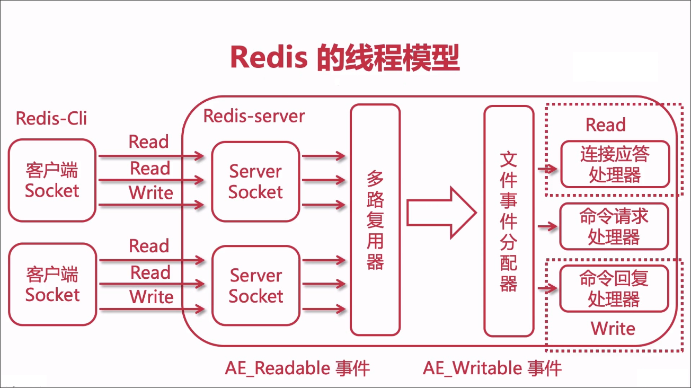

1. 客户端 socket01 向 redis 的 server socket 请求建立连接，此时 server socket 会产生一个 AE_READABLE 事件，IO 多路复用程序监听到 server socket 产生的事件后，将该事件压入队列中。文件事件分派器从队列中获取该事件，交给连接应答处理器。连接应答处理器会创建一个能与客户端通信的 socket01，并将该 socket01 的 AE_READABLE 事件与命令请求处理器关联。
2. 假设此时客户端发送了一个 set key value 请求，此时 redis 中的 socket01 会产生 AE_READABLE 事件，IO 多路复用程序将事件压入队列，此时事件分派器从队列中获取到该事件，由于前面 socket01 的 AE_READABLE 事件已经与命令请求处理器关联，因此事件分派器将事件交给命令请求处理器来处理。命令请求处理器读取 socket01 的 key value 并在自己内存中完成 key value 的设置。操作完成后，它会将 socket01 的 AE_WRITABLE 事件与命令回复处理器关联。
3. 如果此时客户端准备好接收返回结果了，那么 redis 中的 socket01 会产生一个 AE_WRITABLE 事件，同样压入队列中，事件分派器找到相关联的命令回复处理器，由命令回复处理器对 socket01 输入本次操作的一个结果，比如 ok，之后解除 socket01 的 AE_WRITABLE 事件与命令回复处理器的关联。

这样便完成了一次通信。

## 为啥 redis 单线程模型也能效率这么高？

- **纯内存操作**
- **核心是基于非阻塞的 IO 多路复用机制**
- **单线程反而避免了多线程的频繁上下文切换问题**

#  Redis缓存击穿、雪崩、穿透的解决方案

### 概念简述

- 缓存击穿
  - 某个热点key缓存失效了
- 缓存雪崩
  - 多个热点key都过期
- 缓存穿透
  - 查询不存在数据

### 缓存击穿+解决方案

- 缓存击穿 (某个热点key缓存失效了)

  - 缓存中没有但数据库中有的数据，假如是热点数据，那key在缓存过期的一刻，同时有大量的请求，这些请求都会击穿到DB，造成瞬时DB请求量大、压力增大。
  - 和缓存雪崩的区别在于这里针对某一key缓存，后者则是很多key。

- 预防

  - 设置热点数据不过期
  - 定时任务定时更新缓存
  - 设置互斥锁

- SpringCache解决方案

  - 缓存的同步 sync
  - sync 可以指示底层将缓存锁住，使只有一个线程可以进入计算，而其他线程堵塞，直到返回结果更新到缓存中

  ```java
  @Cacheable(value = {"product"},key = "#root.args[0]", cacheManager = "customCacheManager", sync=true)
  ```

### 缓存雪崩+解决方案

- 缓存雪崩 (多个热点key都过期)

  - 大量的key设置了相同的过期时间，导致在缓存在同一时刻全部失效，造成瞬时DB请求量大、压力骤增，引起雪崩

  - 预防

    - 存数据的过期时间设置随机，防止同一时间大量数据过期现象发生
    - 设置热点数据永远不过期，定时任务定时更新

  - SpringCache解决方案

    - 设置差别的过时时间
    - 比如CacheManager配置多个过期时间维度
    - 配置文件 time-to-live 配置

    ```yaml
     cache:
       #使用的缓存类型
        type: redis
       #过时时间
        redis:
          time-to-live: 3600000
          # 开启前缀，默以为true
          use-key-prefix: true
          # 键的前缀,默认就是缓存名cacheNames
          key-prefix: WYL_CACHE
          # 是否缓存空结果，防止缓存穿透，默以为true
          cache-null-values: true
    ```

### 缓存穿透+解决方案

- 缓存穿透（查询不存在数据）

  - 查询一个不存在的数据，由于缓存是不命中的，并且出于容错考虑，如发起为id为“-1”不存在的数据

  - 如果从存储层查不到数据则不写入缓存这将导致这个不存在的数据每次请求都要到存储层去查询，失去了缓存的意义。存在大量查询不存在的数据，可能DB就挂掉了，这也是黑客利用不存在的key频繁攻击应用的一种方式。

  - 预防

    - 接口层增加校验，数据合理性校验
    - 缓存取不到的数据，在数据库中也没有取到，这时也可以将key-value对写为key-null，设置短点的过期时间，防止同个key被一直攻击

  - 使用布隆过滤器解决

    将已存在的缓存到布隆过滤器中，当访问不存在的缓存时迅速返回避免缓存及DB挂掉

    > 并不能完全解决， 只能将其控制在一个可以容忍的范围内

  - SpringCache解决方案

    - 空结果也缓存，默认不配置condition或者unless就行

    ```yaml
    cache:
       #使用的缓存类型
        type: redis
       #过时时间
        redis:
          time-to-live: 3600000
          # 开启前缀，默以为true
          use-key-prefix: true
          # 键的前缀,默认就是缓存名cacheNames
          key-prefix: WYL
          # 是否缓存空结果，防止缓存穿透，默以为true
          cache-null-values: true
    ```

## 布隆过滤器

### 寻衅滋事？先过了我这道关

**简介：布隆过滤器是什么，一定要用吗?**

> 解决缓存穿透

- 黑客流量攻击：故意访问不存在的数据，导致程序不断访问DB数据库的数据
- 黑客安全阻截：当黑客访问不存在的缓存时迅速返回避免缓存及DB挂掉
- 思考：如果让你实现这个功能你会怎么做？ key：10000 10001 10002 10003 大集合，key是否在集合里面
- 温故而知新：分析java常用数据结构复习
  - list.contain (key)遍历数据，进行equals()比较，性能小
  - set.contain(key) hashcode比较，性能较高，一个key,64位 1千万数据量就是1G
  - map.get(key) hashcode比较，性能还行
- 概念：
  - **布隆过滤器**（英语：Bloom Filter）是1970年由布隆提出的。它实际上是一个很长的[二进制](https://zh.wikipedia.org/wiki/二进制)向量和一系列随机[映射函数](https://zh.wikipedia.org/wiki/映射)。布隆过滤器可以用于检索一个元素是否在一个集合中。它的优点是空间效率和查询时间都远远超过一般的算法，缺点是有一定的误识别率和删除困难。
- 优点:
  - 相比于其它的数据结构，布隆过滤器在空间和时间方面都有巨大的优势。布隆过滤器存储空间和插入/查询时间都是常数。另外，散列函数相互之间没有关系，方便由硬件并行实现。布隆过滤器不需要存储元素本身，在某些对保密要求非常严格的场合有优势
- 缺点
  - 但是布隆过滤器的缺点和优点一样明显。误算率是其中之一。随着存入的元素数量增加，误算率随之增加。但是如果元素数量太少，则使用散列表足矣。

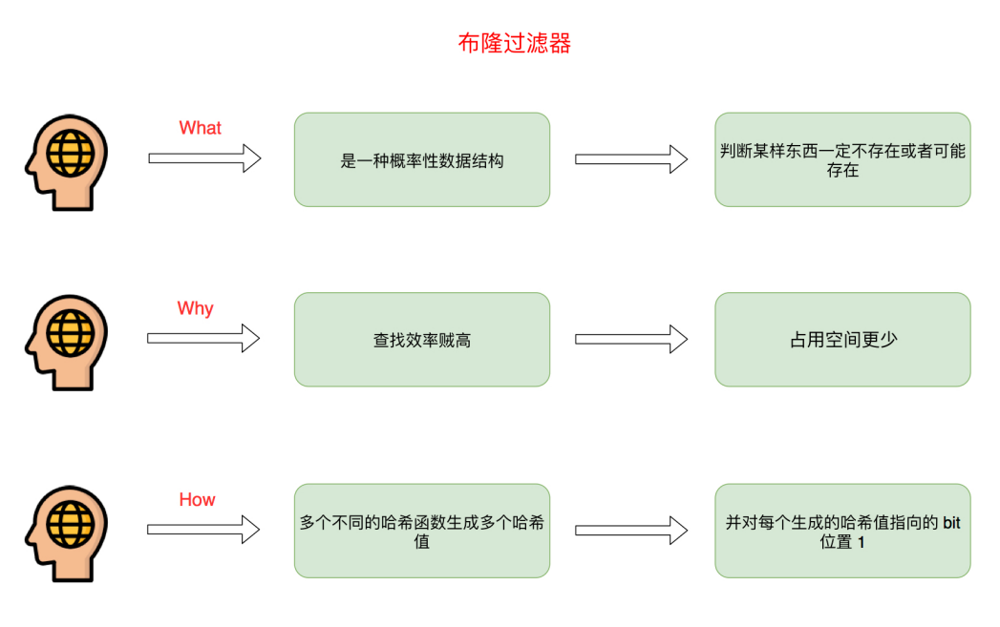

------

### 布隆过滤器原理

布隆过滤器原理：

我们可以把它看做一个会产生误判并且占用空间极少的HashSet。它的结构是一个Bit数组（数组中每个位置只占用一个bit，每个bit位有0和1两种状态）和一系列Hash函数的集合，我们将输入域通过上述一系列Hash函数进行Hash运算得到n个key值，将这n个值对数组的长度进行取余，然后将bit数组中对应的位置bit位设为1。在数组足够大，hash碰撞足够小的情况下，每个输入域都会在数组中不同的位置将其bit位置为1，我们把集合中所有的元素都按照这个方式来一遍的话一个布隆过滤器就生成好了。

那么如何判断一个元素是否在布隆过滤器中呢，原理和生成布隆过滤器的过程差不多，我们将要判断的值通过布隆过滤器的n个Hash函数计算出n个值，对数组长度取余得到bit数组中n个位置，接下来判断这n个位置的bit位是否都为1，若都为1，则说明该元素在集合中，若有一个为0，则该元素肯定不在集合中。

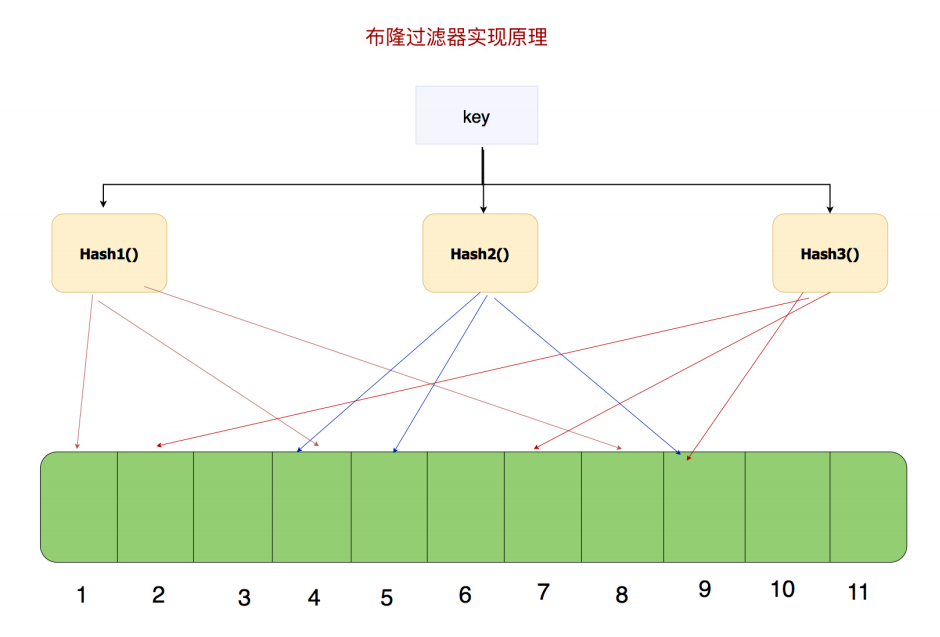

- 那么这个布隆过滤器就有这么几个特点：

  1. 空间占用小

  2. 查询效率高

  3. 有一定误判率：一定不存在，可能存在

     - 返回数据不存在，则肯定不存在。
     - 返回数据存在，但只能是大概率存在。

  4. 删除问题：

     目前我们知道布隆过滤器可以支持 add 和 isExist 操作，那么 delete 操作可以么，答案是不可以，例如上图中的 bit 位 4 被两个值共同覆盖的话，一旦你删除其中一个值例如 “tencent” 而将其置位 0，那么下次判断另一个值例如 “baidu” 是否存在的话，会直接返回 false，而实际上你并没有删除它。

- 布隆过滤器的其他使用场景

  - 网页爬虫对URL的去重，避免爬取相同的URL地址

  - 反垃圾邮件，从数十亿个垃圾邮件列表中判断某邮箱是否垃圾邮箱（同理，垃圾短信）

  - 解决**缓存穿透**，将已存在的缓存放到布隆中，当黑客访问不存在的缓存时迅速返回避免缓存及DB挂掉

    并不能完全解决， 只能将其控制在一个可以容忍的范围内

------

### 谷歌布隆过滤器实现会员转盘抽奖

**简介：抽奖程序功能需求分析，谷歌实现布隆过滤器，谷歌布隆过滤器的局限性**

- 需求分析步骤

  - 互联网功能需求分析
    - 这是一个抽奖程序，只针对会员用户有效
  - 抽离出功能所有api
  - 制定存储方案
  - 性能优化方案分析

  

- 成型互联网产品用户量上千万，日常百万，怎么做到高性能非会员过滤

- 这是一个布隆过滤器的经典使用场景

- 通过google布隆过滤器存储会员数据实战

  - 程序启动时将数据放入内存中
  - google自动创建布隆过滤器
  - 用户ID进来之后判断是否是会员

- 设计表

  ```sql
  CREATE TABLE `sys_user` (
    `id` int(11) unsigned NOT NULL AUTO_INCREMENT,
    `user_name` varchar(11) CHARACTER SET utf8mb4 DEFAULT NULL COMMENT '用户名',
    `image` varchar(11) CHARACTER SET utf8mb4 DEFAULT NULL COMMENT '用户头像',
    PRIMARY KEY (`id`)
  ) ENGINE=InnoDB AUTO_INCREMENT=11 DEFAULT CHARSET=utf8;
  ```

主要代码示例：

```java
import com.google.common.hash.BloomFilter;
import com.google.common.hash.Funnels;
import org.springframework.stereotype.Service;
import org.springframework.util.CollectionUtils;

import javax.annotation.PostConstruct;
import javax.annotation.Resource;
import java.util.List;

@Service
public class BloomFilterService {

    @Resource
    private SysUserMapper sysUserMapper;

    private BloomFilter<Integer> bf;

    /***
     * PostConstruct 程序启动时候加载此方法
     */
    @PostConstruct
    public void initBloomFilter() {
        SysUserExample sysUserExample = new SysUserExample();
        List<SysUser> sysUserList = sysUserMapper.selectByExample(sysUserExample);
        if(CollectionUtils.isEmpty(sysUserList)){
            return;
        }
        //创建布隆过滤器(默认3%误差)
        bf = BloomFilter.create(Funnels.integerFunnel(),sysUserList.size());
        for (SysUser sysUser:sysUserList) {
            bf.put(sysUser.getId());
        }
    }

    /***
     * 判断id可能存在于布隆过滤器里面
     * @param id
     * @return
     */
    public boolean userIdExists(int id){
        return bf.mightContain(id);
    }
}
```

------

### goole布隆过滤器与Redis布隆过滤器

**简介：**布隆过滤器两种实现方案的优缺点分析

- google布隆过滤器的缺陷与思考

  - 基于内存布隆过滤器有什么特点
  - 内存级别产物
  - 重启即失效
  - 本地内存无法用在分布式场景
  - 不支持大数据量存储

- 需求分析步骤

  - 互联网功能需求分析
    - 这是一个抽奖程序，只针对会员用户有效
  - 抽离出功能所有api
  - 制定存储方案
  - 性能优化方案分析

  

- Redis布隆过滤器

  - 可扩展性Bloom过滤器
    - 一旦Bloom过滤器达到容量，就会在其上创建一个新的过滤器
  - 不存在重启即失效或者定时任务维护的成本
    - 基于goole实现的布隆过滤器需要启动之后初始化布隆过滤器
  - 缺点：
    - 需要网络IO,性能比基于内存的过滤器低

- 选择:

  优先基于数据量进行考虑

------

### Redis布隆过滤器安装

**centos7下安装**

- 下载并编译模块：

  ```shell
  # 下载并上传到服务器，下载地址
  https://github.com/RedisBloom/RedisBloom
  # 解压
  unzip RedisBloom-master.zip
  # 进入目录
  cd RedisBloom-master
  # 编译
  make
  # 目录下生成文件
  redisbloom.so
  # 拷贝目录下生成的文件redisbloom.so到redis的bin目录下
  cp redisbloom.so /usr/local/redis/bin/redisbloom.so
  ```

- redis引入该模块

  ```shell
  # 在redis.conf配置文件里加入如下引入配置
  loadmodule /usr/local/redis/bin/redisbloom.so
  # redis集群每个配置文件都需要加入这一行
  ```

- 重启redis

  ```
  ./redis-cli shutdown
  ./redis-server redis.conf
  ```

- 命令实战

  ```shell
  127.0.0.1:6379> bf.add codehole user1
  (integer) 1
  127.0.0.1:6379> bf.add codehole user2
  (integer) 1
  127.0.0.1:6379> bf.add codehole user3
  (integer) 1
  127.0.0.1:6379> bf.exists codehole user1
  (integer) 1
  127.0.0.1:6379> bf.exists codehole user2
  (integer) 1
  127.0.0.1:6379> bf.exists codehole user3
  (integer) 1
  127.0.0.1:6379> bf.exists codehole user4
  (integer) 0
  127.0.0.1:6379> bf.madd codehole user4 user5 user6
  1) (integer) 1
  2) (integer) 1
  3) (integer) 1
  127.0.0.1:6379> bf.mexists codehole user4 user5 user6 user7
  1) (integer) 1
  2) (integer) 1
  3) (integer) 1
  4) (integer) 0
  ```

------

### Redis布隆过滤器与springboot的整合

**基于lua脚本实现springboot和布隆过滤器的整合**

- 通过普通命令无法实现springboot整合布隆过滤器
- 查找github开源框架的流程
- 分析开源框架的实现原理
- 通过lua脚本自己实现布隆过滤器
- 编写两个lua脚本
  - 添加数据到指定名称的布隆过滤器
  - 从指定名称的布隆过滤器获取key是否存在的脚本

```
bloomFilterAdd.lua
local bloomName = KEYS[1]
local value = KEYS[2]

-- bloomFilter
local result_1 = redis.call('BF.ADD', bloomName, value)
return result_1
bloomFilterExist.lua
local bloomName = KEYS[1]
local value = KEYS[2]

-- bloomFilter
local result_1 = redis.call('BF.EXISTS', bloomName, value)
return result_1
```

java代码调用：

```java
    public Boolean bloomFilterAdd(String filterName,int value){
        DefaultRedisScript<Boolean> bloomAdd = new DefaultRedisScript<>();
        bloomAdd.setScriptSource(new ResourceScriptSource(new ClassPathResource("bloomFilterAdd.lua")));
        bloomAdd.setResultType(Boolean.class);
        List<Object> keyList= new ArrayList<>();
        keyList.add(filterName);
        keyList.add(value+"");
        Boolean result = (Boolean) redisTemplate.execute(bloomAdd,keyList);
        return result;
    }


    public Boolean bloomFilterExists(String filterName,int value){
        DefaultRedisScript<Boolean> bloomExists= new DefaultRedisScript<>();
        bloomExists.setScriptSource(new ResourceScriptSource(new ClassPathResource("bloomFilterExist.lua")));
        bloomExists.setResultType(Boolean.class);
        List<Object> keyList= new ArrayList<>();
        keyList.add(filterName);
        keyList.add(value+"");
        Boolean result = (Boolean) redisTemplate.execute(bloomExists,keyList);
        return result;
    }
```

# Redis 分布式锁

## 跨JVM的线程安全问题

在单体的应用开发场景中，在多线程的环境下，涉及并发同步的时候，为了保证一个代码块在同一时间只能由一个线程访问，我们一般可以使用synchronized语法和ReetrantLock去保证，这实际上是本地锁的方式。

也就是说，在同一个JVM内部，大家往往采用synchronized或者Lock的方式来解决多线程间的安全问题。但在分布式集群工作的开发场景中，在JVM之间，那么就需要一种更加高级的锁机制，来处理种跨JVM进程之间的线程安全问题.

> 解决方案是：使用分布式锁

总之，对于分布式场景，我们可以使用分布式锁，它是控制分布式系统之间**互斥访问共享资源**的一种方式。

比如说在一个分布式系统中，多台机器上部署了多个服务，当客户端一个用户发起一个数据插入请求时，如果没有分布式锁机制保证，那么那多台机器上的多个服务可能进行并发插入操作，导致数据重复插入，对于某些不允许有多余数据的业务来说，这就会造成问题。而分布式锁机制就是为了解决类似这类问题，保证多个服务之间互斥的访问共享资源，如果一个服务抢占了分布式锁，其他服务没获取到锁，就不进行后续操作。

大致意思如下图所示（不一定准确）：

## [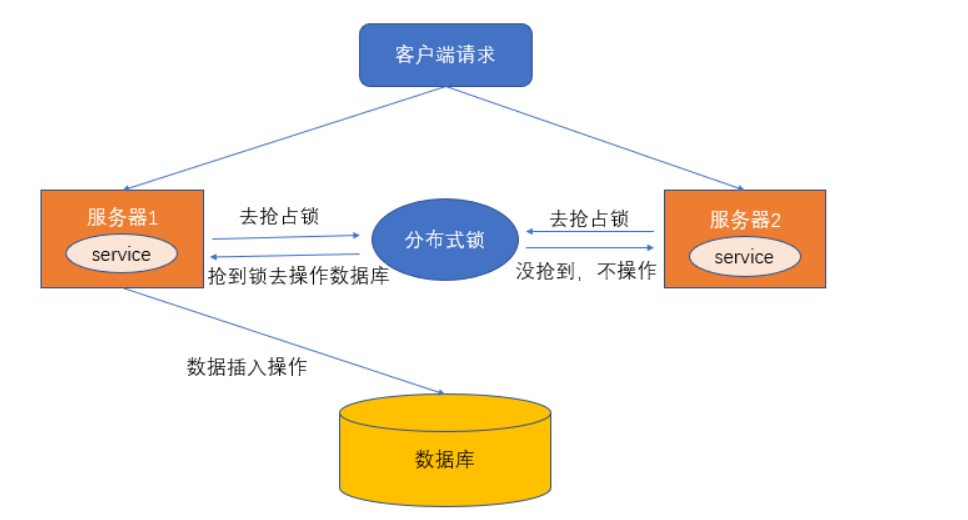](https://img-blog.csdnimg.cn/20210505213026273.png)

### 何为分布式锁？

**何为分布式锁？**

- 当在分布式模型下，数据只有一份（或有限制），此时需要利用锁的技术控制某一时刻修改数据的进程数。
- 用一个状态值表示锁，对锁的占用和释放通过状态值来标识。

**分布式锁的条件：**

- 互斥性。在任意时刻，只有一个客户端能持有锁。
- 不会发生死锁。即使有一个客户端在持有锁的期间崩溃而没有主动解锁，也能保证后续其他客户端能加锁。
- 具有容错性。只要大部分的 Redis 节点正常运行，客户端就可以加锁和解锁。
- 解铃还须系铃人。加锁和解锁必须是同一个客户端，客户端自己不能把别人加的锁给解了。

**分布式锁的实现：**

分布式锁的实现由很多种，文件锁、数据库、redis等等，比较多；分布式锁常见的多种实现方式：

1. 数据库悲观锁、
2. 数据库乐观锁；
3. 基于Redis的分布式锁；
4. 基于ZooKeeper的分布式锁。

在实践中，还是redis做分布式锁性能会高一些

------

### 数据库悲观锁

所谓悲观锁，悲观锁是对数据被的修改持悲观态度（认为数据在被修改的时候一定会存在并发问题），因此在整个数据处理过程中将数据锁定。

悲观锁的实现，往往依靠数据库提供的锁机制（也只有数据库层提供的锁机制才能真正保证数据访问的排他性，否则，即使在应用层中实现了加锁机制，也无法保证外部系统不会修改数据）。

> 数据库的行锁、表锁、排他锁等都是悲观锁，这里以行锁为例，进行介绍。以我们常用的MySQL为例，我们通过使用select...for update语句, 执行该语句后，会在表上加持行锁，一直到事务提交，解除行锁。

使用场景举例:

> 在秒杀案例中，生成订单和扣减库存的操作，可以通过商品记录的行锁，进行保护。们通过使用select...for update语句，在查询商品表库存时将该条记录加锁，待下单减库存完成后，再释放锁。

**示例的SQL如下：**


```
//0.开始事务
begin; 
	
//1.查询出商品信息

select stockCount from seckill_good where id=1 for update;

//2.根据商品信息生成订单

insert into seckill_order (id,good_id) values (null,1);

//3.修改商品stockCount减一

update seckill_good set stockCount=stockCount-1 where id=1;

//4.提交事务

commit;
```

以上，在对id = 1的记录修改前，先通过for update的方式进行加锁，然后再进行修改。这就是比较典型的悲观锁策略。

如果以上修改库存的代码发生并发，同一时间只有一个线程可以开启事务并获得id=1的锁，其它的事务必须等本次事务提交之后才能执行。这样我们可以保证当前的数据不会被其它事务修改。

> 我们使用select_for_update，另外一定要写在事务中.
>
> 注意：要使用悲观锁，我们必须关闭mysql数据库中自动提交的属性，命令set autocommit=0;即可关闭，因为MySQL默认使用autocommit模式，也就是说，当你执行一个更新操作后，MySQL会立刻将结果进行提交。

悲观锁的实现，往往依靠数据库提供的锁机制。在数据库中，悲观锁的流程如下：

- 在对记录进行修改前，先尝试为该记录加上排他锁（exclusive locking）。
- 如果加锁失败，说明该记录正在被修改，那么当前查询可能要等待或者抛出异常。具体响应方式由开发者根据实际需要决定。
- 如果成功加锁，那么就可以对记录做修改，事务完成后就会解锁了。
- 其间如果有其他事务对该记录做加锁的操作，都要等待当前事务解锁或直接抛出异常。

------

### 数据库乐观锁

> 使用乐观锁就不需要借助数据库的锁机制了。

乐观锁的概念中其实已经阐述了他的具体实现细节：主要就是两个步骤：冲突检测和数据更新。其实现方式有一种比较典型的就是**Compare and Swap(CAS)技术**。

CAS是项乐观锁技术，当多个线程尝试使用CAS同时更新同一个变量时，只有其中一个线程能更新变量的值，而其它线程都失败，**失败的线程并不会被挂起，而是被告知这次竞争中失败，并可以再次尝试。**

> CAS的实现中，在表中增加一个version字段，操作前先查询version信息，在数据提交时检查version字段是否被修改，如果没有被修改则进行提交，否则认为是过期数据。

比如前面的扣减库存问题，通过乐观锁可以实现如下：


```
//1.查询出商品信息
			
select stockCount, version from seckill_good where id=1;
			
//2.根据商品信息生成订单
insert into seckill_order (id,good_id) values (null,1);

//3.修改商品库存
update seckill_good set stockCount=stockCount-1, version = version+1 where id=1, version=version;
```

以上，我们在更新之前，先查询一下库存表中当前版本（version），然后在做update的时候，以version 作为一个修改条件。

当我们提交更新的时候，判断数据库表对应记录的当前version与第一次取出来的version进行比对，如果数据库表当前version与第一次取出来的version相等，则予以更新，否则认为是过期数据。

CAS 乐观锁有两个问题：

(1) CAS 存在一个比较重要的问题，即**ABA问题**. 解决的办法是version字段顺序递增。

(2) 乐观锁的方式，在高并发时，只有一个线程能执行成功，会造成大量的失败，这给用户的体验显然是很不好的。

------

### Zookeeper分布式锁

除了在数据库层面加分布式锁，通常还可以使用以下更高性能、更高可用的分布式锁：

- 分布式缓存（如redis）锁
- 分布式协调（如zookeeper）锁

> 有关zookeeper分布式锁的原理和实现，具体请参见下面的博客：
> [Zookeeper 分布式锁 （图解+秒懂+史上最全）](https://www.cnblogs.com/crazymakercircle/p/14504520.html)

或者阅读笔者的《Java高并发核心编程（卷1）》

[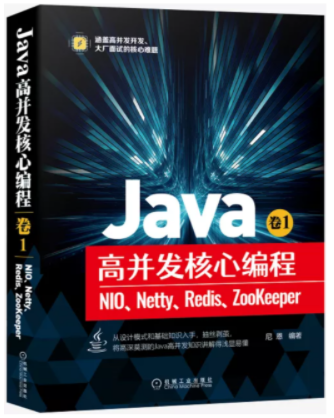](https://img-blog.csdnimg.cn/20210502102727419.png)

------

### Redis分布式锁

本文重点介绍Redis分布式锁，分为两个维度进行介绍：

（1）基于Jedis手工造轮子分布式锁

（2）介绍Redission 分布式锁的使用和原理。

### 分布式锁一般有如下的特点：

- 互斥性： 同一时刻只能有一个线程持有锁
- 可重入性： 同一节点上的同一个线程如果获取了锁之后能够再次获取锁
- 锁超时：和J.U.C中的锁一样支持锁超时，防止死锁
- 高性能和高可用： 加锁和解锁需要高效，同时也需要保证高可用，防止分布式锁失效
- 具备阻塞和非阻塞性：能够及时从阻塞状态中被唤醒

------

## 手工造轮子：基于Jedis 的API实现分布式锁

我们首先讲解 Jedis 普通分布式锁实现，并且是纯手工的模式，从最为基础的Redis命令开始。

只有充分了解与分布式锁相关的普通Redis命令，才能更好的了解高级的Redis分布式锁的实现，因为高级的分布式锁的实现完全基于普通Redis命令。

### Redis几种架构

Redis发展到现在，几种常见的部署架构有：

- 单机模式；
- 主从模式；
- 哨兵模式；
- 集群模式；

从分布式锁的角度来说， 无论是单机模式、主从模式、哨兵模式、集群模式，其原理都是类同的。 只是主从模式、哨兵模式、集群模式的更加的高可用、或者更加高并发。

> 所以，接下来先基于单机模式，基于Jedis手工造轮子实现自己的分布式锁。

### 首先看两个命令：

> Redis分布式锁机制，主要借助setnx和expire两个命令完成。

**setnx命令:**

SETNX 是SET if Not eXists的简写。将 key 的值设为 value，当且仅当 key 不存在; 若给定的 key 已经存在，则 SETNX 不做任何动作。

*下面为客户端使用示例：*


```
127.0.0.1:6379> set lock "unlock"
OK
127.0.0.1:6379> setnx lock "unlock"
(integer) 0
127.0.0.1:6379> setnx lock "lock"
(integer) 0
127.0.0.1:6379> 
```

**expire命令:**

expire命令为 key 设置生存时间，当 key 过期时(生存时间为 0 )，它会被自动删除. 其格式为：

> EXPIRE key seconds

*下面为客户端使用示例：*


```
127.0.0.1:6379> expire lock 10
(integer) 1
127.0.0.1:6379> ttl lock
8
```

### 基于Jedis API的分布式锁的总体流程：

通过Redis的setnx、expire命令可以实现简单的锁机制：

- key不存在时创建，并设置value和过期时间，返回值为1；成功获取到锁；
- 如key存在时直接返回0，抢锁失败；
- 持有锁的线程释放锁时，手动删除key； 或者过期时间到，key自动删除，锁释放。

线程调用setnx方法成功返回1认为加锁成功，其他线程要等到当前线程业务操作完成释放锁后，才能再次调用setnx加锁成功。

[](https://img-blog.csdnimg.cn/20210504234411261.png)

**以上简单redis分布式锁的问题：**

如果出现了这么一个问题：如果`setnx`是成功的，但是`expire`设置失败，一旦出现了释放锁失败，或者没有手工释放，那么这个锁永远被占用，其他线程永远也抢不到锁。

> 所以,需要保障setnx和expire两个操作的原子性，要么全部执行，要么全部不执行，二者不能分开。

解决的办法有两种：

- 使用set的命令时，同时设置过期时间，不再单独使用 expire命令
- 使用lua脚本，将加锁的命令放在lua脚本中原子性的执行

### 简单加锁：使用set的命令时，同时设置过期时间

使用set的命令时，同时设置过期时间的示例如下：


```
127.0.0.1:6379> set unlock "234" EX 100 NX
(nil)
127.0.0.1:6379> 
127.0.0.1:6379> set test "111" EX 100 NX
OK
```

这样就完美的解决了分布式锁的原子性； set 命令的完整格式：

> set key value [EX seconds] [PX milliseconds] [NX|XX]


```
EX seconds：设置失效时长，单位秒
PX milliseconds：设置失效时长，单位毫秒
NX：key不存在时设置value，成功返回OK，失败返回(nil)
XX：key存在时设置value，成功返回OK，失败返回(nil)
```

使用set命令实现加锁操作，先展示加锁的简单代码实习，再带大家慢慢解释为什么这样实现。

**加锁的简单代码实现**


```
package com.crazymaker.springcloud.standard.lock;


@Slf4j
@Data
@AllArgsConstructor
public class JedisCommandLock {

    private  RedisTemplate redisTemplate;

    private static final String LOCK_SUCCESS = "OK";
    private static final String SET_IF_NOT_EXIST = "NX";
    private static final String SET_WITH_EXPIRE_TIME = "PX";

    /**
     * 尝试获取分布式锁
     * @param jedis Redis客户端
     * @param lockKey 锁
     * @param requestId 请求标识
     * @param expireTime 超期时间
     * @return 是否获取成功
     */
    public static   boolean tryGetDistributedLock(Jedis jedis, String lockKey, String requestId, int expireTime) {

        String result = jedis.set(lockKey, requestId, SET_IF_NOT_EXIST, SET_WITH_EXPIRE_TIME, expireTime);

        if (LOCK_SUCCESS.equals(result)) {
            return true;
        }
        return false;

    }

  

}
```

可以看到，我们加锁用到了**Jedis的set Api**：

> ```
> jedis.set(String key, String value, String nxxx, String expx, int time)
> ```

**这个set()方法一共有五个形参：**

- 第一个为key，我们使用key来当锁，因为key是唯一的。

- 第二个为value，我们传的是requestId，很多童鞋可能不明白，有key作为锁不就够了吗，为什么还要用到value？原因就是我们在上面讲到可靠性时，分布式锁要满足第四个条件解铃还须系铃人，通过给value赋值为requestId，我们就知道这把锁是哪个请求加的了，在解锁的时候就可以有依据。

  > requestId可以使用`UUID.randomUUID().toString()`方法生成。

- 第三个为nxxx，这个参数我们填的是NX，意思是SET IF NOT EXIST，即当key不存在时，我们进行set操作；若key已经存在，则不做任何操作；

- 第四个为expx，这个参数我们传的是PX，意思是我们要给这个key加一个过期的设置，具体时间由第五个参数决定。

- 第五个为time，与第四个参数相呼应，代表key的过期时间。

**总的来说，执行上面的set()方法就只会导致两种结果：**

> 1. 当前没有锁（key不存在），那么就进行加锁操作，并对锁设置个有效期，同时value表示加锁的客户端。
> 2. 已有锁存在，不做任何操作。

心细的童鞋就会发现了，我们的加锁代码满足前面描述的四个条件中的三个。

- 首先，set()加入了NX参数，可以保证如果已有key存在，则函数不会调用成功，也就是只有一个客户端能持有锁，满足互斥性。
- 其次，由于我们对锁设置了过期时间，即使锁的持有者后续发生崩溃而没有解锁，锁也会因为到了过期时间而自动解锁（即key被删除），不会被永远占用（而发生死锁）。
- 最后，因为我们将value赋值为requestId，代表加锁的客户端请求标识，那么在客户端在解锁的时候就可以进行校验是否是同一个客户端。
- 由于我们只考虑Redis单机部署的场景，所以容错性我们暂不考虑。

### 基于Jedis 的API实现简单解锁代码

还是先展示代码，再带大家慢慢解释为什么这样实现。

**解锁的简单代码实现**：


```
package com.crazymaker.springcloud.standard.lock;


@Slf4j
@Data
@AllArgsConstructor
public class JedisCommandLock {

  

    private static final Long RELEASE_SUCCESS = 1L;

    /**
     * 释放分布式锁
     * @param jedis Redis客户端
     * @param lockKey 锁
     * @param requestId 请求标识
     * @return 是否释放成功
     */
    public static boolean releaseDistributedLock(Jedis jedis, String lockKey, String requestId) {

        String script = "if redis.call('get', KEYS[1]) == ARGV[1] then return redis.call('del', KEYS[1]) else return 0 end";
        Object result = jedis.eval(script, Collections.singletonList(lockKey), Collections.singletonList(requestId));

        if (RELEASE_SUCCESS.equals(result)) {
            return true;
        }
        return false;

    }

}
```

那么这段Lua代码的功能是什么呢？

其实很简单，首先获取锁对应的value值，检查是否与requestId相等，如果相等则删除锁（解锁）。

第一行代码，我们写了一个简单的Lua脚本代码。

第二行代码，我们将Lua代码传到`jedis.eval()`方法里，并使参数KEYS[1]赋值为lockKey，ARGV[1]赋值为requestId。eval()方法是将Lua代码交给Redis服务端执行。

> **那么为什么要使用Lua语言来实现呢？**
>
> 因为要确保上述操作是原子性的。那么为什么执行eval()方法可以确保原子性，源于Redis的特性.
>
> 简单来说，就是在eval命令执行Lua代码的时候，Lua代码将被当成一个命令去执行，并且直到eval命令执行完成，Redis才会执行其他命

**错误示例1**

最常见的解锁代码就是直接使用 jedis.del() 方法删除锁，这种不先判断锁的拥有者而直接解锁的方式，会导致任何客户端都可以随时进行解锁，即使这把锁不是它的。


```
public static void wrongReleaseLock1(Jedis jedis, String lockKey) {
    jedis.del(lockKey);
}
```

**错误示例2**

这种解锁代码乍一看也是没问题，甚至我之前也差点这样实现，与正确姿势差不多，唯一区别的是分成两条命令去执行，代码如下：


```
public static void wrongReleaseLock2(Jedis jedis, String lockKey, String requestId) {
        
    // 判断加锁与解锁是不是同一个客户端
    if (requestId.equals(jedis.get(lockKey))) {
        // 若在此时，这把锁突然不是这个客户端的，则会误解锁
        jedis.del(lockKey);
    }

}
```

------

## 再造轮子：基于Lua脚本实现分布式锁

### lua脚本的好处

前面提到，在redis中执行lua脚本，有如下的好处：

> **那么为什么要使用Lua语言来实现呢？**
>
> 因为要确保上述操作是原子性的。那么为什么执行eval()方法可以确保原子性，源于Redis的特性.
>
> 简单来说，就是在eval命令执行Lua代码的时候，Lua代码将被当成一个命令去执行，并且直到eval命令执行完成，Redis才会执行其他命

所以：

> 大部分的开源框架（如 redission）中的分布式锁组件，都是用纯lua脚本实现的。

题外话： lua脚本是**高并发、高性能的必备脚本语言**

有关lua的详细介绍，请参见以下书籍：

[](https://img-blog.csdnimg.cn/20210502103128529.png)

那么，我们也来模拟一下

### 基于纯Lua脚本的分布式锁的执行流程

加锁和删除锁的操作，使用纯lua进行封装，保障其执行时候的原子性。

基于纯Lua脚本实现分布式锁的执行流程，大致如下：

[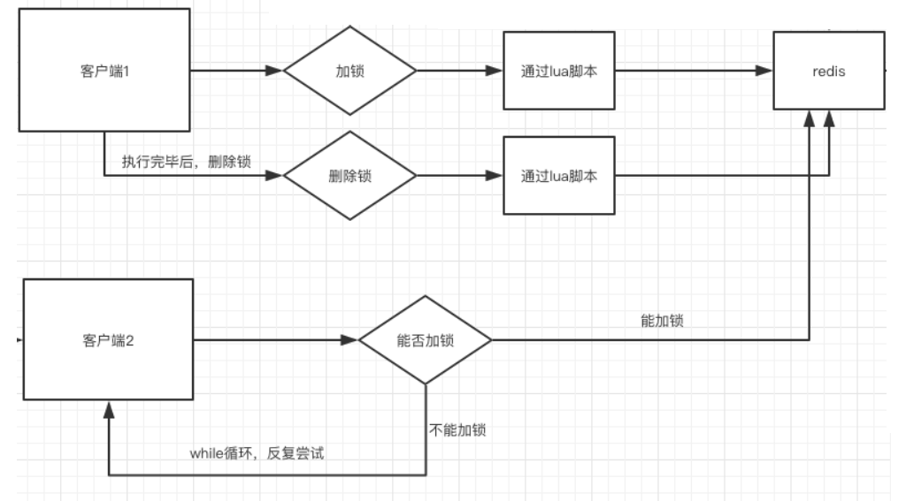](https://img-blog.csdnimg.cn/20210418084432419.png)

### 加锁的Lua脚本： lock.lua


```
--- -1 failed
--- 1 success
---
local key = KEYS[1]
local requestId = KEYS[2]
local ttl = tonumber(KEYS[3])
local result = redis.call('setnx', key, requestId)
if result == 1 then
    --PEXPIRE:以毫秒的形式指定过期时间
    redis.call('pexpire', key, ttl)
else
    result = -1;
    -- 如果value相同，则认为是同一个线程的请求，则认为重入锁
    local value = redis.call('get', key)
    if (value == requestId) then
        result = 1;
        redis.call('pexpire', key, ttl)
    end
end
--  如果获取锁成功，则返回 1
return result
```

### 解锁的Lua脚本： unlock.lua：


```
--- -1 failed
--- 1 success

-- unlock key
local key = KEYS[1]
local requestId = KEYS[2]
local value = redis.call('get', key)
if value == requestId then
    redis.call('del', key);
    return 1;
end
return -1
```

### 两个文件，放在资源文件夹下备用：

[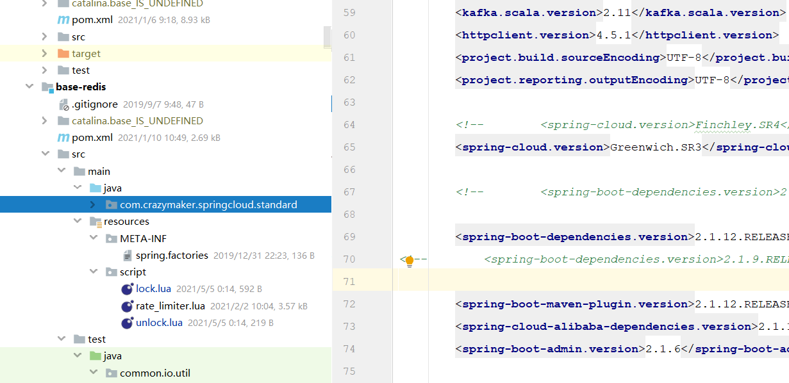](https://img-blog.csdnimg.cn/20210505094800359.png)

## 在Java中调用lua脚本，完成加锁操作


```
package com.crazymaker.springcloud.standard.lock;

import com.crazymaker.springcloud.common.exception.BusinessException;
import com.crazymaker.springcloud.common.util.IOUtil;
import com.crazymaker.springcloud.standard.context.SpringContextUtil;
import com.crazymaker.springcloud.standard.lua.ScriptHolder;
import lombok.extern.slf4j.Slf4j;
import org.apache.commons.lang3.StringUtils;
import org.springframework.data.redis.core.RedisCallback;
import org.springframework.data.redis.core.RedisTemplate;
import org.springframework.data.redis.core.script.DefaultRedisScript;
import org.springframework.data.redis.core.script.RedisScript;

import java.util.ArrayList;
import java.util.List;

@Slf4j
public class InnerLock {

    private RedisTemplate redisTemplate;


    public static final Long LOCKED = Long.valueOf(1);
    public static final Long UNLOCKED = Long.valueOf(1);
    public static final int EXPIRE = 2000;

    String key;
    String requestId;  // lockValue 锁的value ,代表线程的uuid

    /**
     * 默认为2000ms
     */
    long expire = 2000L;


    private volatile boolean isLocked = false;
    private RedisScript lockScript;
    private RedisScript unLockScript;


    public InnerLock(String lockKey, String requestId) {
        this.key = lockKey;
        this.requestId = requestId;
        lockScript = ScriptHolder.getLockScript();
        unLockScript = ScriptHolder.getUnlockScript();
    }

    /**
     * 抢夺锁
     */
    public void lock() {
        if (null == key) {
            return;
        }
        try {
            List<String> redisKeys = new ArrayList<>();
            redisKeys.add(key);
            redisKeys.add(requestId);
            redisKeys.add(String.valueOf(expire));

            Long res = (Long) getRedisTemplate().execute(lockScript, redisKeys);
            isLocked = false;
        } catch (Exception e) {
            e.printStackTrace();
            throw BusinessException.builder().errMsg("抢锁失败").build();
        }
    }

    /**
     * 有返回值的抢夺锁
     *
     * @param millisToWait
     */
    public boolean lock(Long millisToWait) {
        if (null == key) {
            return false;
        }
        try {
            List<String> redisKeys = new ArrayList<>();
            redisKeys.add(key);
            redisKeys.add(requestId);
            redisKeys.add(String.valueOf(millisToWait));
            Long res = (Long) getRedisTemplate().execute(lockScript, redisKeys);

            return res != null && res.equals(LOCKED);
        } catch (Exception e) {
            e.printStackTrace();
            throw BusinessException.builder().errMsg("抢锁失败").build();
        }

    }

    //释放锁
    public void unlock() {
        if (key == null || requestId == null) {
            return;
        }
        try {
            List<String> redisKeys = new ArrayList<>();
            redisKeys.add(key);
            redisKeys.add(requestId);
            Long res = (Long) getRedisTemplate().execute(unLockScript, redisKeys);

//            boolean unlocked = res != null && res.equals(UNLOCKED);


        } catch (Exception e) {
            e.printStackTrace();
            throw BusinessException.builder().errMsg("释放锁失败").build();

        }
    }

    private RedisTemplate getRedisTemplate() {
        if(null==redisTemplate)
        {
            redisTemplate= (RedisTemplate) SpringContextUtil.getBean("stringRedisTemplate");
        }
        return redisTemplate;
    }
}
```

### 在Java中调用lua脚本，完成加锁操作

下一步，实现Lock接口, 完成JedisLock的分布式锁。

其加锁操作，通过调用 lock.lua脚本完成，代码如下：


```
package com.crazymaker.springcloud.standard.lock;

import com.crazymaker.springcloud.common.exception.BusinessException;
import com.crazymaker.springcloud.common.util.ThreadUtil;
import lombok.AllArgsConstructor;
import lombok.Data;
import lombok.extern.slf4j.Slf4j;
import org.springframework.data.redis.core.RedisTemplate;
import org.springframework.data.redis.core.script.RedisScript;

import java.util.ArrayList;
import java.util.List;
import java.util.concurrent.TimeUnit;
import java.util.concurrent.locks.Condition;
import java.util.concurrent.locks.Lock;

@Slf4j
@Data
@AllArgsConstructor
public class JedisLock implements Lock {

    private RedisTemplate redisTemplate;

    RedisScript<Long> lockScript = null;
    RedisScript<Long> unLockScript = null;

    public static final int DEFAULT_TIMEOUT = 2000;
    public static final Long LOCKED = Long.valueOf(1);
    public static final Long UNLOCKED = Long.valueOf(1);
    public static final Long WAIT_GAT = Long.valueOf(200);
    public static final int EXPIRE = 2000;


    String key;
    String lockValue;  // lockValue 锁的value ,代表线程的uuid

    /**
     * 默认为2000ms
     */
    long expire = 2000L;

    public JedisLock(String lockKey, String lockValue) {
        this.key = lockKey;
        this.lockValue = lockValue;
    }

    private volatile boolean isLocked = false;

    private Thread thread;

    /**
     * 获取一个分布式锁 , 超时则返回失败
     *
     * @return 获锁成功 - true | 获锁失败 - false
     */
    @Override
    public boolean tryLock(long time, TimeUnit unit) throws InterruptedException {

        //本地可重入
        if (isLocked && thread == Thread.currentThread()) {
            return true;
        }
        expire = unit != null ? unit.toMillis(time) : DEFAULT_TIMEOUT;
        long startMillis = System.currentTimeMillis();
        Long millisToWait = expire;

        boolean localLocked = false;

        int turn = 1;
        while (!localLocked) {

            localLocked = this.lockInner(expire);
            if (!localLocked) {
                millisToWait = millisToWait - (System.currentTimeMillis() - startMillis);
                startMillis = System.currentTimeMillis();
                if (millisToWait > 0L) {
                    /**
                     * 还没有超时
                     */
                    ThreadUtil.sleepMilliSeconds(WAIT_GAT);
                    log.info("睡眠一下，重新开始，turn:{},剩余时间：{}", turn++, millisToWait);
                } else {
                    log.info("抢锁超时");
                    return false;
                }
            } else {
                isLocked = true;
                localLocked = true;
            }
        }
        return isLocked;
    }


  
    /**
     * 有返回值的抢夺锁
     *
     * @param millisToWait
     */
    public boolean lockInner(Long millisToWait) {
        if (null == key) {
            return false;
        }
        try {
            List<String> redisKeys = new ArrayList<>();
            redisKeys.add(key);
            redisKeys.add(lockValue);
            redisKeys.add(String.valueOf(millisToWait));
            Long res = (Long) redisTemplate.execute(lockScript, redisKeys);

            return res != null && res.equals(LOCKED);
        } catch (Exception e) {
            e.printStackTrace();
            throw BusinessException.builder().errMsg("抢锁失败").build();
        }

    }

   
}
```

### 实现JUC的Lock显示锁接口，实现一个简单的分布式锁

其解锁操作，通过调用unlock.lua脚本完成，代码如下：


```
package com.crazymaker.springcloud.standard.lock;

import com.crazymaker.springcloud.common.exception.BusinessException;
import com.crazymaker.springcloud.common.util.ThreadUtil;
import lombok.AllArgsConstructor;
import lombok.Data;
import lombok.extern.slf4j.Slf4j;
import org.springframework.data.redis.core.RedisTemplate;
import org.springframework.data.redis.core.script.RedisScript;

import java.util.ArrayList;
import java.util.List;
import java.util.concurrent.TimeUnit;
import java.util.concurrent.locks.Condition;
import java.util.concurrent.locks.Lock;

@Slf4j
@Data
@AllArgsConstructor
public class JedisLock implements Lock {

    private RedisTemplate redisTemplate;

    RedisScript<Long> lockScript = null;
    RedisScript<Long> unLockScript = null;

    //释放锁
    @Override
    public void unlock() {
        if (key == null || requestId == null) {
            return;
        }
        try {
            List<String> redisKeys = new ArrayList<>();
            redisKeys.add(key);
            redisKeys.add(requestId);
            Long res = (Long) redisTemplate.execute(unLockScript, redisKeys);

        } catch (Exception e) {
            e.printStackTrace();
            throw BusinessException.builder().errMsg("释放锁失败").build();

        }
    }
  
   
}
```

### 编写RedisLockService用于管理JedisLock

编写个分布式锁服务，用于加载lua脚本，创建 分布式锁，代码如下：


```
package com.crazymaker.springcloud.standard.lock;

import com.crazymaker.springcloud.common.util.IOUtil;
import lombok.Data;
import lombok.extern.slf4j.Slf4j;
import org.apache.commons.lang3.StringUtils;
import org.springframework.data.redis.core.RedisTemplate;
import org.springframework.data.redis.core.script.DefaultRedisScript;
import org.springframework.data.redis.core.script.RedisScript;

import java.util.ArrayList;
import java.util.List;
import java.util.concurrent.TimeUnit;
import java.util.concurrent.locks.Lock;

@Slf4j
@Data
public class RedisLockService
{

    private RedisTemplate redisTemplate;

    static String lockLua = "script/lock.lua";
    static String unLockLua = "script/unlock.lua";
    static RedisScript<Long> lockScript = null;
    static RedisScript<Long> unLockScript = null;
    {
        String script = IOUtil.loadJarFile(RedisLockService.class.getClassLoader(),lockLua);
//        String script = FileUtil.readString(lockLua, Charset.forName("UTF-8" ));
        if(StringUtils.isEmpty(script))
        {
            log.error("lua load failed:"+lockLua);
        }

        lockScript = new DefaultRedisScript<>(script, Long.class);

//        script = FileUtil.readString(unLockLua, Charset.forName("UTF-8" ));
        script =  IOUtil.loadJarFile(RedisLockService.class.getClassLoader(),unLockLua);
        if(StringUtils.isEmpty(script))
        {
            log.error("lua load failed:"+unLockLua);
        }
        unLockScript = new DefaultRedisScript<>(script, Long.class);

    }

    public RedisLockService(RedisTemplate redisTemplate)
    {
        this.redisTemplate = redisTemplate;
    }


    public Lock getLock(String lockKey, String lockValue) {
        JedisLock lock=new JedisLock(lockKey,lockValue);
        lock.setRedisTemplate(redisTemplate);
        lock.setLockScript(lockScript);
        lock.setUnLockScript(unLockScript);
        return lock;
    }
}
```

### 测试用例

接下来，终于可以上测试用例了


```
package com.crazymaker.springcloud.lock;

@Slf4j
@RunWith(SpringRunner.class)
@SpringBootTest(classes = {DemoCloudApplication.class})
// 指定启动类
public class RedisLockTest {

    @Resource
    RedisLockService redisLockService;

    private ExecutorService pool = Executors.newFixedThreadPool(10);

    @Test
    public void testLock() {
        int threads = 10;
        final int[] count = {0};
        CountDownLatch countDownLatch = new CountDownLatch(threads);
        long start = System.currentTimeMillis();
        for (int i = 0; i < threads; i++) {
            pool.submit(() ->
            {
                String lockValue = UUID.randomUUID().toString();

                try {
                    Lock lock = redisLockService.getLock("test:lock:1", lockValue);
                    boolean locked = lock.tryLock(10, TimeUnit.SECONDS);

                    if (locked) {
                        for (int j = 0; j < 1000; j++) {
                            count[0]++;
                        }

                        log.info("count = " + count[0]);
                        lock.unlock();
                    } else {
                        System.out.println("抢锁失败");
                    }


                } catch (Exception e) {
                    e.printStackTrace();
                }
                countDownLatch.countDown();
            });
        }
        try {
            countDownLatch.await();
        } catch (InterruptedException e) {
            e.printStackTrace();
        }
        System.out.println("10个线程每个累加1000为： = " + count[0]);
        //输出统计结果
        float time = System.currentTimeMillis() - start;

        System.out.println("运行的时长为(ms)：" + time);
        System.out.println("每一次执行的时长为(ms)：" + time / count[0]);

    }

}
```

执行用例，结果如下：


```
2021-05-04 23:02:11.900  INFO 22120 --- [pool-1-thread-7] c.c.springcloud.lock.RedisLockTest       LN:50 count = 6000
2021-05-04 23:02:11.901  INFO 22120 --- [pool-1-thread-1] c.c.springcloud.standard.lock.JedisLock  LN:81 睡眠一下，重新开始，turn:3,剩余时间：9585
2021-05-04 23:02:11.902  INFO 22120 --- [pool-1-thread-1] c.c.springcloud.lock.RedisLockTest       LN:50 count = 7000
2021-05-04 23:02:12.100  INFO 22120 --- [pool-1-thread-4] c.c.springcloud.standard.lock.JedisLock  LN:81 睡眠一下，重新开始，turn:3,剩余时间：9586
2021-05-04 23:02:12.101  INFO 22120 --- [pool-1-thread-5] c.c.springcloud.standard.lock.JedisLock  LN:81 睡眠一下，重新开始，turn:3,剩余时间：9585
2021-05-04 23:02:12.101  INFO 22120 --- [pool-1-thread-8] c.c.springcloud.standard.lock.JedisLock  LN:81 睡眠一下，重新开始，turn:3,剩余时间：9585
2021-05-04 23:02:12.101  INFO 22120 --- [pool-1-thread-4] c.c.springcloud.lock.RedisLockTest       LN:50 count = 8000
2021-05-04 23:02:12.102  INFO 22120 --- [pool-1-thread-8] c.c.springcloud.lock.RedisLockTest       LN:50 count = 9000
2021-05-04 23:02:12.304  INFO 22120 --- [pool-1-thread-5] c.c.springcloud.standard.lock.JedisLock  LN:81 睡眠一下，重新开始，turn:4,剩余时间：9383
2021-05-04 23:02:12.307  INFO 22120 --- [pool-1-thread-5] c.c.springcloud.lock.RedisLockTest       LN:50 count = 10000
10个线程每个累加1000为： = 10000
运行的时长为(ms)：827.0
每一次执行的时长为(ms)：0.0827
```

## STW导致的锁过期问题

下面有一个简单的使用锁的例子，在10秒内占着锁：


```
  //写数据到文件
function writeData(filename, data) {
    boolean locked = lock.tryLock(10, TimeUnit.SECONDS);
    if (!locked) {
        throw 'Failed to acquire lock';
    }

    try {
        //将数据写到文件
        var file = storage.readFile(filename);
        var updated = updateContents(file, data);
        storage.writeFile(filename, updated);
    } finally {
        lock.unlock();
    }
}
```

> 问题是：如果在写文件过程中，发生了 fullGC，并且其时间跨度较长， 超过了10秒， 那么，分布式就自动释放了。

在此过程中，client2 抢到锁，写了文件。

client1 的fullGC完成后，也继续写文件，**注意，此时client1 的并没有占用锁**，此时写入会导致文件数据错乱，发生线程安全问题。

这就是STW导致的锁过期问题。

**STW导致的锁过期问题，具体如下图所示：**

[](https://img-blog.csdnimg.cn/20210418080111945.png)

> STW导致的锁过期问题,大概的解决方案，有：
>
> 1： 模拟CAS乐观锁的方式，增加版本号
>
> 2：**watch dog自动延期机制**

**1： 模拟CAS乐观锁的方式，增加版本号（如下图中的token）**

[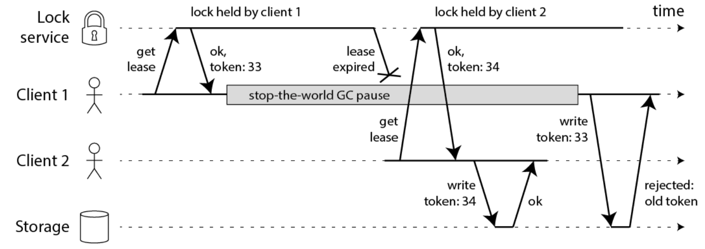](https://img-blog.csdnimg.cn/20210418080524249.png)

此方案如果要实现，需要调整业务逻辑，与之配合，所以会入侵代码。

**2：watch dog自动延期机制**

客户端1加锁的锁key默认生存时间才30秒，如果超过了30秒，客户端1还想一直持有这把锁，怎么办呢？

简单！只要客户端1一旦加锁成功，就会启动一个watch dog看门狗，**他是一个后台线程，会每隔10秒检查一下**，如果客户端1还持有锁key，那么就会不断的延长锁key的生存时间。

> redission，采用的就是这种方案， 此方案不会入侵业务代码。

注意：

单机版的watch dog 并不能解决 STW的过期问题， 需要分布式版本的 watch dog， 独立的看门狗服务。

锁删除之后， 取消看门狗服务的 对应的key记录， 当然，这就使得系统变得复杂， 还要保证看门狗服务的高并发、高可用、数据一致性的问题。

### 为啥推荐使用Redission

作为 Java 开发人员，我们若想在程序中集成 Redis，必须使用 Redis 的第三方库。目前大家使用的最多的第三方库是jedis。

**和SpringCloud gateway一样，Redisson也是基于Netty实现的，是更高性能的第三方库**。 所以，这里推荐大家使用Redission替代 jedis。

> 在使用Redission之前，建议大家先掌握Netty的知识。
>
> 推荐大家阅读被很多小伙伴评价为**史上最为易懂的NIO、Netty书籍：**《Java高并发核心编程（卷1）》
>
> [](https://img-blog.csdnimg.cn/20210502102727419.png)

------

## Redisson简介

Redisson是一个在Redis的基础上实现的Java驻内存数据网格（In-Memory Data Grid）。它不仅提供了一系列的分布式的Java常用对象，还实现了可重入锁（Reentrant Lock）、公平锁（Fair Lock、联锁（MultiLock）、 红锁（RedLock）、 读写锁（ReadWriteLock）等，还提供了许多分布式服务。

[](https://img-blog.csdnimg.cn/20190324222104806.jpg)

Redisson提供了使用Redis的最简单和最便捷的方法。Redisson的宗旨是促进使用者对Redis的关注分离（Separation of Concern），从而让使用者能够将精力更集中地放在处理业务逻辑上。

[](https://img-blog.csdnimg.cn/20190324222130834.jpg)

### Redisson与Jedis的对比

1.概况对比

Jedis是Redis的java实现的客户端，其API提供了比较全面的的Redis命令的支持，Redisson实现了分布式和可扩展的的java数据结构，和Jedis相比，功能较为简单，不支持字符串操作，不支持排序，事物，管道，分区等Redis特性。Redisson的宗旨是促进使用者对Redis的关注分离，从而让使用者能够将精力更集中的放在处理业务逻辑上。

2.可伸缩性

Jedis使用阻塞的I/O，且其方法调用都是同步的，程序流程要等到sockets处理完I/O才能执行，不支持异步，Jedis客户端实例不是线程安全的，所以需要通过连接池来使用Jedis。

Redisson使用非阻塞的I/O和基于Netty框架的事件驱动的通信层，其方法调用时异步的。Redisson的API是线程安全的，所以操作单个Redisson连接来完成各种操作。

3.第三方框架整合

Redisson在Redis的基础上实现了java缓存标准规范；Redisson还提供了Spring Session回话管理器的实现。

### Redission 的源码地址：

官网： https://redisson.org/

github： https://github.com/redisson/redisson#quick-start

[](https://img-blog.csdnimg.cn/20190324222309705.jpg)

### 特性 & 功能：

- 支持 Redis 单节点（single）模式、哨兵（sentinel）模式、主从（Master/Slave）模式以及集群（Redis Cluster）模式
- 程序接口调用方式采用异步执行和异步流执行两种方式
- 数据序列化，Redisson 的对象编码类是用于将对象进行序列化和反序列化，以实现对该对象在 Redis 里的读取和存储
- 单个集合数据分片，在集群模式下，Redisson 为单个 Redis 集合类型提供了自动分片的功能
- 提供多种分布式对象，如：Object Bucket，Bitset，AtomicLong，Bloom Filter 和 HyperLogLog 等
- 提供丰富的分布式集合，如：Map，Multimap，Set，SortedSet，List，Deque，Queue 等
- 分布式锁和同步器的实现，可重入锁（Reentrant Lock），公平锁（Fair Lock），联锁（MultiLock），红锁（Red Lock），信号量（Semaphonre），可过期性信号锁（PermitExpirableSemaphore）等
- 提供先进的分布式服务，如分布式远程服务（Remote Service），分布式实时对象（Live Object）服务，分布式执行服务（Executor Service），分布式调度任务服务（Schedule Service）和分布式映射归纳服务（MapReduce）

------

## Redisson的使用

### 如何安装 Redisson

安装 Redisson 最便捷的方法是使用 Maven 或者 Gradle：

•Maven


```
<dependency>	
    <groupId>org.redisson</groupId>	
    <artifactId>redisson</artifactId>	
    <version>3.11.4</version>	
</dependency>
```

•Gradle


```
compile group: 'org.redisson', name: 'redisson', version: '3.11.4'
```

目前 Redisson 最新版是 3.11.4，当然你也可以通过搜索 Maven 中央仓库 mvnrepository[1] 来找到 Redisson 的各种版本。

### 获取RedissonClient对象

RedissonClient有多种模式，主要的模式有：

- 单节点模式
- 哨兵模式
- 主从模式
- 集群模式

> 首先介绍单节点模式。

单节点模式的程序化配置方法，大致如下：


```
Config config = new Config();
config.useSingleServer().setAddress("redis://myredisserver:6379");
RedissonClient redisson = Redisson.create(config);xxxxxxxxxx Config config = new Config();config.useSingleServer().setAddress("redis://myredisserver:6379");RedissonClient redisson = Redisson.create(config);// connects to 127.0.0.1:6379 by defaultRedissonClient redisson = Redisson.create();
```


```
SingleServerConfig singleConfig = config.useSingleServer();
```

**SingleServerConfig类的设置参数如下**：

> #### address（节点地址）
>
> 可以通过`host:port`的格式来指定节点地址。
>
> #### subscriptionConnectionMinimumIdleSize（发布和订阅连接的最小空闲连接数）
>
> 默认值：`1`
>
> 用于发布和订阅连接的最小保持连接数（长连接）。Redisson内部经常通过发布和订阅来实现许多功能。长期保持一定数量的发布订阅连接是必须的。
>
> #### subscriptionConnectionPoolSize（发布和订阅连接池大小）
>
> 默认值：`50`
>
> 用于发布和订阅连接的连接池最大容量。连接池的连接数量自动弹性伸缩。
>
> #### connectionMinimumIdleSize（最小空闲连接数）
>
> 默认值：`32`
>
> 最小保持连接数（长连接）。长期保持一定数量的连接有利于提高瞬时写入反应速度。
>
> #### connectionPoolSize（连接池大小）
>
> 默认值：`64`
>
> 连接池最大容量。连接池的连接数量自动弹性伸缩。
>
> #### dnsMonitoring（是否启用DNS监测）
>
> 默认值：`false`
>
> 在启用该功能以后，Redisson将会监测DNS的变化情况。
>
> #### dnsMonitoringInterval（DNS监测时间间隔，单位：毫秒）
>
> 默认值：`5000`
>
> 监测DNS的变化情况的时间间隔。
>
> #### idleConnectionTimeout（连接空闲超时，单位：毫秒）
>
> 默认值：`10000`
>
> 如果当前连接池里的连接数量超过了最小空闲连接数，而同时有连接空闲时间超过了该数值，那么这些连接将会自动被关闭，并从连接池里去掉。时间单位是毫秒。
>
> #### connectTimeout（连接超时，单位：毫秒）
>
> 默认值：`10000`
>
> 同节点建立连接时的等待超时。时间单位是毫秒。
>
> #### timeout（命令等待超时，单位：毫秒）
>
> 默认值：`3000`
>
> 等待节点回复命令的时间。该时间从命令发送成功时开始计时。
>
> #### retryAttempts（命令失败重试次数）
>
> 默认值：`3`
>
> 如果尝试达到 **retryAttempts（命令失败重试次数）** 仍然不能将命令发送至某个指定的节点时，将抛出错误。如果尝试在此限制之内发送成功，则开始启用 **timeout（命令等待超时）** 计时。
>
> #### retryInterval（命令重试发送时间间隔，单位：毫秒）
>
> 默认值：`1500`
>
> 在一条命令发送失败以后，等待重试发送的时间间隔。时间单位是毫秒。
>
> #### reconnectionTimeout（重新连接时间间隔，单位：毫秒）
>
> 默认值：`3000`
>
> 当与某个节点的连接断开时，等待与其重新建立连接的时间间隔。时间单位是毫秒。
>
> #### failedAttempts（执行失败最大次数）
>
> 默认值：`3`
>
> 在某个节点执行相同或不同命令时，**连续** 失败 **failedAttempts（执行失败最大次数）** 时，该节点将被从可用节点列表里清除，直到 **reconnectionTimeout（重新连接时间间隔）** 超时以后再次尝试。
>
> #### database（数据库编号）
>
> 默认值：`0`
>
> 尝试连接的数据库编号。
>
> #### password（密码）
>
> 默认值：`null`
>
> 用于节点身份验证的密码。
>
> #### subscriptionsPerConnection（单个连接最大订阅数量）
>
> 默认值：`5`
>
> 每个连接的最大订阅数量。
>
> #### clientName（客户端名称）
>
> 默认值：`null`
>
> 在Redis节点里显示的客户端名称。
>
> #### sslEnableEndpointIdentification（启用SSL终端识别）
>
> 默认值：`true`
>
> 开启SSL终端识别能力。
>
> #### sslProvider（SSL实现方式）
>
> 默认值：`JDK`
>
> 确定采用哪种方式（JDK或OPENSSL）来实现SSL连接。
>
> #### sslTruststore（SSL信任证书库路径）
>
> 默认值：`null`
>
> 指定SSL信任证书库的路径。
>
> #### sslTruststorePassword（SSL信任证书库密码）
>
> 默认值：`null`
>
> 指定SSL信任证书库的密码。
>
> #### sslKeystore（SSL钥匙库路径）
>
> 默认值：`null`
>
> 指定SSL钥匙库的路径。
>
> #### sslKeystorePassword（SSL钥匙库密码）
>
> 默认值：`null`
>
> 指定SSL钥匙库的密码。

### SpringBoot整合Redisson

Redisson有多种模式，首先介绍单机模式的整合。

#### 一、导入Maven依赖


```
<!-- redisson-springboot -->
   <dependency>
       <groupId>org.redisson</groupId>
       <artifactId>redisson-spring-boot-starter</artifactId>
       <version>3.11.4</version>
   </dependency>
```

#### 二、核心配置文件


```
spring:
  redis:
    host: 127.0.0.1
    port: 6379
    database: 0
    timeout: 5000
```

#### 三、添加配置类

RedissonConfig.java


```
import org.redisson.Redisson;
import org.redisson.api.RedissonClient;
import org.redisson.config.Config;
import org.springframework.beans.factory.annotation.Autowired;
import org.springframework.boot.autoconfigure.data.redis.RedisProperties;
import org.springframework.boot.context.properties.EnableConfigurationProperties;
import org.springframework.context.annotation.Bean;
import org.springframework.context.annotation.Configuration;


@Configuration
public class RedissonConfig {

    @Autowired
    private RedisProperties redisProperties;

    @Bean
    public RedissonClient redissonClient() {
        Config config = new Config();
        String redisUrl = String.format("redis://%s:%s", redisProperties.getHost() + "", redisProperties.getPort() + "");
        config.useSingleServer().setAddress(redisUrl).setPassword(redisProperties.getPassword());
        config.useSingleServer().setDatabase(3);
        return Redisson.create(config);
    }

}
```

### 

#### 自定义starter

由于redission可以有多种模式，处于学习的目的，将多种模式封装成一个start，可以学习一下starter的制作。

[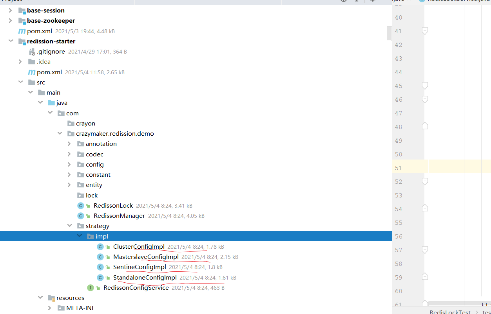](https://img-blog.csdnimg.cn/20210505112446350.png)

封装一个RedissonManager，通过策略模式，根据不同的配置类型，创建 RedissionConfig实例，然后创建RedissionClient对象。

[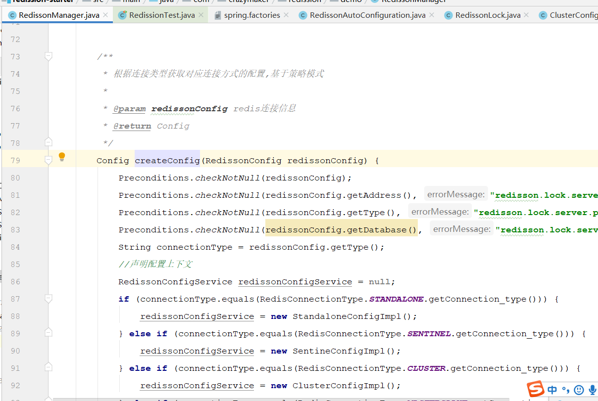](https://img-blog.csdnimg.cn/20210505113016829.png)

### 使用RBucket操作分布式对象

Redission模拟了Java的面向对象编程思想，可以简单理解为一切皆为对象。

**每一个 Redisson 对象 实现了[RObject](https://static.javadoc.io/org.redisson/redisson/latest/org/redisson/api/RObject.html) and [RExpirable](https://static.javadoc.io/org.redisson/redisson/latest/org/redisson/api/RExpirable.html) 两个interfaces**.

Usage example:


```
RObject object = redisson.get...()

object.sizeInMemory();

object.delete();

object.rename("newname");

object.isExists();

// catch expired event
object.addListener(new ExpiredObjectListener() {
   ...
});

// catch delete event
object.addListener(new DeletedObjectListener() {
   ...
});
```

**每一个Redisson 对象的名字，就是 Redis中的 Key**.


```
RMap map = redisson.getMap("mymap");
map.getName(); // = mymap
```

**可以通过 [RKeys](https://static.javadoc.io/org.redisson/redisson/latest/org/redisson/api/RKeys.html) 接口操作Redis中的keys**.

Usage example:


```
RKeys keys = redisson.getKeys();

Iterable<String> allKeys = keys.getKeys();

Iterable<String> foundedKeys = keys.getKeysByPattern('key*');

long numOfDeletedKeys = keys.delete("obj1", "obj2", "obj3");

long deletedKeysAmount = keys.deleteByPattern("test?");

String randomKey = keys.randomKey();

long keysAmount = keys.count();

keys.flushall();

keys.flushdb();
```

**Redisson通过RBucket接口代表可以访问任何类型的基础对象，或者普通对象**。

> RBucket有一系列的工具方法，如compareAndSet()，get()，getAndDelete()，getAndSet()，set()，size()，trySet()等等，用于设值/取值/获取尺寸。

*RBucket普通对象的最大大小，为512兆字节*。


```
RBucket<AnyObject> bucket = redisson.getBucket("anyObject");

bucket.set(new AnyObject(1));
AnyObject obj = bucket.get();

bucket.trySet(new AnyObject(3));
bucket.compareAndSet(new AnyObject(4), new AnyObject(5));
bucket.getAndSet(new AnyObject(6));
```

下面是一个完整的实例：


```
public class RedissionTest {

    @Resource
    RedissonManager redissonManager;

   @Test
    public void testRBucketExamples() {
        // 默认连接上 127.0.0.1:6379
        RedissonClient client = redissonManager.getRedisson();
        // RList 继承了 java.util.List 接口
        RBucket<String> rstring  = client.getBucket("redission:test:bucket:string");
        rstring.set("this is a string");

        RBucket<UserDTO> ruser  = client.getBucket("redission:test:bucket:user");
        UserDTO dto = new UserDTO();
        dto.setToken(UUID.randomUUID().toString());
        ruser.set(dto);
        System.out.println("string is: " + rstring.get());
        System.out.println("dto is: " + ruser.get());

        client.shutdown();
    }


}
```

运行上面的代码时，可以获得以下输出:


```
string is: this is a string
dto is: UserDTO(id=null, userId=null, username=null, password=null, nickname=null, token=183b6eeb-65a8-4b2a-80c6-cf17c08332ce, createTime=null, updateTime=null, headImgUrl=null, mobile=null, sex=null, enabled=null, type=null, openId=null, isDel=false)
```

[](https://img-blog.csdnimg.cn/2021050408525283.png)

### 使用 RList 操作 Redis 列表

下面的代码简单演示了如何在 Redisson 中使用 `RList` 对象。`RList` 是 Java 的 List 集合的分布式并发实现。

考虑以下代码：


```
public class RedissionTest {

    @Resource
    RedissonManager redissonManager;

    @Test
    public void testListExamples() {
        // 默认连接上 127.0.0.1:6379
        RedissonClient client = redissonManager.getRedisson();
        // RList 继承了 java.util.List 接口
        RList<String> nameList = client.getList("redission:test:nameList");
        nameList.clear();
        nameList.add("张三");
        nameList.add("李四");
        nameList.add("王五");
        nameList.remove(-1);

        System.out.println("List size: " + nameList.size());


        boolean contains = nameList.contains("李四");
        System.out.println("Is list contains name '李四': " + contains);
        nameList.forEach(System.out::println);

        client.shutdown();
    }


}
```

运行上面的代码时，可以获得以下输出：


```
List size: 2
Is list contains name '李四': true
张三
李四
```

[](https://img-blog.csdnimg.cn/20210503232156569.png)

### 使用 RMap 操作 Redis 哈希

Redisson 还包括 RMap，它是 Java Map 集合的分布式并发实现，考虑以下代码：


```
public class RedissionTest {

    @Resource
    RedissonManager redissonManager;

    @Test
    public void testListExamples() {
         // 默认连接上 127.0.0.1:6379
        RedissonClient client = redissonManager.getRedisson();
        // RMap 继承了 java.util.concurrent.ConcurrentMap 接口
        RMap<String, Object> map = client.getMap("redission:test:personalMap");
        map.put("name", "张三");
        map.put("address", "北京");
        map.put("age", new Integer(50));

        System.out.println("Map size: " + map.size());

        boolean contains = map.containsKey("age");
        System.out.println("Is map contains key 'age': " + contains);
        String value = String.valueOf(map.get("name"));
        System.out.println("Value mapped by key 'name': " + value);

        client.shutdown();
    }


}
```

运行上面的代码时，将会看到以下输出：


```
Map size: 3
Is map contains key 'age': true
Value mapped by key 'name': 张三
```

[](https://img-blog.csdnimg.cn/20210503232756466.png)

### 执行 Lua脚本

Lua是一种开源、简单易学、轻量小巧的脚本语言，用标准C语言编写。

其设计的目的就是为了嵌入应用程序中，从而为应用程序提供灵活的扩展和定制功能。

Redis从2.6版本开始支持Lua脚本，Redis使用Lua可以：

1. 原子操作。Redis会将整个脚本作为一个整体执行，不会被中断。可以用来批量更新、批量插入
2. 减少网络开销。多个Redis操作合并为一个脚本，减少网络时延
3. 代码复用。客户端发送的脚本可以存储在Redis中，其他客户端可以根据脚本的id调用。


```
public class RedissionTest {

    @Resource
    RedissonManager redissonManager;

    @Test
    public void testLuaExamples() {
        // 默认连接上 127.0.0.1:6379
        RedissonClient redisson = redissonManager.getRedisson();

        redisson.getBucket("redission:test:foo").set("bar");
        String r = redisson.getScript().eval(RScript.Mode.READ_ONLY,
                "return redis.call('get', 'redission:test:foo')", RScript.ReturnType.VALUE);
        System.out.println("foo: " + r);

        // 通过预存的脚本进行同样的操作
        RScript s = redisson.getScript();
        // 首先将脚本加载到Redis
        String sha1 = s.scriptLoad("return redis.call('get', 'redission:test:foo')");
        // 返回值 res == 282297a0228f48cd3fc6a55de6316f31422f5d17
        System.out.println("sha1: " + sha1);
        // 再通过SHA值调用脚本
        Future<Object> r1 = redisson.getScript().evalShaAsync(RScript.Mode.READ_ONLY,
                sha1,
                RScript.ReturnType.VALUE,
                Collections.emptyList());
        try {
            System.out.println("res: " + r1.get());
        } catch (InterruptedException e) {
            e.printStackTrace();
        } catch (ExecutionException e) {
            e.printStackTrace();
        }
        client.shutdown();
    }
}
```

运行上面的代码时，将会看到以下输出：


```
foo: bar
sha1: 282297a0228f48cd3fc6a55de6316f31422f5d17
res: bar
```

[](https://img-blog.csdnimg.cn/20210503232756466.png)

### 使用 RLock 实现 Redis 分布式锁

RLock 是 Java 中可重入锁的分布式实现，下面的代码演示了 RLock 的用法：


```
public class RedissionTest {

    @Resource
    RedissonManager redissonManager;

 @Test
    public void testLockExamples() {
        // 默认连接上 127.0.0.1:6379
        RedissonClient redisson = redissonManager.getRedisson();
        // RLock 继承了 java.util.concurrent.locks.Lock 接口
        RLock lock = redisson.getLock("redission:test:lock:1");

        final int[] count = {0};
        int threads = 10;
        ExecutorService pool = Executors.newFixedThreadPool(10);
        CountDownLatch countDownLatch = new CountDownLatch(threads);
        long start = System.currentTimeMillis();
        for (int i = 0; i < threads; i++) {
            pool.submit(() ->
            {
                for (int j = 0; j < 1000; j++) {
                    lock.lock();

                    count[0]++;
                    lock.unlock();
                }
                countDownLatch.countDown();
            });
        }

        try {
            countDownLatch.await();
        } catch (InterruptedException e) {
            e.printStackTrace();
        }

        System.out.println("10个线程每个累加1000为： = " + count[0]);
        //输出统计结果
        float time = System.currentTimeMillis() - start;

        System.out.println("运行的时长为：" + time);
        System.out.println("每一次执行的时长为：" + time/count[0]);
    }

}
```

此代码将产生以下输出：


```
10个线程每个累加1000为： = 10000
运行的时长为：14172.0
每一次执行的时长为：1.4172
```

### 使用 RAtomicLong 实现 Redis 原子操作

RAtomicLong 是 Java 中 AtomicLong 类的分布式“替代品”，用于在并发环境中保存长值。以下示例代码演示了 RAtomicLong 的用法：


```
public class RedissionTest {

    @Resource
    RedissonManager redissonManager;

    @Test
    public void testRAtomicLongExamples() {
        // 默认连接上 127.0.0.1:6379
        RedissonClient redisson = redissonManager.getRedisson();
        RAtomicLong atomicLong = redisson.getAtomicLong("redission:test:myLong");
          // 线程数
        final int threads = 10;
        // 每条线程的执行轮数
        final int turns = 1000;
        ExecutorService pool = Executors.newFixedThreadPool(threads);
        for (int i = 0; i < threads; i++)
        {
            pool.submit(() ->
            {
                try
                {
                    for (int j = 0; j < turns; j++)
                    {
                        atomicLong.incrementAndGet();
                    }

                } catch (Exception e)
                {
                    e.printStackTrace();
                }
            });
        }

        ThreadUtil.sleepSeconds(5);
        System.out.println("atomicLong: " + atomicLong.get());
        redisson.shutdown();
    }

}
```

此代码的输出将是：


```
atomicLong: 10000
```

[](https://img-blog.csdnimg.cn/20210504072144462.png)

### 整长型累加器（LongAdder）

基于Redis的Redisson分布式整长型累加器（LongAdder）采用了与java.util.concurrent.atomic.LongAdder类似的接口。通过利用客户端内置的LongAdder对象，为分布式环境下递增和递减操作提供了很高得性能。据统计其性能最高比分布式`AtomicLong`对象快 **12000** 倍。

完美适用于分布式统计计量场景。下面是RLongAdder的使用案例：


```
RLongAdder atomicLong = redisson.getLongAdder("myLongAdder");
atomicLong.add(12);
atomicLong.increment();
atomicLong.decrement();
atomicLong.sum();
```

以下示例代码演示了 RLongAdder 的用法：


```
public class RedissionTest {

    @Resource
    RedissonManager redissonManager;

    @Test
    public void testRAtomicLongExamples() {
        // 默认连接上 127.0.0.1:6379
        RedissonClient redisson = redissonManager.getRedisson();
        RAtomicLong atomicLong = redisson.getAtomicLong("redission:test:myLong");
          // 线程数
        final int threads = 10;
        // 每条线程的执行轮数
        final int turns = 1000;
        ExecutorService pool = Executors.newFixedThreadPool(threads);
        for (int i = 0; i < threads; i++)
        {
            pool.submit(() ->
            {
                try
                {
                    for (int j = 0; j < turns; j++)
                    {
                        atomicLong.incrementAndGet();
                    }

                } catch (Exception e)
                {
                    e.printStackTrace();
                }
            });
        }

        ThreadUtil.sleepSeconds(5);
        System.out.println("atomicLong: " + atomicLong.get());
        redisson.shutdown();
    }

}
```

此代码将产生以下输出：


```
longAdder: 10000
运行的时长为：5085.0
每一次执行的时长为：0.5085
```

当不再使用整长型累加器对象的时候应该自行手动销毁，如果Redisson对象被关闭（shutdown）了，则不用手动销毁。


```
RLongAdder atomicLong = ...
atomicLong.destroy();
```

### 序列化

Redisson的对象编码类是用于将对象进行序列化和反序列化，以实现对该对象在Redis里的读取和存储。Redisson提供了以下几种的对象编码应用，以供大家选择：

| 编码类名称                                      | 说明                                                         |
| :---------------------------------------------- | :----------------------------------------------------------- |
| `org.redisson.codec.JsonJacksonCodec`           | [Jackson JSON](https://github.com/FasterXML/jackson) 编码 **默认编码** |
| `org.redisson.codec.AvroJacksonCodec`           | [Avro](http://avro.apache.org/) 一个二进制的JSON编码         |
| `org.redisson.codec.SmileJacksonCodec`          | [Smile](http://wiki.fasterxml.com/SmileFormatSpec) 另一个二进制的JSON编码 |
| `org.redisson.codec.CborJacksonCodec`           | [CBOR](http://cbor.io/) 又一个二进制的JSON编码               |
| `org.redisson.codec.MsgPackJacksonCodec`        | [MsgPack](http://msgpack.org/) 再来一个二进制的JSON编码      |
| `org.redisson.codec.IonJacksonCodec`            | [Amazon Ion](https://amzn.github.io/ion-docs/) 亚马逊的Ion编码，格式与JSON类似 |
| `org.redisson.codec.KryoCodec`                  | [Kryo](https://github.com/EsotericSoftware/kryo) 二进制对象序列化编码 |
| `org.redisson.codec.SerializationCodec`         | JDK序列化编码                                                |
| `org.redisson.codec.FstCodec`                   | [FST](https://github.com/RuedigerMoeller/fast-serialization) 10倍于JDK序列化性能而且100%兼容的编码 |
| `org.redisson.codec.LZ4Codec`                   | [LZ4](https://github.com/jpountz/lz4-java) 压缩型序列化对象编码 |
| `org.redisson.codec.SnappyCodec`                | [Snappy](https://github.com/xerial/snappy-java) 另一个压缩型序列化对象编码 |
| `org.redisson.client.codec.JsonJacksonMapCodec` | 基于Jackson的映射类使用的编码。可用于避免序列化类的信息，以及用于解决使用`byte[]`遇到的问题。 |
| `org.redisson.client.codec.StringCodec`         | 纯字符串编码（无转换）                                       |
| `org.redisson.client.codec.LongCodec`           | 纯整长型数字编码（无转换）                                   |
| `org.redisson.client.codec.ByteArrayCodec`      | 字节数组编码                                                 |
| `org.redisson.codec.CompositeCodec`             | 用来组合多种不同编码在一起                                   |

由Redisson默认的编码器为二进制编码器，为了序列化后的内容可见，需要使用Json文本序列化编码工具类。Redisson提供了编码器 JsonJacksonCodec，作为Json文本序列化编码工具类。

> 问题是：JsonJackson在序列化有双向引用的对象时，会出现无限循环异常。而fastjson在检查出双向引用后会自动用引用符$ref替换，终止循环。

所以，一些特殊场景中：用fastjson能 正常序列化到redis，而JsonJackson则抛出无限循环异常。

为了序列化后的内容可见，所以不用redission其他自带的，自行实现fastjson编码器：


```
package com.crayon.distributedredissionspringbootstarter.codec;

import com.alibaba.fastjson.JSON;
import com.alibaba.fastjson.serializer.SerializerFeature;
import io.netty.buffer.ByteBuf;
import io.netty.buffer.ByteBufAllocator;
import io.netty.buffer.ByteBufInputStream;
import io.netty.buffer.ByteBufOutputStream;
import org.redisson.client.codec.BaseCodec;
import org.redisson.client.protocol.Decoder;
import org.redisson.client.protocol.Encoder;

import java.io.IOException;

public class FastjsonCodec extends BaseCodec {

    private final Encoder encoder = in -> {
        ByteBuf out = ByteBufAllocator.DEFAULT.buffer();
        try {
            ByteBufOutputStream os = new ByteBufOutputStream(out);
            JSON.writeJSONString(os, in, SerializerFeature.WriteClassName);
            return os.buffer();
        } catch (IOException e) {
            out.release();
            throw e;
        } catch (Exception e) {
            out.release();
            throw new IOException(e);
        }
    };

    private final Decoder<Object> decoder = (buf, state) ->
            JSON.parseObject(new ByteBufInputStream(buf), Object.class);

    @Override
    public Decoder<Object> getValueDecoder() {
        return decoder;
    }

    @Override
    public Encoder getValueEncoder() {
        return encoder;
    }
}
```

替换的方法如下：


```
 */
@Slf4j
public class StandaloneConfigImpl implements RedissonConfigService {

    @Override
    public Config createRedissonConfig(RedissonConfig redissonConfig) {
        Config config = new Config();
        try {
            String address = redissonConfig.getAddress();
            String password = redissonConfig.getPassword();
            int database = redissonConfig.getDatabase();
            String redisAddr = GlobalConstant.REDIS_CONNECTION_PREFIX.getConstant_value() + address;
            config.useSingleServer().setAddress(redisAddr);
            config.useSingleServer().setDatabase(database);
            //密码可以为空
            if (!StringUtils.isEmpty(password)) {
                config.useSingleServer().setPassword(password);
            }
            log.info("初始化[单机部署]方式Config,redisAddress:" + address);

//            config.setCodec( new FstCodec());
            config.setCodec( new FastjsonCodec());
        } catch (Exception e) {
            log.error("单机部署 Redisson init error", e);
        }
        return config;
    }
}
```

### 哨兵模式

哨兵模式即sentinel模式，配置Redis哨兵服务的官方文档在[这里](http://redis.cn/topics/sentinel.html)。

> 哨兵模式实现代码和单机模式几乎一样，唯一的不同就是Config的构造.

*程序化配置哨兵模式的方法如下*：


```
Config config = new Config();
config.useSentinelServers()
    .setMasterName("mymaster")
    // use "rediss://" for SSL connection
    .addSentinelAddress("redis://127.0.0.1:26389", "redis://127.0.0.1:26379")
    .addSentinelAddress("redis://127.0.0.1:26319");

RedissonClient redisson = Redisson.create(config);
```

Redisson的哨兵模式的使用方法如下：


```
SentinelServersConfig sentinelConfig = config.useSentinelServers();
```

**SentinelServersConfig配置参数如下**：

> 配置Redis哨兵服务的官方文档在[这里](http://redis.cn/topics/sentinel.html)。Redisson的哨兵模式的使用方法如下：`SentinelServersConfig sentinelConfig = config.useSentinelServers();`
>
> `SentinelServersConfig` 类的设置参数如下：
>
> #### dnsMonitoringInterval（DNS监控间隔，单位：毫秒）
>
> 默认值：`5000`
>
> 用来指定检查节点DNS变化的时间间隔。使用的时候应该确保JVM里的DNS数据的缓存时间保持在足够低的范围才有意义。用`-1`来禁用该功能。
>
> #### masterName（主服务器的名称）
>
> 主服务器的名称是哨兵进程中用来监测主从服务切换情况的。
>
> #### addSentinelAddress（添加哨兵节点地址）
>
> 可以通过`host:port`的格式来指定哨兵节点的地址。多个节点可以一次性批量添加。
>
> #### readMode（读取操作的负载均衡模式）
>
> 默认值： `SLAVE`（只在从服务节点里读取）
>
> 注：在从服务节点里读取的数据说明已经至少有两个节点保存了该数据，确保了数据的高可用性。
>
> 设置读取操作选择节点的模式。可用值为：`SLAVE` - 只在从服务节点里读取。`MASTER` - 只在主服务节点里读取。`MASTER_SLAVE` - 在主从服务节点里都可以读取。
>
> #### subscriptionMode（订阅操作的负载均衡模式）
>
> 默认值：`SLAVE`（只在从服务节点里订阅）
>
> 设置订阅操作选择节点的模式。可用值为：`SLAVE` - 只在从服务节点里订阅。`MASTER` - 只在主服务节点里订阅。
>
> #### loadBalancer（负载均衡算法类的选择）
>
> 默认值： `org.redisson.connection.balancer.RoundRobinLoadBalancer`
>
> 在使用多个Redis服务节点的环境里，可以选用以下几种负载均衡方式选择一个节点：`org.redisson.connection.balancer.WeightedRoundRobinBalancer` - 权重轮询调度算法`org.redisson.connection.balancer.RoundRobinLoadBalancer` - 轮询调度算法`org.redisson.connection.balancer.RandomLoadBalancer` - 随机调度算法
>
> #### subscriptionConnectionMinimumIdleSize（从节点发布和订阅连接的最小空闲连接数）
>
> 默认值：`1`
>
> 多从节点的环境里，**每个** 从服务节点里用于发布和订阅连接的最小保持连接数（长连接）。Redisson内部经常通过发布和订阅来实现许多功能。长期保持一定数量的发布订阅连接是必须的。
>
> #### subscriptionConnectionPoolSize（从节点发布和订阅连接池大小）
>
> 默认值：`50`
>
> 多从节点的环境里，**每个** 从服务节点里用于发布和订阅连接的连接池最大容量。连接池的连接数量自动弹性伸缩。
>
> #### slaveConnectionMinimumIdleSize（从节点最小空闲连接数）
>
> 默认值：`32`
>
> 多从节点的环境里，**每个** 从服务节点里用于普通操作（**非** 发布和订阅）的最小保持连接数（长连接）。长期保持一定数量的连接有利于提高瞬时读取反映速度。
>
> #### slaveConnectionPoolSize（从节点连接池大小）
>
> 默认值：`64`
>
> 多从节点的环境里，**每个** 从服务节点里用于普通操作（**非** 发布和订阅）连接的连接池最大容量。连接池的连接数量自动弹性伸缩。
>
> #### masterConnectionMinimumIdleSize（主节点最小空闲连接数）
>
> 默认值：`32`
>
> 多从节点的环境里，**每个** 主节点的最小保持连接数（长连接）。长期保持一定数量的连接有利于提高瞬时写入反应速度。
>
> #### masterConnectionPoolSize（主节点连接池大小）
>
> 默认值：`64`
>
> 主节点的连接池最大容量。连接池的连接数量自动弹性伸缩。
>
> #### idleConnectionTimeout（连接空闲超时，单位：毫秒）
>
> 默认值：`10000`
>
> 如果当前连接池里的连接数量超过了最小空闲连接数，而同时有连接空闲时间超过了该数值，那么这些连接将会自动被关闭，并从连接池里去掉。时间单位是毫秒。
>
> #### connectTimeout（连接超时，单位：毫秒）
>
> 默认值：`10000`
>
> 同任何节点建立连接时的等待超时。时间单位是毫秒。
>
> #### timeout（命令等待超时，单位：毫秒）
>
> 默认值：`3000`
>
> 等待节点回复命令的时间。该时间从命令发送成功时开始计时。
>
> #### retryAttempts（命令失败重试次数）
>
> 默认值：`3`
>
> 如果尝试达到 **retryAttempts（命令失败重试次数）** 仍然不能将命令发送至某个指定的节点时，将抛出错误。如果尝试在此限制之内发送成功，则开始启用 **timeout（命令等待超时）** 计时。
>
> #### retryInterval（命令重试发送时间间隔，单位：毫秒）
>
> 默认值：`1500`
>
> 在一条命令发送失败以后，等待重试发送的时间间隔。时间单位是毫秒。
>
> #### reconnectionTimeout（重新连接时间间隔，单位：毫秒）
>
> 默认值：`3000`
>
> 当与某个节点的连接断开时，等待与其重新建立连接的时间间隔。时间单位是毫秒。
>
> #### failedAttempts（执行失败最大次数）
>
> 默认值：`3`
>
> 在某个节点执行相同或不同命令时，**连续** 失败 **failedAttempts（执行失败最大次数）** 时，该节点将被从可用节点列表里清除，直到 **reconnectionTimeout（重新连接时间间隔）** 超时以后再次尝试。
>
> #### database（数据库编号）
>
> 默认值：`0`
>
> 尝试连接的数据库编号。
>
> #### password（密码）
>
> 默认值：`null`
>
> 用于节点身份验证的密码。
>
> #### subscriptionsPerConnection（单个连接最大订阅数量）
>
> 默认值：`5`
>
> 每个连接的最大订阅数量。
>
> #### clientName（客户端名称）
>
> 默认值：`null`
>
> 在Redis节点里显示的客户端名称。
>
> #### sslEnableEndpointIdentification（启用SSL终端识别）
>
> 默认值：`true`
>
> 开启SSL终端识别能力。
>
> #### sslProvider（SSL实现方式）
>
> 默认值：`JDK`
>
> 确定采用哪种方式（JDK或OPENSSL）来实现SSL连接。
>
> #### sslTruststore（SSL信任证书库路径）
>
> 默认值：`null`
>
> 指定SSL信任证书库的路径。
>
> #### sslTruststorePassword（SSL信任证书库密码）
>
> 默认值：`null`
>
> 指定SSL信任证书库的密码。
>
> #### sslKeystore（SSL钥匙库路径）
>
> 默认值：`null`
>
> 指定SSL钥匙库的路径。
>
> #### sslKeystorePassword（SSL钥匙库密码）
>
> 默认值：`null`
>
> 指定SSL钥匙库的密码。

**通过属性文件，配置的示例如下：**

> ```
> ---
> sentinelServersConfig:
> idleConnectionTimeout: 10000
> connectTimeout: 10000
> timeout: 3000
> retryAttempts: 3
> retryInterval: 1500
> failedSlaveReconnectionInterval: 3000
> failedSlaveCheckInterval: 60000
> password: null
> subscriptionsPerConnection: 5
> clientName: null
> loadBalancer: !<org.redisson.connection.balancer.RoundRobinLoadBalancer> {}
> subscriptionConnectionMinimumIdleSize: 1
> subscriptionConnectionPoolSize: 50
> slaveConnectionMinimumIdleSize: 24
> slaveConnectionPoolSize: 64
> masterConnectionMinimumIdleSize: 24
> masterConnectionPoolSize: 64
> readMode: "SLAVE"
> subscriptionMode: "SLAVE"
> sentinelAddresses:
>   - "redis://127.0.0.1:26379"
>   - "redis://127.0.0.1:26389"
> masterName: "mymaster"
> database: 0
> threads: 16
> nettyThreads: 32
> codec: !<org.redisson.codec.MarshallingCodec> {}
> transportMode: "NIO"
> ```

### 主从模式

介绍配置Redis主从服务组态的文档在[这里](http://redis.cn/topics/replication.html).

*程序化配置主从模式的方法如下*：


```
Config config = new Config();
config.useMasterSlaveServers()
    // use "rediss://" for SSL connection
    .setMasterAddress("redis://127.0.0.1:6379")
    .addSlaveAddress("redis://127.0.0.1:6389", "redis://127.0.0.1:6332", "redis://127.0.0.1:6419")
    .addSlaveAddress("redis://127.0.0.1:6399");

RedissonClient redisson = Redisson.create(config);
```

**主从模式使用到MasterSlaveServersConfig ：**

MasterSlaveServersConfig masterSlaveConfig = config.useMasterSlaveServers();

**`MasterSlaveServersConfig` 类的设置参数如下：**

> #### dnsMonitoringInterval（DNS监控间隔，单位：毫秒）
>
> 默认值：`5000`
>
> 用来指定检查节点DNS变化的时间间隔。使用的时候应该确保JVM里的DNS数据的缓存时间保持在足够低的范围才有意义。用`-1`来禁用该功能。
>
> #### masterAddress（主节点地址）
>
> 可以通过`host:port`的格式来指定主节点地址。
>
> #### addSlaveAddress（添加从主节点地址）
>
> 可以通过`host:port`的格式来指定从节点的地址。多个节点可以一次性批量添加。
>
> #### readMode（读取操作的负载均衡模式）
>
> 默认值： `SLAVE`（只在从服务节点里读取）
>
> 注：在从服务节点里读取的数据说明已经至少有两个节点保存了该数据，确保了数据的高可用性。
>
> 设置读取操作选择节点的模式。可用值为：`SLAVE` - 只在从服务节点里读取。`MASTER` - 只在主服务节点里读取。`MASTER_SLAVE` - 在主从服务节点里都可以读取。
>
> #### subscriptionMode（订阅操作的负载均衡模式）
>
> 默认值：`SLAVE`（只在从服务节点里订阅）
>
> 设置订阅操作选择节点的模式。可用值为：`SLAVE` - 只在从服务节点里订阅。`MASTER` - 只在主服务节点里订阅。
>
> #### loadBalancer（负载均衡算法类的选择）
>
> 默认值： `org.redisson.connection.balancer.RoundRobinLoadBalancer`
>
> 在使用多个Redis服务节点的环境里，可以选用以下几种负载均衡方式选择一个节点：`org.redisson.connection.balancer.WeightedRoundRobinBalancer` - 权重轮询调度算法`org.redisson.connection.balancer.RoundRobinLoadBalancer` - 轮询调度算法`org.redisson.connection.balancer.RandomLoadBalancer` - 随机调度算法
>
> #### subscriptionConnectionMinimumIdleSize（从节点发布和订阅连接的最小空闲连接数）
>
> 默认值：`1`
>
> 多从节点的环境里，**每个** 从服务节点里用于发布和订阅连接的最小保持连接数（长连接）。Redisson内部经常通过发布和订阅来实现许多功能。长期保持一定数量的发布订阅连接是必须的。
>
> #### subscriptionConnectionPoolSize（从节点发布和订阅连接池大小）
>
> 默认值：`50`
>
> 多从节点的环境里，**每个** 从服务节点里用于发布和订阅连接的连接池最大容量。连接池的连接数量自动弹性伸缩。
>
> #### slaveConnectionMinimumIdleSize（从节点最小空闲连接数）
>
> 默认值：`32`
>
> 多从节点的环境里，**每个** 从服务节点里用于普通操作（**非** 发布和订阅）的最小保持连接数（长连接）。长期保持一定数量的连接有利于提高瞬时读取反映速度。
>
> #### slaveConnectionPoolSize（从节点连接池大小）
>
> 默认值：`64`
>
> 多从节点的环境里，**每个** 从服务节点里用于普通操作（**非** 发布和订阅）连接的连接池最大容量。连接池的连接数量自动弹性伸缩。
>
> #### masterConnectionMinimumIdleSize（主节点最小空闲连接数）
>
> 默认值：`32`
>
> 多从节点的环境里，**每个** 主节点的最小保持连接数（长连接）。长期保持一定数量的连接有利于提高瞬时写入反应速度。
>
> #### masterConnectionPoolSize（主节点连接池大小）
>
> 默认值：`64`
>
> 主节点的连接池最大容量。连接池的连接数量自动弹性伸缩。
>
> #### idleConnectionTimeout（连接空闲超时，单位：毫秒）
>
> 默认值：`10000`
>
> 如果当前连接池里的连接数量超过了最小空闲连接数，而同时有连接空闲时间超过了该数值，那么这些连接将会自动被关闭，并从连接池里去掉。时间单位是毫秒。
>
> #### connectTimeout（连接超时，单位：毫秒）
>
> 默认值：`10000`
>
> 同任何节点建立连接时的等待超时。时间单位是毫秒。
>
> #### timeout（命令等待超时，单位：毫秒）
>
> 默认值：`3000`
>
> 等待节点回复命令的时间。该时间从命令发送成功时开始计时。
>
> #### retryAttempts（命令失败重试次数）
>
> 默认值：`3`
>
> 如果尝试达到 **retryAttempts（命令失败重试次数）** 仍然不能将命令发送至某个指定的节点时，将抛出错误。如果尝试在此限制之内发送成功，则开始启用 **timeout（命令等待超时）** 计时。
>
> #### retryInterval（命令重试发送时间间隔，单位：毫秒）
>
> 默认值：`1500`
>
> 在一条命令发送失败以后，等待重试发送的时间间隔。时间单位是毫秒。
>
> #### reconnectionTimeout（重新连接时间间隔，单位：毫秒）
>
> 默认值：`3000`
>
> 当与某个节点的连接断开时，等待与其重新建立连接的时间间隔。时间单位是毫秒。
>
> #### failedAttempts（执行失败最大次数）
>
> 默认值：`3`
>
> 在某个节点执行相同或不同命令时，**连续** 失败 **failedAttempts（执行失败最大次数）** 时，该节点将被从可用节点列表里清除，直到 **reconnectionTimeout（重新连接时间间隔）** 超时以后再次尝试。
>
> #### database（数据库编号）
>
> 默认值：`0`
>
> 尝试连接的数据库编号。
>
> #### password（密码）
>
> 默认值：`null`
>
> 用于节点身份验证的密码。
>
> #### subscriptionsPerConnection（单个连接最大订阅数量）
>
> 默认值：`5`
>
> 每个连接的最大订阅数量。
>
> #### clientName（客户端名称）
>
> 默认值：`null`
>
> 在Redis节点里显示的客户端名称。
>
> #### sslEnableEndpointIdentification（启用SSL终端识别）
>
> 默认值：`true`
>
> 开启SSL终端识别能力。
>
> #### sslProvider（SSL实现方式）
>
> 默认值：`JDK`
>
> 确定采用哪种方式（JDK或OPENSSL）来实现SSL连接。
>
> #### sslTruststore（SSL信任证书库路径）
>
> 默认值：`null`
>
> 指定SSL信任证书库的路径。
>
> #### sslTruststorePassword（SSL信任证书库密码）
>
> 默认值：`null`
>
> 指定SSL信任证书库的密码。
>
> #### sslKeystore（SSL钥匙库路径）
>
> 默认值：`null`
>
> 指定SSL钥匙库的路径。
>
> #### sslKeystorePassword（SSL钥匙库密码）
>
> 默认值：`null`
>
> 指定SSL钥匙库的密码。

### 集群模式

集群模式除了适用于Redis集群环境，也适用于任何云计算服务商提供的集群模式，例如[AWS ElastiCache集群版](http://docs.aws.amazon.com/AmazonElastiCache/latest/UserGuide/Clusters.html)、[Azure Redis Cache](https://azure.microsoft.com/en-us/services/cache/)和[阿里云（Aliyun）的云数据库Redis版](https://cn.aliyun.com/product/kvstore)。

介绍配置Redis集群组态的文档在[这里](http://www.redis.cn/topics/cluster-tutorial.html)。 Redis集群组态的最低要求是必须有三个主节点。

集群模式构造Config如下：


```
Config config = new Config();
config.useClusterServers()
    .setScanInterval(2000) // 集群状态扫描间隔时间，单位是毫秒
    //可以用"rediss://"来启用SSL连接
    .addNodeAddress("redis://127.0.0.1:7000", "redis://127.0.0.1:7001")
    .addNodeAddress("redis://127.0.0.1:7002");
RedissonClient redisson = Redisson.create(config);
```

**集群模式使用到ClusterServersConfig ：**

ClusterServersConfig clusterConfig = config.useClusterServers();

**ClusterServersConfig 配置参数如下**：

> #### nodeAddresses（添加节点地址）
>
> 可以通过`host:port`的格式来添加Redis集群节点的地址。多个节点可以一次性批量添加。
>
> #### scanInterval（集群扫描间隔时间）
>
> 默认值： `1000`
>
> 对Redis集群节点状态扫描的时间间隔。单位是毫秒。
>
> #### slots（分片数量）
>
> 默认值： `231`用于指定数据分片过程中的分片数量。支持数据分片/框架结构有：[集（Set）](https://www.bookstack.cn/read/redisson-wiki-zh/$7.-分布式集合#732--集set数据分片sharding)、[映射（Map）](https://www.bookstack.cn/read/redisson-wiki-zh/$7.-分布式集合#711-映射map的元素淘汰eviction本地缓存localcache和数据分片sharding)、[BitSet](https://www.bookstack.cn/read/redisson-wiki-zh/$6.-分布式对象#641-bitset数据分片sharding分布式roaringbitmap)、[Bloom filter](https://www.bookstack.cn/read/redisson-wiki-zh/$6.-分布式对象#681-布隆过滤器数据分片sharding), [Spring Cache](https://www.bookstack.cn/read/redisson-wiki-zh/$14.-第三方框架整合#1421-spring-cache---本地缓存和数据分片)和[Hibernate Cache](https://www.bookstack.cn/read/redisson-wiki-zh/$14.-第三方框架整合#1431-hibernate二级缓存---本地缓存和数据分片)等.
>
> #### readMode（读取操作的负载均衡模式）
>
> 默认值： `SLAVE`（只在从服务节点里读取）
>
> 注：在从服务节点里读取的数据说明已经至少有两个节点保存了该数据，确保了数据的高可用性。
>
> 设置读取操作选择节点的模式。可用值为：`SLAVE` - 只在从服务节点里读取。`MASTER` - 只在主服务节点里读取。`MASTER_SLAVE` - 在主从服务节点里都可以读取。
>
> #### subscriptionMode（订阅操作的负载均衡模式）
>
> 默认值：`SLAVE`（只在从服务节点里订阅）
>
> 设置订阅操作选择节点的模式。可用值为：`SLAVE` - 只在从服务节点里订阅。`MASTER` - 只在主服务节点里订阅。
>
> #### loadBalancer（负载均衡算法类的选择）
>
> 默认值： `org.redisson.connection.balancer.RoundRobinLoadBalancer`
>
> 在多Redis服务节点的环境里，可以选用以下几种负载均衡方式选择一个节点：`org.redisson.connection.balancer.WeightedRoundRobinBalancer` - 权重轮询调度算法`org.redisson.connection.balancer.RoundRobinLoadBalancer` - 轮询调度算法`org.redisson.connection.balancer.RandomLoadBalancer` - 随机调度算法
>
> #### subscriptionConnectionMinimumIdleSize（从节点发布和订阅连接的最小空闲连接数）
>
> 默认值：`1`
>
> 多从节点的环境里，**每个** 从服务节点里用于发布和订阅连接的最小保持连接数（长连接）。Redisson内部经常通过发布和订阅来实现许多功能。长期保持一定数量的发布订阅连接是必须的。
>
> #### subscriptionConnectionPoolSize（从节点发布和订阅连接池大小）
>
> 默认值：`50`
>
> 多从节点的环境里，**每个** 从服务节点里用于发布和订阅连接的连接池最大容量。连接池的连接数量自动弹性伸缩。
>
> #### slaveConnectionMinimumIdleSize（从节点最小空闲连接数）
>
> 默认值：`32`
>
> 多从节点的环境里，**每个** 从服务节点里用于普通操作（**非** 发布和订阅）的最小保持连接数（长连接）。长期保持一定数量的连接有利于提高瞬时读取反映速度。
>
> #### slaveConnectionPoolSize（从节点连接池大小）
>
> 默认值：`64`
>
> 多从节点的环境里，**每个** 从服务节点里用于普通操作（**非** 发布和订阅）连接的连接池最大容量。连接池的连接数量自动弹性伸缩。
>
> #### masterConnectionMinimumIdleSize（主节点最小空闲连接数）
>
> 默认值：`32`
>
> 多节点的环境里，**每个** 主节点的最小保持连接数（长连接）。长期保持一定数量的连接有利于提高瞬时写入反应速度。
>
> #### masterConnectionPoolSize（主节点连接池大小）
>
> 默认值：`64`
>
> 多主节点的环境里，**每个** 主节点的连接池最大容量。连接池的连接数量自动弹性伸缩。
>
> #### idleConnectionTimeout（连接空闲超时，单位：毫秒）
>
> 默认值：`10000`
>
> 如果当前连接池里的连接数量超过了最小空闲连接数，而同时有连接空闲时间超过了该数值，那么这些连接将会自动被关闭，并从连接池里去掉。时间单位是毫秒。
>
> #### connectTimeout（连接超时，单位：毫秒）
>
> 默认值：`10000`
>
> 同任何节点建立连接时的等待超时。时间单位是毫秒。
>
> #### timeout（命令等待超时，单位：毫秒）
>
> 默认值：`3000`
>
> 等待节点回复命令的时间。该时间从命令发送成功时开始计时。
>
> #### retryAttempts（命令失败重试次数）
>
> 默认值：`3`
>
> 如果尝试达到 **retryAttempts（命令失败重试次数）** 仍然不能将命令发送至某个指定的节点时，将抛出错误。如果尝试在此限制之内发送成功，则开始启用 **timeout（命令等待超时）** 计时。
>
> #### retryInterval（命令重试发送时间间隔，单位：毫秒）
>
> 默认值：`1500`
>
> 在一条命令发送失败以后，等待重试发送的时间间隔。时间单位是毫秒。
>
> #### reconnectionTimeout（重新连接时间间隔，单位：毫秒）
>
> 默认值：`3000`
>
> 当与某个节点的连接断开时，等待与其重新建立连接的时间间隔。时间单位是毫秒。
>
> #### failedAttempts（执行失败最大次数）
>
> 默认值：`3`
>
> 在某个节点执行相同或不同命令时，**连续** 失败 **failedAttempts（执行失败最大次数）** 时，该节点将被从可用节点列表里清除，直到 **reconnectionTimeout（重新连接时间间隔）** 超时以后再次尝试。
>
> #### password（密码）
>
> 默认值：`null`
>
> 用于节点身份验证的密码。
>
> #### subscriptionsPerConnection（单个连接最大订阅数量）
>
> 默认值：`5`
>
> 每个连接的最大订阅数量。
>
> #### clientName（客户端名称）
>
> 默认值：`null`
>
> 在Redis节点里显示的客户端名称。
>
> #### sslEnableEndpointIdentification（启用SSL终端识别）
>
> 默认值：`true`
>
> 开启SSL终端识别能力。
>
> #### sslProvider（SSL实现方式）
>
> 默认值：`JDK`
>
> 确定采用哪种方式（JDK或OPENSSL）来实现SSL连接。
>
> #### sslTruststore（SSL信任证书库路径）
>
> 默认值：`null`
>
> 指定SSL信任证书库的路径。
>
> #### sslTruststorePassword（SSL信任证书库密码）
>
> 默认值：`null`
>
> 指定SSL信任证书库的密码。
>
> #### sslKeystore（SSL钥匙库路径）
>
> 默认值：`null`
>
> 指定SSL钥匙库的路径。
>
> #### sslKeystorePassword（SSL钥匙库密码）
>
> 默认值：`null`
>
> 指定SSL钥匙库的密码。

## 简单Redision锁的原理

Redis发展到现在，几种常见的部署架构有：

1. 单机模式；
2. 哨兵模式；
3. 集群模式；

先介绍，基于单机模式的简单Redision锁的使用。

### 简单Redision锁的使用

单机模式下，简单Redision锁的使用如下：


```
// 构造redisson实现分布式锁必要的Config
Config config = new Config();
config.useSingleServer().setAddress("redis://172.29.1.180:5379").setPassword("a123456").setDatabase(0);
// 构造RedissonClient
RedissonClient redissonClient = Redisson.create(config);
// 设置锁定资源名称
RLock disLock = redissonClient.getLock("DISLOCK");
//尝试获取分布式锁
boolean isLock= disLock.tryLock(500, 15000, TimeUnit.MILLISECONDS);
if (isLock) {
   try {
        //TODO if get lock success, do something;
        Thread.sleep(15000);

   } catch (Exception e) {
   } finally {
    // 无论如何, 最后都要解锁
    disLock.unlock();
   }
}
```

> 通过代码可知，经过Redisson的封装，实现Redis分布式锁非常方便，和显式锁的使用方法是一样的。RLock接口继承了 Lock接口。

我们再看一下Redis中的value是啥，和前文分析一样，hash结构, redis 的key就是资源名称。

hash结构的key就是UUID+threadId，hash结构的value就是重入值，在分布式锁时，这个值为1（Redisson还可以实现重入锁，那么这个值就取决于重入次数了）：


```
172.29.1.180:5379> hgetall DISLOCK
1) "01a6d806-d282-4715-9bec-f51b9aa98110:1"
2) "1"
```

使用客户端工具看到的效果如下：

[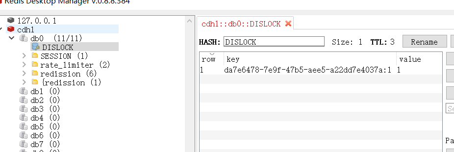](https://img-blog.csdnimg.cn/20210505120348622.png)

### getLock()方法

> [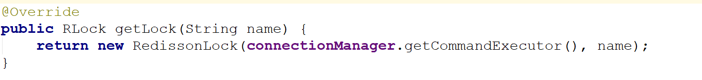](https://img2018.cnblogs.com/blog/874963/201810/874963-20181022144313593-1492245053.png)

可以看到，调用getLock()方法后实际返回一个RedissonLock对象

### tryLock方法

下面来看下tryLock方法，源码如下：


```
    @Override
    public boolean tryLock(long waitTime, long leaseTime, TimeUnit unit) throws InterruptedException {
        long time = unit.toMillis(waitTime);
        long current = System.currentTimeMillis();
        long threadId = Thread.currentThread().getId();
        Long ttl = tryAcquire(leaseTime, unit, threadId);
        // lock acquired
        if (ttl == null) {
            return true;
        }
        
        time -= System.currentTimeMillis() - current;
        if (time <= 0) {
            acquireFailed(threadId);
            return false;
        }
        
        current = System.currentTimeMillis();
        RFuture<RedissonLockEntry> subscribeFuture = subscribe(threadId);
        if (!subscribeFuture.await(time, TimeUnit.MILLISECONDS)) {
            if (!subscribeFuture.cancel(false)) {
                subscribeFuture.onComplete((res, e) -> {
                    if (e == null) {
                        unsubscribe(subscribeFuture, threadId);
                    }
                });
            }
            acquireFailed(threadId);
            return false;
        }

        try {
            time -= System.currentTimeMillis() - current;
            if (time <= 0) {
                acquireFailed(threadId);
                return false;
            }
        
            while (true) {
                long currentTime = System.currentTimeMillis();
                ttl = tryAcquire(leaseTime, unit, threadId);
                // lock acquired
                if (ttl == null) {
                    return true;
                }

                time -= System.currentTimeMillis() - currentTime;
                if (time <= 0) {
                    acquireFailed(threadId);
                    return false;
                }

                // waiting for message
                currentTime = System.currentTimeMillis();
                if (ttl >= 0 && ttl < time) {
                    getEntry(threadId).getLatch().tryAcquire(ttl, TimeUnit.MILLISECONDS);
                } else {
                    getEntry(threadId).getLatch().tryAcquire(time, TimeUnit.MILLISECONDS);
                }

                time -= System.currentTimeMillis() - currentTime;
                if (time <= 0) {
                    acquireFailed(threadId);
                    return false;
                }
            }
        } finally {
            unsubscribe(subscribeFuture, threadId);
        }
//        return get(tryLockAsync(waitTime, leaseTime, unit));
    }
```

以上代码使用了异步回调模式，RFuture 继承了 java.util.concurrent.Future, CompletionStage两大接口，异步回调模式的基础知识，请参见 《Java高并发核心编程 卷2 》

> [](https://img-blog.csdnimg.cn/20210502103040184.png)

### tryAcquire()方法

在RedissonLock对象的lock()方法主要调用tryAcquire()方法

[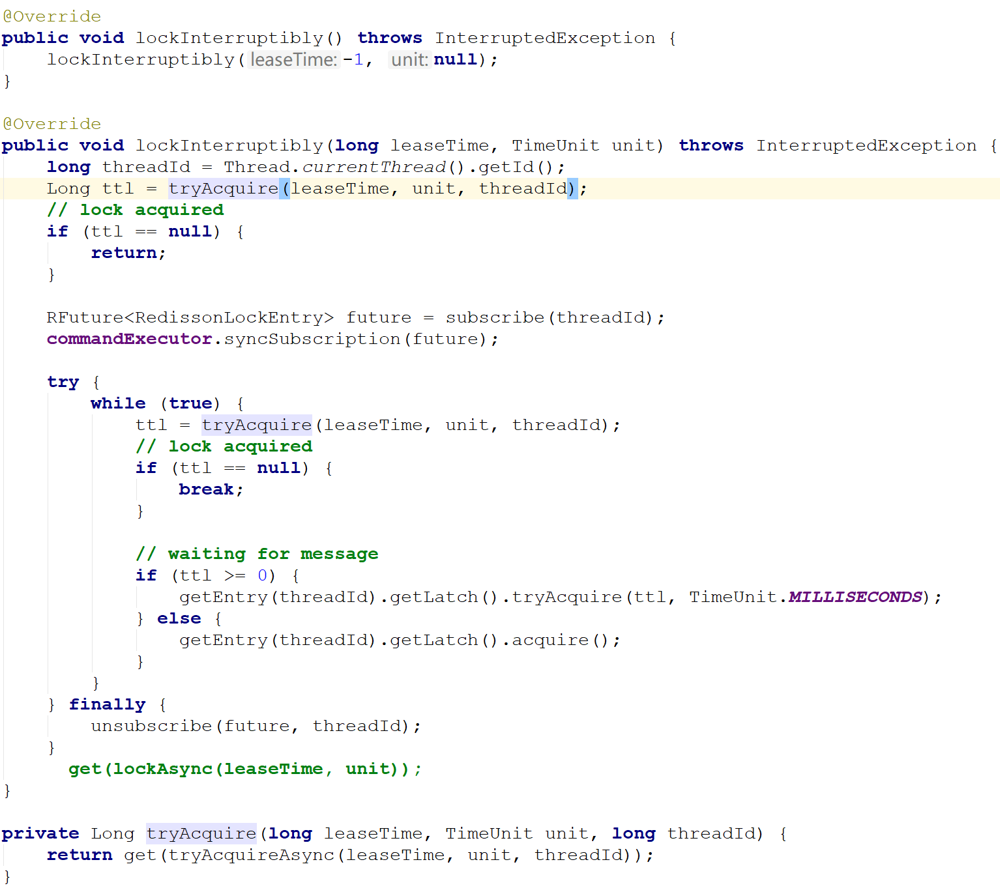](https://img2018.cnblogs.com/blog/874963/201810/874963-20181022144118880-431399348.png)

### tryLockInnerAsync

> [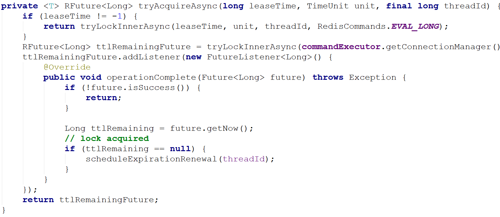](https://img2018.cnblogs.com/blog/874963/201810/874963-20181022144652395-505222887.png)

**由于leaseTime == -1，于是走tryLockInnerAsync()方法，这个方法才是关键**

> [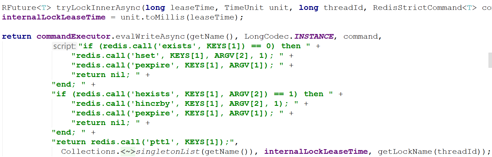](https://img2018.cnblogs.com/blog/874963/201810/874963-20181022150544732-816612223.png)

首先，看一下evalWriteAsync方法的定义


```
<T, R> RFuture<R> evalWriteAsync(String key, Codec codec, RedisCommand<T> evalCommandType, String script, List<Object> keys, Object ... params);
```

这和前面的jedis调用lua脚本类似，最后两个参数分别是keys和params。

单独将调用的那一段摘出来看，实际调用是这样的：


```
commandExecutor.evalWriteAsync(getName(), LongCodec.INSTANCE, command,
                  "if (redis.call('exists', KEYS[1]) == 0) then " +
                      "redis.call('hset', KEYS[1], ARGV[2], 1); " +
                      "redis.call('pexpire', KEYS[1], ARGV[1]); " +
                      "return nil; " +
                  "end; " +
                  "if (redis.call('hexists', KEYS[1], ARGV[2]) == 1) then " +
                      "redis.call('hincrby', KEYS[1], ARGV[2], 1); " +
                      "redis.call('pexpire', KEYS[1], ARGV[1]); " +
                      "return nil; " +
                  "end; " +
                  "return redis.call('pttl', KEYS[1]);",
                    Collections.<Object>singletonList(getName()), internalLockLeaseTime, getLockName(threadId));
```

结合上面的参数声明，我们可以知道，这里KEYS[1]就是getName()，ARGV[2]是getLockName(threadId)

假设：

- 前面获取锁时传的name是“DISLOCK”，
- 假设调用的线程ID是1，
- 假设成员变量UUID类型的id是01a6d806-d282-4715-9bec-f51b9aa98110

那么KEYS[1]=DISLOCK，ARGV[2]=01a6d806-d282-4715-9bec-f51b9aa98110:1

因此，这段脚本的意思是

　　1、判断有没有一个叫“DISLOCK”的key

　　2、如果没有，则在其下设置一个字段为“01a6d806-d282-4715-9bec-f51b9aa98110:1”，值为“1”的键值对 ，并设置它的过期时间

　　3、如果存在，则进一步判断“01a6d806-d282-4715-9bec-f51b9aa98110:1”是否存在，若存在，则其值加1，并重新设置过期时间

　　4、返回“DISLOCK”的生存时间（毫秒）

### 原理：加锁机制

这里用的数据结构是hash，hash的结构是： key 字段1 值1 字段2 值2 。。。

用在锁这个场景下，key就表示锁的名称，也可以理解为临界资源，字段就表示当前获得锁的线程

所有竞争这把锁的线程都要判断在这个key下有没有自己线程的字段，如果没有则不能获得锁，如果有，则相当于重入，字段值加1（次数）

[](https://img-blog.csdnimg.cn/20210420202325309.png)

### Lua脚本的详解

为何要使用lua语言？

因为一大堆复杂的业务逻辑，可以通过封装在lua脚本中发送给redis，保证这段复杂业务逻辑执行的**原子性**

[](https://img-blog.csdnimg.cn/20210505122547765.png)

回顾一下evalWriteAsync方法的定义


```
<T, R> RFuture<R> evalWriteAsync(String key, Codec codec, RedisCommand<T> evalCommandType, String script, List<Object> keys, Object ... params);
```

**注意，其最后两个参数分别是keys和params。**

### 关于 lua脚本的参数解释：

**KEYS[1]**代表的是你加锁的那个key，比如说：

> RLock lock = redisson.getLock("DISLOCK");

这里你自己设置了加锁的那个锁key就是“DISLOCK”。

**ARGV[1]**代表的就是锁key的默认生存时间

> 调用的时候，传递的参数为 internalLockLeaseTime ，该值默认30秒。

**ARGV[2]**代表的是加锁的客户端的ID，类似于下面这样：

> 01a6d806-d282-4715-9bec-f51b9aa98110:1

lua脚本的第一段if判断语句，就是用“exists DISLOCK”命令判断一下，如果你要加锁的那个锁key不存在的话，你就进行加锁。

如何加锁呢？很简单，用下面的redis命令：

> hset DISLOCK 01a6d806-d282-4715-9bec-f51b9aa98110:1 1

通过这个命令设置一个hash数据结构，这行命令执行后，会出现一个类似下面的数据结构：


```
DISLOCK:
    {
        8743c9c0-0795-4907-87fd-6c719a6b4586:1 1
    }
```

接着会执行“pexpire DISLOCK 30000”命令，设置DISLOCK这个锁key的生存时间是30秒(默认)

### **锁互斥机制**

那么在这个时候，如果客户端2来尝试加锁，执行了同样的一段lua脚本，会咋样呢？

很简单，第一个if判断会执行“exists DISLOCK”，发现DISLOCK 这个锁key已经存在了。

接着第二个if判断，判断一下，DISLOCK锁key的hash数据结构中，是否包含客户端2的ID，但是明显不是的，因为那里包含的是客户端1的ID。

所以，客户端2会获取到pttl DISLOCK返回的一个数字，这个数字代表了DISLOCK 这个锁key的**剩余生存时间。**比如还剩15000毫秒的生存时间。

此时客户端2会进入一个while循环，不停的尝试加锁。

### **可重入加锁机制**

如果客户端1都已经持有了这把锁了，结果可重入的加锁会怎么样呢？


```
RLock lock = redisson.getLock("DISLOCK")
lock.lock();
//业务代码
lock.lock();
//业务代码
lock.unlock();
lock.unlock();
```

分析上面那段lua脚本。

第一个if判断肯定不成立，“exists DISLOCK”会显示锁key已经存在了。

第二个if判断会成立，因为DISLOCK的hash数据结构中包含的那个ID，就是客户端1的那个ID，也就是“8743c9c0-0795-4907-87fd-6c719a6b4586:1”

此时就会执行可重入加锁的逻辑，他会用：

incrby DISLOCK

8743c9c0-0795-4907-87fd-6c719a6b4586:1 1

通过这个命令，对客户端1的加锁次数，累加1。

此时DISLOCK数据结构变为下面这样：


```
DISLOCK:
    {
        8743c9c0-0795-4907-87fd-6c719a6b4586:1 2
    }
```

### **释放锁机制**

如果执行lock.unlock()，就可以释放分布式锁，此时的业务逻辑也是非常简单的。

其实说白了，就是每次都对DISLOCK数据结构中的那个加锁次数减1。

如果发现加锁次数是0了，说明这个客户端已经不再持有锁了，此时就会用：

“del DISLOCK”命令，从redis里删除这个key。

然后呢，另外的客户端2就可以尝试完成加锁了。

### unlock 源码


```
  @Override
    public void unlock() {
        try {
            get(unlockAsync(Thread.currentThread().getId()));
        } catch (RedisException e) {
            if (e.getCause() instanceof IllegalMonitorStateException) {
                throw (IllegalMonitorStateException) e.getCause();
            } else {
                throw e;
            }
        }
        
//        Future<Void> future = unlockAsync();
//        future.awaitUninterruptibly();
//        if (future.isSuccess()) {
//            return;
//        }
//        if (future.cause() instanceof IllegalMonitorStateException) {
//            throw (IllegalMonitorStateException)future.cause();
//        }
//        throw commandExecutor.convertException(future);
    }
```

再深入一下，实际调用的是unlockInnerAsync方法

### unlockInnerAsync方法

[](https://img-blog.csdnimg.cn/20210505124031202.png)

### 原理：Redision 解锁机制

上图没有截取完整，完整的源码如下：


```
    protected RFuture<Boolean> unlockInnerAsync(long threadId) {
        return commandExecutor.evalWriteAsync(getName(), LongCodec.INSTANCE, RedisCommands.EVAL_BOOLEAN,
                "if (redis.call('hexists', KEYS[1], ARGV[3]) == 0) then " +
                    "return nil;" +
                "end; " +
                "local counter = redis.call('hincrby', KEYS[1], ARGV[3], -1); " +
                "if (counter > 0) then " +
                    "redis.call('pexpire', KEYS[1], ARGV[2]); " +
                    "return 0; " +
                "else " +
                    "redis.call('del', KEYS[1]); " +
                    "redis.call('publish', KEYS[2], ARGV[1]); " +
                    "return 1; "+
                "end; " +
                "return nil;",
                Arrays.<Object>asList(getName(), getChannelName()), LockPubSub.UNLOCK_MESSAGE, internalLockLeaseTime, getLockName(threadId));

    }
```

我们还是假设name=DISLOCK，假设线程ID是1

同理，我们可以知道

KEYS[1]是getName()，即KEYS[1]=DISLOCK

KEYS[2]是getChannelName()，即KEYS[2]=redisson_lock__channel:{DISLOCK}

ARGV[1]是LockPubSub.unlockMessage，即ARGV[1]=0

ARGV[2]是生存时间

ARGV[3]是getLockName(threadId)，即ARGV[3]=8743c9c0-0795-4907-87fd-6c719a6b4586:1

因此，上面脚本的意思是：

　　1、判断是否存在一个叫“DISLOCK”的key

　　2、如果不存在，返回nil

　　3、如果存在，使用Redis *Hincrby* 命令用于为哈希表中的字段值加上指定增量值 -1 ，代表减去1

　　4、若counter >，返回空，若字段存在，则字段值减1

　　5、若减完以后，counter > 0 值仍大于0，则返回0

　　6、减完后，若字段值小于或等于0，则用 publish 命令广播一条消息，广播内容是0，并返回1；

可以猜测，广播0表示资源可用，即通知那些等待获取锁的线程现在可以获得锁了

[](https://img-blog.csdnimg.cn/20210420201915515.png)

### 通过redis Channel 解锁订阅

以上是正常情况下获取到锁的情况，那么当无法立即获取到锁的时候怎么办呢？

再回到前面获取锁的位置


```
@Override
public void lockInterruptibly(long leaseTime, TimeUnit unit) throws InterruptedException {
    long threadId = Thread.currentThread().getId();
    Long ttl = tryAcquire(leaseTime, unit, threadId);
    // lock acquired
    if (ttl == null) {
        return;
    }

    //    订阅
    RFuture<RedissonLockEntry> future = subscribe(threadId);
    commandExecutor.syncSubscription(future);

    try {
        while (true) {
            ttl = tryAcquire(leaseTime, unit, threadId);
            // lock acquired
            if (ttl == null) {
                break;
            }

            // waiting for message
            if (ttl >= 0) {
                getEntry(threadId).getLatch().tryAcquire(ttl, TimeUnit.MILLISECONDS);
            } else {
                getEntry(threadId).getLatch().acquire();
            }
        }
    } finally {
        unsubscribe(future, threadId);
    }
//        get(lockAsync(leaseTime, unit));
}


protected static final LockPubSub PUBSUB = new LockPubSub();

protected RFuture<RedissonLockEntry> subscribe(long threadId) {
    return PUBSUB.subscribe(getEntryName(), getChannelName(), commandExecutor.getConnectionManager().getSubscribeService());
}

protected void unsubscribe(RFuture<RedissonLockEntry> future, long threadId) {
    PUBSUB.unsubscribe(future.getNow(), getEntryName(), getChannelName(), commandExecutor.getConnectionManager().getSubscribeService());
}
```

这里会订阅Channel，当资源可用时可以及时知道，并抢占，防止无效的轮询而浪费资源

这里的channel为：

> redisson_lock__channel:{DISLOCK}

[](https://img-blog.csdnimg.cn/20210505131139833.png)

[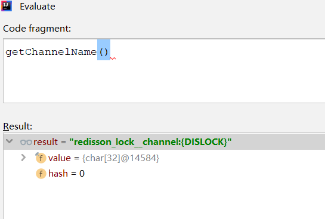](https://img-blog.csdnimg.cn/20210505131239819.png)

当资源可用用的时候，循环去尝试获取锁，由于多个线程同时去竞争资源，所以这里用了信号量，对于同一个资源只允许一个线程获得锁，其它的线程阻塞

这点，有点儿类似 Zookeeper分布式锁：

> 有关zookeeper分布式锁的原理和实现，具体请参见下面的博客：
> [Zookeeper 分布式锁 （图解+秒懂+史上最全）](https://www.cnblogs.com/crazymakercircle/p/14504520.html)

### **watch dog自动延期机制**

客户端1加锁的锁key默认生存时间才30秒，如果超过了30秒，客户端1还想一直持有这把锁，怎么办呢？

简单！只要客户端1一旦加锁成功，就会启动一个watch dog看门狗，**他是一个后台线程，会每隔10秒检查一下**，如果客户端1还持有锁key，那么就会不断的延长锁key的生存时间。

------

## 使用watchDog机制实现锁的续期

但是聪明的同学肯定会问：

> 有效时间设置多长，假如我的业务操作比有效时间长，我的业务代码还没执行完，就自动给我解锁了，不就完蛋了吗。

这个问题就有点棘手了，在网上也有很多讨论：

第一种解决方法就是靠程序员自己去把握，预估一下业务代码需要执行的时间，然后设置有效期时间比执行时间长一些，保证不会因为自动解锁影响到客户端业务代码的执行。

但是这并不是万全之策，比如网络抖动这种情况是无法预测的，也有可能导致业务代码执行的时间变长，所以并不安全。

第二种方法，使用监事狗watchDog机制实现锁的续期。

> 第二种方法比较靠谱一点，而且无业务入侵。

在Redisson框架实现分布式锁的思路，就使用watchDog机制实现锁的续期。

当加锁成功后，同时开启守护线程，默认有效期是30秒，每隔10秒就会给锁续期到30秒，只要持有锁的客户端没有宕机，就能保证一直持有锁，直到业务代码执行完毕由客户端自己解锁，如果宕机了自然就在有效期失效后自动解锁。

> 这里，和前面解决 JVM STW的锁过期问题有点类似，只不过，watchDog自动续期，也没有完全解决JVM STW的锁过期问题。
>
> 如何彻底解决 JVM STW的锁过期问题，可以来疯狂创客圈的社群讨论。

### redisson watchdog 使用和原理

实际上，redisson加锁的基本流程图如下：

[](https://img-blog.csdnimg.cn/20210418083558605.png)

这里专注于介绍watchdog。

首先watchdog的具体思路是 加锁时，默认加锁 30秒，每10秒钟检查一次，如果存在就重新设置 过期时间为30秒。

然后设置默认加锁时间的参数是 lockWatchdogTimeout（监控锁的看门狗超时，单位：毫秒）

官方文档描述如下

> ##### lockWatchdogTimeout（监控锁的看门狗超时，单位：毫秒）
>
> 默认值：`30000`
>
> 监控锁的看门狗超时时间单位为毫秒。该参数只适用于分布式锁的加锁请求中未明确使用`leaseTimeout`参数的情况。如果该看门狗未使用`lockWatchdogTimeout`去重新调整一个分布式锁的`lockWatchdogTimeout`超时，那么这个锁将变为失效状态。这个参数可以用来避免由Redisson客户端节点宕机或其他原因造成死锁的情况。

**需要注意的是**

1.watchDog 只有在未显示指定加锁时间时才会生效。（这点很重要）

2.lockWatchdogTimeout设定的时间不要太小 ，比如我之前设置的是 100毫秒，由于网络直接导致加锁完后，watchdog去延期时，这个key在redis中已经被删除了。

### tryAcquireAsync原理

在调用lock方法时，会最终调用到tryAcquireAsync。详细解释如下：


```
private <T> RFuture<Long> tryAcquireAsync(long waitTime, long leaseTime, TimeUnit unit, long threadId) {
    //如果指定了加锁时间，会直接去加锁
        if (leaseTime != -1) {
            return tryLockInnerAsync(waitTime, leaseTime, unit, threadId, RedisCommands.EVAL_LONG);
        }
    //没有指定加锁时间 会先进行加锁，并且默认时间就是 LockWatchdogTimeout的时间
    //这个是异步操作 返回RFuture 类似netty中的future
        RFuture<Long> ttlRemainingFuture = tryLockInnerAsync(waitTime,
                                                commandExecutor.getConnectionManager().getCfg().getLockWatchdogTimeout(),
                                                TimeUnit.MILLISECONDS, threadId, RedisCommands.EVAL_LONG);
       //这里也是类似netty Future 的addListener，在future内容执行完成后执行
        ttlRemainingFuture.onComplete((ttlRemaining, e) -> {
            if (e != null) {
                return;
            }

            // lock acquired
            if (ttlRemaining == null) {
            //这里是定时执行 当前锁自动延期的动作
                scheduleExpirationRenewal(threadId);
            }
        });
        return ttlRemainingFuture;
    }
```

scheduleExpirationRenewal 中会调用renewExpiration。

### renewExpiration执行延期动作

这里我们可以看到是 启用了一个timeout定时，去执行延期动作


```
    private void renewExpiration() {
   
      
        Timeout task = commandExecutor.getConnectionManager().newTimeout(new TimerTask() {
            @Override
            public void run(Timeout timeout) throws Exception {
                ExpirationEntry ent = EXPIRATION_RENEWAL_MAP.get(getEntryName());
                if (ent == null) {
                    return;
                }
                Long threadId = ent.getFirstThreadId();
                if (threadId == null) {
                    return;
                }
                
                RFuture<Boolean> future = renewExpirationAsync(threadId);
                future.onComplete((res, e) -> {
                    if (e != null) {
                        log.error("Can't update lock " + getName() + " expiration", e);
                        return;
                    }
                    
                    if (res) {
                     	//如果 没有报错，就再次定时延期
                     // reschedule itself
                     
                        renewExpiration();
                    }
                });
            }
            // 这里我们可以看到定时任务 是 lockWatchdogTimeout 的1/3时间去执行 renewExpirationAsync
        }, internalLockLeaseTime / 3, TimeUnit.MILLISECONDS);
        
        ee.setTimeout(task);
    }
```

最终 scheduleExpirationRenewal会调用到 renewExpirationAsync，

### renewExpirationAsync

执行下面这段 lua脚本。他主要判断就是 这个锁是否在redis中存在，如果存在就进行 pexpire 延期。


```
   protected RFuture<Boolean> renewExpirationAsync(long threadId) {
        return evalWriteAsync(getName(), LongCodec.INSTANCE, RedisCommands.EVAL_BOOLEAN,
                "if (redis.call('hexists', KEYS[1], ARGV[2]) == 1) then " +
                        "redis.call('pexpire', KEYS[1], ARGV[1]); " +
                        "return 1; " +
                        "end; " +
                        "return 0;",
                Collections.singletonList(getName()),
                internalLockLeaseTime, getLockName(threadId));
    }
```

### watchLog总结

1.要使 watchLog机制生效 ，lock时 不要设置 过期时间

2.watchlog的延时时间 可以由 lockWatchdogTimeout指定默认延时时间，但是不要设置太小。如100

3.watchdog 会每 lockWatchdogTimeout/3时间，去延时。

4.watchdog 通过 类似netty的 Future功能来实现异步延时

5.watchdog 最终还是通过 lua脚本来进行延时

## Redisson框架的分布式锁

Redisson框架十分强大，除了前面介绍的 getLock方法获取的分布式锁（输入可重入锁的类型），还有很多其他的分布式锁类型。

总体的Redisson框架的分布式锁类型，大致如下：

- 可重入锁
- 公平锁
- 联锁
- 红锁
- 读写锁
- 信号量
- 可过期信号量
- 闭锁（/倒数闩）

### 1.可重入锁（Reentrant Lock）

Redisson的分布式可重入锁RLock Java对象实现了java.util.concurrent.locks.Lock接口，同时还支持自动过期解锁。


```
public void testReentrantLock(RedissonClient redisson){
	RLock lock = redisson.getLock("anyLock");
	try{
		// 1. 最常见的使用方法
		//lock.lock();
		// 2. 支持过期解锁功能,10秒钟以后自动解锁, 无需调用unlock方法手动解锁
		//lock.lock(10, TimeUnit.SECONDS);
		// 3. 尝试加锁，最多等待3秒，上锁以后10秒自动解锁
		boolean res = lock.tryLock(3, 10, TimeUnit.SECONDS);
		if(res){ //成功
		// do your business
		}
	} catch (InterruptedException e) {
		e.printStackTrace();
	} finally {
		lock.unlock();
	}
}
```

Redisson同时还为分布式锁提供了异步执行的相关方法：


```
public void testAsyncReentrantLock(RedissonClient redisson){
	RLock lock = redisson.getLock("anyLock");
	try{
		lock.lockAsync();
		lock.lockAsync(10, TimeUnit.SECONDS);
		Future<Boolean> res = lock.tryLockAsync(3, 10, TimeUnit.SECONDS);
		if(res.get()){
		// do your business
		}
	} catch (InterruptedException e) {
		e.printStackTrace();
	} catch (ExecutionException e) {
		e.printStackTrace();
	} finally {
		lock.unlock();
	}
}
```

### 2.公平锁（Fair Lock）

Redisson分布式可重入公平锁也是实现了java.util.concurrent.locks.Lock接口的一种RLock对象。在提供了自动过期解锁功能的同时，保证了当多个Redisson客户端线程同时请求加锁时，优先分配给先发出请求的线程。


```
public void testFairLock(RedissonClient redisson){
	RLock fairLock = redisson.getFairLock("anyLock");
	try{
		// 最常见的使用方法
		fairLock.lock();
		// 支持过期解锁功能, 10秒钟以后自动解锁,无需调用unlock方法手动解锁
		fairLock.lock(10, TimeUnit.SECONDS);
		// 尝试加锁，最多等待100秒，上锁以后10秒自动解锁
		boolean res = fairLock.tryLock(100, 10, TimeUnit.SECONDS);
	} catch (InterruptedException e) {
		e.printStackTrace();
	} finally {
		fairLock.unlock();
	}
}
```

Redisson同时还为分布式可重入公平锁提供了异步执行的相关方法：


```
RLock fairLock = redisson.getFairLock("anyLock");
fairLock.lockAsync();
fairLock.lockAsync(10, TimeUnit.SECONDS);
Future<Boolean> res = fairLock.tryLockAsync(100, 10, TimeUnit.SECONDS);
```

### 3.联锁（MultiLock）

Redisson的RedissonMultiLock对象可以将多个RLock对象关联为一个联锁，每个RLock对象实例可以来自于不同的Redisson实例。


```
public void testMultiLock(RedissonClient redisson1,RedissonClient redisson2, RedissonClient redisson3){
	RLock lock1 = redisson1.getLock("lock1");
	RLock lock2 = redisson2.getLock("lock2");
	RLock lock3 = redisson3.getLock("lock3");
	RedissonMultiLock lock = new RedissonMultiLock(lock1, lock2, lock3);
	try {
		// 同时加锁：lock1 lock2 lock3, 所有的锁都上锁成功才算成功。
		lock.lock();
		// 尝试加锁，最多等待100秒，上锁以后10秒自动解锁
		boolean res = lock.tryLock(100, 10, TimeUnit.SECONDS);
	} catch (InterruptedException e) {
		e.printStackTrace();
	} finally {
		lock.unlock();
	}
}
```

### 4.红锁（RedLock）

Redisson的RedissonRedLock对象实现了Redlock介绍的加锁算法。该对象也可以用来将多个RLock对象关联为一个红锁，每个RLock对象实例可以来自于不同的Redisson实例。


```
public void testRedLock(RedissonClient redisson1,RedissonClient redisson2, RedissonClient redisson3){
	RLock lock1 = redisson1.getLock("lock1");
	RLock lock2 = redisson2.getLock("lock2");
	RLock lock3 = redisson3.getLock("lock3");
	RedissonRedLock lock = new RedissonRedLock(lock1, lock2, lock3);
	try {
		// 同时加锁：lock1 lock2 lock3, 红锁在大部分节点上加锁成功就算成功。
		lock.lock();
		// 尝试加锁，最多等待100秒，上锁以后10秒自动解锁
		boolean res = lock.tryLock(100, 10, TimeUnit.SECONDS);
	} catch (InterruptedException e) {
		e.printStackTrace();
	} finally {
		lock.unlock();
	}
}
```

### 5.读写锁（ReadWriteLock）

Redisson的分布式可重入读写锁RReadWriteLock,Java对象实现了java.util.concurrent.locks.ReadWriteLock接口。同时还支持自动过期解锁。该对象允许同时有多个读取锁，但是最多只能有一个写入锁。


```
RReadWriteLock rwlock = redisson.getLock("anyRWLock");
// 最常见的使用方法
rwlock.readLock().lock();
// 或
rwlock.writeLock().lock();
// 支持过期解锁功能
// 10秒钟以后自动解锁
// 无需调用unlock方法手动解锁
rwlock.readLock().lock(10, TimeUnit.SECONDS);
// 或
rwlock.writeLock().lock(10, TimeUnit.SECONDS);
// 尝试加锁，最多等待100秒，上锁以后10秒自动解锁
boolean res = rwlock.readLock().tryLock(100, 10, TimeUnit.SECONDS);
// 或
boolean res = rwlock.writeLock().tryLock(100, 10, TimeUnit.SECONDS);
...
lock.unlock();
```

### 6.信号量（Semaphore）

Redisson的分布式信号量（Semaphore）Java对象RSemaphore采用了与java.util.concurrent.Semaphore相似的接口和用法。


```
RSemaphore semaphore = redisson.getSemaphore("semaphore");
semaphore.acquire();
//或
semaphore.acquireAsync();
semaphore.acquire(23);
semaphore.tryAcquire();
//或
semaphore.tryAcquireAsync();
semaphore.tryAcquire(23, TimeUnit.SECONDS);
//或
semaphore.tryAcquireAsync(23, TimeUnit.SECONDS);
semaphore.release(10);
semaphore.release();
//或
semaphore.releaseAsync();
```

### 7.可过期性信号量（PermitExpirableSemaphore）

Redisson的可过期性信号量（PermitExpirableSemaphore）实在RSemaphore对象的基础上，为每个信号增加了一个过期时间。每个信号可以通过独立的ID来辨识，释放时只能通过提交这个ID才能释放。


```
RPermitExpirableSemaphore semaphore = redisson.getPermitExpirableSemaphore("mySemaphore");
String permitId = semaphore.acquire();
// 获取一个信号，有效期只有2秒钟。
String permitId = semaphore.acquire(2, TimeUnit.SECONDS);
// ...
semaphore.release(permitId);
```

### 8.闭锁/倒数闩（CountDownLatch）

Redisson的分布式闭锁（CountDownLatch）Java对象RCountDownLatch采用了与java.util.concurrent.CountDownLatch相似的接口和用法。


```
RCountDownLatch latch = redisson.getCountDownLatch("anyCountDownLatch");
latch.trySetCount(1);
latch.await();
// 在其他线程或其他JVM里
RCountDownLatch latch = redisson.getCountDownLatch("anyCountDownLatch");
latch.countDown();
```

## redis分布式锁的高可用

关于Redis分布式锁的高可用问题，大致如下：

在master- slave的集群架构中，就是如果你对某个redis master实例，写入了DISLOCK这种锁key的value，此时会异步复制给对应的master slave实例。

但是，这个过程中一旦发生redis master宕机，主备切换，redis slave变为了redis master。而此时的主从复制没有彻底完成.....

接着就会导致，客户端2来尝试加锁的时候，在新的redis master上完成了加锁，而客户端1也以为自己成功加了锁。

此时就会导致多个客户端对一个分布式锁完成了加锁。

> 这时系统在业务语义上一定会出现问题，导致脏数据的产生。

所以这个是是redis master-slave架构的主从异步复制导致的redis分布式锁的最大缺陷：

> 在redis master实例宕机的时候，可能导致多个客户端同时完成加锁。

### 高可用的RedLock（红锁）原理

RedLock算法思想：

> 不能只在一个redis实例上创建锁，应该是在多个redis实例上创建锁，n / 2 + 1，必须在大多数redis节点上都成功创建锁，才能算这个整体的RedLock加锁成功，避免说仅仅在一个redis实例上加锁而带来的问题。

这个场景是假设有一个 redis cluster，有 5 个 redis master 实例。然后执行如下步骤获取一把红锁：

1. 获取当前时间戳，单位是毫秒；
2. 跟上面类似，轮流尝试在每个 master 节点上创建锁，过期时间较短，一般就几十毫秒；
3. 尝试在大多数节点上建立一个锁，比如 5 个节点就要求是 3 个节点 n / 2 + 1；
4. 客户端计算建立好锁的时间，如果建立锁的时间小于超时时间，就算建立成功了；
5. 要是锁建立失败了，那么就依次之前建立过的锁删除；
6. 只要别人建立了一把分布式锁，你就得不断轮询去尝试获取锁。

[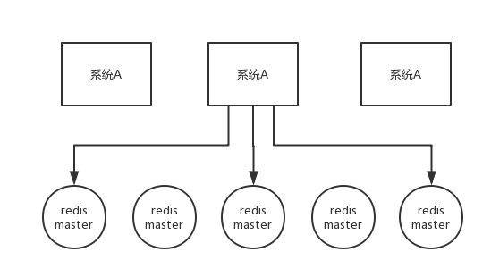](https://s4.51cto.com/oss/202007/09/bfb8d10209b39c24f0b02ce0a12d86d2.png-wh_651x-s_4154573900.png)

RedLock是基于redis实现的分布式锁，它能够保证以下特性：

- 互斥性：在任何时候，只能有一个客户端能够持有锁；避免死锁：
- 当客户端拿到锁后，即使发生了网络分区或者客户端宕机，也不会发生死锁；（利用key的存活时间）
- 容错性：只要多数节点的redis实例正常运行，就能够对外提供服务，加锁或者释放锁；

以sentinel模式架构为例，如下图所示，有sentinel-1，sentinel-2，sentinel-3总计3个sentinel模式集群，如果要获取分布式锁，那么需要向这3个sentinel集群通过EVAL命令执行LUA脚本，需要3/2+1=2，即至少2个sentinel集群响应成功，才算成功的以Redlock算法获取到分布式锁：

[](https://img-blog.csdnimg.cn/20210421140328536.png)

### 高可用的红锁会导致性能降低

提前说明，使用redis分布式锁，是追求高性能， 在cap理论中，追求的是 ap 而不是cp。

所以，如果追求高可用，建议使用 zookeeper分布式锁。

> redis分布式锁可能导致的数据不一致性，建议使用业务补偿的方式去弥补。所以，不太建议使用红锁，但是从学习的层面来说，大家还是一定要掌握的。

### 实现原理

Redisson中有一个`MultiLock`的概念，可以将多个锁合并为一个大锁，对一个大锁进行统一的申请加锁以及释放锁

而Redisson中实现RedLock就是基于`MultiLock` 去做的，接下来就具体看看对应的实现吧

### RedLock使用案例

先看下官方的代码使用：
(**https://github.com/redisson/redisson/wiki/8.-distributed-locks-and-synchronizers#84-redlock**)


```
RLock lock1 = redisson1.getLock("lock1");
RLock lock2 = redisson2.getLock("lock2");
RLock lock3 = redisson3.getLock("lock3");

RLock redLock = anyRedisson.getRedLock(lock1, lock2, lock3);

// traditional lock method
redLock.lock();

// or acquire lock and automatically unlock it after 10 seconds
redLock.lock(10, TimeUnit.SECONDS);

// or wait for lock aquisition up to 100 seconds 
// and automatically unlock it after 10 seconds
boolean res = redLock.tryLock(100, 10, TimeUnit.SECONDS);
if (res) {
   try {
     ...
   } finally {
       redLock.unlock();
   }
}
```

这里是分别对3个redis实例加锁，然后获取一个最后的加锁结果。

### RedissonRedLock实现原理

上面示例中使用redLock.lock()或者tryLock()最终都是执行`RedissonRedLock`中方法。

`RedissonRedLock` 继承自`RedissonMultiLock`， 实现了其中的一些方法：


```
public class RedissonRedLock extends RedissonMultiLock {
    public RedissonRedLock(RLock... locks) {
        super(locks);
    }

    /**
     * 锁可以失败的次数，锁的数量-锁成功客户端最小的数量
     */
    @Override
    protected int failedLocksLimit() {
        return locks.size() - minLocksAmount(locks);
    }
    
    /**
     * 锁的数量 / 2 + 1，例如有3个客户端加锁，那么最少需要2个客户端加锁成功
     */
    protected int minLocksAmount(final List<RLock> locks) {
        return locks.size()/2 + 1;
    }

    /** 
     * 计算多个客户端一起加锁的超时时间，每个客户端的等待时间
     * remainTime默认为4.5s
     */
    @Override
    protected long calcLockWaitTime(long remainTime) {
        return Math.max(remainTime / locks.size(), 1);
    }
    
    @Override
    public void unlock() {
        unlockInner(locks);
    }

}
```

看到`locks.size()/2 + 1` ，例如我们有3个客户端实例，那么最少2个实例加锁成功才算分布式锁加锁成功。

接着我们看下`lock()`的具体实现

### RedissonMultiLock实现原理


```
public class RedissonMultiLock implements Lock {

    final List<RLock> locks = new ArrayList<RLock>();

    public RedissonMultiLock(RLock... locks) {
        if (locks.length == 0) {
            throw new IllegalArgumentException("Lock objects are not defined");
        }
        this.locks.addAll(Arrays.asList(locks));
    }

    public boolean tryLock(long waitTime, long leaseTime, TimeUnit unit) throws InterruptedException {
        long newLeaseTime = -1;
        if (leaseTime != -1) {
            // 如果等待时间设置了，那么将等待时间 * 2
            newLeaseTime = unit.toMillis(waitTime)*2;
        }
        
        // time为当前时间戳
        long time = System.currentTimeMillis();
        long remainTime = -1;
        if (waitTime != -1) {
            remainTime = unit.toMillis(waitTime);
        }
        // 计算锁的等待时间，RedLock中：如果remainTime=-1，那么lockWaitTime为1
        long lockWaitTime = calcLockWaitTime(remainTime);
        
        // RedLock中failedLocksLimit即为n/2 + 1
        int failedLocksLimit = failedLocksLimit();
        List<RLock> acquiredLocks = new ArrayList<RLock>(locks.size());
        // 循环每个redis客户端，去获取锁
        for (ListIterator<RLock> iterator = locks.listIterator(); iterator.hasNext();) {
            RLock lock = iterator.next();
            boolean lockAcquired;
            try {
                // 调用tryLock方法去获取锁，如果获取锁成功，则lockAcquired=true
                if (waitTime == -1 && leaseTime == -1) {
                    lockAcquired = lock.tryLock();
                } else {
                    long awaitTime = Math.min(lockWaitTime, remainTime);
                    lockAcquired = lock.tryLock(awaitTime, newLeaseTime, TimeUnit.MILLISECONDS);
                }
            } catch (Exception e) {
                lockAcquired = false;
            }
            
            // 如果获取锁成功，将锁加入到list集合中
            if (lockAcquired) {
                acquiredLocks.add(lock);
            } else {
                // 如果获取锁失败，判断失败次数是否等于失败的限制次数
                // 比如，3个redis客户端，最多只能失败1次
                // 这里locks.size = 3, 3-x=1，说明只要成功了2次就可以直接break掉循环
                if (locks.size() - acquiredLocks.size() == failedLocksLimit()) {
                    break;
                }

                // 如果最大失败次数等于0
                if (failedLocksLimit == 0) {
                    // 释放所有的锁，RedLock加锁失败
                    unlockInner(acquiredLocks);
                    if (waitTime == -1 && leaseTime == -1) {
                        return false;
                    }
                    failedLocksLimit = failedLocksLimit();
                    acquiredLocks.clear();
                    // 重置迭代器 重试再次获取锁
                    while (iterator.hasPrevious()) {
                        iterator.previous();
                    }
                } else {
                    // 失败的限制次数减一
                    // 比如3个redis实例，最大的限制次数是1，如果遍历第一个redis实例，失败了，那么failedLocksLimit会减成0
                    // 如果failedLocksLimit就会走上面的if逻辑，释放所有的锁，然后返回false
                    failedLocksLimit--;
                }
            }
            
            if (remainTime != -1) {
                remainTime -= (System.currentTimeMillis() - time);
                time = System.currentTimeMillis();
                if (remainTime <= 0) {
                    unlockInner(acquiredLocks);
                    return false;
                }
            }
        }

        if (leaseTime != -1) {
            List<RFuture<Boolean>> futures = new ArrayList<RFuture<Boolean>>(acquiredLocks.size());
            for (RLock rLock : acquiredLocks) {
                RFuture<Boolean> future = rLock.expireAsync(unit.toMillis(leaseTime), TimeUnit.MILLISECONDS);
                futures.add(future);
            }
            
            for (RFuture<Boolean> rFuture : futures) {
                rFuture.syncUninterruptibly();
            }
        }
        
        return true;
    }
}
```

核心代码都已经加了注释，实现原理其实很简单，基于RedLock思想，遍历所有的Redis客户端，然后依次加锁，最后统计成功的次数来判断是否加锁成功。

## Redis分段锁

### 普通Redis分布式锁的性能瓶颈问题

分布式锁一旦加了之后，对同一个商品的下单请求，会导致所有下单操作，都必须对同一个商品key加分布式锁。

假设某个场景，一个商品1分钟6000订单，每秒的 600个下单操作，

假设加锁之后，释放锁之前，查库存 -> 创建订单 -> 扣减库存，每个IO操作100ms，大概300毫秒。

具体如下图：

[](https://img-blog.csdnimg.cn/20210605213016929.png)

可以再进行一下优化，将 创建订单 + 扣减库存 并发执行，将两个100ms 减少为一个100ms，这既是空间换时间的思想，大概200毫秒。

[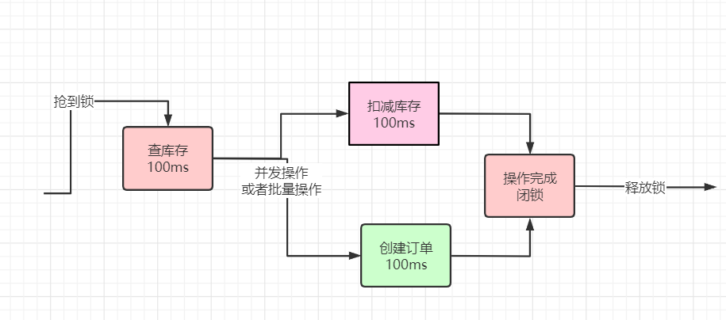](https://img-blog.csdnimg.cn/20210605213343204.png)

将 创建订单 + 扣减库存 批量执行，减少一次IO，也是大概200毫秒。

> 这个优化方案，有个重要的前提，就是 订单表和库存表在相同的库中，但是，这个前提条件，在数据量大+高并发的场景下，够呛。


```
package com.crazymaker.springcloud;

import com.crazymaker.springcloud.common.util.ThreadUtil;
import org.junit.Test;

import java.util.concurrent.CompletableFuture;
import java.util.concurrent.CountDownLatch;
import java.util.concurrent.ExecutorService;

public class CoCurrentDemo {


    /**
     * 使用CompletableFuture 和  CountDownLatch  进行并发回调
     */

    @Test
    public void testMutiCallBack() {
        CountDownLatch countDownLatch = new CountDownLatch(10);
        //批量异步
        ExecutorService executor = ThreadUtil.getIoIntenseTargetThreadPool();
        long start = System.currentTimeMillis();
        for (int i = 0; i < 10; i++) {
            CompletableFuture<Long> future = CompletableFuture.supplyAsync(() -> {
                long tid = ThreadUtil.getCurThreadId();
                 try {
                    System.out.println("线程" + tid + "开始了,模拟一下远程调用");
                    Thread.sleep(100);
                } catch (InterruptedException e) {
                    e.printStackTrace();
                }
                return tid;
            }, executor);

            future.thenAccept((tid) -> {
                System.out.println("线程" + tid + "结束了");
                countDownLatch.countDown();
            });
        }
        try {
            countDownLatch.await();
            //输出统计结果
            float time = System.currentTimeMillis() - start;

            System.out.println("所有任务已经执行完毕");
            System.out.println("运行的时长为(ms)：" + time);

        } catch (InterruptedException e) {
            e.printStackTrace();
        }
    }
}
```

那么，一秒内，只能完成多少个商品的秒杀订单的下单操作呢？

1000毫秒 / 200 =5 个订单

如何达到每秒600个下单呢？ 还是要从基础知识里边寻找答案？

### 分段加锁的思想来源

分段加锁的思想来源与基础知识。

> 我经常在疯狂创客圈社群里边，对小伙伴们强调 基础知识的重要性，反复强调， [《Java 高并发三部曲》](https://www.cnblogs.com/crazymakercircle/p/14493539.html) 一定要多刷，最好刷三遍。

中 [《Java 高并发核心编程 卷2》](https://www.cnblogs.com/crazymakercircle/p/14493539.html) 介绍了 JUC的 LongAdder 和 ConcurrentHashMap的源码和底层原理，他们提升性能的办法是：

> 空间换时间， 分段加锁

尤其是 LongAdder 的实现思想，可以用于 Redis分布式锁 作为性能提升的手段，将 Redis分布式锁 优化为 Redis分段锁。

#### 有关LongAdder 的系统化学习

有关LongAdder 的系统化学习，请参见 [《Java 高并发核心编程 卷2》](https://www.cnblogs.com/crazymakercircle/p/14493539.html)

[](https://img-blog.csdnimg.cn/20210605205917574.png)

### 使用Redis分段锁提升秒杀的并发性能

回到前面的场景：

> 假设一个商品1分钟6000订单，每秒的 600个下单操作，
>
> 假设加锁之后，释放锁之前，查库存 -> 创建订单 -> 扣减库存，经过优化，每个IO操作100ms，大概200毫秒，一秒钟5个订单。

如何提高性能呢？ 空间换时间

为了达到每秒600个订单，可以将锁分成 600 /5 =120 个段，反过来， 每个段1秒可以操作5次， 120个段，合起来，及时每秒操作600次。

进行抢夺锁的，如果申请到一个具体的段呢？

每一次使用随机算法，随机到一个分段， 如果不行，就轮询下一个分段，具体的流程，大致如下：

[](https://img-blog.csdnimg.cn/20210605220713171.png)

缺点：

> 这个是一个理论的时间预估，没有扣除 尝试下一个分段的 时间, 另外，实际上的性能， 会比理论上差，从咱们实操案例的测试结果，也可以证明这点。

### 实战： 手写一个Redis分段锁


```
package com.crazymaker.springcloud.standard.lock;

import com.crazymaker.springcloud.common.util.RandomUtil;
import com.crazymaker.springcloud.common.util.ThreadUtil;
import lombok.AllArgsConstructor;
import lombok.Data;
import lombok.extern.slf4j.Slf4j;

import java.util.concurrent.TimeUnit;
import java.util.concurrent.locks.Condition;
import java.util.concurrent.locks.Lock;

@Slf4j
@Data
@AllArgsConstructor
public class JedisMultiSegmentLock implements Lock {

    public static final int NO_SEG = -1;
    //拿到锁的线程
    private Thread thread;

    //拿到锁的状态
    private volatile boolean isLocked = false;

    //段数
    private final int segAmount;

    public static final int DEFAULT_TIMEOUT = 2000;
    public static final Long WAIT_GAT = Long.valueOf(100);

    //内部的锁
    InnerLock[] innerLocks = null;

    //被锁住的分段
    int segmentIndexLocked = NO_SEG;
    /**
     * 默认为2000ms
     */
    long expire = 2000L;
    int segmentIndex = 0;

    public JedisMultiSegmentLock(String lockKey, String requestId, int segAmount) {
        this.segAmount = segAmount;
        innerLocks = new InnerLock[segAmount];
        for (int i = 0; i < this.segAmount; i++) {
            //每一个分段，加上一个编号
            String innerLockKey = lockKey + ":" + i;
            innerLocks[i] = new InnerLock(innerLockKey, requestId);
        }
        segmentIndex = RandomUtil.randInModLower(this.segAmount);
    }


    /**
     * 获取一个分布式锁 , 超时则返回失败
     *
     * @return 获锁成功 - true | 获锁失败 - false
     */
    @Override
    public boolean tryLock(long time, TimeUnit unit) throws InterruptedException {

        //本地可重入
        if (isLocked && thread == Thread.currentThread()) {
            return true;
        }
        expire = unit != null ? unit.toMillis(time) : DEFAULT_TIMEOUT;
        long startMillis = System.currentTimeMillis();
        Long millisToWait = expire;

        boolean localLocked = false;

        int turn = 1;

        InnerLock innerLock = innerLocks[segmentIndex];

        while (!localLocked) {

            localLocked = innerLock.lock(expire);
            if (!localLocked) {
                millisToWait = millisToWait - (System.currentTimeMillis() - startMillis);
                startMillis = System.currentTimeMillis();
                if (millisToWait > 0L) {
                    /**
                     * 还没有超时
                     */
                    ThreadUtil.sleepMilliSeconds(WAIT_GAT);
                    log.info("睡眠一下，重新开始，turn:{},剩余时间：{}", turn++, millisToWait);

                    segmentIndex++;
                    if (segmentIndex >= this.segAmount) {
                        segmentIndex = 0;
                    }
                    innerLock = innerLocks[segmentIndex];
                } else {
                    log.info("抢锁超时");
                    return false;
                }
            } else {
                segmentIndexLocked = segmentIndex;
                isLocked = true;
                localLocked = true;
                thread = Thread.currentThread();
            }
        }
        return isLocked;
    }


    /**
     * 抢夺锁
     */
    @Override
    public void lock() {
        throw new IllegalStateException(
                "方法 'lock' 尚未实现!");
    }


    //释放锁
    @Override
    public void unlock() {
        if (segmentIndexLocked == NO_SEG) {
            return;
        }
        this.innerLocks[segmentIndexLocked].unlock();

        segmentIndexLocked = NO_SEG;
        thread = null;
        isLocked = false;
    }

    @Override
    public Condition newCondition() {
        throw new IllegalStateException(
                "方法 'newCondition' 尚未实现!");
    }

    @Override
    public void lockInterruptibly() throws InterruptedException {
        throw new IllegalStateException(
                "方法 'lockInterruptibly' 尚未实现!");

    }


    @Override
    public boolean tryLock() {
        throw new IllegalStateException(
                "方法 'tryLock' 尚未实现!");
    }

}
```

#### 尼恩的忠实建议：

> 强烈参照 LongAdder ，手写一个Redis分段锁,
>
> 这里， 还是有点复杂，但是很重要，建议大家动手干一票.

- 理论水平的提升，看看视频、看看书，只有两个字，就是需要：多看。
- 实战水平的提升，只有两个字，就是需要：多干。

手写一个Redis分段锁的实操，是高并发实战的重要动手实操之一。
