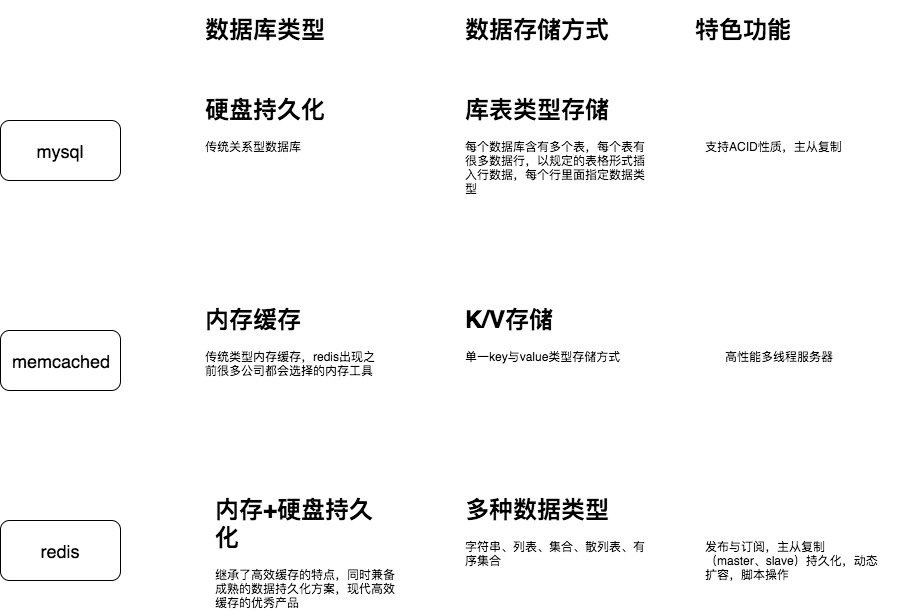

# 什么是 Redis

## 参考

- Redis 官网：https://redis.io/
- Redis 在线测试：http://try.redis.io/
- Redis 命令参考：http://doc.redisfans.com/

`Redis` 是一个开源(BSD许可)的, 是一个高性能的 key-value 数据库.

内存中的数据结构存储系统, 它可以用作数据库, 缓存和消息中间件. 它支持多 种类型的数据结构, 如 字符串(strings), 散列(hashes),  列表(lists),  集合(sets),  有序集合(sorted sets)等.

`Redis` 与其他 `key-value` 缓存产品有以下三个特点: 

- Redis支持数据的持久化, 可以将内存中的数据保存在磁盘中, 重启的时候可以再次加载进行使用.
- Redis不仅仅支持简单的key-value类型的数据, 同时还提供list, set, zset, hash等数据结构的存储.
- Redis支持数据的备份, 即master-slave模式的数据备份.

## Redis与其他key-value存储有什么不同(优点)？

- Redis有着更为复杂的数据结构并且提供对他们的原子性操作，这是一个不同于其他数据库的进化路径。Redis的数据类型都是基于基本数据结构的同时对程序员透明，无需进行额外的抽象。
- Redis运行在内存中但是可以持久化到磁盘，所以在对不同数据集进行高速读写时需要权衡内存，因为数据量不能大于硬件内存。在内存数据库方面的另一个优点是，相比在磁盘上相同的复杂的数据结构，在内存中操作起来非常简单，这样Redis可以做很多内部复杂性很强的事情。同时，在磁盘格式方面他们是紧凑的以追加的方式产生的，因为他们并不需要进行随机访问。

## Redis和memcached和mysql之间的区别

## redis作为数据库和作为缓存的选择，线上怎么优雅的使用redis

**简介：redis作为数据库和作为内存缓存的两种使用方法**

- redis作为数据库的使用有什么优缺点
  - 优点
    - 没有Scheme约束，数据结构的变更相对容易，一开始确定数据类型， 抗压能力强，性能极高，10万/qps
  - 缺点
    - 没有索引，没有外键，缺少int/date等基本数据类型，多条件查询需要通过集合内联(sinter,zinterstore) 和连接间接实现开发效率低，可维护性不佳
- redis作为缓存的使用，搭配数据库使用的两种方案
  - jedis整合使用方案 set key,value ["11","22"] 第一层在缓存进行查询，如果得到数据则直接返回， 第二层在数据库进行查询，并且刷新缓存，方便下次查询 ["33,"44"]
  - 作为mybatis/hibernate二级缓存使用方案，一级缓存：sqlSession，进程缓存，单次链接有效

## Redis消息订阅发布

**简介：redis消息订阅发布讲解，基础使用**

- 作用：发布订阅类似于信息管道，用来进行系统之间消息解耦，类似于mq，rabbitmq、rocketmq、kafka、activemq主要有消息发布者和消息订阅者。比如运用于：订单支付成功，会员系统加积分、钱包进行扣钱操作、发货系统（下发商品）

- PUBLISH 将信息message发送到指定的频道channel。返回收到消息的客户端数量
- SUBSCRIBE 订阅给指定频道的信息
- UNSUBSCRIBE 取消订阅指定的频道，如果不指定，则取消订阅所有的频道。
- redis的消息订阅发布和mq对比？

  答：redis发布订阅功能比较薄弱但比较轻量级

   mq消息持久化，数据可靠性比较差

   无后台功能（mq通常都有个后台管理平台）

   可msgId、msgKey进行查询消息

## 数据类型

### String字符串(key-value)数据类型

String是最常用的一种数据类型，普通的key/value存储都可以归为此类。

常用命令：

- set/get
  - 设置key对应的值为String类型的value
  - 获取key对应的值
- mget
  - 批量获取多个key的值，如果可以不存在则返回nil
- incr && incrby
  - incr对key对应的值进行加加操作，并返回新的值;incrby加指定值
- setnx
  - 设置key对应的值为String类型的value，如果key已经存在则返回0
- setex
  - 设置key对应的值为String类型的value，并设定有效期
- 其他命令
  - getrange 获取key对应value的子字符串
  - mset 批量设置多个key的值，如果成功表示所有值都被设置，否则返回0表示没有任何值被设置
  - msetnx，同mset，不存在就设置，不会覆盖已有的key
  - getset 设置key的值，并返回key旧的值
  - append：给指定key的value追加字符串，并返回新字符串的长度

> 备注：redis String命令的使用实战，记住1、3、5、6这几个重要命令

------

### Hash类型讲解

Redis hash 是一个 string 类型的 field（字段） 和 value（值） 的映射表，hash 特别适合用于存储对象。

Redis 中每个 hash 可以存储 232 - 1 键值对（40多亿）。

常用命令：

- Hash是一个String类型的field和value之间的映射表
- redis的Hash数据类型的key（hash表名称）对应的value实际的内部存储结构为一个HashMap
- Hash特别适合存储对象
- 相对于把一个对象的每个属性存储为String类型，将整个对象存储在Hash类型中会占用更少内存。
- 所存储的成员较少时数据存储为zipmap，当成员数量增大时会自动转成真正的HashMap,此时encoding为ht。
- 运用场景： 如用一个对象来存储用户信息，商品信息，订单信息等等。

- Hash命令讲解
  - hset——设置key对应的HashMap中的field的value
  - hget——获取key对应的HashMap中的field的value
  - hgetall——获取key对应的HashMap中的所有field的value
  - hlen--返回key对应的HashMap中的field的数量

------

### List列表类型讲解

Redis列表是简单的字符串列表，按照插入顺序排序。你可以添加一个元素到列表的头部（左边）或者尾部（右边）

一个列表最多可以包含 232 - 1 个元素 (4294967295, 每个列表超过40亿个元素)。

常用命令：

- lpush——在key对应的list的头部添加一个元素
- lrange——获取key对应的list的指定下标范围的元素，-1表示获取所有元素
- lpop——从key对应的list的尾部删除一个元素，并返回该元素
- rpush——在key对应的list的尾部添加一个元素
- rpop——从key对应的list的尾部删除一个元素，并返回该元素

------

### Set类型讲解

Redis 的 Set 是 String 类型的无序集合。集合成员是唯一的，这就意味着集合中不能出现重复的数据。

Redis 中集合是通过哈希表实现的，所以添加，删除，查找的复杂度都是 O(1)。

集合中最大的成员数为 232 - 1 (4294967295, 每个集合可存储40多亿个成员)。

常用命令：

- sadd——在key对应的set中添加一个元素
- smembers——获取key对应的set的所有元素
- spop——随机返回并删除key对应的set中的一个元素
- suion——求给定key对应的set并集
- sinter——求给定key对应的set交集

------

### SortSet类型讲解

Redis 有序集合和集合一样也是 string 类型元素的集合,且不允许重复的成员。

不同的是每个元素都会关联一个 double 类型的分数。redis 正是通过分数来为集合中的成员进行从小到大的排序。

有序集合的成员是唯一的,但分数(score)却可以重复。

集合是通过哈希表实现的，所以添加，删除，查找的复杂度都是 O(1)。 集合中最大的成员数为 2^32 - 1 (4294967295, 每个集合可存储40多亿个成员)。

set的基础增加顺序score，再根据score进行排序 实战：通过sortset实现排行榜

- zadd ——在key对应的zset中添加一个元素
- zrange——获取key对应的zset中指定范围的元素，-1表示获取所有元素
- zrem——删除key对应的zset中的一个元素
- zrangebyscore——返回有序集key中，指定分数范围的元素列表,排行榜中运用
- zrank——返回key对应的zset中指定member的排名。其中member按score值递增(从小到大）； 排名以0为底，也就是说，score值最小的成员排名为0,排行榜中运用

**set和sortset对比**

- set是通过hashmap存储，key对应set的元素，value是空对象
- sortset是怎么存储并实现排序的呢，hashmap存储，还加了一层跳跃表 跳跃表：相当于双向链表，在其基础上添加前往比当前元素大的跳转链接