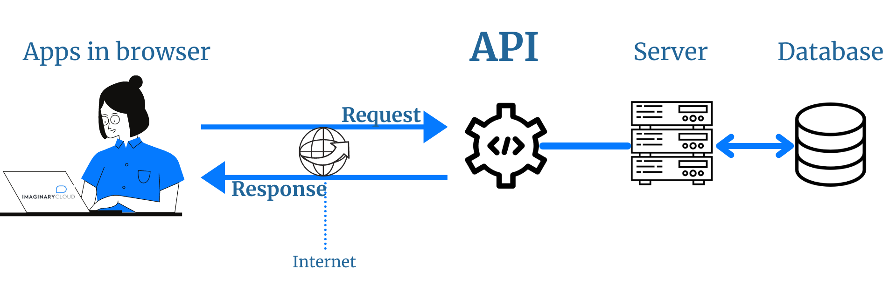
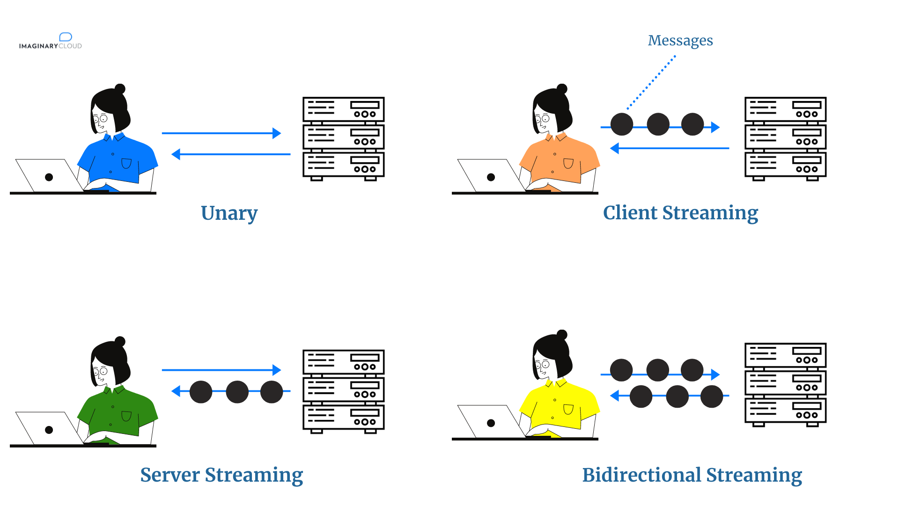
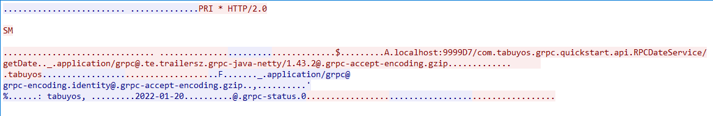

# 参考

- [REST跟RPC区别与联系(搞前端的会认为后端通信直接采用REST比较好)_John_ToStr的博客-CSDN博客](https://blog.csdn.net/John_ToStr/article/details/103473077)
- [gRPC vs REST：两种API架构风格的对比-InfoQ](https://www.infoq.cn/article/i71vnujcel09ebukak59)
- [GRpc实战及原理分析 | grpc-in-action](https://liuyazong.github.io/grpc-in-action/)

# RPC 与 REST

什么是RPC呢？百度百科给出的解释是这样的：“RPC（Remote Procedure Call Protocol）——远程过程调用协议，它是一种通过网络从远程计算机程序上请求服务，而不需要了解底层网络技术的协议”。REST这个词，是Roy Thomas Fielding在他2000年的博士论文中提出的。现在貌似流行了起来，甚至出现过：RESTful API是目前比较成熟的一套互联网应用程序的API设计理论，作为前端设备与后端(主要用于B/S架构)进行通信的架构，有必要好好熟悉一下。

既 REST ，何 RPC ？

在 OpenStack 里的进程间通信方式主要有两种，一种是基于HTTP协议的RESTFul API方式，另一种则是RPC调用。

那么这两种方式在应用场景上有何区别呢？

有使用经验的人，会说：

前者（RESTful）主要用于各组件之间的通信（如nova与glance的通信），或者说用于组件对外提供调用接口而后者（RPC）则用于同一组件中各个不同模块之间的通信（如nova组件中nova-compute与nova-scheduler的通信）。首先，给你提两个问题，带着这两个问题再往下看：

RPC 和 REST 区别是什么？2、为什么要采用RPC呢？

首先，第一个问题：RPC 和 REST 区别是什么？(如下图)

你一定会觉得这个问题很奇怪，是的，包括我，但是你在网络上一搜，会发现类似对比的文章比比皆是，我在想可能很多初学者由于基础不牢固，才会将不相干的二者拿出来对比吧。既然是这样，那为了让你更加了解陌生的RPC，就从你熟悉得不能再熟悉的 REST 入手吧。

01、所属类别不同

REST，是Representational State Transfer 的简写，中文描述表述性状态传递（是指某个瞬间状态的资源数据的快照，包括资源数据的内容、表述格式(XML、JSON)等信息。）

REST 是一种软件架构风格。这种风格的典型应用，就是HTTP。其因为简单、扩展性强的特点而广受开发者的青睐。

而RPC 呢，是 Remote Procedure Call Protocol 的简写，中文描述是远程过程调用，它可以实现客户端像调用本地服务(方法)一样调用服务器的服务(方法)。

而 RPC 可以基于 TCP/UDP，也可以基于 HTTP 协议进行传输的，按理说它和REST不是一个层面意义上的东西，不应该放在一起讨论，但是谁让REST这么流行呢，它是目前最流行的一套互联网应用程序的API设计标准，某种意义下，我们说 REST 可以其实就是指代 HTTP 协议。

02、使用方式不同

从使用上来看，HTTP 接口只关注服务提供方，对于客户端怎么调用并不关心。接口只要保证有客户端调用时，返回对应的数据就行了。而RPC则要求客户端接口保持和服务端的一致。

REST 是服务端把方法写好，客户端并不知道具体方法。客户端只想获取资源，所以发起HTTP请求，而服务端接收到请求后根据URI经过一系列的路由才定位到方法上面去RPC是服务端提供好方法给客户端调用，客户端需要知道服务端的具体类，具体方法，然后像调用本地方法一样直接调用它。03、面向对象不同

从设计上来看，RPC，所谓的远程过程调用 ，是面向方法的 ，REST：所谓的 Representational state transfer ，是面向资源的，除此之外，还有一种叫做 SOA，所谓的面向服务的架构，它是面向消息的，这个接触不多，就不多说了。

03、序列化协议不同

接口调用通常包含两个部分，序列化和通信协议。

通信协议，上面已经提及了，REST 是 基于 HTTP 协议，而 RPC 可以基于 TCP/UDP，也可以基于 HTTP 协议进行传输的。

常见的序列化协议，有：json、xml、hession、protobuf、thrift、text、bytes等，REST 通常使用的是 JSON或者XML，而 RPC 使用的是 JSON-RPC，或者 XML-RPC。

04、应用场景

REST和RPC都常用于微服务架构中。

1、HTTP相对更规范，更标准，更通用，无论哪种语言都支持http协议。如果你是对外开放API，例如开放平台，外部的编程语言多种多样，你无法拒绝对每种语言的支持，现在开源中间件，基本最先支持的几个协议都包含RESTful。

RPC在微服务中的利用

2、 RPC 框架作为架构微服务化的基础组件，它能大大降低架构微服务化的成本，提高调用方与服务提供方的研发效率，屏蔽跨进程调用函数（服务）的各类复杂细节。让调用方感觉就像调用本地函数一样调用远端函数、让服务提供方感觉就像实现一个本地函数一样来实现服务。

REST调用及测试都很方便，RPC就显得有点繁琐，但是RPC的效率是毋庸置疑的，所以建议在多系统之间的内部调用采用RPC。对外提供的服务，Rest更加合适。

REST与RPC比较：


通过以上几点，我们知道了 REST 和 RPC 之间有很明显的差异。

然后第二个问题：为什么要采用RPC呢？

那到底为何要使用 RPC，单纯的依靠RESTful API不可以吗？为什么要搞这么多复杂的协议。

关于这一点，以下几点仅仅个人观点，仅供交流：

RPC 和 REST 两者的定位不同，REST 面向资源，更注重接口的规范，因为要保证通用性更强，所以对外最好通过 REST。而 RPC 面向方法，主要用于函数方法的调用，可以适合更复杂通信需求的场景。RESTful API客户端与服务端之间采用的是同步机制，当发送HTTP请求时，客户端需要等待服务端的响应。当然对于这一点是可以通过一些技术来实现异步的机制的。采用RESTful API，客户端与服务端之间虽然可以独立开发，但还是存在耦合。比如，客户端在发送请求的时，必须知道服务器的地址，且必须保证服务器正常工作。而 rpc + ralbbimq中间件可以实现低耦合的分布式集群架构。说了这么多，我们该如何选择这两者呢？我总结了如下两点，供你参考：

REST 接口更加规范，通用适配性要求高，建议对外的接口都统一成 REST。而组件内部的各个模块，可以选择 RPC，一个是不用耗费太多精力去开发和维护多套的HTTP接口，一个RPC的调用性能更高（见下条）从性能角度看，由于HTTP本身提供了丰富的状态功能与扩展功能，但也正由于HTTP提供的功能过多，导致在网络传输时，需要携带的信息更多，从性能角度上讲，较为低效。而RPC服务网络传输上仅传输与业务内容相关的数据，传输数据更小，性能更高。RPC注重安全性、高性能、跨平台、跨语言、天生支持分布式、客户端服务端完全解耦，工程师们在做技术选型的时候酌情考虑。


# gRPC vs REST：两种 API 架构风格的对比

想知道未来是不是 gRPC 的天下？本文会具体介绍两种 API 架构风格：REST 和 gRPC，并讨论它们之间的区别。不过，首先，我们会解释什么是 API，以及为什么它对微服务基础设施而言至关重要。之后，我们会介绍 gRPC 的基础——RPC，并探讨 gRPC 和 REST API 之间的重要差异。根据它们的对比结果，我们最后会分析什么时候应该使用哪种架构类型。

## API 是什么


API，即应用程序编程接口。这些接口充当软件中介，为应用程序之间的交互和对话建立特定的定义和规则。API 负责将响应从用户传递到系统，然后从系统返回给用户。听起来还是有点糊涂？




API 的工作机制


假设我们正在预订一个酒店。我们在笔记本电脑上访问酒店预订页面，连接到互联网的这个页面会将数据（我们的请求）发送到服务器。然后，服务器检索数据，解析它，一旦所需的操作得到执行，它就会向我们发送一个响应，并在我们的界面上提供信息。这个过程需要 API 才能实现。


API 指定了一个应用程序（网页或移动应用）可以向另一个应用程序发出的请求类型，并进一步确定：如何发出这些请求；使用哪些数据格式；以及用户必须遵循的实践。


本文会对比 gRPC 和 REST 两大架构风格，因为它们代表了人们创建 API 时最常用的两种架构风格。

### API 和微服务


一方面，在单体应用程序中，项目的所有功能都包含在一个单元中，更准确地说是包含在一个代码库中。另一方面，微服务架构由一些较小的服务组成，这些服务使用 HTTP 等协议相互通信。作为微服务架构一部分的组件服务通过 API 相互通信和交互。换句话说，API 允许集成到微服务应用程序中的所有服务互相连接和通信。


最常用的架构风格是 REST API。但构建 API 时主要有 3 种模型：RPC（远程过程调用）、REST（表征状态传输）和 GraphQL。在本文中，我们将重点介绍前两个。

## 什么是 RPC？


RPC 使用客户端-服务器模型。请求服务器（换句话说就是客户端）请求一条消息，该消息由 RPC 转换并发送到另一台服务器。服务器收到请求后将响应发送回客户端。当服务器处理这个调用时，客户端被阻塞，服务器内部的消息传递被隐藏。


此外，RPC 允许客户端以特定格式请求函数，并以完全相同的格式接收响应。在 URL 中可以找到使用 RPC API 提交调用的方法。RPC 支持本地和分布式环境中的远程过程调用。


与 REST API 一样，RPC 还建立了交互规则以及用户如何提交“调用”（请求）以调用方法与服务通信和交互的机制。

## 什么是 REST？


使用 REST API 时，来自后端数据的响应通过 JSON 或 XML 消息格式传递给客户端（或用户）。这种架构模型倾向于遵循 HTTP 协议。然而，在维护 RCP 模型的同时，RCP 设计也时常从 HTTP 中汲取一些想法。事实上，不管使用的是哪种模型（RPC 或 REST），大多数现代 API 实现都将 API 映射到相同的 HTTP 协议时。


当 REST API 公开可用时，每个集成微服务应用程序的服务都可以作为资源呈现给用户/客户端，资源可以通过以下 HTTP 命令访问：`GET`、`DELETE`、`POST`和`PUT`。

## 什么是 gRPC？


gRPC 是 Google Remote Procedure Call 的简写，是基于 RCP 架构的变体。该技术遵循一个使用 HTTP 2.0 协议的 RPC API 实现，但 HTTP 不会呈现给 API 开发人员或服务器。因此，开发人员无需担心 RPC 概念如何映射到 HTTP，从而降低了复杂性。


总的来说，gRPC 旨在加快微服务之间的数据传输。它的基础方法是确定一个服务，建立方法和相应的参数来实现远程调用和返回类型。


此外，它以**一个 IDL（接口描述语言）表示 RPC API 模型**，这为确定远程过程提供了更直接的方法。默认情况下，IDL 使用 **Protocol Buffers**（但也可以使用其他替代方案）来描述服务接口以及负载消息的结构。

## gRPC 与 REST：对比


现在，我们对 gRPC 和 REST 有了一个初步认识，下面我们来看看它们的主要区别。

#### HTTP 1.1 vs HTTP 2


REST API 遵循一个通常基于 HTTP 1.1 构建的**请求-响应通信模型**。不幸的是，这意味着如果一个微服务收到来自多个客户端的多个请求，该模型必须每次只处理一个请求，拖慢了整个系统的速度。REST API 也可以构建在 HTTP 2 上，但通信的请求-响应模型保持不变，这使得 REST API 无法充分利用 HTTP 2 的优势，例如**流式通信**和**双向支持**。


gRPC 没有面临类似的障碍。它建立在 HTTP 2 之上，且遵循客户端-响应通信模型。这让它支持双向通信和流式通信，因为 gRPC 能接收来自多个客户端的多个请求，并通过不断地流式传输信息来同时处理这些请求。此外，gRPC 还可以处理“一元”交互，例如构建在 HTTP 1.1 上的交互。


总之，gRPC 能处理一元交互和多种类型的流：


- 一元：客户端发出单个请求并接收单个响应。
- 服务器流：服务器对客户端的请求响应一个消息流。当全部数据发送完毕后，服务器会再发送一条状态消息来完成流程。
- 客户端流：客户端向服务器发送一个消息流，并接收单个响应消息。
- 双向流：客户端和服务器的两个流互相独立，也就是说它们都能以任何顺序传输消息。客户端负责发起并结束双向流。




流类型

#### 浏览器支持


这可能是 REST 相对于 gRPC 的主要优势之一。一方面，所有浏览器都完全支持 REST。另一方面，gRPC 获得的浏览器支持仍然非常有限。


不幸的是，它需要 gRPC-web 和一个代理层来执行 HTTP 1.1 和 HTTP 2 之间的转换。因此，gRPC 主要用于内部/私有系统（特定组织的后端数据和应用程序功能中的 API 程序）。

#### 负载数据结构


如前所述，gRPC 默认使用 Protocol Buffers 来序列化负载数据。这个方案更轻便，因为它支持高度压缩的格式并减少了消息的大小。此外，Protobuf（或 Protocol Buffer）是二进制的；它对结构化数据进行序列化和反序列化，以便通信和传输。换句话说，强类型消息可以自动从 Protobuf 转换为客户端和服务器的编程语言。


相比之下，REST 主要依靠 JSON 或 XML 格式来发送和接收数据。事实上，即使它不强制要求任何结构，JSON 也是最流行的格式，因为它具有灵活性和发送动态数据的能力，而不必遵循严格的结构。使用 JSON 的另一显著优势是其人类可读水平，这方面 Protobuf 尚无法与之竞争。


尽管如此，JSON 在数据传输方面并不够轻量或快速。其原因在于，在使用 REST 时，必须将 JSON（或其他格式）序列化并转换为客户端和服务器端使用的编程语言。这在传输数据的过程中增加了一个额外步骤，从而可能会损害性能并增加出现错误的可能性。

#### 代码生成功能


与 gRPC 不同，REST API 不提供内置代码生成功能，这意味着开发人员必须使用 Swagger 或 Postman 等第三方工具为 API 请求生成代码。


相比之下，gRPC 由于其 protoc 编译器而具有原生代码生成功能，该编译器与多种编程语言兼容。这对于集成了以不同语言和平台开发的各种服务的微服务系统来说尤其方便。此外，内置的代码生成器还有助于创建 SDK（软件开发工具包）。

## gRPC 与 REST：对比表


## 何时使用 gRPC，何时使用 REST？


如前所述，尽管 gRPC 提供了许多优势，但它有一个主要障碍：浏览器兼容性低。因此，gRPC 的用例一般局限在内部/私有系统。


相比之下，正如我们所讨论的那样，REST API 可能有其缺点，但它们仍然是连接基于微服务的系统的最流行的 API。此外，REST 遵循 HTTP 协议标准化并提供通用支持，使这种 API 架构风格成为 Web 服务开发以及应用程序和微服务集成的首选。然而，这并不意味着我们应该忽视 gRPC 的应用场景。


gRPC 架构风格具有很多值得（并且应该）探索的有前途的特性。它是处理多语言系统和实时流的绝佳选择，例如，当运营需要轻量级消息传输（可以由序列化 Protobuf 消息支持）的 IoT 系统时，gRPC 就很合适。此外，gRPC 也可以考虑用于移动应用程序，因为它们不需要浏览器，且消息体积更小，不会拖慢移动设备的速度。

## 结论


gRPC 提供了很多优势。与 REST 不同，它可以充分利用 HTTP 2，使用多路复用流并遵循二进制协议。此外，由于 Protobuf 消息结构，它还具备性能优势，支持多语言环境的内置代码生成功能也是一大好处。这些因素使 gRPC 成为了一种很有前途的 API 架构风格。


尽管如此，浏览器支持不足使 gRPC 很难匹敌 REST 的通用支持能力。REST 仍然是微服务系统中的粘合剂，是最流行的解决方案。因此它很可能会存在很长时间，而且说实话，它是一个非常成熟和成功的架构。


# gRpc 数据包




# GRpc实战及原理分析

- grpc-client/grpc-client-demo：客户端示例程序
- grpc-server／grpc-server-demo：服务端示例程序
- grpc-service：grpc服务定义
- grpc-client-spring-boot：客户端集成Spring Boot
- grpc-server-spring-boot：服务端集成Spring Boot

## 消息及服务定义

1. message定义

   ```protobuf
    message InputMessage {
        double numA = 1;
        double numB = 2;
    }
       
    message OutputMessage {
        double result = 1;
    }
   ```

2. 数据类型

   ```protobuf
    proto type      java type       default
    double          double          0
    float           float           0
    int32           int             0
    int64           long            0
    bool            bool            false
    string          String          ""
    bytes           ByteString      
   ```

3. service定义

   ```protobuf
    service ComputeService {
        //Simple RPC。客户端发送一个并等待服务端的响应
        rpc add (InputMessage) returns (OutputMessage) {
       
        }
       
        //Client-side streaming RPC。客户端写消息序列到流并把他们通过流发送到服务端，发送完成后等待服务器端返回结果
        rpc subtract (stream InputMessage) returns (OutputMessage) {
       
        }
       
        //Server-side streaming RPC。客户端发送一个请求，服务端返回一个流给客户端，客户端从流中读取消息序列直到读取完
        rpc multiply (InputMessage) returns (stream OutputMessage) {
       
        }
       
        //Bidirectional streaming RPC。客户端和服务端都可以通过流来发送消息序列，客户端和服务端读写的顺序是任意的
        rpc divide (stream InputMessage) returns (stream OutputMessage) {
       
        }
    }
   ```

4. options

   ```protobuf
    option java_multiple_files = true; //是否为每个message生成单独的java文件
    option java_package = "yz.grpc.proto.service"; //生成文件的包名
    option java_outer_classname = "ComputeServiceProto";
   ```

5. 其他

   其他消息类型，如map类型、嵌套、引用其他proto文件定义，见[官方教程](https://developers.google.com/protocol-buffers/docs/proto3)。

## API

### 服务端API

1. `io.grpc.Server`

   监听和分发客户端请求。实现类：`io.grpc.internal.ServerImpl`

2. `io.grpc.netty.NettyServerBuilder`

   提供一系列静态方法用于构建`io.grpc.Server`实例

3. `io.grpc.BindableService`

   绑定service实例到server的方法。service实例继承`xxxGrpc.xxxImplBase`（proto生成的类），而`xxxGrpc.xxxImpl`Base实现了`io.grpc.BindableService`接口。调用ServerBuilder的`public abstract T addService(BindableService bindableService);`方法即可将service绑定到server对外提供服务。

4. `io.grpc.ServerInterceptor`

   服务端拦截器，在处理请求之前或之后做一些工作，如认证、日志、将请求转发到其他server

### 客户端API

1. `io.grpc.stub.AbstractStub`

   用于调用服务端提供的服务方法，由proto根据service定义生成其实现类

2. `io.grpc.netty.NettyChannelBuilder`

   提供一系列静态方法用于构建`io.grpc.ManagedChannel`实例

3. `io.grpc.ClientInterceptor`

   客户端拦截器，在客户端发送请求或接收响应时做一些工作，如认证、日志、request/response重写

## 原理分析

### 服务端

1. server端在使用`io.grpc.netty.NettyServerBuilder`构建`io.grpc.Server`实例时，通过调用`addService(BindableService bindableService);`方法将`service`实例解析为`io.grpc.ServerServiceDefinition`对象，最终以`ServerServiceDefinition.getServiceDescriptor().getName()`为key，以`io.grpc.ServerServiceDefinition`实例为value存储在`io.grpc.internal.InternalHandlerRegistry.Builder`属性内的`java.util.LinkedHashMap`实例中。
2. 接下来调用`io.grpc.netty.NettyServerBuilder`的`build`方法，该方法调用构造器`ServerImpl(AbstractServerImplBuilder<?> builder,InternalServer transportServer,Context rootContext)`返回`io.grpc.Server`实例。该构造函数调用`builder`参数的`build`方法将`java.util.LinkedHashMap`中方key、value封装为`io.grpc.internal.InternalHandlerRegistry`实例并赋值给`io.grpc.internal.ServerImpl`的`io.grpc.internal.InternalHandlerRegistry`属性。参数`transportServer`由`io.grpc.netty.NettyServerBuilder`的`io.grpc.netty.NettyServerBuilder.buildTransportServer`方法构建，实际上它是一个`io.grpc.netty.NettyServer`的实例。
3. 接下来看`io.grpc.internal.ServerImpl`的`start`方法，其内部调用了`io.grpc.netty.NettyServer`的`start`方法，这里才开始netty server的配置及启动。这里重点关注`io.netty.bootstrap.ServerBootstrap.childHandler(io.netty.channel.ChannelHandler)`方法，在`io.grpc.netty.NettyServerTransport`的`start`方法内对`io.grpc.netty.NettyServerHandler`进行实例化并把该实例添加到netty的channel链中。

### 客户端

客户端实例化ManagedChannel并实例化对stub，像调用本地方法一样调用远程方法就行了。

那么，服务端是如何直到客户端调用的哪个方法的呢？接着看。

### `io.grpc.netty.NettyClientStream.Sink.writeHeaders`与`io.grpc.netty.NettyServerHandler.onHeadersRead`

1. 客户端writeHeaders

   从stub的远程方法调用入口跟进去，会发现，实际调用的是`io.grpc.stub.ClientCalls`的几个公有静态方法。在调用这些方法时，stub首先会把方法相关的返回值类型、入参类型、方法全名(`service全名+／+方法名`)封装为`io.grpc.MethodDescriptor`实例。然后会构造`io.grpc.internal.ClientCallImpl`实例并调用其`start`方法，在这个方法内构造了`io.grpc.netty.NettyClientStream`实例并调用其`start`方法，这里就到了writeHeaders的地方：以`:path`为key、以`/+方法全名`为value写入`io.netty.handler.codec.http2.Http2Headers`实例中。

2. 服务端onHeadersRead

   服务端在读取完客户端请求头后会调用`io.grpc.netty.NettyServerHandler`的`onHeadersRead`方法。该方法从请求头中取出path值，然后调用`io.grpc.internal.InternalHandlerRegistry`(`io.grpc.internal.ServerImpl`实例的一个属性，服务端启动时已初始化并把service信息放入其中)的`lookupMethod`方法更具path值找到对应的处理方法。

### 整体流程

1. 服务端将service实例添加到server中，并将其构造为`io.grpc.internal.InternalHandlerRegistry`实例。
2. 客户端请求时将所要调用的方法信息以path、value的方式放在请求头中。
3. 服务端在接到请求头后取出path对应的值并到`io.grpc.internal.InternalHandlerRegistry`实例中找到对应的`io.grpc.ServerCallHandler`来完成其请求的处理。

## GRpc官方文档

[官方教程](https://grpc.io/docs/tutorials/basic/java.html)