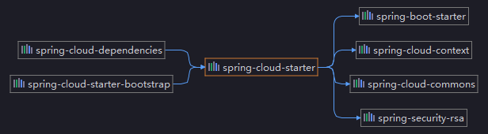

`Nacos` 需要引入 `spring-cloud-starter-bootstrap` 模块

该模块内, 只有一个类: `org.springframework.cloud.bootstrap.marker.Marker` , 无任何内容

依赖树:



在 `spring-cloud-context` 模块中 `org.springframework.cloud.bootstrap.BootstrapApplicationListener#onApplicationEvent` 调用 `org.springframework.cloud.util.PropertyUtils#bootstrapEnabled` 

```java
/**
 * Property name for bootstrap marker class name.
 */
public static final String MARKER_CLASS = "org.springframework.cloud.bootstrap.marker.Marker";

/**
 * Boolean if bootstrap marker class exists.
 */
public static final boolean MARKER_CLASS_EXISTS = ClassUtils.isPresent(MARKER_CLASS, null);

// bootstrapEnabled
public static boolean bootstrapEnabled(Environment environment) {
    return environment.getProperty(BOOTSTRAP_ENABLED_PROPERTY, Boolean.class, false) || MARKER_CLASS_EXISTS;
}
```

所以 `Marker` 这个类, 仅仅只是起到了一个标记的作用

