# 什么是 Zookeeper

## 参考

- [Zookeeper 分布式锁 （图解+秒懂+史上最全） - 疯狂创客圈 - 博客园](https://www.cnblogs.com/crazymakercircle/p/14504520.html)
- [ZooKeeper 详解 - 知乎](https://zhuanlan.zhihu.com/p/72902467)

## 一、 ZooKeeper 简介

顾名思义 zookeeper 就是动物园管理员，他是用来管 hadoop（大象）、Hive(蜜蜂)、pig(小 猪)的管理员， Apache Hbase 和 Apache Solr 的分布式集群都用到了 zookeeper；Zookeeper: 是一个分布式的、开源的程序协调服务，是 hadoop 项目下的一个子项目。他提供的主要功 能包括：配置管理、名字服务、分布式锁、集群管理。

## 二、 ZooKeeper 的作用

1.1 配置管理

在我们的应用中除了代码外，还有一些就是各种配置。比如数据库连接等。一般我们都 是使用配置文件的方式，在代码中引入这些配置文件。当我们只有一种配置，只有一台服务 器，并且不经常修改的时候，使用配置文件是一个很好的做法，但是如果我们配置非常多， 有很多服务器都需要这个配置，这时使用配置文件就不是个好主意了。这个时候往往需要寻 找一种集中管理配置的方法，我们在这个集中的地方修改了配置，所有对这个配置感兴趣的 都可以获得变更。Zookeeper 就是这种服务，它使用 Zab 这种一致性协议来提供一致性。现 在有很多开源项目使用 Zookeeper 来维护配置，比如在 HBase 中，客户端就是连接一个 Zookeeper，获得必要的 HBase 集群的配置信息，然后才可以进一步操作。还有在开源的消 息队列 Kafka 中，也使用 Zookeeper来维护broker的信息。在 Alibaba开源的 SOA 框架Dubbo 中也广泛的使用 Zookeeper 管理一些配置来实现服务治理。

1.2 名字服务

名字服务这个就很好理解了。比如为了通过网络访问一个系统，我们得知道对方的 IP 地址，但是 IP 地址对人非常不友好，这个时候我们就需要使用域名来访问。但是计算机是 不能是域名的。怎么办呢？如果我们每台机器里都备有一份域名到 IP 地址的映射，这个倒 是能解决一部分问题，但是如果域名对应的 IP 发生变化了又该怎么办呢？于是我们有了 DNS 这个东西。我们只需要访问一个大家熟知的(known)的点，它就会告诉你这个域名对应 的 IP 是什么。在我们的应用中也会存在很多这类问题，特别是在我们的服务特别多的时候， 如果我们在本地保存服务的地址的时候将非常不方便，但是如果我们只需要访问一个大家都 熟知的访问点，这里提供统一的入口，那么维护起来将方便得多了。

1.3 分布式锁

其实在第一篇文章中已经介绍了 Zookeeper 是一个分布式协调服务。这样我们就可以利 用 Zookeeper 来协调多个分布式进程之间的活动。比如在一个分布式环境中，为了提高可靠 性，我们的集群的每台服务器上都部署着同样的服务。但是，一件事情如果集群中的每个服 务器都进行的话，那相互之间就要协调，编程起来将非常复杂。而如果我们只让一个服务进 行操作，那又存在单点。通常还有一种做法就是使用分布式锁，在某个时刻只让一个服务去

干活，当这台服务出问题的时候锁释放，立即 fail over 到另外的服务。这在很多分布式系统 中都是这么做，这种设计有一个更好听的名字叫 Leader Election(leader 选举)。比如 HBase 的 Master 就是采用这种机制。但要注意的是分布式锁跟同一个进程的锁还是有区别的，所 以使用的时候要比同一个进程里的锁更谨慎的使用。

1.4 集群管理

在分布式的集群中，经常会由于各种原因，比如硬件故障，软件故障，网络问题，有些 节点会进进出出。有新的节点加入进来，也有老的节点退出集群。这个时候，集群中其他机 器需要感知到这种变化，然后根据这种变化做出对应的决策。比如我们是一个分布式存储系 统，有一个中央控制节点负责存储的分配，当有新的存储进来的时候我们要根据现在集群目 前的状态来分配存储节点。这个时候我们就需要动态感知到集群目前的状态。还有，比如一 个分布式的 SOA 架构中，服务是一个集群提供的，当消费者访问某个服务时，就需要采用 某种机制发现现在有哪些节点可以提供该服务(这也称之为服务发现，比如 Alibaba 开源的 SOA 框架 Dubbo 就采用了 Zookeeper 作为服务发现的底层机制)。还有开源的 Kafka 队列就 采用了 Zookeeper 作为 Cosnumer 的上下线管理。

## 三、 Zookeeper 的存储结构

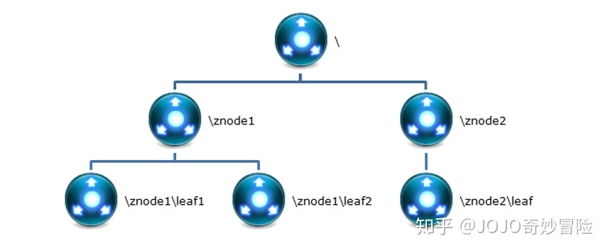

1 Znode

在 Zookeeper 中，znode 是一个跟 Unix 文件系统路径相似的节点，可以往这个节点存储 或获取数据。 Zookeeper 底层是一套数据结构。这个存储结构是一个树形结构，其上的每一个节点， 我们称之为“znode” zookeeper 中的数据是按照“树”结构进行存储的。而且 znode 节点还分为 4 中不同的类 型。 每一个 znode 默认能够存储 1MB 的数据（对于记录状态性质的数据来说，够了） 可以使用 zkCli 命令，登录到 zookeeper 上，并通过 ls、create、delete、get、set 等命令 操作这些 znode 节点


2 Znode 节点类型

(1)PERSISTENT 持久化节点: 所谓持久节点，是指在节点创建后，就一直存在，直到 有删除操作来主动清除这个节点。否则不会因为创建该节点的客户端会话失效而消失。

(2)PERSISTENT_SEQUENTIAL 持久顺序节点：这类节点的基本特性和上面的节点类 型是一致的。额外的特性是，在 ZK 中，每个父节点会为他的第一级子节点维护一份时序， 会记录每个子节点创建的先后顺序。基于这个特性，在创建子节点的时候，可以设置这个属 性，那么在创建节点过程中，ZK 会自动为给定节点名加上一个数字后缀，作为新的节点名。 这个数字后缀的范围是整型的最大值。 在创建节点的时候只需要传入节点 “/test_”，这样 之后，zookeeper 自动会给”test_”后面补充数字。

(3)EPHEMERAL 临时节点：和持久节点不同的是，临时节点的生命周期和客户端会 话绑定。也就是说，如果客户端会话失效，那么这个节点就会自动被清除掉。注意，这里提 到的是会话失效，而非连接断开。另外，在临时节点下面不能创建子节点。 这里还要注意一件事，就是当你客户端会话失效后，所产生的节点也不是一下子就消失 了，也要过一段时间，大概是 10 秒以内，可以试一下，本机操作生成节点，在服务器端用 命令来查看当前的节点数目，你会发现客户端已经 stop，但是产生的节点还在。

(4) EPHEMERAL_SEQUENTIAL 临时自动编号节点：此节点是属于临时节点，不过带 有顺序，客户端会话结束节点就消失。

## 单机版

## Zookeeper 目录结构

1. bin：放置运行脚本和工具脚本，如果是 Linux 环境还会有有 zookeeper 的运 行日志 zookeeper.out

2. conf：zookeeper 默认读取配置的目录，里面会有默认的配置文件

3. contrib：zookeeper 的拓展功能

4. dist-maven：zookeeper的 maven 打包目录

5. docs：zookeeper 相关的文档

6. lib：zookeeper 核心的 jar

7. recipes：zookeeper 分布式相关的 jar 包

8. src：zookeeper 源码

## 配置 Zookeeper

Zookeeper 在启动时默认的去 conf 目录下查找一个名称为 zoo.cfg 的配置文件。 在 zookeeper 应用目录中有子目录 conf。其中有配置文件模板：zoo_sample.cfg cp zoo_sample.cfg zoo.cfg。zookeeper 应用中的配置文件为 conf/zoo.cfg。 修改配置文件 zoo.cfg - 设置数据缓存路径

## 集群版

## Zookeeper 集群中的角色

Zookeeper 集群中的角色主要有以下三类

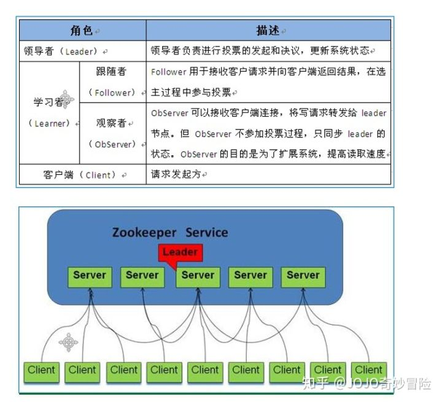

## 设计目的

1.最终一致性：client 不论连接到哪个 Server，展示给它都是同一个视图，这是 zookeeper 最重要的性能。

2 .可靠性：具有简单、健壮、良好的性能，如果消息 m 被到一台服务器接受，那么它 将被所有的服务器接受。

3 .实时性：Zookeeper 保证客户端将在一个时间间隔范围内获得服务器的更新信息，或 者服务器失效的信息。但由于网络延时等原因，Zookeeper 不能保证两个客户端能同时得到 刚更新的数据，如果需要最新数据，应该在读数据之前调用 sync()接口。

4 .等待无关（wait-free）：慢的或者失效的 client 不得干预快速的 client 的请求，使得每 个 client 都能有效的等待。

5.原子性：更新只能成功或者失败，没有中间状态。

6 .顺序性：包括全局有序和偏序两种：全局有序是指如果在一台服务器上消息 a 在消息 b 前发布，则在所有 Server 上消息 a 都将在消息 b 前被发布；偏序是指如果一个消息 b 在消 息 a 后被同一个发送者发布，a 必将排在 b 前面。

## 提供应用唯一标识

在 Zookeeper 集群中，每个节点需要一个唯一标识。这个唯一标识要求是自然数。且唯 一标识保存位置是：$dataDir/myid。其中 dataDir 为配置文件 zoo.cfg 中的配置参数 在 data 目录中创建文件 myid ： touch myid 为应用提供唯一标识。本环境中使用 1、2、3 作为每个节点的唯一标识。 vi myid 简化方式为： echo [唯一标识] >> myid。 echo 命令为回声命令，系统会将命令发送的 数据返回。 '>>'为定位，代表系统回声数据指定发送到什么位置。 此命令代表系统回声数 据发送到 myid 文件中。 如果没有文件则创建文件。

## 修改配置文件 zoo.cfg - 设置服务、投票、选举端口

vi zoo.cfg clientPort=2181 #服务端口根据应用做对应修改,zk01-2181,zk02-2182,zk03-2183 server.1=192.168.70.143:2881:3881 server.2=192.168.70.143:2882:3882 server.3=192.168.70.143:2883:3883

## 启动 ZooKeeper 应用

bin/zkServer.sh start ZooKeeper 集群搭建后，至少需要启动两个应用才能提供服务。因需要选举出主服务节 点。启动所有 ZooKeeper 节点后，可使用命令 bin/zkServer.sh status 来查看节点状态。如下：

Mode: leader - 主机 Mode: follower - 备份机

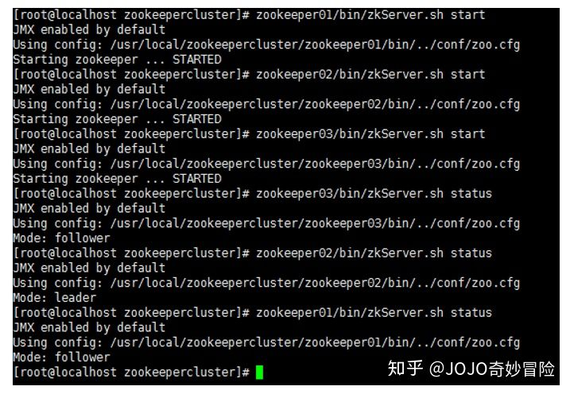

## 2.3.8 关闭 ZooKeeper 应用

bin/zkServer.sh stop 命令为关闭 ZooKeeper 应用的命令。

2.3.9 控制台访问 ZooKeeper 应用

bin/zkCli.sh -server 192.168.199.175:2181 命令格式为： [zkCli.sh](https://link.zhihu.com/?target=http%3A//zkCli.sh) -server host:port。默认连接 localhost:2181。


## 控制台客户端常用命令

```text
[zk: 192.168.199.175:2181(CONNECTED) 22] get /test
 123
 cZxid = 0xd # 创建节点时的事务 ID，由 ZooKeeper 维护。
 ctime = Tue Jun 12 07:45:53 PDT 2018 
mZxid = 0x1f # 当前节点携带数据最后一次修改的事务 ID。
 mtime = Tue Jun 12 07:52:53 PDT 2018 
pZxid = 0x21 # 子节点列表最后一次修改的事务 ID。
 cversion = 1 # 节点版本号，当节点的子节点列表发生变化时，版本变更。
 dataVersion = 2 # 数据版本号，当节点携带数据发生变化时，版本变更。 
aclVersion = 0 ephemeralOwner = 0x0
 # 此数据值不是 0x0 时，代表是临时节点 dataLength = 3 
# 节点携带数据长度 numChildren = 1 
# 子节点数量 
```


connect host:port - 连接其他的 ZooKeeper 应用。

ls path - 列表路径下的资源。在 ZooKeeper 控制台客户端中，没有默认列表功能，必须 指定要列表资源的位置。 如： ls / ； ls /path 等。

create [-e] [-s] path data - 创建节点，如：

create /test 123 创建一个/test 节点，节点携 带数据信息 123。

create -e /test 123 创建一个临时节点/test，携带数据为 123，临时节点只 在当前会话生命周期中有效，会话结束节点自动删除。

create -s /test 123 创建一个顺序节点 /test，携带数据123，创建的顺序节点由ZooKeeper自动为节点增加后缀信息，如-/test00000001 等。-e 和-s 参数可以联合使用。


get path - 查看指定节点的数据。 如： get /test。结果如下：

set path data [version] - 设置对应位置节点的数据。如： set /test 'test data'。 如果要设 置的数据中有空格，则使用单引号界定数据的范围。每次修改数据后，dataVersion 属性自增。 那么在 set 命令中可以指定 version，version 数据必须与上次查询的值一致，用于保证本次修 改命令执行时，没有其他会话修改此数据。

delete path [version] - 删除指定节点，此命令不能删除有子节点的节点。如：delete /test。 其中 version 参数和 set 命令的 version 含义一致 rmr path - 删除指定结点，包括子节点。

quit - 退出控制台

# 分布式锁

在单体的应用开发场景中，涉及并发同步的时候，大家往往采用synchronized或者Lock的方式来解决多线程间的同步问题。但在分布式集群工作的开发场景中，那么就需要一种更加高级的锁机制，来处理种跨JVM进程之间的数据同步问题，这就是分布式锁。

## Zookeeper节点类型

1. **持久节点(PERSISTENT)**

   持久节点，创建后一直存在，直到主动删除此节点。

2. **持久顺序节点(PERSISTENT_SEQUENTIAL)**
   持久顺序节点，创建后一直存在，直到主动删除此节点。在ZK中，每个父节点会为它的第一级子节点维护一份时序，记录每个子节点创建的先后顺序。

3. **临时节点(EPHEMERAL)**
   临时节点在客户端会话失效后节点自动清除。临时节点下面不能创建子节点。

4. **顺序临时节点(EPHEMERAL_SEQUENTIAL)**

   临时节点在客户端会话失效后节点自动清除。临时节点下面不能创建子节点。父节点getChildren会获得顺序的节点列表。

## 公平锁和可重入锁的原理

最经典的分布式锁是可重入的公平锁。什么是可重入的公平锁呢？直接讲解的概念和原理，会比较抽象难懂，还是从具体的实例入手吧！这里用一个简单的故事来类比，估计就简单多了。

故事发生在一个没有自来水的古代，在一个村子有一口井，水质非常的好，村民们都抢着取井里的水。井就那么一口，村里的人很多，村民为争抢取水打架斗殴，甚至头破血流。

问题总是要解决，于是村长绞尽脑汁，最终想出了一个凭号取水的方案。井边安排一个看井人，维护取水的秩序。取水秩序很简单：

（1）取水之前，先取号；

（2）号排在前面的，就可以先取水；

（3）先到的排在前面，那些后到的，一个一个挨着，在井边排成一队。

取水示意图，如图10-3所示。
[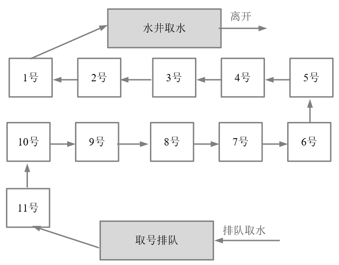](https://img-blog.csdnimg.cn/20210309111256172.png)

图10-3 排队取水示意图

这种排队取水模型，就是一种锁的模型。排在最前面的号，拥有取水权，就是一种典型的独占锁。另外，先到先得，号排在前面的人先取到水，取水之后就轮到下一个号取水，挺公平的，说明它是一种公平锁。

什么是可重入锁呢？
假定，取水时以家庭为单位，家庭的某人拿到号，其他的家庭成员过来打水，这时候不用再取号，如图10-4所示。
[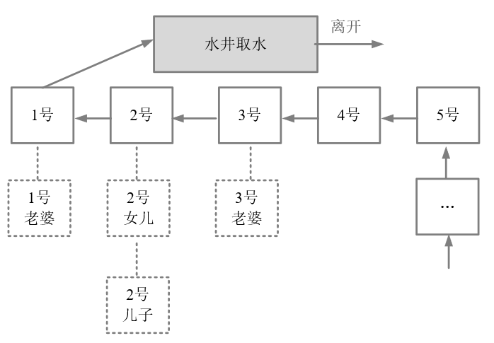](https://img-blog.csdnimg.cn/20210309111313506.png)

图10-4 同一家庭的人不需要重复排队

图10-4中，排在1号的家庭，老公取号，假设其老婆来了，直接排第一个，正所谓妻凭夫贵。再看上图的2号，父亲正在打水，假设其儿子和女儿也到井边了，直接排第二个，所谓子凭父贵。总之，如果取水时以家庭为单位，则同一个家庭，可以直接复用排号，不用从后面排起重新取号。

以上这个故事模型中，取号一次，可以用来多次取水，其原理为可重入锁的模型。在重入锁模型中，一把独占锁，可以被多次锁定，这就叫做可重入锁。

## ZooKeeper分布式锁的原理

理解了经典的公平可重入锁的原理后，再来看在分布式场景下的公平可重入锁的原理。通过前面的分析，基本可以判定：ZooKeeper
的临时顺序节点，天生就有一副实现分布式锁的胚子。为什么呢？

（一） ZooKeeper的每一个节点，都是一个天然的顺序发号器。

在每一个节点下面创建临时顺序节点（EPHEMERAL_SEQUENTIAL）类型，新的子节点后面，会加上一个次序编号，而这个生成的次序编号，是上一个生成的次序编号加一。

例如，有一个用于发号的节点“/test/lock”为父亲节点，可以在这个父节点下面创建相同前缀的临时顺序子节点，假定相同的前缀为“/test/lock/seq-”。第一个创建的子节点基本上应该为/test/lock/seq-0000000000，下一个节点则为/test/lock/seq-0000000001，依次类推，如果10-5所示。
[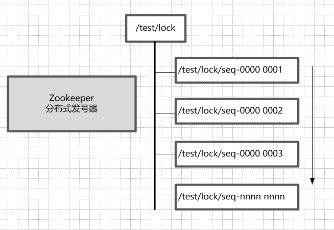](https://img-blog.csdnimg.cn/20210309155957390.png)

图10-5 Zookeeper临时顺序节点的天然的发号器作用

（二） ZooKeeper节点的递增有序性，可以确保锁的公平

一个ZooKeeper分布式锁，首先需要创建一个父节点，尽量是持久节点（PERSISTENT类型），然后每个要获得锁的线程，都在这个节点下创建个临时顺序节点。由于ZK节点，是按照创建的次序，依次递增的。

为了确保公平，可以简单的规定：编号最小的那个节点，表示获得了锁。所以，每个线程在尝试占用锁之前，首先判断自己是排号是不是当前最小，如果是，则获取锁。

（三）ZooKeeper的节点监听机制，可以保障占有锁的传递有序而且高效

每个线程抢占锁之前，先尝试创建自己的ZNode。同样，释放锁的时候，就需要删除创建的Znode。创建成功后，如果不是排号最小的节点，就处于等待通知的状态。等谁的通知呢？不需要其他人，只需要等前一个Znode
的通知就可以了。前一个Znode删除的时候，会触发Znode事件，当前节点能监听到删除事件，就是轮到了自己占有锁的时候。第一个通知第二个、第二个通知第三个，击鼓传花似的依次向后。

ZooKeeper的节点监听机制，能够非常完美地实现这种击鼓传花似的信息传递。具体的方法是，每一个等通知的Znode节点，只需要监听（linsten）或者监视（watch）排号在自己前面那个，而且紧挨在自己前面的那个节点，就能收到其删除事件了。
只要上一个节点被删除了，就进行再一次判断，看看自己是不是序号最小的那个节点，如果是，自己就获得锁。

另外，ZooKeeper的内部优越的机制，能保证由于网络异常或者其他原因，集群中占用锁的客户端失联时，锁能够被有效释放。一旦占用Znode锁的客户端与ZooKeeper集群服务器失去联系，这个临时Znode也将自动删除。排在它后面的那个节点，也能收到删除事件，从而获得锁。正是由于这个原因，在创建取号节点的时候，尽量创建临时znode
节点，

（四）ZooKeeper的节点监听机制，能避免羊群效应

ZooKeeper这种首尾相接，后面监听前面的方式，可以避免羊群效应。所谓羊群效应就是一个节点挂掉，所有节点都去监听，然后做出反应，这样会给服务器带来巨大压力，所以有了临时顺序节点，当一个节点挂掉，只有它后面的那一个节点才做出反应。

## 图解：分布式锁的抢占过程

接下来我们一起来看看，多客户端获取及释放zk分布式锁的整个流程及背后的原理。

首先大家看看下面的图，如果现在有两个客户端一起要争抢zk上的一把分布式锁，会是个什么场景？

[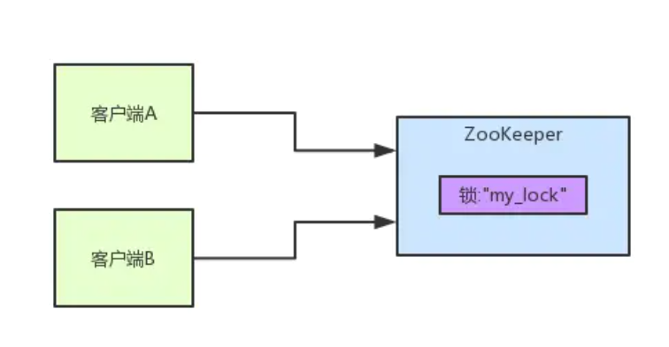](https://img-blog.csdnimg.cn/20210309105355106.png)

如果大家对zk还不太了解的话，建议先自行百度一下，简单了解点基本概念，比如zk有哪些节点类型等等。

参见上图。zk里有一把锁，这个锁就是zk上的一个节点。然后呢，两个客户端都要来获取这个锁，具体是怎么来获取呢？

咱们就假设客户端A抢先一步，对zk发起了加分布式锁的请求，这个加锁请求是用到了zk中的一个特殊的概念，叫做“临时顺序节点”。

简单来说，就是直接在"my_lock"这个锁节点下，创建一个顺序节点，这个顺序节点有zk内部自行维护的一个节点序号。

## 客户端A发起一个加锁请求

比如说，第一个客户端来搞一个顺序节点，zk内部会给起个名字叫做：xxx-000001。然后第二个客户端来搞一个顺序节点，zk可能会起个名字叫做：xxx-000002。大家注意一下，最后一个数字都是依次递增的，从1开始逐次递增。zk会维护这个顺序。

所以这个时候，假如说客户端A先发起请求，就会搞出来一个顺序节点，大家看下面的图，Curator框架大概会弄成如下的样子：

[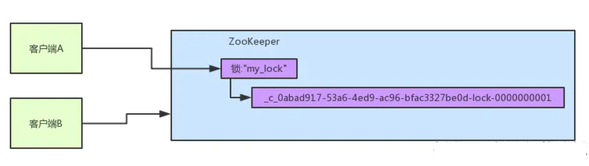](https://img-blog.csdnimg.cn/20210309105443497.png)

大家看，客户端A发起一个加锁请求，先会在你要加锁的node下搞一个临时顺序节点，这一大坨长长的名字都是Curator框架自己生成出来的。

然后，那个最后一个数字是"1"。大家注意一下，因为客户端A是第一个发起请求的，所以给他搞出来的顺序节点的序号是"1"。

接着客户端A创建完一个顺序节点。还没完，他会查一下"my_lock"这个锁节点下的所有子节点，并且这些子节点是按照序号排序的，这个时候他大概会拿到这么一个集合：

[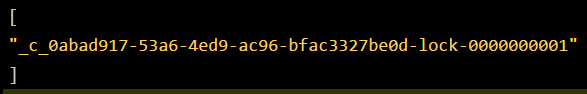](https://img-blog.csdnimg.cn/img_convert/d99b223c5ed589f33a603de388270b9c.png)

接着客户端A会走一个关键性的判断，就是说：唉！兄弟，这个集合里，我创建的那个顺序节点，是不是排在第一个啊？

如果是的话，那我就可以加锁了啊！因为明明我就是第一个来创建顺序节点的人，所以我就是第一个尝试加分布式锁的人啊！

bingo！加锁成功！大家看下面的图，再来直观的感受一下整个过程。

[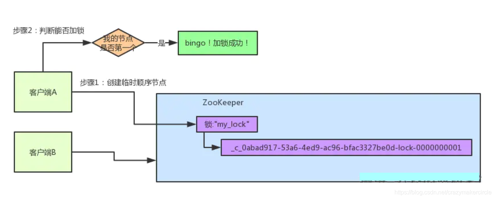](https://img-blog.csdnimg.cn/2021030910562611.png?x-oss-process=image/watermark,type_ZmFuZ3poZW5naGVpdGk,shadow_10,text_aHR0cHM6Ly9ibG9nLmNzZG4ubmV0L2NyYXp5bWFrZXJjaXJjbGU=,size_16,color_FFFFFF,t_70)

## 客户端B过来排队

接着假如说，客户端A都加完锁了，客户端B过来想要加锁了，这个时候他会干一样的事儿：先是在"my_lock"这个锁节点下创建一个临时顺序节点，此时名字会变成类似于：

[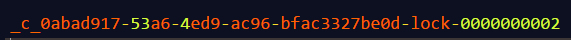](https://img-blog.csdnimg.cn/img_convert/9f1334c78a9347f6a120ea90361bf8bd.png)

大家看看下面的图：

[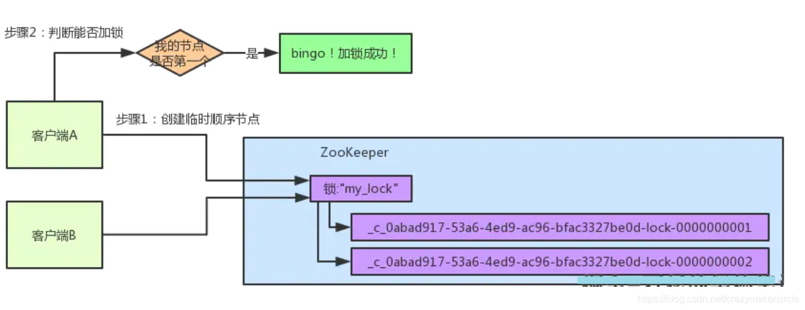](https://img-blog.csdnimg.cn/20210309105740885.png?x-oss-process=image/watermark,type_ZmFuZ3poZW5naGVpdGk,shadow_10,text_aHR0cHM6Ly9ibG9nLmNzZG4ubmV0L2NyYXp5bWFrZXJjaXJjbGU=,size_16,color_FFFFFF,t_70)

客户端B因为是第二个来创建顺序节点的，所以zk内部会维护序号为"2"。

接着客户端B会走加锁判断逻辑，查询"my_lock"锁节点下的所有子节点，按序号顺序排列，此时他看到的类似于：

[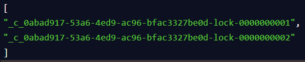](https://img-blog.csdnimg.cn/img_convert/1599f548c182bd5c6a8e4b47a93a71be.png)

同时检查自己创建的顺序节点，是不是集合中的第一个？

明显不是啊，此时第一个是客户端A创建的那个顺序节点，序号为"01"的那个。所以加锁失败！

## 客户端B开启监听客户端A

加锁失败了以后，客户端B就会通过ZK的API对他的顺序节点的上一个顺序节点加一个监听器。zk天然就可以实现对某个节点的监听。

如果大家还不知道zk的基本用法，可以百度查阅，非常的简单。客户端B的顺序节点是：

[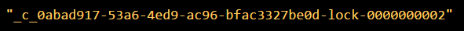](https://img-blog.csdnimg.cn/img_convert/a13595259fa45a5072ce594a1f12ec9f.png)

他的上一个顺序节点，不就是下面这个吗？

[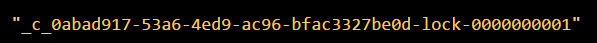](https://img-blog.csdnimg.cn/img_convert/d5968fe71eb4e2312b374d411cfdfae5.png)

即客户端A创建的那个顺序节点！

所以，客户端B会对：

[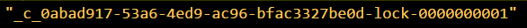](https://img-blog.csdnimg.cn/img_convert/13e381607dfa1d8eca7ad69db8024e41.png)

这个节点加一个监听器，监听这个节点是否被删除等变化！大家看下面的图。

[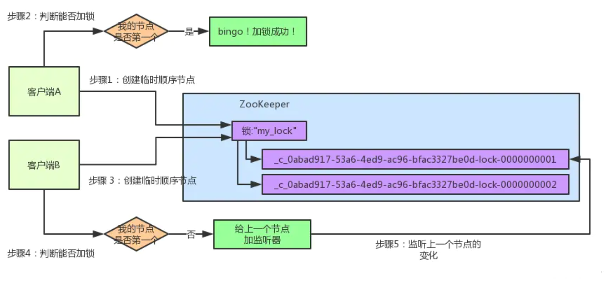](https://img-blog.csdnimg.cn/2021030911010510.png)

接着，客户端A加锁之后，可能处理了一些代码逻辑，然后就会释放锁。那么，释放锁是个什么过程呢？

其实很简单，就是把自己在zk里创建的那个顺序节点，也就是：

[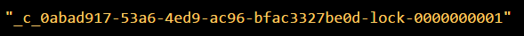](https://img-blog.csdnimg.cn/img_convert/0bed252427663cb8555501f5c16ab904.png)

这个节点给删除。

删除了那个节点之后，zk会负责通知监听这个节点的监听器，也就是客户端B之前加的那个监听器，说：兄弟，你监听的那个节点被删除了，有人释放了锁。

[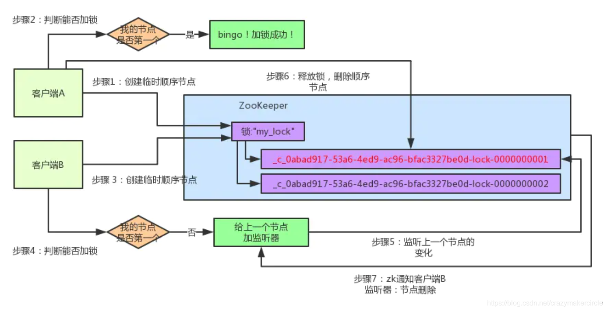](https://img-blog.csdnimg.cn/20210309110200427.png?x-oss-process=image/watermark,type_ZmFuZ3poZW5naGVpdGk,shadow_10,text_aHR0cHM6Ly9ibG9nLmNzZG4ubmV0L2NyYXp5bWFrZXJjaXJjbGU=,size_16,color_FFFFFF,t_70)

此时客户端B的监听器感知到了上一个顺序节点被删除，也就是排在他之前的某个客户端释放了锁。

## 客户端B抢锁成功

此时，就会通知客户端B重新尝试去获取锁，也就是获取"my_lock"节点下的子节点集合，此时为：

[](https://img-blog.csdnimg.cn/img_convert/257a4ef253a15b3140d1e00ae55a6228.png)

集合里此时只有客户端B创建的唯一的一个顺序节点了！

然后呢，客户端B判断自己居然是集合中的第一个顺序节点，bingo！可以加锁了！直接完成加锁，运行后续的业务代码即可，运行完了之后再次释放锁。

[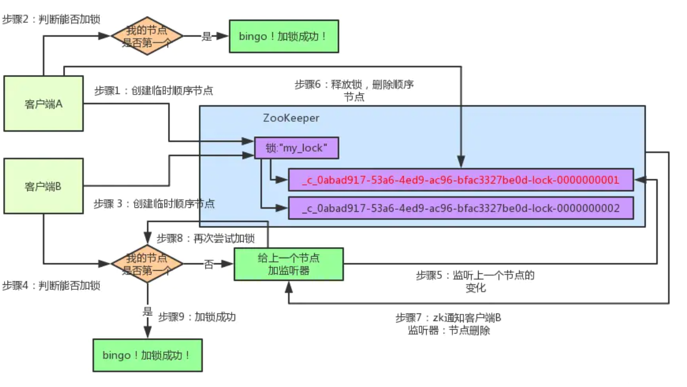](https://img-blog.csdnimg.cn/20210309110239759.png)

# 分布式锁的基本实现

接下来就是基于ZooKeeper，实现一下分布式锁。首先，定义了一个锁的接口Lock，很简单，仅仅两个抽象方法：一个加锁方法，一个解锁方法。Lock接口的代码如下：

```java
package com.crazymakercircle.zk.distributedLock;

/**
 * create by 尼恩 @ 疯狂创客圈
 **/
public interface Lock {
    /**
     * 加锁方法
     *
     * @return 是否成功加锁
     */
    boolean lock() throws Exception;

    /**
     * 解锁方法
     *
     * @return 是否成功解锁
     */
    boolean unlock();
}
```

使用ZooKeeper实现分布式锁的算法，有以下几个要点：

（1）一把分布式锁通常使用一个Znode节点表示；如果锁对应的Znode节点不存在，首先创建Znode节点。这里假设为“/test/lock”，代表了一把需要创建的分布式锁。

（2）抢占锁的所有客户端，使用锁的Znode节点的子节点列表来表示；如果某个客户端需要占用锁，则在“/test/lock”下创建一个临时有序的子节点。

这里，所有临时有序子节点，尽量共用一个有意义的子节点前缀。

比如，如果子节点的前缀为“/test/lock/seq-”，则第一次抢锁对应的子节点为“/test/lock/seq-000000000”，第二次抢锁对应的子节点为“/test/lock/seq-000000001”，以此类推。

再比如，如果子节点前缀为“/test/lock/”，则第一次抢锁对应的子节点为“/test/lock/000000000”，第二次抢锁对应的子节点为“/test/lock/000000001”，以此类推，也非常直观。

（3）如果判定客户端是否占有锁呢？
很简单，客户端创建子节点后，需要进行判断：自己创建的子节点，是否为当前子节点列表中序号最小的子节点。如果是，则认为加锁成功；如果不是，则监听前一个Znode子节点变更消息，等待前一个节点释放锁。

（4）一旦队列中的后面的节点，获得前一个子节点变更通知，则开始进行判断，判断自己是否为当前子节点列表中序号最小的子节点，如果是，则认为加锁成功；如果不是，则持续监听，一直到获得锁。

（5）获取锁后，开始处理业务流程。完成业务流程后，删除自己的对应的子节点，完成释放锁的工作，以方面后继节点能捕获到节点变更通知，获得分布式锁。
